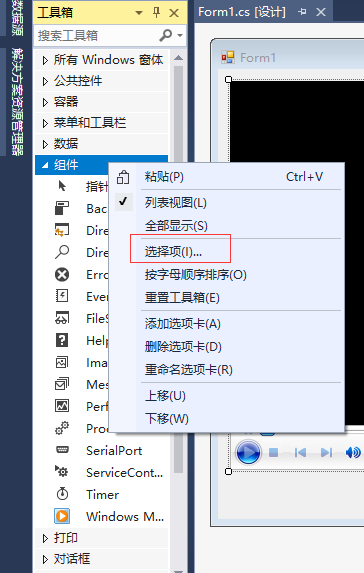
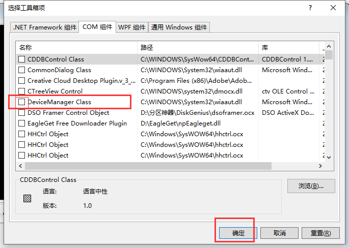

# 使用技巧

## 更改解决方案默认启动项目

解决方案默认启动其中的第一个项目，我们可以通过解决方案右键——属性——启动项目，但启动i项目更改为当前选定内容。

## 卸载和重新加载项目

通过卸载和加载项目可以快速管理当前不用的项目。

- 卸载项目；
  - 项目右键——卸载项目
- 重新加载项目；
  - 要加载的项目右键——加载项目


## 折叠冗余代码

在要折叠的代码全面写 #region 【可选注释内容】后面写#endregion

#### 工具箱添加更多组件



、勾选需要的组件确定即可



## 两次Tab键代码自动补全
```csharp
prop //生成简易属性代码
propfull //生成复杂属性代码【带字段和包装器】
ctor //快速生成当前类的构造器
propg //带有“get”访问器和专用“set”访问器的自动实现属性的代码片段
mbox //MessageBox.Show 的代码片段    
```