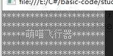
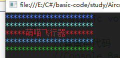

# 控制台

- 设置背景色

  ```csharp
  Console.BackgroundColor = ConsoleColor.DarkGray;
  ```

  

- 设置前景色

  ```csharp
              Console.ForegroundColor = ConsoleColor.Blue;
  ```

  

- 清屏

  ```csharp
  Console.Clear();
  ```


