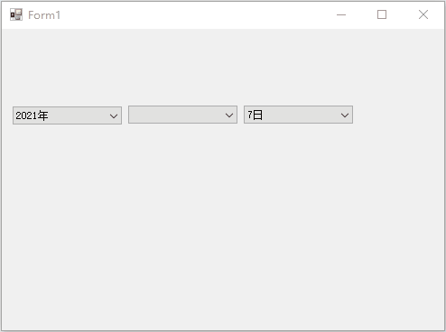

# 日期选择器

下拉列表联动又称二级联动

```csharp
using System;
using System.Collections.Generic;
using System.ComponentModel;
using System.Data;
using System.Drawing;
using System.Linq;
using System.Text;
using System.Threading.Tasks;
using System.Windows.Forms;

namespace lesson9
{
    public partial class Form1 : Form
    {
        public Form1()
        {
            InitializeComponent();
        }

        /// <summary>
        /// 窗口加载给年下拉列表赋值。
        /// </summary>
        /// <param name="sender"></param>
        /// <param name="e"></param>
        private void Form1_Load(object sender, EventArgs e)
        {
            //获取当前系统年
            int year = DateTime.Now.Year;
            //生成年
            for (int i = year ; i >= 1949; i--)
            {
                //放到下拉列表中
                cbxYears.Items.Add(i+"年");
            }

        }

        /// <summary>
        /// 年的索引改变后给月分赋值
        /// </summary>
        /// <param name="sender"></param>
        /// <param name="e"></param>
        private void cbxYeahs_SelectedIndexChanged(object sender, EventArgs e)
        {
            //清空之前的月分
            cbxMonths.Items.Clear();

            //添加月份
            for (int i = 1; i <= 12; i++)
            {
                cbxMonths.Items.Add(i + "月");
            }
        }

        /// <summary>
        /// 月分改变后生成日期
        /// </summary>
        /// <param name="sender"></param>
        /// <param name="e"></param>

        private void cbxMonths_SelectedIndexChanged(object sender, EventArgs e)
        {
            //清空之前的日
            cbxDays.Items.Clear();

            int day = 0; //存放天数。
            //获取年和月
            // 接收字符串类型   使用SelectedItem方法获取下拉列表项，转换为字符串，通过Split方法截取字符串，去掉月返回不包含空字符，返回值为数组这里只要数组的第一个元素即可。
            string strMonth = cbxMonths.SelectedItem.ToString().Split(new char[] { '月' }, StringSplitOptions.RemoveEmptyEntries)[0];
            string strYears = cbxYears.SelectedItem.ToString().Split(new char[] { '年' }, StringSplitOptions.RemoveEmptyEntries)[0];

            //转换为int类型

            int month = Convert.ToInt32(strMonth);
            int year = Convert.ToInt32(strYears);
            //判断日期
            switch (month)
            {
                case 1:
                case 3:
                case 5:
                case 7:
                case 8:
                case 10:
                case 12:
                    day = 31;
                    break;
                case 2:
                    //判断当前年是闰年
                    //定义
                    //公历里闰年的定义是这样的：能被400整除的，或者不能被100整除而能被4整除的年就是闰年，
                    if ((year % 400 == 0) || (year % 100 != 0 && year % 4 == 0))
                    {
                        day = 29; //闰年
                    }
                    else
                    {
                        day = 28;//平年
                    }
                    break;
                default:
                    day = 30;
                    break;
            }

            for (int i = 1; i <= day; i++)
            {
                cbxDays.Items.Add(i + "日");
            }
        }
    }
}
```



