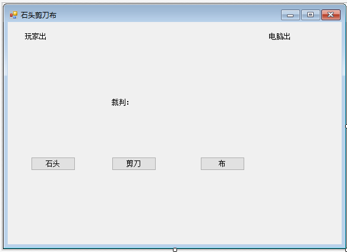

# 石头剪刀布



#### 原理

石头1 剪刀2 布3 玩家赢了： 1 2=-1 2 3=-1 3 1=2 平手： 相减 = 0 另外一种情况 ：电脑赢了

- 玩家类

  ```csharp
  using System;
  using System.Collections.Generic;
  using System.Linq;
  using System.Text;
  using System.Threading.Tasks;
  
  namespace lesson11
  {
      class Player
      {
          /// <summary>
          /// 判断玩家选择是什么拳头
          /// </summary>
          /// <param name="gesture">玩家选择的拳头</param>
          /// <returns>拳头对应的数字</returns>
          public int Punch(string gesture)
          {
              int number = 0;
              switch (gesture)
              {
                  case "石头":
                      number = 1;
                      break;
                  case "剪刀":
                      number = 2;
                      break;
                  case "布":
                      number = 3;
                      break;
              }
              return number;
          }
      }
  }
  ```

- 电脑类

  ```csharp
  using System;
  using System.Collections.Generic;
  using System.Linq;
  using System.Text;
  using System.Threading.Tasks;
  
  namespace lesson11
  {
  
      class Cumputer
      {
          /// <summary>
          /// 自动属性，存放电脑出的拳头。
          /// </summary>
          public string Gesture
          {
              get;
              set;
          }
          /// <summary>
          /// 电脑出拳
          /// </summary>
          /// <returns>电脑出拳对应数字</returns>
          public int Punch()
          {
              //生成电脑的拳头
              int r = new Random().Next(1, 4);
              switch (r)
              {
                  case 1:
                      this.Gesture = "石头";
                      break;
                  case 2:
                      this.Gesture = "剪刀";
                      break;
                  case 3:
                      this.Gesture = "布";
                      break;
              }
              return r;
          }
      }
  }
  ```

- 裁判类

  ```csharp
  using System;
  using System.Collections.Generic;
  using System.Linq;
  using System.Text;
  using System.Threading.Tasks;
  
  namespace lesson11
  {
      //存放判决结果
      public enum Result
      {
          玩家获胜,
          平手,
          电脑获胜
      }
      class Judge
      {
          /// <summary>
          /// 判断谁获胜
          /// </summary>
          /// <param name="playerNumber">玩家出拳数字</param>
          /// <param name="cpuNumber">电脑出拳数字</param>
          /// <returns>返回结果</returns>
          public static Result Judgment(int playerNumber,int cpuNumber) 
          {
              if (playerNumber - cpuNumber == -1 || playerNumber - cpuNumber ==2)
              {
                  return Result.玩家获胜;
              }else if (playerNumber - cpuNumber == 0)
              {
                  return Result.平手;
              }
              else
              {
                  return Result.电脑获胜;
              }
          }
      }
  }
  ```

- 主类

  ```csharp
  using System;
    using System.Collections.Generic;
    using System.ComponentModel;
    using System.Data;
    using System.Drawing;
    using System.Linq;
    using System.Text;
    using System.Threading.Tasks;
    using System.Windows.Forms;
  
    namespace lesson11
    {
        public partial class Form1 : Form
        {
            public Form1()
            {
                InitializeComponent();
            }
  
            /// <summary>
            /// 玩方法
            /// </summary>
            /// <param name="btnText">点击按钮的text属性</param>
            private void Player(string btnText)
            {
                //当前点击的按钮
                string str = btnText;
                labelPlayer.Text = str;//展示玩家选择
                Player player = new Player();
                int playerNumber = player.Punch(str);//获得玩家拳头数值
  
                Cumputer cpu = new Cumputer();
                int cpuNumber = cpu.Punch(); //获得电脑拳头数值
                labelCpu.Text = cpu.Gesture;//展电脑选择
  
                //展示裁判判决结果。
                labelJudge.Text = Judge.Judgment(playerNumber, cpuNumber).ToString();
            }
  
            private void btnStone_Click(object sender, EventArgs e)
            {
                Player(btnStone.Text);//调用玩方法
            }
  
            private void btnScissors_Click(object sender, EventArgs e)
            {
                Player(btnScissors.Text);//调用玩方法
            }
  
            private void btnCloth_Click(object sender, EventArgs e)
            {
                Player(btnCloth.Text);//调用玩方法
            }
        }
    }
  ```