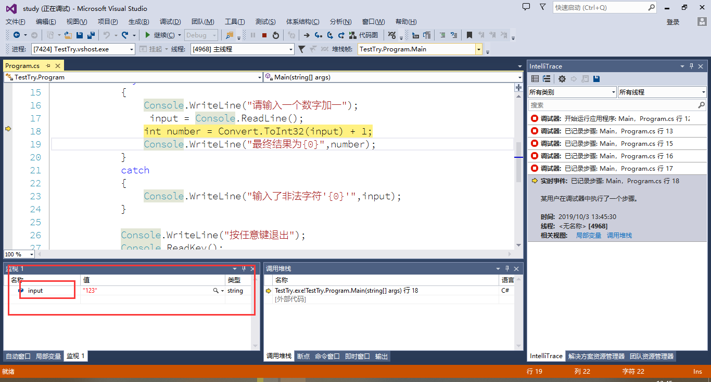
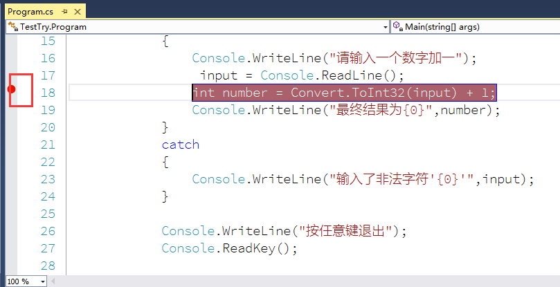

# Debug

## 单步调试

按F11启动程序进入单步调试模式。

可以从监视器中输入要监视的内容查看其值

## 断点调试

在有可能会出现，错误的代码左侧的灰色部分添加一个断点，然后启动程序，程序运行到此断点会自动停止然后在按F11进行单步调试。

## 过程调试

F10是一个一个方法调试功能，可以直接跳到下一个方法调试。

## 调试快捷键

**F5** 继续。

**F10** 执行下一行代码，但不执行任何函数调用。

**F11** 在执行进入函数调用后，逐条语句执行代码。

**Shift + F11** 执行当前执行点所处函数的剩余行。

**Shift + F5** 停止运行程序中的当前应用程序。可用于“中断”模式和“运行”模式。

