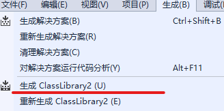
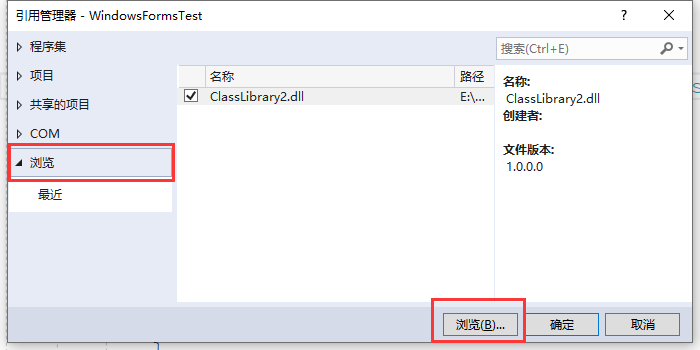

# 创建自己的DLL

## 封装

1. DLL 里面也可以封装资源文件。

2. 解决方案管理器右键=>添加=>新项目选择类库（.NET Framework）.编写要提供的方法代码。

3. 生成的dll默认会在`当前项目\bin\Debug\`

   

## 调用

1. 添加dll引用，浏览dll目录。

   

2. 添加dll命名空间。

   ```c
   using ClassLibrary2; //ClassLibrary2命名空间
   ```

3. 按其它和Windows自带的类使用。

