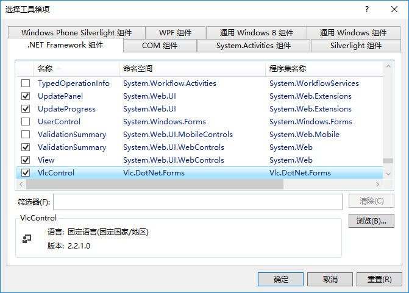

# VLC

## 准备及注意事项

### 注意事项

1. 框架推荐.Net Framework 4.5及以上版本
2. 项目目录不要有中文和特殊字符如@#等会出现莫名奇妙的问题。

### 准备

从NuGet 添加以下包

| 库名                     | 功能              | 备注                     |
| ------------------------ | ----------------- | ------------------------ |
| VideoLAN.LibVLC.Windows  | Vlc播放器库文件   | 可以删除不需要位数的文件 |
| Vlc.DotNet.Core          | 必要依赖库        |                          |
| Vlc.DotNet.Core.Interops | 必要依赖库        |                          |
| Vlc.DotNet.Forms         | WindowForms调用库 | 更具开发平台选择性安装   |
| Vlc.DotNet.Wpf           | WPF调用库         | 更具开发平台选择性安装   |

## 使用

### Vlc.DotNet.Forms【WindowForms平台】

1. 新建一个Windows窗体应用程序 **步骤略**

2. 工具箱添加VlcControl组件，dll目录位于

   `解决方案目录\packages\Vlc.DotNet.Forms.3.0.0\lib\net45\Vlc.DotNet.Forms.dll`

   

3. 将VlcControl控件添加到窗体上

4. 在VlcControl的VlcLibDirectoryNeeded事件中添加如下代码（必须）

```c
using System.IO;        
using Vlc.DotNet.Forms; //必要名称空间

        /// <summary>
        /// 请求vlc播放器库目录事件
        /// </summary>
        /// <param name="sender"></param>
        /// <param name="e"></param>
        private void vlcControl1_VlcLibDirectoryNeeded(object sender, VlcLibDirectoryNeededEventArgs e)
        {
            //获取当前程序所在路径
            var currentAssembly = Assembly.GetEntryAssembly(); //获取当前程序运行所在的那块内存区域。

            var currentDirectory = new FileInfo(currentAssembly.Location).DirectoryName; //获取当前程序完整目录

            if (currentDirectory == null)  return;  //如果路径存不在停止执行下面的代码

            /*———————————————————————根据程序位数加载对应vlc播放器库———————————————————————*/


          /*
             IntPtr.Size 属性 获取此实例的大小。
             此进程中的指针或句柄的大小（以字节为单位）。 
                此属性的值在 32 位进程中为 4，在 64 位进程中为 8。
          */

             */
            if (IntPtr.Size == 4)
            {
                //设置32位vlc播放器库目录
                e.VlcLibDirectory = new DirectoryInfo(Path.GetFullPath(@".\libvlc\win-x86\"));
            }
            else
            {
                //设置64位vlc播放器库目录
                e.VlcLibDirectory = new DirectoryInfo(Path.GetFullPath(@".\libvlc\win-x64\"));
            }


            /*———————————————————vlc库文件目录不存在打开文件浏览器选择vlc目录————————————————*/
            //Exists返回true 文件存在银盘上去非那么就是Fals, if语句不执行否则就执行。

            if (!e.VlcLibDirectory.Exists)
            {
                var folderBrowserDialog = new FolderBrowserDialog();
                folderBrowserDialog.Description = "Select Vlc libraries folder.";
                folderBrowserDialog.RootFolder = Environment.SpecialFolder.Desktop;
                folderBrowserDialog.ShowNewFolderButton = true;
                if (folderBrowserDialog.ShowDialog() == DialogResult.OK)
                {
                    e.VlcLibDirectory = new DirectoryInfo(folderBrowserDialog.SelectedPath);
                }
            }
        }
```

## 方法/属性

> 参考https://www.cnblogs.com/zhangq/p/4381253.html

### vlcControl类

- `Play()`播放资源
- `Pause()`暂停播放/开始播放
- `Stop()`停止播放
- `SetMedia(new System.IO.FileInfo(@"f:\1.flv"));` 设置本地播放源
- `Play("http://**************/******.flv")`播放网络流文件。

### vlcControl.Audio属性

- `ToggleMute()` 静音和非静音切换
- `Volume` 设置音量百分比，值在0—200之间

### vlcControl.Video属性


#### Vlc Plugin Objec

-  VersionInfo:成员, 返回版本信息的字符串
-  vlc.versionInfo()：方法, 返回版本信息的字符串

#### Audio object的属性(读写)

-  vlc.audio.mute :静音和非静音
-  vlc.audio.volume：音量的百分比，值在0—200之间
-  vlc.audio.track：音轨信息，值在0-65535之间
- vlc.audio.channel：值在1至5整数，指示的音频通道模式使用，值可以是：“1 =立体声”，“2 =反向立体声”，“3 =左”，“4 =右” “5 =混音”。
-  vlc.audio.toggleMute() : 方法，切换静音和非静音

#### Input object

**只读属性**

-  vlc.input.length：毫秒数,输入文件的长度
-  vlc.input.fps：每秒产生一个浮动帧
- vlc.input.hasVout：一个布尔值，返回true当视频正在显示，它返回false时不显示视频

**读/写属性；**

- vlc.input.position：在多媒体流正常化的情况下，给定一个浮点值，值范围[0.0 - 1.0]

-  vlc.input.time：在给定的时间以毫秒为单位的绝对位置，这个属性可以用来寻求流

- ````xaml
  
  <!-- 流中的绝对查找 !-->
  
  vlc.input.time = <absolute seek>
  
  <!-- 流中的相对查找 !-->
  
  vlc.input.time = vlc.input.time + <relative seek>
  ````

- vlc.input.state：当前状态（空闲/关闭= 0，开幕= 1，缓冲= 2，打= 3，暂停= 4，停止= 5，错误= 6）

- vlc.input.rate：输入速度，浮动的正常速度，0.5为速度的一半，为2.0快一倍。

#### Playlist object

**只读属性;**

- vlc.playlist.itemCount：目前播放列表中的项目的数量
-  vlc.playlist.isPlaying：一个布尔值，返回true 正在播放，false未播放

**方法；**

-  vlc.playlist.add（mrl）：添加一个mrl（多媒体资源定位器）播放列表项目。mrl必须为字符串。
- vlc.playlist.add（mrl,name,options）：添加mrl（多媒体资源定位器）播放列表项目，与meta的名字和选项。所有的输入值必须为字符串。
-  vlc.playlist.play（）：开始播放当前列表项
-  vlc.playlist.togglePause（）：切换当前播放列表项目的暂停状态
- vlc.playlist.stop（）：停止播放当前播放列表项目
-  vlc.playlist.next（）：迭代到下一个播放列表项目
-   vlc.playlist.prev（）：迭代到以前的音乐项目
-  vlc.playlist.clear（）：清空当前播放列表，所有项目将被删除
-   vlc.playlist.removeItem（number）：删除给定的项目编号（number不能比vlc.playlist.itemCount大）

#### Video object

**只读属性；**

- vlc.video.width：返回视频水平尺寸

- vlc.video.height：返回视频垂直大小

**读/写属性；**

- vlc.video.fullscreen：当设置为true，视频将显示在全屏模式.设置为false时，视频按指定的大小显示。该属性需要布尔值作为输入。
-  vlc.video.aspectRatio：获取和设置长宽比使用视频屏幕。该属性采用字符串作为输入值。有效值为：“1:1”，“4:3”，“16:9”，“16:10”，“221:100”和“5:4”

**方法**

-  vlc.video.toggleFullscreen（）：全屏模式切换


#### Log object

**只读属性**

- vlc.log.messages：返回一个消息对象

 **读/写属性**

-  vlc.log.verbosity：写改变日志信息冗赘级别数[-1,0,1,2,3]。这些数字的含义如下：-1停用，0信息，1个错误，2警告，3调试。

#### Messages object

**只读属性**

-    messages.count：返回日志消息的数量
- messages.severity：数字，日志信息的严重程度（0 =信息，1 =错误，2 =警告，3 =调试）
-   message.name：对VLC模块的名称印的日志信息（如：网址,directx，等等..）
-  message.type：对模块类型的vlc印日志信息（如：input, access, vout, sout，等等..）
-  message.message：消息文本

**方法**

-  messages.clear（）：清除当前日志缓冲区。
-  messages.iterator（）：返回一个消息迭代器对象

#### Iterator object

**只读属性**

- iterator.hasNext：返回一个布尔值，表明还有下一个信息

**方法**

-  iterator.next（）：返回下一个消息对象它的日志。


## VLC可以实现的功能

- Vlc可以通过修改input属性，实现seek,快播，慢播
-  修改audio属性可以实现，声道设置、音量设置、静音
- 通过对video的设置，实现全屏/屏幕比例/屏幕大小的控制
- 通过PlayList对象的控制，可以实现添加、删除播放对象的功能

​      