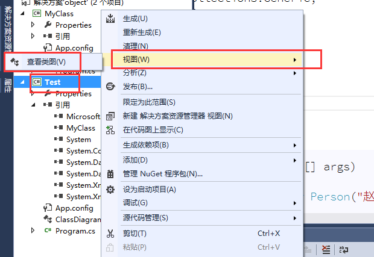

# 继承

我们可能会在一些类中，写一些重复的成员，我们可以将这些重复的成员，单独的封装到一个类中，作为这些类的父类。Student、Teacher、Driver 子类 派生类Person 父类 基类子类继承了父类。

那么子类从父类那里继承过来了什么？首先，子类继承了父类的属性和方法，但是子类并没有继承**父类的私有字段**。

- 问题：子类有没有继承父类的构造函数？
  - 答：子类并没有继承父类的构造函数，但是。**子类会默认的调用父类无参数的构造函数**， 创建父类对象，让子类可以使用父类中的成员。 所以，如果在**父类中重新写了**一个有参数的构造函数之后，那个**无参数的就被干掉了**， 子类就调用不到了，所以子类会报错。 解决办法：
    1. 在父类中重新写一个无参数的构造函数。 
    2. 在子类中显示的调用父类的构造函数，使用关键字`:base()`

继承的特性 

1. 继承的单根性：一个子类只能有一个父类。

2. 继承的传递性 一代传一代

子类可以有自己的构造函数，并且也可以有，有参构造。

**查看类图**




object是所有类的基类。


```csharp
public class 父类{
    public void Show(){

    }
}
//使用:来继承一个类。

//创建子类实力对象时会去调用其父类的构造函数然后再执行自己的构造函数。
public class 子类 :父类{
    //构造函数
    public 子类 ():base(传入父类需要的形参)//调用父类的有参构造。
    {
        //子类可以有自己的构造函数，并且也可以有有参构造。
    }

    public new void Show(){ //使用new关键字可以隐藏从父类哪里继承来的同名方法。

    }
}
```

## 实例

- 父类

  ```csharp
  using System;
  using System.Collections.Generic;
  using System.Linq;
  using System.Text;
  using System.Threading.Tasks;
  
  namespace 虚方法
  {
      public class Fu
      {
          //定义一个字段
          private string _name;
  
          //无参构造
          public Fu()
          {
  
          }
          //全惨构造
  
          public Fu(string name)
          {
              this.Name = name;
          }
  
          //编写get 方法set
          public string Name
          {
              get
              {
                  return _name;
              }
  
              set
              {
                  _name = value;
              }
          }
  
          //定义一个方法。
          public void show()
          {
              Console.WriteLine("我是{0}",this.Name);
          }
      }
  }
  ```

- 子类

  ```csharp
  using System;
  using System.Collections.Generic;
  using System.Linq;
  using System.Text;
  using System.Threading.Tasks;
  
  namespace 虚方法
  {
      public class Zi : Fu //继承父类
      {
          //无参构造。
          public Zi()
          {
  
          }
  
          //有参构造
          //将父类需要的形参传递给父类构造，子类也可以有自己的独立参数。
          public Zi(string name):base(name)
          {
  
          }
      }
  }
  ```

- 测试类

  ```csharp
  using System;
  using System.Collections.Generic;
  using System.Linq;
  using System.Text;
  using System.Threading.Tasks;
  
  namespace 虚方法
  {
      class Program
      {
          static void Main(string[] args)
          {
              //父类引用指向子类，不能调用子类特有的方法。要调用必须进行里氏转换。
              Fu zi = new Zi("张三");
              zi.Show();
  
              Console.ReadKey();
          }
      }
  }
  ```

## virtual【虚方法】

> 作用，实际上就是java中的当子类中的方法和父类中的方法重名时，会调用子类中的方法而不是父类。

作用主要使父类中的部分方法可以被子类覆盖重写。

1. 将父类的方法标记为虚方法 ，使用关键字 `virtual`，这个函数可以被子类重新。

   ```c
    public virtual void Show()
           {
               Console.WriteLine("我是{0}",this.Name);
           }
   ```

1. 在子类中重写这个同名方法，使用`override`标记

   ```c
           //override表示覆盖重写父类中同名的这个方法。
           public override void Show()
           {
               Console.Write("重写了父类中的Show()方法");
           }
   ```


