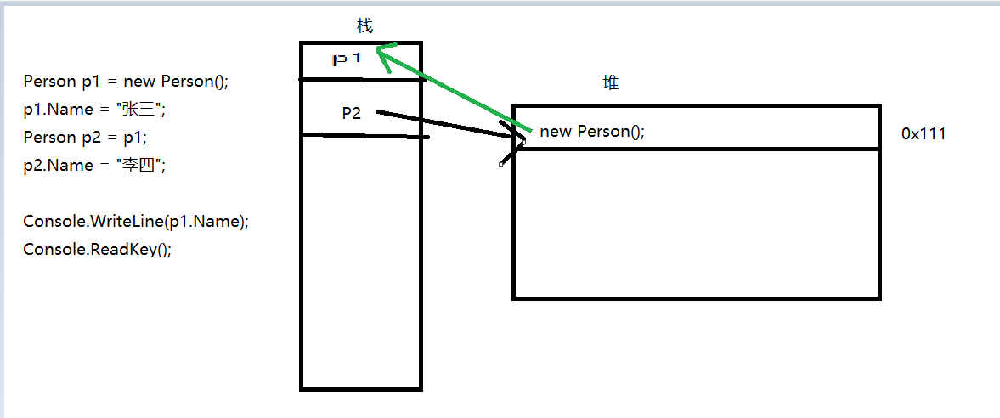

# 值类型和引用类型

## 区别

1. 值类型和引用类型在内存上存储的地方不一样。

2. 在传递值类型和传递引用类型的时候，传递的方式不一样。 值类型我们称之为值传递，引用类型我们称之为引用传递。 我们学的值类型和引用类型： 

   值类型：`int、double、bool、char、decimal、struct、enum `

   引用类型：`string`、自定义类、数组

## 存储

值类型的值是存储在内存的**栈**当中。 

引用类型的值是存储在内存的**堆**中。

## 值传递和引用传递

### 值类型

值类型在赋值的时候，传递的是这个值得本身。也就是把本身复制一份给另一个变量。

### 引用类型

引用类型在赋值的时候，传递的是对这个对象的引用，也就是把这个对象在堆中的地址复制给了这个对象。

```c
/*为什么这里打印的是李四*/

//在栈中开辟空间来存放p1，在堆中开辟空间存放 new的Person().然后把堆中的Person()的内存地址赋值给p1，这样p1就指向了堆中的Person()对象。
     Person p1 = new Person(); 
     p1.Name = "张三";
//在栈中开辟空间来存放p2，把p1存的Person()对象在堆中的地址复制给p2.这样p1和p2都指向了Person()对象。
     Person p2 = p1;
     p2.Name = "李四";//这里实际操作是同一个Person()。对象所以Name被重新赋值了，所以最后打印的是李四而不是张三。
     Console.WriteLine(p1.Name);
     Console.ReadKey();
```



## 装箱和拆箱

### 装箱

就是将值类型转换为引用类型。

```c
int a = 10;
object o = a; //值类型赋值给引用类型叫装箱
```

### 拆箱

将引用类型转换为值类型。

```c
int a = 10;
object o = a; //值装箱
int b = (int)o;//把引用类型强制转换为值类型就叫做拆箱。
```

### 区分

看两种类型是否发生了装箱或者拆箱，要看，这两种类型是否存在**继承**关系。

> **注意；**
>
> 在以后的代码中尽量避免拆装箱，会影响系统的效率。


## 字符串不可变性

1. 字符串的不可变性 当你给一个字符串重新赋值之后，老值并没有销毁，而是重新开辟一块空间存储新值。

当程序结束后，GC扫描整个内存，如果发现有的空间没有被指向，则立即把它销毁。

2. 我们可以讲字符串看做是char类型的一个只读数组。 `ToCharArray();`将字符串转换为char数组 `new string(char[] chs):`能够将char数组转换为字符串

