# 单元测试

> visual studio 2022

## 什么是单元测试

所谓单元测试（unit testing），就是开发者编写的一小段代码，用于对软件中的最小单元进行检查和验证，其一般验证对象是一个函数或者一个类。通常而言，一个单元测试是用于判断某个特定条件（或者场景）下某个特定函数的行为。

### 单元测试好处

- 大大节约了测试和修改的时间，有效且便于测试各种情况。
- 能快速定位bug（每一个测试用例都是具有针对性）。
- 能使开发人员重新审视需求和功能的设计（难以单元测试的代码，就需要重新设计）。
- 强迫开发者以调用者而不是实现者的角度来设计代码，利于代码之间的解耦。
- 自动化的单元测试能保证回归测试的有效执行。
- 使代码可以放心修改和重构。
- 测试用例，可作为开发文档使用（测试即文档）。
- 测试用例永久保存，支持随时测试。

### 框架选型

常用单元测试框架：MSTest (Visual Studio官方)、XUnit 和 NUnit。

1. MS Test为微软产品，集成在Visual Studio 2008+工具中。
2. NUnit为.Net开源测试框架（采用C#开发），广泛用于.Net平台的单元测试和回归测试中，官方网址([www.nunit.org](http://www.nunit.org/))。
3. XUnit.Net为NUnit的改进版。

以下主要讲解MSTest 和NUnit的使用，XUnit操作和NUnit操作基本类似

## 使用案例

> 以下使用MSTest框架演示

1. 在工程中添加**UnitTestClass**类，并书写一个静态的**GetTriangle(string[] sideArr)** 函数用来返回一个三角形的类型。

   ```c#
   using System;
   using System.Collections.Generic;
   using System.Linq;
   using System.Text;
   using System.Threading.Tasks;
   
   namespace UnitTestDemo
   {
       public class UnitTestClass
       {
           /// <summary>
           /// 获取三角形类型.
           /// </summary>
           /// <param name="sideArr">三角形三边长度数组.</param>
           /// <returns>返回三角形类型名称.</returns>
           public static string GetTriangle(string[] sideArr)
           {
               string result = string.Empty;
               int a = int.Parse(sideArr[0]);
               int b = int.Parse(sideArr[1]);
               int c = int.Parse(sideArr[2]);
               if (a + b > c && a + c > b && b + c > a)
               {
                   if (a == b && a == c)
                   {
                       result = "等边三角形";
                   }
   
                   if (a == b || a == c || b == c)
                   {
                       result = "等腰三角形";
                   }
                   else
                   {
                       result = "一般三角形";
                   }
               }
               else
               {
                   result = "不构成三角形";
               }
               return result;
           }
       }
   }
   
   ```

   

2. 在项目中添加一个UnitTestDemoTests测试项目

   > 按自己需求选择合适模板

   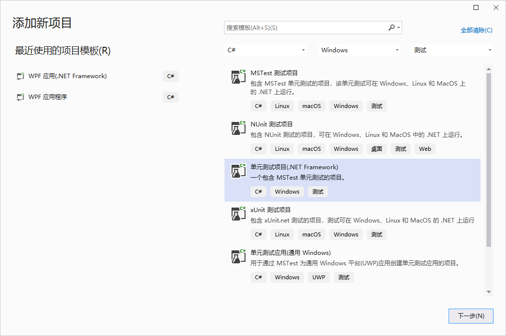

   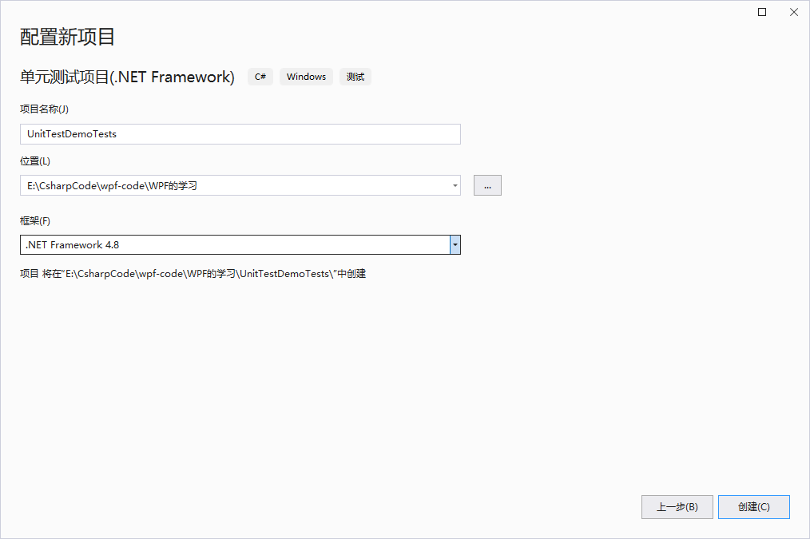

   ```c#
   using Microsoft.VisualStudio.TestTools.UnitTesting;
   using System;
   
   namespace UnitTestDemoTests
   {
       [TestClass]
       public class UnitTest1
       {
           [TestMethod]
           public void TestMethod1()
           {
           }
       }
   }
   
   ```

   完成后会得到一个UnitTest1测试类模板，即一个带有[TestClass] 特性标记的类和一个带有[TestMethod] 特性标记的空方法public void TestMethod1()。

3. 单元测试项目无法自动访问它正在测试的类库。 可以通过添加对类库项目的引用来提供测试库访问权限。 

   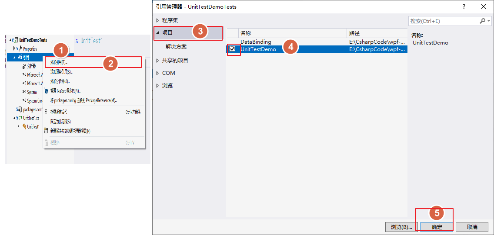


4.  在UnitTestDemoTests项目中的UnitTest1类中，将模板提供的样本单元测试代码替换为以下代码：

   ```c#
   ```

5. 测试项将在测试资源管理器中显示。 如果测试资源管理器窗口不可见，在 Visual Studio 菜单栏=>测试=>测试资源管理器(Ctrl + E,T) 

   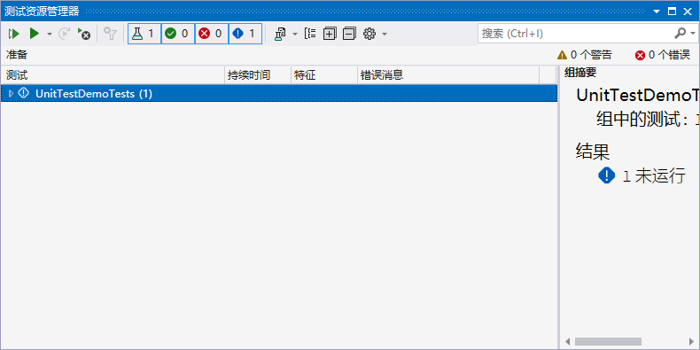

6. 在测试资源管理器上可以看到刚刚所写的测试方法，这样在GetTriangle_Test方法上右击“**运行测试**”就可以在测试资源管理器里看到单元测试的运行结果

   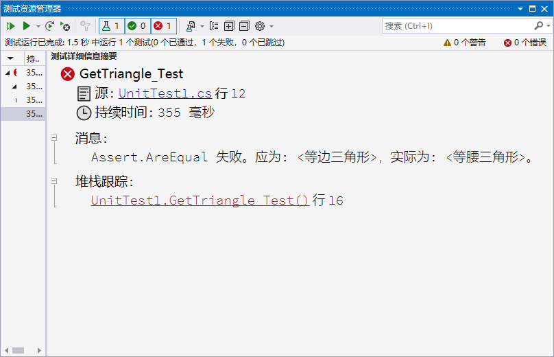

   可以看到，我们在单元测试中提供的例子的期望是输出“等边三角形”，运行结果却是“等腰三角形”。再看一看 **GetTriangle()** 函数的代码，原来是在对在判断三边数值是等边三角形之后没有使用 **else if** 又用 **if** 判断为等腰三角形了。通过这个简单的单元测试就能够发现一些意向不到的错误。不要以为这里的bug很低级，类似的情况确实会在现实中发生。

7. 把上面的错误更正后，再次运行TestMethod1()就会得到测试已通过的结果

   ```c#
     /// <summary>
     /// 获取三角形类型.
     /// </summary>
     /// <param name="sideArr">三角形三边长度数组.</param>
     /// <returns>返回三角形类型名称.</returns>
     public static string GetTriangle(string[] sideArr)
     {
         string result = string.Empty;
         int a = int.Parse(sideArr[0]);
         int b = int.Parse(sideArr[1]);
         int c = int.Parse(sideArr[2]);
         if (a + b > c && a + c > b && b + c > a)
         {
             if (a == b && a == c)
             {
                 result = "等边三角形";
             }
   
             else if (a == b || a == c || b == c)
             {
                 result = "等腰三角形";
             }
             else
             {
                 result = "一般三角形";
             }
         }
         else
         {
             result = "不构成三角形";
         }
         return result;
     }
   ```

   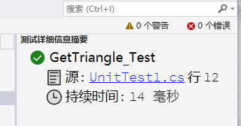

## 通过代码直接生成单元测试项目和单元测试存根

1. 在代码编辑器窗口中，从上下文菜单右键单击并选择“**创建单元测试**”。

   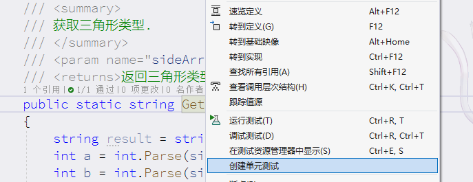

2. 使用选择默认值，或更改用于按需填写参数值。 单击“确定”，创建单元测试项目。

   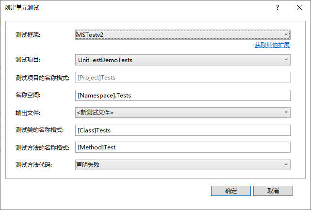

- **测试框架；**MSTest是VS自带的测试框架。新的MS TEST现在是通过Nuget的包发布了，
  - MS TEST V1：V1的版本依赖于一个包： **MSTest.TestFramework**
  - MS TEST V2：V2的版本依赖于两个包： **MSTest.TestFramework** 和 **MSTest.TestAdapter**
    这两个版本使用起来还是大同小异的，MSTest v2 主要是为了**.net core**准备的，当然也可以在**.net framework**上运行，并且在v1上新加入了一些扩展。

## 正确编写单元测试方法

- 要在测试资源管理器中运行，大多数框架要求你添加特定的属性来识别单元测试方法。
- 框架通常通过**断言语句或方法属性**，来指示测试方法是否已通过或失败。
- 框架还提供，其他特性标识用于标识可选的安装方法。这些安装方法在类初始化时执行一次，在每个测试方法之前执行，并在每个测试方法之后执行，最后在整个类被销毁之前运行

**模式一；**

编写待测试方法的单元测试的常用方法

- **准备**（Arrange)，单元测试方法的准备部分初始化对象并设置传递给待测试方法的数据；
- **执行**（Act），执行部分调用具有准备参数的待测试方法；
- **断言**（Assert），断言部分验证待测试方法的执行行为与预期相同

```c#
[TestMethod()]
public void GetTriangle_Test()
{
    // arrange  
    string[] sideArr = { "5", "5", "5" }; // 准备传给待测试方法的数据
    string expected = "等边三角形";

    // act  
    var actual = UnitTestClass.GetTriangle(sideArr); // 调用测试方法

    // assert  
    Assert.AreEqual(expected, actual); // 验证待测试方法的执行结果是否与预期相同
}
```

## 单元测试设置超时值

在某些情况下(例如通过网络获取数据)，常常不希望程序卡住而占用太多时间，通过设置测试方法的超时时间，来测试一个方法是否在预期时间内执行。

```c#
[TestMethod()]
[Timeout(2000)] // 毫秒 要在单个测试方法上设置超时时间
public void GetTriangle_Test()
{   ... 
}

[TestMethod()]
[Timeout(TestTimeout.Infinite)] // 毫秒 将超时时间设置为允许的最大值
public void GetTriangle_Test()
{   ... 
}
```

## MSTest参数化测试

**什么是参数化测试？**

当要测试方法的逻辑同样，但输入参数不同，给出不同的结果。因为只是参数不同，所以并不希望把测试方法写多遍，但是又希望对每个参数的测试成为一个独立的测试用例。举例说，假定我有一个数学计算的方法是把两个整数相加求和，我希望证明这个方法对于任意两个数都是通过的。

```c#
 /// <summary>
 /// 相加（待测试方法）
 /// </summary>
 /// <param name="num1">数值1</param>
 /// <param name="num2">数值2</param>
 /// <returns>计算结果</returns>
 public static int Add(int num1, int num2)
 {
     return Math.Abs(num1 + num2);
 }
```


```c#
 /// <summary>
 /// 多值测试
 /// </summary>
 [TestMethod()]
 [DataRow(10, 20)]
 [DataRow(-2, -5)]
 [DataRow(1, -2)]
 [DataRow(5, null)]
 public void AddTest(int num1,int num2)
 {
     Assert.AreEqual((num1+num2), UnitTestClass.Add(num1,num2));
 }
```

测试了所有可能的情况，以达到更好的覆盖率。上方给出示例Add方法的单元测试运行测试结果如下图所示。

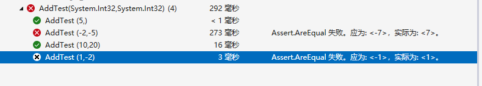

测试结果指出对两个数相加操作的方法，目标方法还取了绝对值，与相应结果不符

## 测试调试

可以使用测试资源管理器为你的测试启动调试会话。 使用 Visual Studio 调试程序可以无缝地逐句得使你在单元测试和所测试项目之间来回反复。 若要开始调试：

1. 在 Visual Studio 编辑器中，在想要调试的一个或多个测试方法中**设置断点**。

2. 在测试资源管理器中，选择测试方法，然后点击右键从快捷菜单选择“**调试选定的测试**”。

   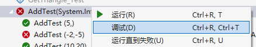

3. 进入调试模式，和平时调试那样操作即可

## Live Unit Testing 实时单元测试

> 仅在 Visual Studio Enterprise 版中可用

- Live Unit Testing 在编辑代码时自动执行所有受影响的测试，确保所做更改不会中断测试。
- 指示单元测试是否充分覆盖代码，并显示未被单元测试覆盖的代码。 Live Unit Testing **以图形方式实时描绘代码覆盖率**，以便一眼就能看到每行代码覆盖的测试数，目和未被任何单元测试覆盖的行。

1. 创建一个待测试方法

   ```c#
           /// <summary>
           /// 相加（待测试方法）
           /// </summary>
           /// <param name="num1"></param>
           /// <param name="num2"></param>
           /// <returns></returns>
           public static int Add2(int num1, int num2)
           {
               return num1 + num2;
           }
   ```

2. **创建一个单元测试项目**（测试框架可以使用 Live Unit Testing 的 MSTest 测试框架（默认）。 还可使用 xUnit 和 NUnit 测试框架）。在测试项目添加对被测试类库项目的引用来提供测试库访问权限。

3. 在测试项目类中，将模板提供的样本单元测试方法代码替换为以下代码：

   ```c#
           [TestMethod()]
           [DataRow(10, 20)]
           [DataRow(-2, -5)]
           [DataRow(1, -2)]
           [DataRow(5, null)]
           public void Add2Test(int num1,int num2)
           {
               Assert.AreEqual(num1 + num2, UnitTestClass.Add2(num1, num2));
           }
   ```

4. 在Visual Studio 菜单栏=>测试-=> Live Unit Testing=>启动 

5. 打开Live lJnit Testing 窗口 在Visual Studio 菜单栏=>测试-=> Live Unit Testing窗口（CTRL+E,T）

   在 Live lJnit Testing 窗口工具栏中使用罹放列表编辑器 选择 Live Unit Testing 应运行的测试。

   或者，右击辑器或解决方案资源管理器中的测试文文件/测试类/测试方法，然舌单击Live Unit Testing=>包括。

   单击，包括所有试，将所有到试包括到放列表中。

6. 完成运行测试后，“测试资源管理器” 显示整体结果和各个测试的结果。 此外，代码窗口以图形方式显示测试代码覆盖率和测试结果

   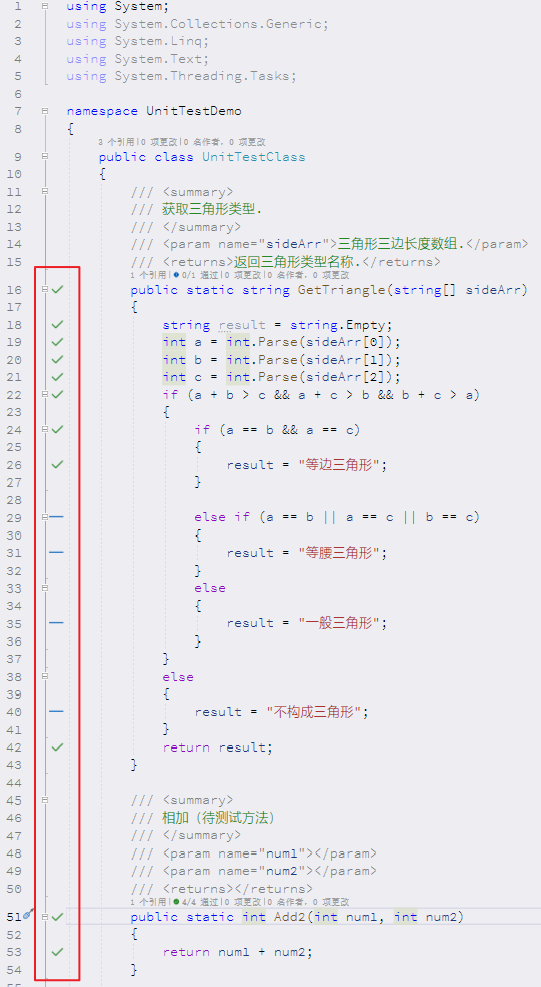

   它还显示测试中已覆盖 **Add2()** 方法中的所有代码位置，并**已成功执行这些测试**（用绿色复选标记“**✓**”指示）。 其他方法有部分代码**没有代码覆盖率**（用蓝线“**—**”指示）

7. 通过在代码窗口中选择一个特定的代码覆盖率图标，来获得有关测试覆盖率和测试结果的**更多详细信息**。 若要查看此详细信息，单击行上的绿色复选标记“✓”，

   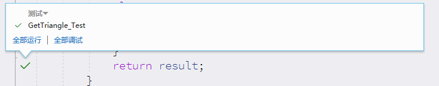

**Live Unit Testing** 中“**—**”标识的主要问题是代码覆盖率不完整，可以通过添加测试方法或改变测试参数，

在你修改源代码时，Live Unit Testing 将自动执行新增的和修改后的测试。

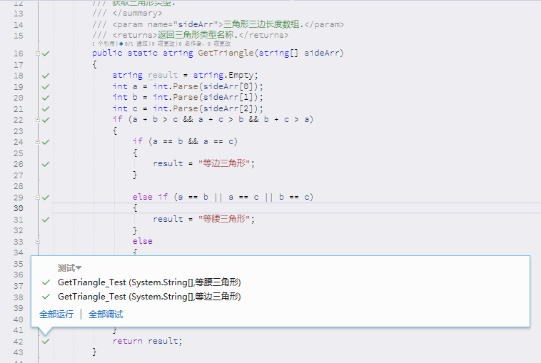

8. 测试失败方法会有一个x号

   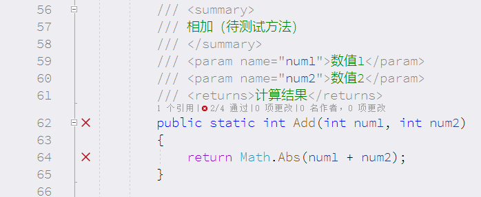

9. 停止测试；点击Live lJnit Testing 窗口上的 或者在Visual Studio 菜单栏=>测试-=> Live Unit Testing=>停止。

## 使用 IntelliTest 为代码生成单元测试


## MSTest

### Assert [断言]

> [Assert 类 (Microsoft.VisualStudio.TestTools.UnitTesting) | Microsoft Learn](https://learn.microsoft.com/zh-cn/previous-versions/ms245302(v=vs.110)?redirectedfrom=MSDN)

静态类，使用 true/false 命题验证单元测试中的条件。

**方法；**

| 参数名   | 说明   |
| -------- | ------ |
| expected | 预期值 |
| actual   | 实际值 |
|          |        |


- `public static void AreEqual( Object expected, Object actual )` 验证指定的两个对象是否相等。 如果两个对象不相等，则断言失败。 
- `public static void AreEqual( double expected, double actual, double delta )` 
  - 参数
    - double delta  


## NUnit 测试框架

### 下载安装NUnit插件

在VS中选择菜单栏=>扩展=>管理扩展，选择联机并在搜索框中输入NUnit

下载安装NUnit Test Generator VS2022 

**如何使用；**

在公共类上选择公共方法，然后右键单击以创建测试

从“测试框架”下拉列表中选择“NUnit”或“NUnit2”。

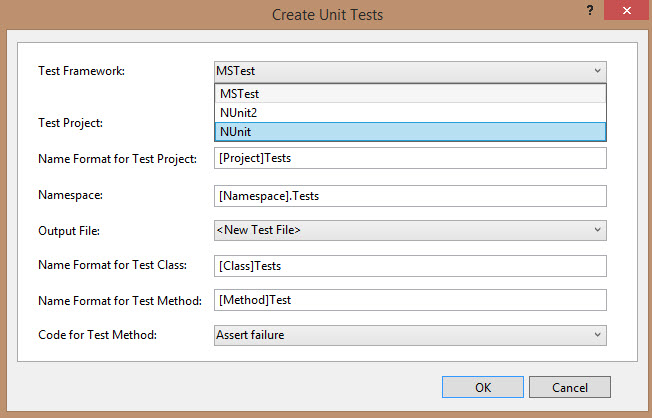

请注意，Intelli Test 仅在 VisualStudio Enterprise 版中可用。其他版本的 Visual Studio 只有“创建单元测试”菜单选项。


