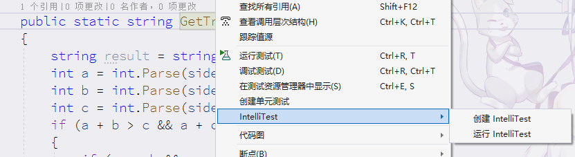
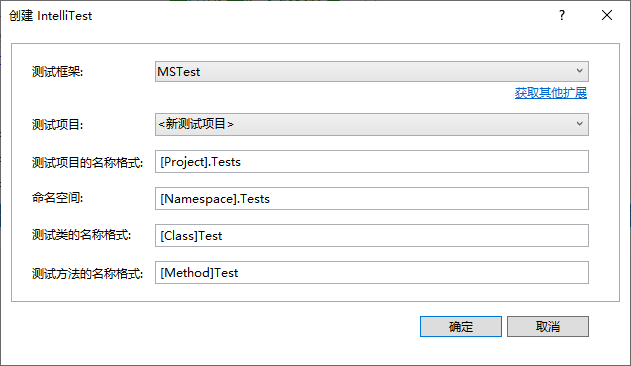
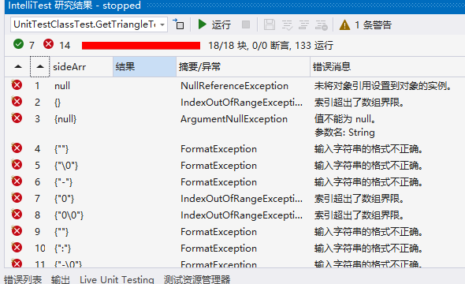
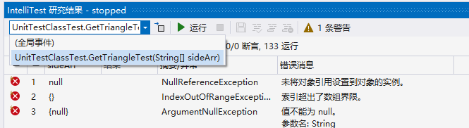

# 单元测试

> visual studio 2022

## 什么是单元测试

所谓单元测试（unit testing），就是开发者编写的一小段代码，用于对软件中的最小单元进行检查和验证，其一般验证对象是一个函数或者一个类。通常而言，一个单元测试是用于判断某个特定条件（或者场景）下某个特定函数的行为。

### 单元测试好处

- 大大节约了测试和修改的时间，有效且便于测试各种情况。
- 能快速定位bug（每一个测试用例都是具有针对性）。
- 能使开发人员重新审视需求和功能的设计（难以单元测试的代码，就需要重新设计）。
- 强迫开发者以调用者而不是实现者的角度来设计代码，利于代码之间的解耦。
- 自动化的单元测试能保证回归测试的有效执行。
- 使代码可以放心修改和重构。
- 测试用例，可作为开发文档使用（测试即文档）。
- 测试用例永久保存，支持随时测试。

### 框架选型

常用单元测试框架：MSTest (Visual Studio官方)、XUnit 和 NUnit。

1. MS Test为微软产品，集成在Visual Studio 2008+工具中。
2. NUnit为.Net开源测试框架（采用C#开发），广泛用于.Net平台的单元测试和回归测试中，官方网址([www.nunit.org](http://www.nunit.org/))。
3. XUnit.Net为NUnit的改进版。

以下主要讲解MSTest 和NUnit的使用，XUnit操作和NUnit操作基本类似

## 使用案例

> 以下使用MSTest框架演示

1. 在工程中添加**UnitTestClass**类，并书写一个静态的**GetTriangle(string[] sideArr)** 函数用来返回一个三角形的类型。

   ```c#
   using System;
   using System.Collections.Generic;
   using System.Linq;
   using System.Text;
   using System.Threading.Tasks;
   
   namespace UnitTestDemo
   {
       public class UnitTestClass
       {
           /// <summary>
           /// 获取三角形类型.
           /// </summary>
           /// <param name="sideArr">三角形三边长度数组.</param>
           /// <returns>返回三角形类型名称.</returns>
           public static string GetTriangle(string[] sideArr)
           {
               string result = string.Empty;
               int a = int.Parse(sideArr[0]);
               int b = int.Parse(sideArr[1]);
               int c = int.Parse(sideArr[2]);
               if (a + b > c && a + c > b && b + c > a)
               {
                   if (a == b && a == c)
                   {
                       result = "等边三角形";
                   }
   
                   if (a == b || a == c || b == c)
                   {
                       result = "等腰三角形";
                   }
                   else
                   {
                       result = "一般三角形";
                   }
               }
               else
               {
                   result = "不构成三角形";
               }
               return result;
           }
       }
   }
   
   ```

   

2. 在项目中添加一个UnitTestDemoTests测试项目

   > 按自己需求选择合适模板

   

   

   ```c#
   using Microsoft.VisualStudio.TestTools.UnitTesting;
   using System;
   
   namespace UnitTestDemoTests
   {
       [TestClass]
       public class UnitTest1
       {
           [TestMethod]
           public void TestMethod1()
           {
           }
       }
   }
   
   ```

   完成后会得到一个UnitTest1测试类模板，即一个带有[TestClass] 特性标记的类和一个带有[TestMethod] 特性标记的空方法public void TestMethod1()。

3. 单元测试项目无法自动访问它正在测试的类库。 可以通过添加对类库项目的引用来提供测试库访问权限。 

   


4.  在UnitTestDemoTests项目中的UnitTest1类中，将模板提供的样本单元测试代码替换为以下代码：

   ```c#
   ```

5. 测试项将在测试资源管理器中显示。 如果测试资源管理器窗口不可见，在 Visual Studio 菜单栏=>测试=>测试资源管理器(Ctrl + E,T) 

   

6. 在测试资源管理器上可以看到刚刚所写的测试方法，这样在GetTriangle_Test方法上右击“**运行测试**”就可以在测试资源管理器里看到单元测试的运行结果

   

   可以看到，我们在单元测试中提供的例子的期望是输出“等边三角形”，运行结果却是“等腰三角形”。再看一看 **GetTriangle()** 函数的代码，原来是在对在判断三边数值是等边三角形之后没有使用 **else if** 又用 **if** 判断为等腰三角形了。通过这个简单的单元测试就能够发现一些意向不到的错误。不要以为这里的bug很低级，类似的情况确实会在现实中发生。

7. 把上面的错误更正后，再次运行TestMethod1()就会得到测试已通过的结果

   ```c#
     /// <summary>
     /// 获取三角形类型.
     /// </summary>
     /// <param name="sideArr">三角形三边长度数组.</param>
     /// <returns>返回三角形类型名称.</returns>
     public static string GetTriangle(string[] sideArr)
     {
         string result = string.Empty;
         int a = int.Parse(sideArr[0]);
         int b = int.Parse(sideArr[1]);
         int c = int.Parse(sideArr[2]);
         if (a + b > c && a + c > b && b + c > a)
         {
             if (a == b && a == c)
             {
                 result = "等边三角形";
             }
   
             else if (a == b || a == c || b == c)
             {
                 result = "等腰三角形";
             }
             else
             {
                 result = "一般三角形";
             }
         }
         else
         {
             result = "不构成三角形";
         }
         return result;
     }
   ```

   

## 通过代码直接生成单元测试项目和单元测试存根

1. 在代码编辑器窗口中，从上下文菜单右键单击并选择“**创建单元测试**”。

   

2. 使用选择默认值，或更改用于按需填写参数值。 单击“确定”，创建单元测试项目。

   

- **测试框架；**MSTest是VS自带的测试框架。新的MS TEST现在是通过Nuget的包发布了，
  - MS TEST V1：V1的版本依赖于一个包： **MSTest.TestFramework**
  - MS TEST V2：V2的版本依赖于两个包： **MSTest.TestFramework** 和 **MSTest.TestAdapter**
    这两个版本使用起来还是大同小异的，MSTest v2 主要是为了**.net core**准备的，当然也可以在**.net framework**上运行，并且在v1上新加入了一些扩展。

## 正确编写单元测试方法

- 要在测试资源管理器中运行，大多数框架要求你添加特定的属性来识别单元测试方法。
- 框架通常通过**断言语句或方法属性**，来指示测试方法是否已通过或失败。
- 框架还提供，其他特性标识用于标识可选的安装方法。这些安装方法在类初始化时执行一次，在每个测试方法之前执行，并在每个测试方法之后执行，最后在整个类被销毁之前运行

**模式一；**

编写待测试方法的单元测试的常用方法

- **准备**（Arrange)，单元测试方法的准备部分初始化对象并设置传递给待测试方法的数据；
- **执行**（Act），执行部分调用具有准备参数的待测试方法；
- **断言**（Assert），断言部分验证待测试方法的执行行为与预期相同

```c#
[TestMethod()]
public void GetTriangle_Test()
{
    // arrange  
    string[] sideArr = { "5", "5", "5" }; // 准备传给待测试方法的数据
    string expected = "等边三角形";

    // act  
    var actual = UnitTestClass.GetTriangle(sideArr); // 调用测试方法

    // assert  
    Assert.AreEqual(expected, actual); // 验证待测试方法的执行结果是否与预期相同
}
```

## 单元测试设置超时值

在某些情况下(例如通过网络获取数据)，常常不希望程序卡住而占用太多时间，通过设置测试方法的超时时间，来测试一个方法是否在预期时间内执行。

```c#
[TestMethod()]
[Timeout(2000)] // 毫秒 要在单个测试方法上设置超时时间
public void GetTriangle_Test()
{   ... 
}

[TestMethod()]
[Timeout(TestTimeout.Infinite)] // 毫秒 将超时时间设置为允许的最大值
public void GetTriangle_Test()
{   ... 
}
```

## MSTest参数化测试

**什么是参数化测试？**

当要测试方法的逻辑同样，但输入参数不同，给出不同的结果。因为只是参数不同，所以并不希望把测试方法写多遍，但是又希望对每个参数的测试成为一个独立的测试用例。举例说，假定我有一个数学计算的方法是把两个整数相加求和，我希望证明这个方法对于任意两个数都是通过的。

```c#
 /// <summary>
 /// 相加（待测试方法）
 /// </summary>
 /// <param name="num1">数值1</param>
 /// <param name="num2">数值2</param>
 /// <returns>计算结果</returns>
 public static int Add(int num1, int num2)
 {
     return Math.Abs(num1 + num2);
 }
```


```c#
 /// <summary>
 /// 多值测试
 /// </summary>
 [TestMethod()]
 [DataRow(10, 20)]
 [DataRow(-2, -5)]
 [DataRow(1, -2)]
 [DataRow(5, null)]
 public void AddTest(int num1,int num2)
 {
     Assert.AreEqual((num1+num2), UnitTestClass.Add(num1,num2));
 }
```

测试了所有可能的情况，以达到更好的覆盖率。上方给出示例Add方法的单元测试运行测试结果如下图所示。


测试结果指出对两个数相加操作的方法，目标方法还取了绝对值，与相应结果不符

## 测试调试

可以使用测试资源管理器为你的测试启动调试会话。 使用 Visual Studio 调试程序可以无缝地逐句得使你在单元测试和所测试项目之间来回反复。 若要开始调试：

1. 在 Visual Studio 编辑器中，在想要调试的一个或多个测试方法中**设置断点**。

2. 在测试资源管理器中，选择测试方法，然后点击右键从快捷菜单选择“**调试选定的测试**”。

   

3. 进入调试模式，和平时调试那样操作即可

## Live Unit Testing 实时单元测试

> 仅在 Visual Studio Enterprise 版中可用

- Live Unit Testing 在编辑代码时自动执行所有受影响的测试，确保所做更改不会中断测试。
- 指示单元测试是否充分覆盖代码，并显示未被单元测试覆盖的代码。 Live Unit Testing **以图形方式实时描绘代码覆盖率**，以便一眼就能看到每行代码覆盖的测试数，目和未被任何单元测试覆盖的行。

1. 创建一个待测试方法

   ```c#
           /// <summary>
           /// 相加（待测试方法）
           /// </summary>
           /// <param name="num1"></param>
           /// <param name="num2"></param>
           /// <returns></returns>
           public static int Add2(int num1, int num2)
           {
               return num1 + num2;
           }
   ```

2. **创建一个单元测试项目**（测试框架可以使用 Live Unit Testing 的 MSTest 测试框架（默认）。 还可使用 xUnit 和 NUnit 测试框架）。在测试项目添加对被测试类库项目的引用来提供测试库访问权限。

3. 在测试项目类中，将模板提供的样本单元测试方法代码替换为以下代码：

   ```c#
           [TestMethod()]
           [DataRow(10, 20)]
           [DataRow(-2, -5)]
           [DataRow(1, -2)]
           [DataRow(5, null)]
           public void Add2Test(int num1,int num2)
           {
               Assert.AreEqual(num1 + num2, UnitTestClass.Add2(num1, num2));
           }
   ```

4. 在Visual Studio 菜单栏=>测试-=> Live Unit Testing=>启动 

5. 打开Live lJnit Testing 窗口 在Visual Studio 菜单栏=>测试-=> Live Unit Testing窗口（CTRL+E,T）

   在 Live lJnit Testing 窗口工具栏中使用罹放列表编辑器 选择 Live Unit Testing 应运行的测试。

   或者，右击辑器或解决方案资源管理器中的测试文文件/测试类/测试方法，然舌单击Live Unit Testing=>包括。

   单击，包括所有试，将所有到试包括到放列表中。

6. 完成运行测试后，“测试资源管理器” 显示整体结果和各个测试的结果。 此外，代码窗口以图形方式显示测试代码覆盖率和测试结果

   

   它还显示测试中已覆盖 **Add2()** 方法中的所有代码位置，并**已成功执行这些测试**（用绿色复选标记“**✓**”指示）。 其他方法有部分代码**没有代码覆盖率**（用蓝线“**—**”指示）

7. 通过在代码窗口中选择一个特定的代码覆盖率图标，来获得有关测试覆盖率和测试结果的**更多详细信息**。 若要查看此详细信息，单击行上的绿色复选标记“✓”，

   

**Live Unit Testing** 中“**—**”标识的主要问题是代码覆盖率不完整，可以通过添加测试方法或改变测试参数，

在你修改源代码时，Live Unit Testing 将自动执行新增的和修改后的测试。


8. 测试失败方法会有一个x号

   

9. 停止测试；点击Live lJnit Testing 窗口上的 或者在Visual Studio 菜单栏=>测试-=> Live Unit Testing=>停止。

## 使用 IntelliTest 为代码生成单元测试

IntelliTest 浏览你的 .NET 代码，以生成测试数据和单元测试套件。 对于代码中的每个语句，将生成执行该语句的测试输入。 为代码中的每个条件分支执行案例分析。 例如，分析 if 语句、断言和可能引发异常的所有操作。 此分析用于为你的每个方法生成参数化单元测试的测试数据，从而创建具有较高代码覆盖率的单元测试。

> 注意；
>
> 只有企业版提供 IntelliTest。 面向 .NET Framework 的 C# 代码支持它。 当前不支持 .NET Core 和 .NET Standard。

若要生成单元测试，你的类型必须是公共类。 否则，先创建单元测试，然后再生成它们。

1. 打开解决方案。 然后打开包含你要测试的方法的类文件

2. 在代码中右键单击一种方法并选择“**创建 IntelliTest**”，为方法中的代码创建生成单元测试项目。

   

3. 选择使用默认格式以生成测试或自定义。

   

4. 创建测试项目成功之后，选择“**运行 IntelliTest**”（如步骤2中图所示），为方法中的代码运行**IntelliTest**单元测试项目。

   　　**IntelliTest** 使用不同的输入多次运行你的代码。 每次运行都会在表中表示出来，显示输入测试数据以及产生的输出或异常。

   

5. 要为一个类中的所有公共方法生成单元测试，只需右键单击类而不是特定的方法。 然后选择“运行 IntelliTest”。 使用“浏览结果”窗口中的下拉列表，显示类中每个方法的单元测试和输入数据。

   

6. 对于通过的测试，检查结果列中报告的结果是否与你对代码的预期要求匹配。 对于失败的测试，根据需要修复你的代码。 然后重新运行 IntelliTest 来验证修复。


## MSTest

### Assert 【断言】

> [Assert 类 (Microsoft.VisualStudio.TestTools.UnitTesting) | Microsoft Learn](https://learn.microsoft.com/zh-cn/previous-versions/ms245302(v=vs.110)?redirectedfrom=MSDN)

静态类，使用 true/false 命题验证单元测试中的条件。

| 参数名                | 说明                                          |
| --------------------- | --------------------------------------------- |
| expected              | 预期值                                        |
| actual                | 实际值                                        |
| message               | 断言失败显示的消息                            |
| `Object[] parameters` | 为message参数中的字符串格式化占位符填充数据值 |

方法前面标“⭐”的表示该方法有以下参数的重载

- `string message` 

- `string message,params Object[] parameters` 

**AreEqual()方法；**

主要用于判断两个对象是否相等

- ⭐`public static void AreEqual( Object expected, Object actual )` 验证指定的两个对象是否相等。 如果两个对象不相等，则断言失败。 

- `AreEqual(Object, Object, String)` 验证指定的两个对象是否相等。 如果两个对象不相等，则断言失败。 如果断言失败，将显示一则消息

- `public static void AreEqual(Object expected,Object actual,string message,params Object[] parameters)` 验证指定的两个对象是否相等。 如果两个对象不相等，则断言失败。 断言失败时将显示一则消息，并向该消息应用指定的格式。

  - 参数

    - Object[] parameters 设置 message 格式时使用的参数的数组。 

      ```c#
       Assert.AreEqual(1, 2, "不相等{0}", new string[]{"2333"});
      ```

      

- ⭐`public static void AreEqual( double expected, double actual, double delta )`  验证指定的两个双精度型值是否相等或者是否在对方的指定精度内。 如果它们不位于对方的指定精度内，则断言失败。
  
  - 参数
    - double delta   只有当 expected 与 actual 的**差超过** delta 时断言才失败。 
  
  
  
- ⭐`AreEqual(Single, Single, Single)` 验证指定的两个单精度型值是否相等或者是否位于对方的指定精度内。 如果它们不位于对方的指定精度内，则断言失败。 

  

- ⭐`public static void AreEqual( string expected, string actual, bool ignoreCase )` 验证指定的两个字符串是否相等，根据指定的要求忽略大小写或不忽略大小写。 如果它们不相等，则断言失败。
  - 参数；
    - bool ignoreCase  指示区分大小写或不区分大小写的比较。 true 指示所进行的比较不区分大小写。 

- ⭐`AreEqual<T>(T, T)` 使用相等运算符验证指定的两个泛型数据是否相等。 如果它们不相等，则断言失败。 
  - 参数
    - `<T>` 要验证数据的泛型类型是什么
  - 注意；如果逻辑值相等，不同的数值类型也会**被视为相等**。 例如，42L 不等于 42。

**AreNotEqual()方法；**

验证指定的两个对象是否不相等

- ⭐`AreNotEqual(Object, Object)` 验证指定的两个对象是否不相等。 如果两个对象相等，则断言失败。 

**AreNotSame()方法；**

验证指定的两个对象变量是否引用不同的对象

- ⭐`AreNotSame(Object, Object)` 验证指定的两个对象变量是否引用不同的对象。 如果它们引用同一个对象，则断言失败。 

**其它方法；**

- ⭐`Fail()` 在不检查任何条件的情况下使断言失败。 

- ⭐`Inconclusive()` 指示无法验证断言。 

- ⭐`IsTrue(Boolean)` 验证指定的条件是否为 true。 如果该条件为 false，则断言失败。 

- ⭐`IsFalse(Boolean)` 验证指定的条件是否为 false。 如果该条件为 true，则断言失败。 

- ⭐ `IsInstanceOfType(Object, Type)` 验证指定的对象是否为指定类型的实例。 如果在该对象的继承层次结构中找不到该类型，则断言失败。 

  ```c#
  Assert.IsInstanceOfType("s",typeof(string));
  ```

- ⭐`IsNotInstanceOfType(Object, Type)` 验证指定的对象是否不为指定类型的实例。 如果在该对象的继承层次结构中找到了指定的类型，则断言失败。 

- ⭐`IsNull(Object)` 验证指定的对象是否**为 null**。如果该对象不为 null，则断言失败。 

- ⭐`IsNotNull(Object)` 验证指定的对象是否**不为 null**。如果该对象为 null，则断言失败。 

- `ReplaceNullChars` 在字符串中，用 "\\0" 替换空字符 ('\0')。 

**总结；**

 Assert  类提供了许多用于验证真假设的静态方法。 如果所验证的条件不为  true，则断言将失败。

> 重要；
>
> Assert 类通过引发 `AssertFailedException` 来表示失败。 **不应捕获该异常**。 单元测试引擎处理此异常来指示断言失败。

### StringAssert 【字符串断言】

静态类

- ⭐Contains(String, String) 验证第一个字符串是否包含第二个字符串。 此方法**区分大小写**。 
- ⭐DoesNotMatch(String, Regex) 验证指定的字符串是否与正则表达式**不匹配**。 
- ⭐EndsWith(String, String) 验证第一个字符串是否以第二个字符串结尾。 此方法**区分大小写**。
- ⭐Matches(String, Regex) 验证指定的字符串是否与正则表达式匹配。 
- ⭐StartsWith(String, String) 验证第一个字符串是否以第二个字符串开头。 此方法**区分大小写**。 

### TestContext

> [TestContext 类 (Microsoft.VisualStudio.TestTools.UnitTesting) | Microsoft Learn](https://learn.microsoft.com/zh-cn/previous-versions/ms245541(v=vs.110)?redirectedfrom=MSDN)

用于存储提供给单元测试的信息。


### CollectionAssert【集合断言】

> [CollectionAssert 类 (Microsoft.VisualStudio.TestTools.UnitTesting) | Microsoft Learn](https://learn.microsoft.com/zh-cn/previous-versions/ms245294(v=vs.110)?redirectedfrom=MSDN)

在单元测试中验证与集合关联的 true/false 命题。

### DataSourceElement 

> [DataSourceElement 类 (Microsoft.VisualStudio.TestTools.UnitTesting) | Microsoft Learn](https://learn.microsoft.com/zh-cn/previous-versions/ms245512(v=vs.110)?redirectedfrom=MSDN)

将数据源元素表示为配置文件中的 XML 标记。

### DataSourceElementCollection 

> [DataSourceElementCollection 类 (Microsoft.VisualStudio.TestTools.UnitTesting) | Microsoft Learn](https://learn.microsoft.com/zh-cn/previous-versions/ms245536(v=vs.110)?redirectedfrom=MSDN)

表示 XML 元素，此元素包含子 DataSourceElement 对象的集合。


## NUnit 测试框架

### 下载安装NUnit插件

在VS中选择菜单栏=>扩展=>管理扩展，选择联机并在搜索框中输入NUnit

下载安装NUnit Test Generator VS2022 

**如何使用；**

在公共类上选择公共方法，然后右键单击以创建测试

从“测试框架”下拉列表中选择“NUnit”或“NUnit2”。


请注意，Intelli Test 仅在 VisualStudio Enterprise 版中可用。其他版本的 Visual Studio 只有“创建单元测试”菜单选项。

## MSTest特性

### DeploymentItem【部署项】

指定应具有在运行测试之前的程序集一起部署的文件或目录。 附加此属性设置为测试选件类或测试方法。 可以使用多个实例。 

**构造；**

- `public DeploymentItemAttribute(string path)` 
  - 参数；
    - string path 部署的文件或目录。 路径是**相对于生成输出目录**。 项目将被复制到与部署测试程序集的目录。 

- `public DeploymentItemAttribute(string path,string outputDirectory)` 在测试运行开始之前，指定项目将部署。
  - 参数；
    - string path 部署的文件或目录的相对路径或绝对路径。 路径是相对于生成输出目录。 项目将被复制到与部署测试程序集的目录。 
    - string outputDirectory  项目将复制目录的路径。 它可以是或绝对或相对部署目录中。 path 和内容确定的所有文件都复制到该目录。 

>  若要避免在项目结构的依赖关系，请从生成输出目录设置项目文件 复制到输出 属性，并部署。

**使用方法；**

- `[DeploymentItem("file1.xml")]`  复制 file1.xml 从生成输出目录添加到部署目录。

- `[DeploymentItem(@"Testfiles\")]  `复制所有文件和文件夹。Testfiles 文件夹从生成输出文件夹添加到部署文件夹。 子文件夹在部署文件夹复制。

- `[DeploymentItem("file2.xml", "DataFiles")]`  创建在部署文件夹名为的 DataFiles 一个文件夹，并复制从生成输出文件夹中的 file2.xml 到数据存档。

  > 说明；
  >
  > 如果使用第二个参数，它必须始终是文件夹，从文件的路径。 如果该文件夹不存在，则将创建。 使用 DeploymentItem，不能更改文件的名称。

- `[DeploymentItem(@"Resources\file2.xml",  "DataFiles")]`  如果不存在，创建在部署文件夹名为的 DataFiles 一个文件夹。 复制资源文件夹的 file2.xml 在生成输出文件夹下到数据存档。 通知资源文件夹在目标文件夹中没有重复项。

- `[DeploymentItem(@"TestFiles\", "TestFiles")]`  TestFiles 内容复制到部署文件夹的子文件夹。 子文件夹复制到该目标下。

- `[DeploymentItem(@"..\..\file1.xml")] (不建议)`  将一个项从项目目录。 此示例假定输出目录，例如，在 bin\debug 的典型的项目结构。而不是这取决于项目结构，设置文件的 复制到输出 属性。 部署文件从生成输出目录。

- `[DeploymentItem(@"C:\MyDataFiles\")]`  复制 MyDataFiles 文件夹的内容添加到部署文件夹。

  - (如果使用的 .testsettings  文件) [DeploymentItem("%myDir%\myFile.txt")] 

    部署文件 myFile.txt，如果该文件存在于 %myDir% 解决的内容。

### TestProperty【测试属性】

在方法上建立临时测试用特定属性。

 ```c#
 using System;
 using Microsoft.VisualStudio.TestTools.UnitTesting;
 using System.Windows.Forms;
 using System.Reflection;
 
 namespace TestProperty
 {
    [TestClass]
    public class TestPropertyTest
    {
       [TestMethod()]
       [TestProperty("MyProperty1", "Big")]
       [TestProperty("MyProperty2", "Small")]
       public void MyTestMethod()
       {
          // Get the current type
          Type t = GetType();
 
          MethodInfo mi = t.GetMethod("MyTestMethod");
          Type MyType = typeof(TestPropertyAttribute);
          object[] attributes = mi.GetCustomAttributes(MyType, false);
 
          for (int i = 0; i < attributes.Length; i++)
          {
             string name = ((TestPropertyAttribute)attributes[i]).Name;
             string val = ((TestPropertyAttribute)attributes[i]).Value;
 
             string mystring = string.Format("Property Name: {0}, Value: {1}", name, val);
             MessageBox.Show(mystring);
          }
       }
    }
 }
 ```


### Description【测试说明】

用于指定对测试的说明。 此类不能被继承。

```
[Description("这是一个示例测试方法")]
```

###  Owner【测试人员信息】

用于指定负责对测试进行维护、运行和/或调试的人员 

### TestCategory【测试类别名】

用于指定单元测试类别的类。

### Priority【测试优先级】

用于指定单元测试的优先级 

数值越大优先级越高

### Shadowing【禁用此类】

不要使用此类。

### ExpectedException 【预期异常】

表示测试方法的执行过程中应引发异常。 

构造；

- `public ExpectedExceptionAttribute(Type exceptionType)` 用预期的异常初始化 

  - 参数；

    - Type exceptionType 预期的异常类型，此异常将由方法引发。

      如果 exceptionType 为  null  , 诊断消息将被发送到跟踪侦听器。 

-  `public ExpectedExceptionAttribute(Type exceptionType,string noExceptionMessage)` 用预期的异常类型以及描述此异常的消息来初始化 
  -  参数；
    - string noExceptionMessage 如果测试没有引发异常而失败，则要包含在测试结果中的消息。

### Ignore 【忽略测试】

指示特定测试不应运行。 此类不能被继承。

> 这应该用于在运行一组测试时暂时排除其中的特定测试。 如果由于代码中存在错误，某个测试使其他测试无法运行，则可以使用它来阻止该测试的运行。 因为测试仍在编译，所以与注释掉代码相比，这种方法更好。
>
> 它将测试的“已启用测试”属性设置为 false。
>
> 可以在测试类或方法上指定此属性。 一个方法或类上只能有此属性的一个实例。

### DataSource【数据源】

为数据驱动测试提供数据源特定的信息。 此类不能被继承。 

**构造；**

- ` public DataSourceAttribute(string dataSourceSettingName)` 使用与设置名称关联的数据提供程序和连接字符串进行初始化。

  - 参数
    - string dataSourceSettingName 在 app.config 文件的 `microsoft.visualstudio.qualitytools` 部分中找到的数据源的名称。

-  `public DataSourceAttribute(string connectionString, string tableName)` 将使用连接字符串和表名称进行初始化。 指定连接字符串和数据表以访问 OLEDB 数据源。

  - 参数；
    - string connectionString  特定于数据提供程序的连接字符串。 警告：连接字符串可以包含敏感数据（例如密码）。 连接字符串以纯文本形式存储在源代码和已编译的程序集中。 限制对源代码和程序集的访问以保护此敏感信息。
    - string tableName 数据表的名称。

- `public DataSourceAttribute(string providerInvariantName, string connectionString, string tableName, DataAccessMethod dataAccessMethod)`  使用数据提供程序、连接字符串、数据表和数据访问方法进行初始化，以访问数据源。及使用数据库

  - 参数；

    - string providerInvariantName 固定数据提供程序名称，例如 System.Data.SqlClientstring connectionString 

    - string connectionString 特定于数据提供程序的连接字符串。 警告：连接字符串可以包含敏感数据（例如密码）。 连接字符串以纯文本形式存储在源代码和已编译的程序集中。 限制对源代码和程序集的访问以保护此敏感信息。如文件路径、连接字符串等。

    - string tableName 数据表的名称。

    - DataAccessMethod dataAccessMethod 指定访问数据的顺序。

      DataAccessMethod 枚举

      | 值         | 作用               |
      | ---------- | ------------------ |
      | Random     | 按随机顺序返回行。 |
      | Sequential | 按顺序返回行。     |

### AssemblyInitialize【程序集初始化】

被标记的方法会在运行程序集中的**所有测试之前**使，并分配程序集获得的资源。

- 被标记的方法必须是`public static void`修饰的。
- 方法必须有`TestContext testContext` 形参

- 将在用 ClassInitializeAttribute、 TestInitializeAttribute 和 TestMethodAttribute 属性标记的方法之前运行用该属性标记的方法。 **一个程序集中只有一个方法可用该属性修饰。**
- 此属性不应当用于 ASP.NET 单元测试，即任何带有 [HostType("ASP.NET")] 属性的测试。 由于  IIS 和 ASP.NET 的无状态特性，用此属性修饰的方法在每个测试运行中可以多次调用。
- 对于带有 AssemblyInitialize 属性标记的方法，仅当该方法属于带有 TestClass  属性标记的类的成员时，测试引擎才会运行它。
- 每个方法只能应用此特性的一个实例

### ClassInitialize【类初始化】

标识一个包含代码的方法，这些代码必须在测试类中的**任意测试运行之前**使用，并用于分配测试类所使用的资源。 

- 被标记的方法必须是`public static void`修饰的。

- 方法必须有`TestContext testContext` 形参
- 在负载测试中运行时，标有此属性的方法将**运行一次**，并且它所执行的任何初始化操作都将应用于**整个测试**。  
- 每个方法只能应用此特性的一个实例

### TestInitialize【测试初始化】

标识在**测试之前**要运行的方法，从而分配并配置测试类中的所有测试所需的资源。 

- 在负载测试中运行时，标有此属性的方法将针对测试中的所有虚拟用户迭代**运行一次**。
- 每个方法只能应用此特性的一个实例

###  TestMethod

用于标识测试方法。 

- 测试方法必须位于测试类中并且必须用 TestMethodAttribute 标记才是有效的。
- 可以在方法上指定此属性。 每个方法只能应用此特性的一个实例。
- 默认情况下，此属性用于区分自动生成的代码中的测试方法。

### TestClass【标识测试类】

用于标识包含测试方法的类。 此类不能被继承。

### TestClassExtension【测试扩展类】

激活类，以将其识别为单元测试扩展类 

### TestCleanup【测试清理】

标识一个方法，此方法包含测试运行后必须用于释放测试类中的全部测试所获得的资源的代码。

- 将在用 TestMethodAttribute 标记的方法**之后**、用 ClassCleanupAttribute 和 AssemblyCleanupAttribute 标记的方法**之前**运行用此属性标记的方法。
- 可以在方法上指定此属性。 每个方法只能应用此特性的一个实例。
- 默认情况下，此特性用于生成的代码中。

### ClassCleanup【类清理】

标识一个包含代码的方法，该代码将在测试类中所有的测试都运行以后使用，并释放测试类所获取的资源。 此类不能被继承。

- 将在用 TestCleanupAttribute 标记的方法**之后**、用 AssemblyCleanupAttribute 标记的方法**之前**运行用此属性标记的方法。 
- 一个类中只有一个方法可以用此属性修饰。
- 此属性不应当用于 ASP.NET 单元测试，即任何带有 [HostType("ASP.NET")] 属性的测试。 由于  IIS 和 ASP.NET 的无状态特性，用此属性修饰的方法在每个测试运行中可以多次调用。

### AssemblyCleanup 【程序集清理】

被标记的方法会在程序集中的所有测试之后使用并释放程序集获得的资源。

- 被标记的方法必须是`public static`修饰的并且无返回值。如果不是会导致其它测试方法不执行。

- 将在用 TestCleanupAttribute 和 ClassCleanupAttribute 属性标记的方法**之后**运行用该属性标记的方法。
-  如果**引发未经处理的异常，则不执行该方法**。 
- 如果具有 AssemblyCleanupAttribute 特性的方法与测试方法所在的类不同，将执行该方法。 **一个程序集中只有一个方法可用该属性修饰。**
- 每个方法只能应用此特性的一个实例

> 此属性不应当用于 ASP.NET 单元测试，即任何带有 [HostType("ASP.NET")] 属性的测试。 由于  IIS 和 ASP.NET 的无状态特性，用此属性修饰的方法在每个测试运行中可以多次调用。

```c#
  [AssemblyCleanup()]
  public static void AssemblyCleanupAttributeTest()
  {
      MessageBox.Show("AssemblyCleanup");

  }
```


## 特性执行顺序

1. AssemblyInitialize
2. ClassInitialize
3. TestInitialize
4. TestMethod
5. TestCleanup
6. ClassCleanup
7. AssemblyCleanup

```c#
using Microsoft.VisualStudio.TestTools.UnitTesting;
using System;

namespace UnitTestDemoTests
{
    [TestClass]
    public class DivideClassTest
    {
        [AssemblyInitialize]
        public static void AssemblyInit(TestContext testContext)
        {
            Console.WriteLine("AssemblyInitialize" + testContext);
        }

        [ClassInitialize]
        public static void ClassInit(TestContext testContext)
        {
            Console.WriteLine("ClassInitialize" + testContext);
        }

        [TestInitialize()]
        public void Initialize()
        {
            Console.WriteLine("TestInitialize");
        }

        [TestCleanup()]
        public void Cleanup()
        {
            Console.WriteLine("TestCleanup");
        }

        [ClassCleanup()]
        public static void ClassCleanup()
        {
            Console.WriteLine("ClassCleanup");
        }

        [AssemblyCleanup()]
        public static void AssemblyCleanup()
        {
            Console.WriteLine("AssemblyCleanup");
        }

        [TestMethod]
        [ExpectedException(typeof(System.DivideByZeroException))]
        public void Test11() {

            Console.WriteLine("TestMethod");
            Assert.Fail();
        }
    }

}

```


