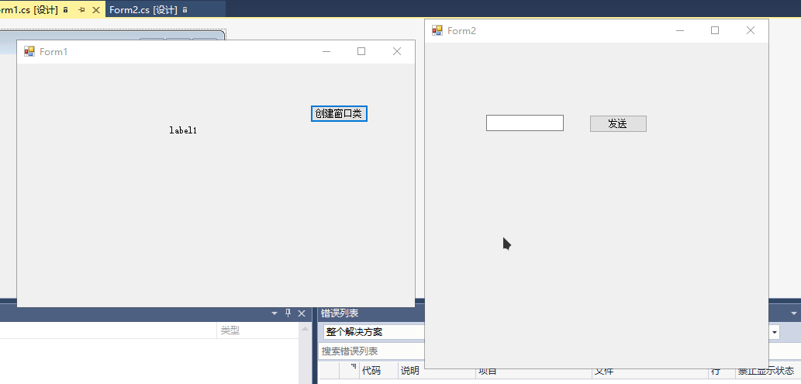

# 委托

把方法作为参数传递给另一个方法，传递的这个方法的类型就是**委托类型**

也就是让一个方法去调另一个方法，负责调方法的这个方法就叫委托

首先要知道什么是委托，用最通俗易懂的话来讲，你就可以把委托看成是用来执行方法（函数）的一个东西。

如何使用委托 　　在使用委托的时候，你可以像对待一个类一样对待它。即先声明，再实例化。只是有点不同，类在实例化之后叫对象或实例，但委托在实例化后仍叫委托。

## 声明

1. 书写在命名空间内，类的外面
2. 委托所指向的函数必须跟委托具有相同的**签名**【参数和返回值一样】
3. `delegate` 声明委托的关键字

```csharp
    //只有满足以下签名的函数才能被委托
    public delegate void MyDelegate(int number);
```

## 实例化

### 已有方法指定委托

> 总格式； 委托类型【定义的委托名】 委托名 = 实例化步骤

- 第一种实例化new创建【静态方法】

  ```csharp
  MyDelegate showNumber = new MyDelegate(Show);//传递要调用的方法
  ```

- 第二种实例化new创建【非静态方法】

  ```csharp
  MyDelegate showMultiple = new MyDelegate(new Program().ShowMultiple);//创建本类对象，去点要调用的方法。
  ```

- 第三种直接把要调用的方法【必须是静态方法】赋值给委托类型。

  ```csharp
  MyDelegate add = Add;
  ```

### 直接委托

- 匿名函数

  ```csharp
  //格式；delegate关键词(参数列表){方法体};
              MyDelegate del = delegate(int n){
                  Console.WriteLine(n);
              };
  ```

- `landa`表达式

  ```csharp
  MyDelegate landaDel = (int n) => { Console.WriteLine(n); };
  ```

## 调用

格式；和普通方法使用一直。都是方法名(参数列表)

```csharp
landaDel(666);
```

## 综合实例

```csharp
using System;
using System.Collections.Generic;
using System.Linq;
using System.Text;
using System.Threading.Tasks;

namespace lesson19
{
    //第一步 声明一个委托
    //只有满足以下签名的函数才能被委托
    public delegate void MyDelegate(int number);
    class Program
    {
        static void Main(string[] args)
        {


            /*============第三步实例化委托=============================*/
            //第一种实例化new创建【静态方法】
            MyDelegate showNumber = new MyDelegate(Show);//传递要调用的方法

            //第二种实例化new创建【非静态方法】
            MyDelegate showMultiple = new MyDelegate(new Program().ShowMultiple);//创建本类对象，去点要调用的方法。

            //第三种直接把要调用的方法赋值给委托类型。
            MyDelegate add = Add;

            /*第三步使用委托——————————————————————————*/

            showNumber(244);//静态
            showMultiple(5);//非静态
            add(233);//直接赋值

            /*——————————————————————————特殊直接使用+——————————————*/

            //匿名函数
            //格式；delegate关键词(参数列表){方法体};
            MyDelegate del = delegate(int n){
                Console.WriteLine(n);
            };

            del(50);//匿名调用

            //landa表达式

            MyDelegate landaDel = (int n) => { Console.WriteLine(n); };

            landaDel(666);//landa调用

            Console.ReadKey();
        }
        //第二部书写满足委托的方法

        public static void Show(int number)
        {
            Console.WriteLine(number);
        }

        public void ShowMultiple(int number)
        {
            Console.WriteLine(number * 2);
        }

        public static void Add(int number)
        {
            Console.WriteLine("加"+number);
        }
    }
}
```


## 窗体传值

从A窗口定义一个方法到B窗口去调用。把B窗口中的数据传递给A

**步骤**

1. 从A窗口声明一个方法。
2. B窗口声明一个委托【让此类的构造方法支持委托方法作为参数】，声明一个委托类型的字段保存传递的方法，给构造方法添加委托类型的形参，从B窗口的构造中保存传递的参数。调用。

**示例**

- A窗口

```csharp
using System;
using System.Collections.Generic;
using System.ComponentModel;
using System.Data;
using System.Drawing;
using System.Linq;
using System.Text;
using System.Threading.Tasks;
using System.Windows.Forms;

namespace lesson21
{

    public partial class Form1 : Form
    {
        public Form1()
        {
            InitializeComponent();

        }

        private void button1_Click(object sender, EventArgs e)
        {
            //创建窗体2对象，传递Send方法。
            Form2 form2 = new Form2(Send);
            form2.Show();
        }

        /// <summary>
        /// 显式Form2中TextBox中的数据。
        /// </summary>
        /// <param name="str"></param>
        void Send(string str)
        {
            label1.Text = str;
        }
    }
}
```

- B窗口

  ```csharp
  using System;
  using System.Collections.Generic;
  using System.ComponentModel;
  using System.Data;
  using System.Drawing;
  using System.Linq;
  using System.Text;
  using System.Threading.Tasks;
  using System.Windows.Forms;
  
  namespace lesson21
  {
      //声明委托接收form1中的传递的方法。委托作用，让from2的构造支持接收一个方法作为参数。
      //谁要让构造函数接收一个方法作为参数，就要定义一个委托。
      public delegate void DelNumber(string str);
      public partial class Form2 : Form
      {
          DelNumber _form1Send; //声明一个委托类型的字段类保存传递过来的方法。
          public Form2(DelNumber Send) //添加一个委托类型的形参
          {
              _form1Send = Send;//保存传递的委托
              InitializeComponent();
          }
  
          private void button1_Click(object sender, EventArgs e)
          {
              this._form1Send(textBox1.Text);//调用传递过来的Form1中的Send方法。
  
          }
      }
  }
  ```

  

## 多播委托

委托可以同时指向多个方法，这就是多播。

通过定义一个委托类型来指向一个委托方法，可以使用+=来指定多个方法同样也有-=。

```csharp
using System;
using System.Collections.Generic;
using System.Linq;
using System.Text;
using System.Threading.Tasks;

namespace lesson22
{
    //声明委托
    public delegate void Show();
    class Program
    {
        static void Main(string[] args)
        {
            //定义一个委托类型指向Show1
            Show show1 = Show1;
            show1(); //只输出了Show1内容
            Console.WriteLine();

            //多播委托

            Show shows = Show1;
            shows += Show2;
            shows += Show3;

            shows();//输出了所有Show方法。


            Console.ReadKey();
        }

        public static void Show1()
        {
            Console.WriteLine("显式1");
        }

        public static void Show2()
        {
            Console.WriteLine("显式2");
        }

        public static void Show3()
        {
            Console.WriteLine("显式3");
        }

    }
}
```