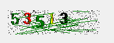

# GDI+

GDI 就像是H5中canvas一个画图控件。

Graphics 类

封装一个 GDI+ 绘图图面。 此类不能被继承。

> https://docs.microsoft.com/zh-cn/dotnet/api/system.drawing.graphics?redirectedfrom=MSDN&view=netframework-4.8


## 绘制线

```csharp
             //创建GDI对象,通过当前窗体对象
            Graphics g = this.CreateGraphics();// 不能直接new Graphics();
            //创建画笔对象 被给颜色参数
            Pen pen = new Pen(Brushes.Red);
            //创建两个点
            Point p1 = new Point(30, 50);
            Point p2 = new Point(250, 250);
            //绘制线 ，参数，笔和坐标
            g.DrawLine(pen, p1, p2);
```

## 绘制矩形

```csharp
     Graphics g = this.CreateGraphics(); //传教GDI对象
            Pen pen=new Pen(Brushes.Yellow); //创建画笔
            Size size=new System.Drawing.Size(80,80);//创建size对象指定矩形大小
            //创建画笔对象，指定要绘制的坐标和，size（矩形大小）
            Rectangle rec=new Rectangle(new Point(50,50),size);
            g.DrawRectangle(pen,rec);//绘制，传入笔和矩形对象。
```

## 绘制扇形

```csharp
            Graphics g = this.CreateGraphics();//创建GDI对象
            Pen pen=new Pen(Brushes.Blue);//创建笔
            Size size=new System.Drawing.Size(180,180);//创建size指定大小。
            Rectangle rec=new Rectangle(new Point(150,150),size);//创建一个矩形对象。
            g.DrawPie(pen, rec, 60, 60);//绘制扇形，传入笔，矩形，两个角度。
```

## 绘制文字

```csharp
    Graphics g = this.CreateGraphics();//创建GDI对象
    g.DrawString("老赵是最帅的", new Font("宋体", 20, FontStyle.Underline), Brushes.Black,         new Point(300, 300));
    /*参数
        - 要绘制的文本
        - 字体
            - 字体名
            - 字体大小
            - 字体样式【加粗，下划线，斜体等】
        - 字体颜色
        - 绘制的坐标点

    */
```


## 验证码绘制



> 要准备一个 pictureBox控件。

```c
            Random r = new Random(); 
            string str = null; //存放生成的随机数
        //生成随机数
            for (int i = 0; i < 5; i++)
            {
                int rNumber = r.Next(0, 10);
                str += rNumber; //放入到str中
            }

            //开始绘制
            Bitmap bmp = new Bitmap(150, 40); //传教一个位图对象，传入宽度和高度
            Graphics g = Graphics.FromImage(bmp);//创建GDI对象，传入位图对象。表示从当前位图对象绘制。

            //一次绘制一个字符
            for (int i = 0; i < 5; i++)
            {
                //定义一个点对象，x坐标依次向右增减i大小
                Point p = new Point(i * 20, 0);
                //定义一个存放字体的数组。
                string[] fonts = { "微软雅黑", "宋体", "黑体", "隶书", "仿宋" };
                //定义一个颜色对象数组。
                Color[] colors = { Color.Yellow, Color.Blue, Color.Black, Color.Red, Color.Green };
                //正式绘文字
                g.DrawString(str[i].ToString(), new Font(fonts[r.Next(0, 5)], 20, FontStyle.Bold), new SolidBrush(colors[r.Next(0, 5)]), p);
      /*参数
          - 绘制的文本；从str中拿到第i个字符转换为字符串类型，方法中要的是字符串类型所以要转换。
          - 字体；
              - 字体名；从字体数组中随机获取一种字体。
              - 字体大小； 固定20
              - 字体样式；统一为Bold
          - 字颜色；从颜色数组中随机获取一种。
          - 坐标；按P中定义的坐标进行绘制，x轴依次增大i个单位。

      */           
            }

//绘制验证码，背景那些线，绘制20条。
            for (int i = 0; i < 20; i++)
            {
                //创建两个点对象，坐标随机，不能超过验证码bmp的大小。
                Point p1=new Point(r.Next(0,bmp.Width),r.Next(0,bmp.Height));
                Point p2=new Point(r.Next(0,bmp.Width),r.Next(0,bmp.Height));
                //两点确定一条直线，所以这里传入上面创建的两个随机点。
                g.DrawLine(new Pen(Brushes.Green), p1, p2);
            }

    //添加一些像素颗粒。
            for (int i = 0; i < 500; i++)
            {
                //随机生成坐标，不要超过bmp的宽和高。
                Point p=new Point(r.Next(0,bmp.Width),r.Next(0,bmp.Height));
                //使用bmp的方法添加一些像素点，
                bmp.SetPixel(p.X, p.Y, Color.Black);
                /*参数
                    - X坐标
                    - Y坐标
                    - 颜色

                */
            }


            //将图片镶嵌到PictureBox中
            pictureBox1.Image = bmp;
```