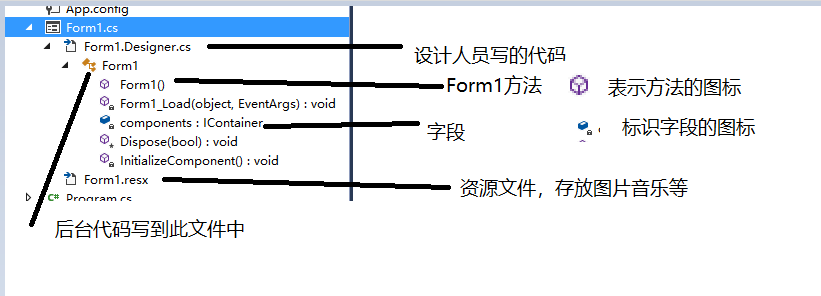

# 概览

**定义；**

winform应用程序是一种智能客户端技术，我们可以使用winform应用程序，帮助我们获得信息或者传输信息等。

## 特有目录

他两个共同组成了Form1这个类。因为都使用了`partial`进行标记也就是部分类。

## 启动流程

`Program.cs`【Main】创建Form1对象=>Form1构造中调用`InitializeComponent()`方法=>Form1.Designer.cs中的`InitializeComponent()`方法开始初始化控件。

