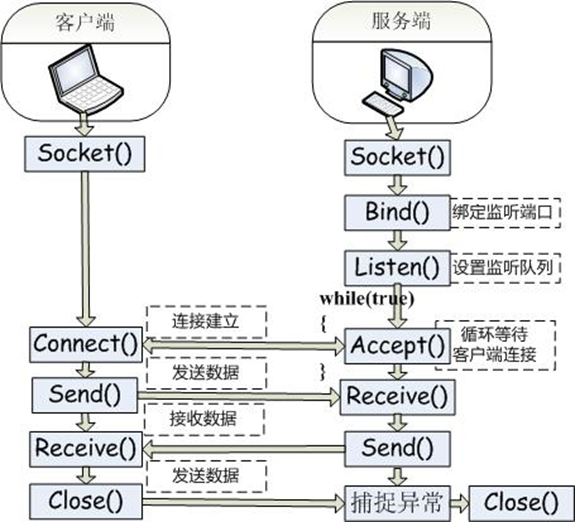
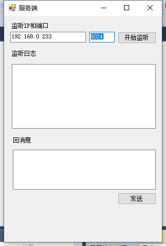
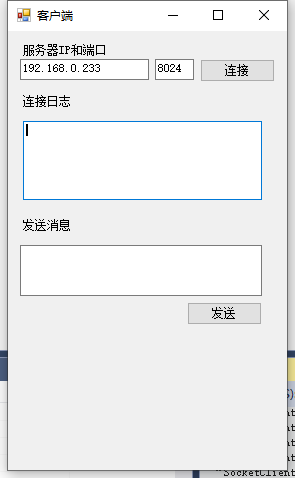

# 实例

## 通讯流程图



## 服务端



```csharp
using System;
using System.Collections.Generic;
using System.ComponentModel;
using System.Data;
using System.Drawing;
using System.Linq;
using System.Net;
using System.Net.Sockets;
using System.Text;
using System.Threading;
using System.Threading.Tasks;
using System.Windows.Forms;

namespace SocketServer
{
    public partial class Form1 : Form
    {
        public Form1()
        {
            InitializeComponent();
        }

        private void btnListen_Click(object sender, EventArgs e)
        {

            /* 创建一个负责监听的socket，*/
            //步骤一 获得一个IP对象
            //将 IP 地址字符串转换为 IPAddress 实例 
            IPAddress iPAddress = IPAddress.Parse(txtIP.Text);

            //步骤二 获得一个IP加端口对象。
            IPEndPoint iPEndPoint = new IPEndPoint(iPAddress, Convert.ToInt32(txtPort.Text));

            //步骤三 创建一个socket服务对象。
            Socket server = new Socket(AddressFamily.InterNetwork, SocketType.Stream, ProtocolType.Tcp);

            //步骤四 绑定监听IP和端口.
            server.Bind(iPEndPoint);

            //步骤五 设置监听队列
            server.Listen(20);


            ListenLogs("监听ing...");

            //监听客户端请求线程
            Thread thread = new Thread(Listening);
            thread.IsBackground = true;
            thread.Start(server);


        }
        Socket sockSend;//保存通讯socket
        /// <summary>
        /// 监听客户端请求
        /// </summary>
        /// <param name="socket">服务端socket</param>
        void Listening(object server)
        {
            //类型转换。
            Socket socket = server as Socket;
            /*创建通讯socket*/
            //一直等待客户连接
            while (true)
            {
                try
                {
                    sockSend = socket.Accept();//为新建连接创建新的 Socket对象
                                                      //获取连接的对象IP和端口 打印日志
                    ListenLogs(sockSend.RemoteEndPoint.ToString() + ";连接成功");

                    //开新的线程去一直调用接收数据方法。
                    Thread thread = new Thread(Recive);
                    thread.IsBackground = true;//设置为后台线程
                    thread.Start(sockSend);//传递负责通讯的socket
                }
                catch
                {

                }
            }
        }

        /// <summary>
        /// 服务端不停接收客户端数据
        /// </summary>
        /// <param name="sockSend">负责通讯的socket</param>
        void Recive(object sockSend)
        {
            //类型转换
            Socket socket = sockSend as Socket;
            while (true)
            {
                try //对于网络编程经常会抛出异常，所以使用try方法
                {
                    //缓冲数组
                    byte[] buffByte = new byte[1024 * 1024 * 1];
                    //实际读取的有效字节数，接收客户端发送的数据。
                    int r = socket.Receive(buffByte);
                    //当r接收的字节为空时证明客户已经断开连接，就不在执行接收数据。
                    if (r == 0)
                    {
                        break;
                    }
                    //解码数组
                    string str = Encoding.UTF8.GetString(buffByte, 0, r);
                    ListenLogs(socket.RemoteEndPoint.ToString() + ":" + str);//打印日志
                }
                catch
                {
                    //catch中不写任何代码，给用户的感觉是，这个程序并没有异常。
                }
            }
        }

        /// <summary>
        /// 显式监听日志方法。
        /// </summary>
        /// <param name="log"></param>
        void ListenLogs(string log)
        {
            //追加日志。
            txtLogs.AppendText(log + "\r\n");
        }

        /// <summary>
        /// 窗口加载事件，取消跨线程检测
        /// </summary>
        /// <param name="sender"></param>
        /// <param name="e"></param>
        private void Form1_Load(object sender, EventArgs e)
        {
            //取消跨线程检测
            Control.CheckForIllegalCrossThreadCalls = false;
        }

        /// <summary>
        /// 发回数据到客户端。
        /// </summary>
        /// <param name="sender"></param>
        /// <param name="e"></param>
        private void btnSend_Click(object sender, EventArgs e)
        {
            //第三步发送数据到服务器
            //Trim()去掉字符串中前后的空格
            string content = txtSend.Text.Trim();
            //把字符串解码为byte字节数组。
            byte[] buffByte = Encoding.UTF8.GetBytes(content);
            //发送字节数组
            sockSend.Send(buffByte);
        }
    }
}
```

## 客户端



```csharp
using System;
using System.Collections.Generic;
using System.ComponentModel;
using System.Data;
using System.Drawing;
using System.Linq;
using System.Net;
using System.Net.Sockets;
using System.Text;
using System.Threading;
using System.Threading.Tasks;
using System.Windows.Forms;

namespace SocketClient
{
    public partial class Form1 : Form
    {
        public Form1()
        {
            InitializeComponent();
        }


        /// <summary>
        /// 窗口加载，关闭跨线程检测
        /// </summary>
        /// <param name="sender"></param>
        /// <param name="e"></param>
        private void Form1_Load(object sender, EventArgs e)
        {
            Control.CheckForIllegalCrossThreadCalls = false;   
        }
        Socket socketAttach; //用来保存socket对象。

        /// <summary>
        /// 连接服务端
        /// </summary>
        /// <param name="sender"></param>
        /// <param name="e"></param>
        private void btnAttach_Click(object sender, EventArgs e)
        {
            try
            {
                //获取一个IP实力
                IPAddress iP = IPAddress.Parse(txtIP.Text);
                //获取端口和IP绑定实力
                IPEndPoint iPEndPoint = new IPEndPoint(iP, Convert.ToInt32(txtPort.Text));

                //第一步创建socket连接。
                socketAttach = new Socket(AddressFamily.InterNetwork, SocketType.Stream, ProtocolType.Tcp);

                //第二步连接远程服务
                socketAttach.Connect(iPEndPoint);

                AttachLog("连接成功\r\n");
            }
            catch
            {

            }

            //新线程接收客户端发送数据

            Thread thread = new Thread(Recive);
            thread.IsBackground = true;
            thread.Start();

        }
        void  AttachLog(string log)
        {
            txtLog.AppendText(log+"\n\r");
        }

        /// <summary>
        /// 和服务端交互发送数据
        /// </summary>
        /// <param name="sender"></param>
        /// <param name="e"></param>
        private void btnSend_Click(object sender, EventArgs e)
        {
            try
            {
                //第三步发送数据到服务器
                //Trim()去掉字符串中前后的空格
                string content = txtSend.Text.Trim();
                //把字符串解码为byte字节数组。
                byte[] buffByte = Encoding.UTF8.GetBytes(content);
                //发送字节数组
                socketAttach.Send(buffByte);
            }
            catch
            {

            }
        }


        /// <summary>
        /// 接收客户端发送数据
        /// </summary>
        void Recive()
        {
            while (true)
            {
                try //对于网络编程经常会抛出异常，所以使用try方法
                {
                    //缓冲数组
                    byte[] buffByte = new byte[1024 * 1024 * 1];
                    //实际读取的有效字节数，接收客户端发送的数据。
                    int r = socketAttach.Receive(buffByte);
                    //当r接收的字节为空时证明客户已经断开连接，就不在执行接收数据。
                    if (r == 0)
                    {
                        break;
                    }
                    //解码数组
                    string str = Encoding.UTF8.GetString(buffByte, 0, r);
                    AttachLog(socketAttach.RemoteEndPoint.ToString() + ":" + str);//打印日志
                }
                catch
                {

                }

            }
        }


    }//class
}
```

