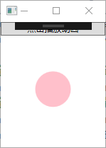

# 差值动画

## DoubleAnimation【双精度差值动画】

> https://docs.microsoft.com/zh-cn/dotnet/api/system.windows.media.animation.doubleanimation?redirectedfrom=MSDN&view=netframework-4.8

在指定的 [Duration](https://docs.microsoft.com/zh-cn/dotnet/api/system.windows.media.animation.timeline.duration?view=netframework-4.8#System_Windows_Media_Animation_Timeline_Duration) 上使用线性内插对两个目标值之间的 [Double](https://docs.microsoft.com/zh-cn/dotnet/api/system.double?view=netframework-4.8) 属性值进行动画处理。

**属性**

- `To` 获取或设置动画的结束值。
- `From` 获取或设置动画的起始值。
- `Duration` 获取或设置此时间线播放的时间长度，而不是计数重复。动画持续时长。
- `BeginTime` 设动画延迟时间。 总动画时间=延迟时间+动画持续时间。
- `SpeedRatio` 动画倍速，默认1
- `RepeatBehavior` 设置动画重复次数。
- `AccelerationRatio`指定从零**加速**到其最大速率过程需要的时间所占用时间线的的百分比。取值0~1
- `DecelerationRatio` 指定在将时间消逝从其最大速率**减速**到零的过程中所占用时间线的百分比。取值0~1

```c
 //创建动画类
 DoubleAnimation doubleAnimation = new DoubleAnimation();
 doubleAnimation.From = 50; //动画起始值，当多次触发该动画时wpf会放弃上次触发没有执行完成的动画再次从该值开始
 doubleAnimation.To = 100; //动画结束值
 /*———————————————————————————————————————————————————————————*/
 doubleAnimation.Duration = TimeSpan.FromSeconds(2);//动画持续时间
 // 设动画延迟时间。 总动画时间=延迟时间+动画持续时间。
 doubleAnimation.BeginTime = TimeSpan.FromSeconds(0.5);
 doubleAnimation.SpeedRatio = 2; //动画倍速，默认1
 doubleAnimation.AutoReverse = true; //动画结束后自动反转动画。

 //该值指定从零加速到其最大速率过程需要的时间所占用时间线的的百分比。取值0~1 
 doubleAnimation.AccelerationRatio = 0.3;
 //该值指定在将时间消逝从其最大速率减速到零的过程中所占用时间线的百分比。取值0~1 
 doubleAnimation.DecelerationRatio = 0.2;
 doubleAnimation.RepeatBehavior = new RepeatBehavior(2); //动画重复次数。

 /*
 设置动画
    参数一 要改变的属性或要做动画的属性注是控件类而不是对象
    参数二 动画对象。
 */
 this.ellipse1.BeginAnimation(Ellipse.WidthProperty, doubleAnimation);
 this.ellipse1.BeginAnimation(Ellipse.HeightProperty, doubleAnimation);
```




## Timeline【时间线类】

> https://docs.microsoft.com/zh-cn/dotnet/api/system.windows.media.animation.timeline?redirectedfrom=MSDN&view=netframework-4.8

定义时间段。


