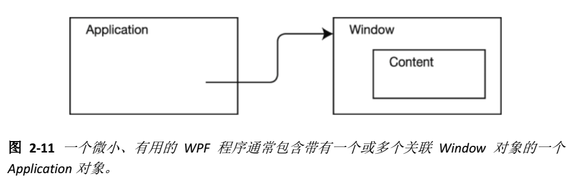

# Application

> 我们可以在项目结构的App.xaml中进行配置使用这也是一个部分类哦

负责启动wpf程序，以及对程序的控制如应用程序的生存期和配置程序主启动的Window对象。

一个WPF 程序包含一个 Application 类 的实例与一个或多个 Window 类的实例。你可以认为一个 WPF 程序是一个 Application 对象 加上一个或多个 Window 类的实例。Application 是一个类，其中封装了 WPF 应用程序特有的功能，包括：

**应用程序生存期；**

-  [Activated](https://docs.microsoft.com/zh-cn/dotnet/api/system.windows.application.activated?view=net-5.0) 事件 当应用程序成为前台应用程序时发生。

- [Current](https://docs.microsoft.com/zh-cn/dotnet/api/system.windows.application.current?view=net-5.0) 属性 获取当前 Application 的 AppDomain 对象。

-  [Deactivated](https://docs.microsoft.com/zh-cn/dotnet/api/system.windows.application.deactivated?view=netframework-4.8)事件 当应用程序停止作为前台应用程序时发生。

- [ DispatcherUnhandledException ](https://docs.microsoft.com/zh-cn/dotnet/api/system.windows.application.dispatcherunhandledexception?view=netframework-4.8)事件 在异常由应用程序引发但未进行处理时发生。

- [Exit](https://docs.microsoft.com/zh-cn/dotnet/api/system.windows.application.exit?view=netframework-4.8) 恰好在应用程序关闭之前发生，无法取消。

-  [Run](https://docs.microsoft.com/zh-cn/dotnet/api/system.windows.application.run?view=netframework-4.8)  方法 启动 WPF（Windows Presentation Foundation） 应用程序。

-  [SessionEnding](https://docs.microsoft.com/zh-cn/dotnet/api/system.windows.application.sessionending?view=netframework-4.8) 事件 当用户通过注销或关闭操作系统来结束 Windows 会话时发生。

-  [Shutdown](https://docs.microsoft.com/zh-cn/dotnet/api/system.windows.application.shutdown?view=netframework-4.8) 方法 关闭一个应用程序。

- [ShutdownMode](https://docs.microsoft.com/zh-cn/dotnet/api/system.windows.application.shutdownmode?view=netframework-4.8) 获取或设置导致调用 [Shutdown()](https://docs.microsoft.com/zh-cn/dotnet/api/system.windows.application.shutdown?view=netframework-4.8#System_Windows_Application_Shutdown) 【关闭一个应用程序】方法的条件。

- [Startup](https://docs.microsoft.com/zh-cn/dotnet/api/system.windows.application.startup?view=netframework-4.8) 事件 在调用 [Run()](https://docs.microsoft.com/zh-cn/dotnet/api/system.windows.application.run?view=netframework-4.8#System_Windows_Application_Run) 对象的 [Application](https://docs.microsoft.com/zh-cn/dotnet/api/system.windows.application?view=netframework-4.8) 方法时发生。

  

**应用程序范围的窗口、属性和资源管理：**

- [FindResource](https://docs.microsoft.com/zh-cn/dotnet/api/system.windows.application.findresource?view=netframework-4.8)  使用指定的键搜索用户界面) 资源 (UI，如 [Style](https://docs.microsoft.com/zh-cn/dotnet/api/system.windows.style?view=netframework-4.8) 或 [Brush](https://docs.microsoft.com/zh-cn/dotnet/api/system.windows.media.brush?view=netframework-4.8) ，并在找不到请求的资源时引发异常 (参见 [XAML 资源](https://docs.microsoft.com/zh-cn/dotnet/framework/wpf/advanced/xaml-resources)) 。
- [GetContentStream](https://docs.microsoft.com/zh-cn/dotnet/api/system.windows.application.getcontentstream?view=netframework-4.8) 返回位于指定 [Uri](https://docs.microsoft.com/zh-cn/dotnet/api/system.uri?view=netframework-4.8) 的内容数据文件的资源流（请参阅 [WPF 应用程序资源、内容和数据文件](https://docs.microsoft.com/zh-cn/dotnet/framework/wpf/app-development/wpf-application-resource-content-and-data-files)）。
- [GetResourceStream](https://docs.microsoft.com/zh-cn/dotnet/api/system.windows.application.getresourcestream?view=netframework-4.8)  返回位于指定 [Uri](https://docs.microsoft.com/zh-cn/dotnet/api/system.uri?view=netframework-4.8) 的资源数据文件的资源流（请参阅 [WPF 应用程序资源、内容和数据文件](https://docs.microsoft.com/zh-cn/dotnet/framework/wpf/app-development/wpf-application-resource-content-and-data-files)）。
- [LoadComponent](https://docs.microsoft.com/zh-cn/dotnet/api/system.windows.application.loadcomponent?view=netframework-4.8)   加载位于指定的统一资源标识符 (URI) 的 XAML 文件。
- [MainWindow](https://docs.microsoft.com/zh-cn/dotnet/api/system.windows.application.mainwindow?view=netframework-4.8) 获取或设置应用程序的主窗口。
- [Properties](https://docs.microsoft.com/zh-cn/dotnet/api/system.windows.application.properties?view=netframework-4.8)   获取应用程序范围属性的集合。
- [Resources](https://docs.microsoft.com/zh-cn/dotnet/api/system.windows.application.resources?view=netframework-4.8)  获取或设置应用程序范围资源（如样式和画笔）的集合。
- [StartupUri](https://docs.microsoft.com/zh-cn/dotnet/api/system.windows.application.startupuri?view=netframework-4.8)  获取或设置在应用程序启动时自动显示的 UI。
- [Windows](https://docs.microsoft.com/zh-cn/dotnet/api/system.windows.application.windows?view=netframework-4.8)  获取应用程序中的实例化窗口。

**命令行参数和退出代码处理：**

- [Application.Startup](https://docs.microsoft.com/zh-cn/dotnet/api/system.windows.application.startup?view=netframework-4.8)   在调用 [Run()](https://docs.microsoft.com/zh-cn/dotnet/api/system.windows.application.run?view=netframework-4.8#System_Windows_Application_Run) 对象的 [Application](https://docs.microsoft.com/zh-cn/dotnet/api/system.windows.application?view=netframework-4.8) 方法时发生。

- [Application.Exit](https://docs.microsoft.com/zh-cn/dotnet/api/system.windows.application.exit?view=netframework-4.8)  恰好在应用程序关闭之前发生，无法取消。

- [Application.Shutdown](https://docs.microsoft.com/zh-cn/dotnet/api/system.windows.application.shutdown?view=netframework-4.8) 关闭一个应用程序。

**导航：**

- [FragmentNavigation](https://docs.microsoft.com/zh-cn/dotnet/api/system.windows.application.fragmentnavigation?view=netframework-4.8)  当应用程序中的导航器开始导航到内容片段时，如果所需片段位于当前内容中，则导航会立即发生，或者，如果所需片段位于不同内容中，则会在加载源 XAML 内容之后发生。
- [LoadCompleted](https://docs.microsoft.com/zh-cn/dotnet/api/system.windows.application.loadcompleted?view=netframework-4.8)   在已经加载、分析并开始呈现应用程序中的导航器导航到的内容时发生。
- [Navigated](https://docs.microsoft.com/zh-cn/dotnet/api/system.windows.application.navigated?view=netframework-4.8) 在已经找到应用程序中的导航器要导航到的内容时发生，尽管此时该内容可能尚未完成加载。
- [Navigating](https://docs.microsoft.com/zh-cn/dotnet/api/system.windows.application.navigating?view=netframework-4.8)  在应用程序中的导航器请求新导航时发生。
-  [NavigationProgress](https://docs.microsoft.com/zh-cn/dotnet/api/system.windows.application.navigationprogress?view=netframework-4.8)  在由应用程序中的导航器管理的下载过程中定期发生，以提供导航进度信息。
- [NavigationStopped](https://docs.microsoft.com/zh-cn/dotnet/api/system.windows.application.navigationstopped?view=netframework-4.8)  在调用应用程序中的导航器的 `StopLoading` 方法时发生，或者当导航器在当前导航正在进行期间请求了一个新导航时发生。
- [NavigationFailed](https://docs.microsoft.com/zh-cn/dotnet/api/system.windows.application.navigationfailed?view=netframework-4.8)  在应用程序中的导航器在导航到所请求内容时出现错误的情况下发生。
- [SetCookie](https://docs.microsoft.com/zh-cn/dotnet/api/system.windows.application.setcookie?view=netframework-4.8)  为由 [Uri](https://docs.microsoft.com/zh-cn/dotnet/api/system.uri?view=netframework-4.8) 指定的位置创建一个 Cookie。
- [GetCookie](https://docs.microsoft.com/zh-cn/dotnet/api/system.windows.application.getcookie?view=netframework-4.8) 为由 [Uri](https://docs.microsoft.com/zh-cn/dotnet/api/system.uri?view=netframework-4.8) 指定的位置检索 Cookie。



## ~~手动实例Application对象~~

> 不推荐自己手动写[详细原因见下文](#App.XAML)。更多属性和方法参考
>
> https://docs.microsoft.com/zh-cn/dotnet/api/system.windows.application?redirectedfrom=MSDN&view=netframework-4.8

新建一个类。实例Application对象和要启动的窗口类对象。把程序属性 =>应用程序 =>启动对象改为我们实例了Application的这个类。

```c
using System;
using System.Collections.Generic;
using System.Linq;
using System.Text;
using System.Threading.Tasks;
using System.Windows;

namespace TestApplication
{
    class Startup
    {
        /*
        [STAThread] attribute指示应用程序的 COM 线程模型是单线程单元。
        而于此对应的多线程单元则是 [MTAThread] （多线程单元线程）
        */
        [STAThread()]
        //定义一个静态的启动方法
       static void Main()
        {
            Application app = new Application(); //实例Application对象
            MainWindow mainWindow = new MainWindow(); //实例要作为主启动的窗口对象。
            app.Run(mainWindow); //Run() 启动一个 Windows Presentation Foundation (WPF) 应用程序。 
        }
    }
}
```

### App.XAML

在建立wpf项目时VS会自动生成一个`App.XAML` 文件此文件的作用和我们手动创建Application效果一样，虽然具体实现和我们手动写的有些差异，要对程序进行配置可以直接更改此文件。

```xaml
<Application x:Class="TestApplication.App"
             xmlns="http://schemas.microsoft.com/winfx/2006/XAML-images/presentation"
             xmlns:x="http://schemas.microsoft.com/winfx/2006/XAML-images"
             xmlns:local="clr-namespace:TestApplication"
             StartupUri="MainWindow.XAML-images"> //默认启动窗体
    <Application.Resources>

    </Application.Resources>
</Application>
```

**属性**

- `ShutdownMode` 获取或设置导致调用 Shutdown【程序关闭方法】 方法的条件。
- `Current.MainWindow` 获取当前的主窗体对象。
- `Current.Windows` 获取打开的所有窗口集合。

### 事件

> 如果当前启动对象不是带有对事件处理的Application类那么事件处理程序无效。

1. 通过绑定指定的事件处理方法，处理事件。

   ```xaml
   Deactivated="Application_Deactivated"
   ```

   ```c
    private void Application_Deactivated(object sender, EventArgs e)
   {
      MessageBox.Show( "变为后台程序了","程序");
   }
   ```

2. 重写受保护的事件方法，事件方法格式带On要处理的事件名，处理事件。

```c
protected override void OnExit(ExitEventArgs e)
 {
            base.OnExit(e);
            MessageBox.Show("确认退出","程序");
 }
```

- `Startup` 在调用 Application 对象的 Run 方法时发生。
- `Exit` 恰好在应用程序关闭之前发生，且无法取消。
- `SessionEnding` 在用户通过注销或关闭操作系统而结束 Windows 会话时发生。
- `Activated` 当应用程序成为前台应用程序时发生。
- `Deactivated` 当应用程序停止作为前台应用程序时发生

## 任务

### 显式启动图/初始界面

往项目里面添加一张图片，图片属性生成操作，改为SplashScreen【开机画面】

### 接收命令行参数

1. 在App.XAML中删除`StartupUri="MainWindow.XAML"` 代码。

2. 自己手动创建一个处理`Startup`事件的方法

3. 对参数进行处理，做响应操作。

   ```csharp
   using System;
   using System.Collections.Generic;
   using System.Configuration;
   using System.Data;
   using System.Linq;
   using System.Threading.Tasks;
   using System.Windows;
   
   namespace Command_Line
   {
       /// <summary>
       /// App.XAML-images 的交互逻辑
       /// </summary>
       public partial class App : Application
       {
           private void Application_Startup(object sender, StartupEventArgs e)
           {
               //e对象的Args属性中存放着命令行传递的参数。
               if (e.Args.Length != 0)
               {
                   if (e.Args[0] == "init")
                   {
                       new Init().Show(); //启动初始窗口
                   }
   
               }
               else
               {
                   new MainWindow().Show(); //启动主窗口
               }
   
           }
       }
   }
   ```

### 访问当前的Application对象

参考对应属性即可。

### 窗口之间互交互

在App.XAML.css里面创建一个列表泛型集合，存放窗口对象，当我们打开窗口时就把该对象存到列表里，这样其它窗体就可以获得该窗体的对象，进行操作了。

### 单实例程序

单实例只无论开启多少个同一个程序，他只有一个主进程来管理这些程序，只要结束主进程所有程序都会被关闭。

实现

1. 删除自动生成Application实例类**App.XAML** 。
2. 创建自己的Application类实例。
3. 继承`Application`类
4. 重写`protected override void OnStartup(StartupEventArgs e)`方法

