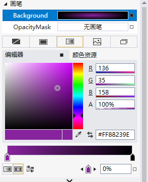

# 控件赋值

## 常用键值对形式赋值

```xaml
<!-- 属性名=值 --> 
<Button Width="200" />
```

## 属性标签/元素属性

有点像HTML中的a标签加image标签实现图片超链接 ，用来设置复杂点的属性

```xaml
<Button>
    <Button.Width>//属性标签开始【对象.属性名】
        200            //内容部分
    </Button.Width>//属性标签结束
</Button>
```

## 附加属性

附加属性一般是布局容器对其子控件施加属性，所以叫附加属性。

格式； 类名.属性名=“值”

```xaml
<Grid>  <!-- 网格布局对Button控件设置的属性，比如这里为Button设置在Grid中的那一列 和哪一行-->
        <Button Grid.Column="0" Grid.Row="0">按钮</Button>
</Grid>
```

## 标签扩展

使用花括号

```xaml
<Button Width="{标签扩展内容}" />
```

## 通过可视化工具赋值

- 渐变色

  通过属性面板设置

  