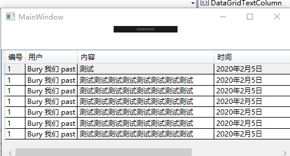

### DataGrid【数据网格】

> https://docs.microsoft.com/zh-cn/dotnet/api/system.windows.controls.datagrid?redirectedfrom=MSDN&view=netframework-4.8#definition

## 属性

- `AutoGenerateColumns` 获取或设置一个值，该值指示是否自动创建列
- `Columns` 获取一个集合，该集合包含 DataGrid 中的所有列
- `ItemsSource` 获取或设置用于生成 ItemsControl 的内容的集合。
- `FrozenColumnCount`获取或设置冻结列列的数目，冻结后的列不受滚动影响位置始重固定。

## DataGridTextColumn属性

- `ElementStyle`获取或设置在呈现列为未处于编辑模式的单元格显示的元素时使用的样式。
- `IsReadOnly `获取或设置一个值，该值指示能否编辑列中的单元格

## 支持列类型

| 列类型                  | 数据类型                     |
| ----------------------- | ---------------------------- |
| DataGridTextColumn      | String                       |
| DataGridCheckBoxColumn  | Boolean                      |
| DataGridComboBoxColumn  | Enum【枚举】                 |
| DataGridHyperlinkColumn | Uri                          |
| DataGridTemplateColumn  | 单元格中承载模板指定的内容。 |

## 应用

### 基本应用



- 布局代码XAML

  ```xaml
  <!--数据网格标记-->
          <DataGrid Margin="0,40" x:Name="dataGrid" AutoGenerateColumns="False" >
              <!--列结合标记-->
              <DataGrid.Columns>
                  <!--列标记
                      Header 表头
                      Binding 绑定数据 如Binding="{Binding 提供数据对象的属性名}"
                  -->
                  <DataGridTextColumn Header="编号" Binding="{Binding Number}"/>
                  <DataGridTextColumn Header="用户" Binding="{Binding UserName}"/>
                  <DataGridTextColumn Header="内容" Width="400" Binding="{Binding Content}">
                      <!--使用元素的样式属性设置内容溢出后自动换行-->
                      <DataGridTextColumn.ElementStyle>
                          <Style TargetType="TextBlock">
                              <Setter Property="TextWrapping" Value="Wrap"/>
                          </Style>
                      </DataGridTextColumn.ElementStyle>
                  </DataGridTextColumn>
                  <DataGridTextColumn Header="时间" Binding="{Binding Time}"/>
              </DataGrid.Columns>
  ```

- 后端C#代码

  ```csharp
  using System.Collections.Generic;
  using System.Windows;
  
  namespace WpfApp003
  {
      /// <summary>
      /// MainWindow.XAML-images 的交互逻辑
      /// </summary>
      public partial class MainWindow : Window
      {
          public MainWindow()
          {
              InitializeComponent();
              //定义一个泛型列表结合
              List<Danmu> danmus = new List<Danmu>();
              /*————————————————往集合添加一些内容———————————————————————————————————————————*/
              danmus.Add(new Danmu(1,"Bury 我们 past","测试","2020年2月5日"));
              danmus.Add(new Danmu(1,"Bury 我们 past", "测试测试测试测试测试测试测试测试", "2020年2月5日"));
              danmus.Add(new Danmu(1,"Bury 我们 past", "测试测试测试测试测试测试测试测试", "2020年2月5日"));
              danmus.Add(new Danmu(1,"Bury 我们 past", "测试测试测试测试测试测试测试测试", "2020年2月5日"));
              danmus.Add(new Danmu(1,"Bury 我们 past", "测试测试测试测试测试测试测试测试", "2020年2月5日"));
              danmus.Add(new Danmu(1,"Bury 我们 past", "测试测试测试测试测试测试测试测试", "2020年2月5日"));
              danmus.Add(new Danmu(1,"Bury 我们 past", "测试测试测试测试测试测试测试测试", "2020年2月5日"));
              //为数据网格指定数据来源，类型为List<T>
              dataGrid.ItemsSource = danmus;
          }
  
          /*——————————————————————模拟一个提供数据的类—————————————————————————————————————*/
          public class Danmu
          {
              private int _number;
  
              public int Number
              {
                  get { return _number; }
                  set { _number = value; }
              }
  
              private string _userName;
  
              public string UserName
              {
                  get { return _userName; }
                  set { _userName = value; }
              }
  
              private string _content;
  
              public string Content
              {
                  get { return _content; }
                  set { _content = value; }
              }
  
              private string _time;
  
              public string Time
              {
                  get { return _time; }
                  set { _time = value; }
              }
  
              /// <summary>
              /// 全参数构造
              /// </summary>
              /// <param name="number">弹幕编号</param>
              /// <param name="userName">发送者名</param>
              /// <param name="content">发送内容</param>
              /// <param name="time">时间</param>
              public Danmu(int number, string userName, string content, string time)
              {
                  this.Number = number;
                  this.UserName = userName;
                  this.Content = content;
                  this.Time = time;
              }
  
          };
      }
  }
  ```