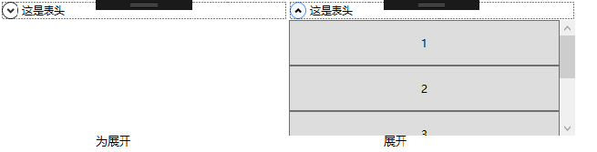

# Expander【扩展器】



内容可以折叠，当展开时如果没有足够的空间来放置所有内容那么超出内容会被裁切掉。为了避免这种情况可以在内容部分放入ScrollViewer【滚动条】。

```xaml
<Expander Header="这是表头" MaxHeight="150">
            <ScrollViewer>
                <StackPanel>
                    <Button Height="50">1</Button>
                    <Button Height="50">2</Button>
                    <Button Height="50">3</Button>
                    <Button Height="50">3</Button>
                    <Button Height="50">3</Button>
                </StackPanel>
            </ScrollViewer>
        </Expander>
```