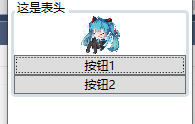

# GroupBox【分组框】

为控件编组。表头可以是文字或图片



```xaml
<GroupBox Header="这是表头" BorderThickness="3"> //边框厚度
            <StackPanel>
                <Image Source="F:\图片\初音图片\56710319_p1.jpg" Width="50" Height="40"/>
                <Button>按钮1</Button>
                <Button>按钮2</Button>
            </StackPanel>
        </GroupBox>
```


