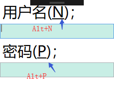

# Label【标签控件】

他被定义用来显式文本内容，但可以是是任意内容。

```xaml
<!--文本内容 -->
<Label 
            Content="文本内容"
            FontSize="30"
            FontFamily="楷体"
            FontStretch="Normal" //字体拉伸
            FontWeight="Heavy" //字体着重
            />
        <!-- 图片内容 -->
        <Label>
            <Image Source="F:\图片\2.jpg"/>
        </Label>
```

## Alt+…快捷键

- Target 属性设置要绑定的控件 `Target="{Binding ElementName=控件名}`
- Content 内容中通过 _加字母设置快捷键 `用户名( _N)；` 这里快捷键就是N了
- 为要绑定的控件设置一个Name属性

```xaml
 <Label 
            Target="{Binding ElementName=txtBox1}"
            Content="用户名(_N)；"
            FontSize="30"
            />
        <TextBox Name="txtBox1" Height="30" Background="#FFC8EEE5"></TextBox>
        <Label FontSize="30" Target="{Binding ElementName=txtBox2}">
            密码(_P)；
        </Label>
        <TextBox Name="txtBox2" Height="30" Background="#FFC8EEE5"></TextBox>
```

当按下Alt+N或ALt+P就可以快速跳转到绑定的控件上了



