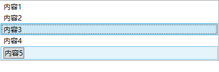
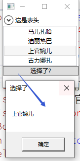

# ListBox

用来显式一组内容



## 检测选中项



```xaml
<ListBox x:Name="listBox" //name属性
                 HorizontalAlignment="Left"  //水平左对齐
                 HorizontalContentAlignment="Center" //内容水平居中对齐
                 Width="150">
            <ListBoxItem>马儿扎哈</ListBoxItem> //列表项框
            <ListBoxItem>迪丽热巴</ListBoxItem>
            <ListBoxItem>上官婉儿</ListBoxItem>
            <ListBoxItem Content="古力娜扎"/>
        </ListBox>
        <Button Click="Button_Click_2">选择了?</Button>
```

```csharp
private void Button_Click_2(object sender, RoutedEventArgs e)
        {
            object obj = listBox.SelectedItem; //获取选中项
            //获取选中项的内容obj要类型转换为ListBoxItem才可以获得值。
            string selected = (obj == null) ? "没有选择任何项":(string)((ListBoxItem)obj).Content;
            MessageBox.Show(selected,"选择了");
        }
```

