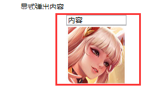

# Popup【弹出内容】

> **注意；**
>
> 只有当Popup控件中有内容时才会显示



## 属性

- `IsOpen` 获取或设置一个值，该值指示 Popup 是否可见。
- `StaysOpen` 获取或设置一个值，该值指示当 Popup 控件焦点不再对准时，是否关闭该控件 只有值为false才生效。
- `AllowsTransparency` 设置控件是否可以透明
- `Placement` 获取或设置 Popup 控件打开时的控件方向。
- `Focusable` 指示控件是否可以获得焦点。
- `HorizontalOffset` 指定一个值,指示 Popup 的位置所需水平移动多少个象素
- `VerticalOffset` 指定一个值,指示 Popup 的位置所需垂直移动多少个象素
- `PopupAnimation` 获取或设置用于打开和关闭 Popup 控件的动画。 如此值`DynamicResource {x:Static SystemParameters.MenuPopupAnimationKey}}` 系统定义的动画。
- `PlacementTarget="{Binding ElementName=绑定控件名}”` 设定 Popup 定义所相对的控件,

## 解决通过按钮触发一直不隐藏问题

- 用到事件 `Closed` 当 IsOpen 属性更改为 false 时发生

```xaml
<!-- 菜单按钮 -->
<Button x:Name="menuBtn"  Height="50" Content="按钮" Width="80"  Click="Button_Click" >
<!-- 显示菜单容器（Popup弹出控件） -->
<Popup  
    x:Name="menu" 
    AllowsTransparency="true"  
    StaysOpen="False"
    Placement="Bottom"   
    VerticalOffset="0"
    PopupAnimation="{DynamicResource {x:Static SystemParameters.MenuPopupAnimationKey}}" 
    PlacementTarget="{Binding ElementName=menuBtn}" 
    StaysOpen="False" 
    Closed="Menu_Closed">
        ListBox>
            <TextBlock Text="弹出内容"/>
        /ListBox>
</Popup>
```


```csharp
 bool isShow = false; //标记菜单打开状态 false关闭状态
        /// <summary>
        /// 菜单按钮点击事件
        /// </summary>
        /// <param name="sender"></param>
        /// <param name="e"></param>
        private void Button_Click(object sender, RoutedEventArgs e)
        {
            if (isShow)
            {

                menu.IsOpen = false;
                isShow = false; //变更菜单状态为false关闭
            }
            else
            {
                menu.IsOpen = true;
                isShow = true; //变更菜单状态为true打开状态

            }
        }

        /// <summary>
        /// IsOpen值为false时执行事件
        /// </summary>
        /// <param name="sender"></param>
        /// <param name="e"></param>
        private void Menu_Closed(object sender, EventArgs e)
        {
            isShow = false; //变更菜单状态为false关闭
        }
```

