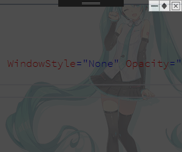
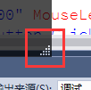

# Window窗口

派生自ContentControl的类。

> https://docs.microsoft.com/zh-cn/dotnet/api/system.windows.window?view=netframework-4.8

## 属性

| 名称                  | 作用                                                         | 值                                                           |
| --------------------- | ------------------------------------------------------------ | ------------------------------------------------------------ |
| ResizeMode            | 禁止窗口缩放                                                 | NoResize不缩放                                               |
| WindowStartupLocation | 窗口启动起始位置                                             | CenterScreen中间                                             |
| WindowState           | 设置窗口启动状态                                             | Maximized最大化显式                                          |
| Topmost               | 窗口置顶                                                     | Boolean                                                      |
| ShowInTaskBar         | 在任务栏列出此窗口                                           | Boolean                                                      |
| Hide                  | 窗口是否可见                                                 | Boolean                                                      |
| WindowStyle           | 设置窗口样式                                                 | None仅工作区可见，不显示标题栏和边框。 SingleBorderWindow具有单个边框的窗口。 这是默认值。 ThreeDBorderWindow具有三维边框的窗口。 ToolWindow固定工具窗口。 |
| AllowsTransparency    | 窗口工作区透明【需要设置WindowStyle为None和窗口透明度属性】  | Boolean                                                      |
| Icon                  | 获取或设置窗口的图标                                         |                                                              |
| Top和Left             | 获取或设置窗口上边或右边缘相对于桌面的位置                   |                                                              |
| RestoreBounds         | 获取窗口在最小化或最大化之前的大小和位置                     |                                                              |
| SizeToContent         | 获取或设置一个值，该值指示窗口是否自动调整自身大小以适应其内容大小。 |                                                              |
| Owner                 | 获取或设置拥有此窗体的窗体。                                 |                                                              |

## 方法

- `Show()` 显式窗口，显式当前调用此方法的窗口类
- `ShowDialog()` //窗口为对话框窗口或叫模态窗口 显式
- `Close()`手动关闭 Window。

## 窗口从属关系

一个程序可以有多个窗口这些窗口可以是独立的或者是有父子级关系的。

- `Owner` 设置其父级窗口。

## 模态窗口或对话框窗口

> 以一个带有取消和确认按钮的对话框为例。

- `DialogResult` 这个属性表示对话的结果当窗口被关闭时，会有两个结果true或false。窗口是通过X号关闭或通过点击设置有`IsCancel`属性的按钮关闭都会被设置为False【这个值有系统设置无法手动干涉】这意味着用户点击了取消按钮。如果为一个按钮设置了`IsDefault`属性就可以控制`DialogResult` 的结果是True或False。从而可以做些逻辑处理或调用Close()方法手动关闭这个窗口。**这样需要这个对话框结果进行处理的代码就可以更具返回结果进行相应操作。**
- `IsCancel` 设置当前按钮是否为取消按钮
- `IsDefault`设置当前按钮是否为默认值【确认按钮】 **设置为True会就必须为此按钮的点击事件绑定处理方法。**设置后默认获得焦点状态。

**创建步骤**

和winform一样，新建一个窗口文件，在另一个窗口后端写代码去new这个窗口对象，使用`ShowDialog()`方法创建模态窗口。`ShowDialog()`返回结果为`DialogResult` 属性的布尔值。

```csharp
 MyDialog myDialog = new MyDialog(); //创建新窗口对象
            string str = (true == myDialog.ShowDialog()) ? "点击了确认":"点击了取消/叉号";
            MessageBox.Show(str,"模态窗口结果");
```

## 窗口传值

窗口之间的传值，实际上是两个类之间的传递，可以从一个类中定义一个静态属性，到另一个类中去获得即可。

一般也都是通过属性类传递值的。

## 非矩形窗口

### 简单透明窗口



**缺点；**

-  鼠标移动到窗口边缘，不可以改变窗口大小。

**步骤**

1. 将Window.AllowsTransparency 属性设为True
2. 将Window.WindowStyle属性设为None
3. 将窗口背景设置为透明

```xaml
<Window x:Class="自定义窗口.MainWindow"
        xmlns="http://schemas.microsoft.com/winfx/2006/XAML-images/presentation"
        xmlns:x="http://schemas.microsoft.com/winfx/2006/XAML-images"
        xmlns:d="http://schemas.microsoft.com/expression/blend/2008"
        xmlns:mc="http://schemas.openxmlformats.org/markup-compatibility/2006"
        xmlns:local="clr-namespace:自定义窗口"
        mc:Ignorable="d"
        Title="MainWindow" Height="450" Width="800" AllowsTransparency="True"  WindowStyle="None" Opacity="0.7" Background="Black"
        >
    <!--设置AllowsTransparency，WindowStyle和Opacity属性-->
   <Canvas>
        <Button Canvas.Right="35"  Click="Button_Click">➖</Button>
        <Button Canvas.Right="20"   Click="Button_Click_1">♦</Button>
        <Button Canvas.Right="0" Click="Button_Click_2">❎</Button>
    </Canvas>
</Window>
```


```csharp
using System;
using System.Collections.Generic;
using System.Linq;
using System.Text;
using System.Threading.Tasks;
using System.Windows;
using System.Windows.Controls;
using System.Windows.Data;
using System.Windows.Documents;
using System.Windows.Input;
using System.Windows.Media;
using System.Windows.Media.Imaging;
using System.Windows.Navigation;
using System.Windows.Shapes;

namespace 自定义窗口
{
    /// <summary>
    /// MainWindow.XAML-images 的交互逻辑
    /// </summary>
    public partial class MainWindow : Window
    {


        public MainWindow()
        {
            InitializeComponent();
        }

        /// <summary>
        /// 重写父类的OnMouseLeftButtonDown方法调用DragMove方法允许窗口被拖动改变位置。
        /// </summary>
        /// <param name="e"></param>
        protected override void OnMouseLeftButtonDown(MouseButtonEventArgs e)
        {
            base.OnMouseLeftButtonDown(e);

            // Begin dragging the window
            /*————————————————————调用此方法就可以实现窗口可以被拖动 ————————————*/
            this.DragMove(); 
        }

        /// <summary>
        /// 最小化按钮
        /// </summary>
        /// <param name="sender"></param>
        /// <param name="e"></param>
        private void Button_Click(object sender, RoutedEventArgs e)
        {
            this.WindowState = WindowState.Minimized;
        }

        /// <summary>
        /// 最大化和还原按钮
        /// </summary>
        /// <param name="sender"></param>
        /// <param name="e"></param>
        private void Button_Click_1(object sender, RoutedEventArgs e)
        {
            //功能带实现

        }

        /// <summary>
        /// 关闭按钮
        /// </summary>
        /// <param name="sender"></param>
        /// <param name="e"></param>
        private void Button_Click_2(object sender, RoutedEventArgs e)
        {
            this.Close();
        }


    }
}
```


### 可改变大小的窗口

#### ResizeMode

- 设置`ResizeMode`属性为`CanResizeWithGrip`。会在窗口右下角点击一个手柄调整窗口大小。不美观不能想其它窗口那样从四周边缘改变大小。

  

##### 方法二

1. 在窗口的左右两侧添加Rectangle元素建议宽度为5高度充满整个窗体。

