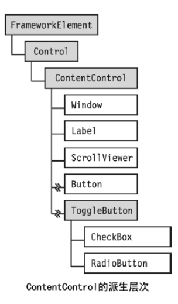

# 概览

## 通用属性

| 属性名                     | 作用                                   | 值                                                           |
| -------------------------- | -------------------------------------- | ------------------------------------------------------------ |
| width                      | 宽度                                   |                                                              |
| height                     | 高度                                   |                                                              |
| background                 | 背景色                                 | 十六位颜色，或颜色单词                                       |
| foreground                 | 文字颜色（控件前景色）                 | 十六位颜色，或颜色单词                                       |
| Click                      | 点击事件                               | 事件处理函数                                                 |
| Visibility                 | 控件可见性                             | Visible【可见默认值】Hidden【不可见会占用容器空间】Collapsed【不可见不占据控件空间】 |
| Name                       | 为控件设置一个标识方便后端获得控件操作 | string                                                       |
| MinWidth                   | 最小宽度                               | int                                                          |
| MaxWidth                   | 最大宽度                               | int                                                          |
| MinHeight                  | 最小高度                               | int                                                          |
| MaxHeight                  | 最大高度                               | int                                                          |
| HorizontalAlignment        | 水平对齐                               | Left、Center、Right、Stretch【拉伸】                         |
| VerticalAlignment          | 垂直对齐                               | Top、Center、Bottom、Stretch【拉伸】                         |
| HorizontalContentAlignment | 水平内容对齐方式                       | 和水平对齐参数一样                                           |
| VerticalContentAlignment   | 垂直内容对齐方式                       | 和垂直对齐参数一样                                           |
| Padding                    | 内边距                                 | 和HTML中的padding设置方式基本一致多个值用逗号隔开，只设置一个值表示四周数值，设置两个值表示，前面值用作左侧和右侧另一用作顶部和底部，也可以分别设置，复合方向是，左、上、右、下。 |
| Margin                     | 外边距                                 | 和HTML中的margin设置方式基本一致多个值用逗号隔开，只设置一个值表示四周数值，设置两个值表示，前面值用作左侧和右侧另一用作顶部和底部，也可以分别设置，复合方向是，左、上、右、下。 |
| Panel.ZIndex               | 设置容器或控件的层级关系               | int 数值大的在前面                                           |
| FontSize                   | 字体大小                               | int                                                          |
| FontFamily                 | 字体                                   | string多个字体可以用,分割，使用嵌入的字体【自己准备的字体文件】格式；路径#字体名 |
| FontStretch                | 字体拉伸                               | Normal【正常】等值                                           |
| FontWeight                 | 字体着重（字体粗细）                   |                                                              |
| FontStyle                  | 设置字形                               | 字体斜体或正常等。                                           |
| Cursor                     | 设置鼠标光标样式                       | 枚举值                                                       |
| ToolTip                    | 工具提示【鼠标放到控件上出现提示文本】 | string                                                       |
| FocusVisualStyle           | 获取焦点后的样式                       | {x:Null} 表示null就不显示黑色虚线了。                        |

## 常见控件/元素

下面列出了内置的 WPF 控件。

- **按钮**： [Button](https://docs.microsoft.com/zh-cn/dotnet/api/system.windows.controls.button) 和 [RepeatButton](https://docs.microsoft.com/zh-cn/dotnet/api/system.windows.controls.primitives.repeatbutton)。
- **数据显示**： [DataGrid](https://docs.microsoft.com/zh-cn/dotnet/api/system.windows.controls.datagrid)、 [ListView](https://docs.microsoft.com/zh-cn/dotnet/api/system.windows.controls.listview)和 [TreeView](https://docs.microsoft.com/zh-cn/dotnet/api/system.windows.controls.treeview)。
- **日期显示和选项**： [Calendar](https://docs.microsoft.com/zh-cn/dotnet/api/system.windows.controls.calendar) 和 [DatePicker](https://docs.microsoft.com/zh-cn/dotnet/api/system.windows.controls.datepicker)。
- **对话框**： [OpenFileDialog](https://docs.microsoft.com/zh-cn/dotnet/api/microsoft.win32.openfiledialog)、 [PrintDialog](https://docs.microsoft.com/zh-cn/dotnet/api/system.windows.controls.printdialog)和 [SaveFileDialog](https://docs.microsoft.com/zh-cn/dotnet/api/microsoft.win32.savefiledialog)。
- **数字墨迹**： [InkCanvas](https://docs.microsoft.com/zh-cn/dotnet/api/system.windows.controls.inkcanvas) 和 [InkPresenter](https://docs.microsoft.com/zh-cn/dotnet/api/system.windows.controls.inkpresenter)。
- **文档**： [DocumentViewer](https://docs.microsoft.com/zh-cn/dotnet/api/system.windows.controls.documentviewer)、 [FlowDocumentPageViewer](https://docs.microsoft.com/zh-cn/dotnet/api/system.windows.controls.flowdocumentpageviewer)、 [FlowDocumentReader](https://docs.microsoft.com/zh-cn/dotnet/api/system.windows.controls.flowdocumentreader)、 [FlowDocumentScrollViewer](https://docs.microsoft.com/zh-cn/dotnet/api/system.windows.controls.flowdocumentscrollviewer)和 [StickyNoteControl](https://docs.microsoft.com/zh-cn/dotnet/api/system.windows.controls.stickynotecontrol)。
- **输入**： [TextBox](https://docs.microsoft.com/zh-cn/dotnet/api/system.windows.controls.textbox)、 [RichTextBox](https://docs.microsoft.com/zh-cn/dotnet/api/system.windows.controls.richtextbox)和 [PasswordBox](https://docs.microsoft.com/zh-cn/dotnet/api/system.windows.controls.passwordbox)。
- **布局**： [Border](https://docs.microsoft.com/zh-cn/dotnet/api/system.windows.controls.border)、 [BulletDecorator](https://docs.microsoft.com/zh-cn/dotnet/api/system.windows.controls.primitives.bulletdecorator)、 [Canvas](https://docs.microsoft.com/zh-cn/dotnet/api/system.windows.controls.canvas)、 [DockPanel](https://docs.microsoft.com/zh-cn/dotnet/api/system.windows.controls.dockpanel)、 [Expander](https://docs.microsoft.com/zh-cn/dotnet/api/system.windows.controls.expander)、 [Grid](https://docs.microsoft.com/zh-cn/dotnet/api/system.windows.controls.grid)、 [GridView](https://docs.microsoft.com/zh-cn/dotnet/api/system.windows.controls.gridview)、 [GridSplitter](https://docs.microsoft.com/zh-cn/dotnet/api/system.windows.controls.gridsplitter)、 [GroupBox](https://docs.microsoft.com/zh-cn/dotnet/api/system.windows.controls.groupbox)、 [Panel](https://docs.microsoft.com/zh-cn/dotnet/api/system.windows.controls.panel)、 [ResizeGrip](https://docs.microsoft.com/zh-cn/dotnet/api/system.windows.controls.primitives.resizegrip)、 [Separator](https://docs.microsoft.com/zh-cn/dotnet/api/system.windows.controls.separator)、 [ScrollBar](https://docs.microsoft.com/zh-cn/dotnet/api/system.windows.controls.primitives.scrollbar)、 [ScrollViewer](https://docs.microsoft.com/zh-cn/dotnet/api/system.windows.controls.scrollviewer)、 [StackPanel](https://docs.microsoft.com/zh-cn/dotnet/api/system.windows.controls.stackpanel)、 [Thumb](https://docs.microsoft.com/zh-cn/dotnet/api/system.windows.controls.primitives.thumb)、 [Viewbox](https://docs.microsoft.com/zh-cn/dotnet/api/system.windows.controls.viewbox)、 [VirtualizingStackPanel](https://docs.microsoft.com/zh-cn/dotnet/api/system.windows.controls.virtualizingstackpanel)、 [Window](https://docs.microsoft.com/zh-cn/dotnet/api/system.windows.window)和 [WrapPanel](https://docs.microsoft.com/zh-cn/dotnet/api/system.windows.controls.wrappanel)。
- **媒体**： [Image](https://docs.microsoft.com/zh-cn/dotnet/api/system.windows.controls.image)、 [MediaElement](https://docs.microsoft.com/zh-cn/dotnet/api/system.windows.controls.mediaelement)和 [SoundPlayerAction](https://docs.microsoft.com/zh-cn/dotnet/api/system.windows.controls.soundplayeraction)。
- **菜单**： [ContextMenu](https://docs.microsoft.com/zh-cn/dotnet/api/system.windows.controls.contextmenu)、 [Menu](https://docs.microsoft.com/zh-cn/dotnet/api/system.windows.controls.menu)和 [ToolBar](https://docs.microsoft.com/zh-cn/dotnet/api/system.windows.controls.toolbar)。
- **导航**： [Frame](https://docs.microsoft.com/zh-cn/dotnet/api/system.windows.controls.frame)、 [Hyperlink](https://docs.microsoft.com/zh-cn/dotnet/api/system.windows.documents.hyperlink)、 [Page](https://docs.microsoft.com/zh-cn/dotnet/api/system.windows.controls.page)、 [NavigationWindow](https://docs.microsoft.com/zh-cn/dotnet/api/system.windows.navigation.navigationwindow)和 [TabControl](https://docs.microsoft.com/zh-cn/dotnet/api/system.windows.controls.tabcontrol)。
- **选项**： [CheckBox](https://docs.microsoft.com/zh-cn/dotnet/api/system.windows.controls.checkbox)、 [ComboBox](https://docs.microsoft.com/zh-cn/dotnet/api/system.windows.controls.combobox)、 [ListBox](https://docs.microsoft.com/zh-cn/dotnet/api/system.windows.controls.listbox)、 [RadioButton](https://docs.microsoft.com/zh-cn/dotnet/api/system.windows.controls.radiobutton)和 [Slider](https://docs.microsoft.com/zh-cn/dotnet/api/system.windows.controls.slider)。
- **用户信息**： [AccessText](https://docs.microsoft.com/zh-cn/dotnet/api/system.windows.controls.accesstext)、 [Label](https://docs.microsoft.com/zh-cn/dotnet/api/system.windows.controls.label)、 [Popup](https://docs.microsoft.com/zh-cn/dotnet/api/system.windows.controls.primitives.popup)、 [ProgressBar](https://docs.microsoft.com/zh-cn/dotnet/api/system.windows.controls.progressbar)、 [StatusBar](https://docs.microsoft.com/zh-cn/dotnet/api/system.windows.controls.primitives.statusbar)、 [TextBlock](https://docs.microsoft.com/zh-cn/dotnet/api/system.windows.controls.textblock)和 [ToolTip](https://docs.microsoft.com/zh-cn/dotnet/api/system.windows.controls.tooltip)。

## 内容控件

派生自`UIElement`的内容控件其内容可以任意内容不仅限于他定义的那种内容。还可以是其它控件，**但是只能包含一个，解决此问题可以使用一个容器控件包含更多。** 详细参考[ToolTip工具提示](./elements/tool-tip.md)

内容控件派生结构

## 元素控件

元素控件往往不会和用户与之交互。

