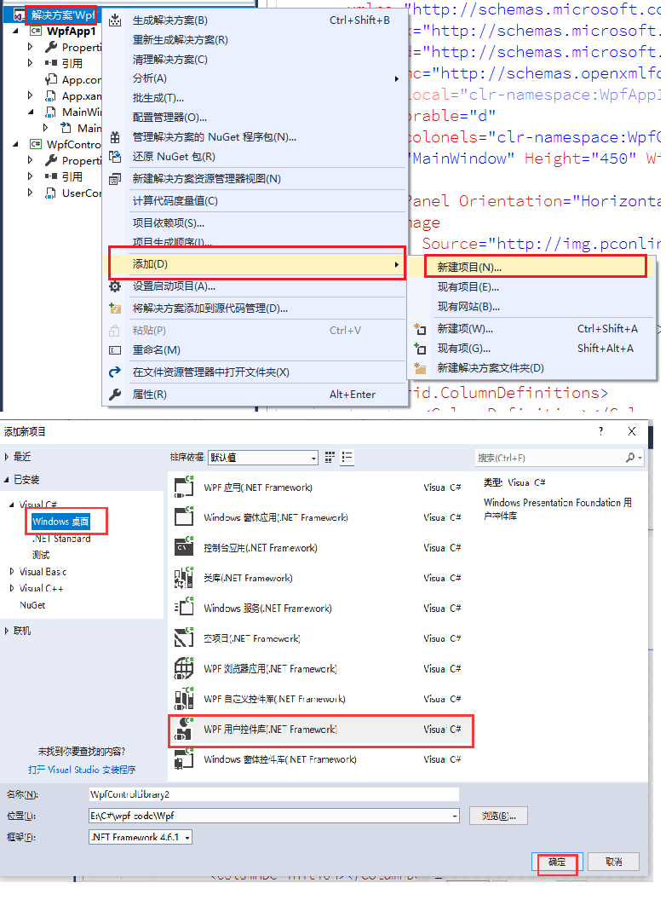
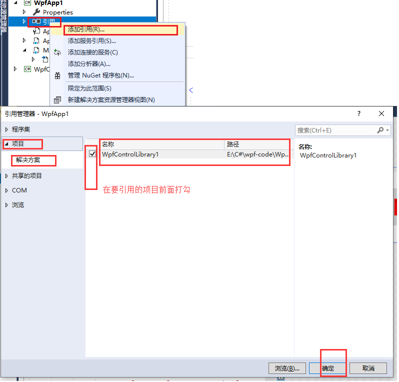

# 用户控件

## 创建自己的控件库



编写自己的控件代码即可

### 引用控件库

> 此操作也适用于第三方控件的引用，只不过添加引用时而不是从项目中选择具体按dll的存放位置而定。

1. 在需要引用控件的项目上添加该项目的引用。

   

2. 到XAML-images中声明该库的命名空间

   ```xaml
   <Window
        xmlns:colonels="clr-namespace:WpfControlLibrary1;assembly=WpfControlLibrary1">
        <!-- xmlns:是必要前缀 冒号后面是映射到XAML-images中的空间名【自定义】 引号中输入要添加的命名空间名VS会自动提示并补全-->
   </Window>
   ```

3. 关于使用

   加上步骤2中定义的空间名前缀和其它Window自带的空间使用方式一样。

   ```xaml
   <colonels:UserControl1 Grid.Column="0" Grid.Row="1"/> //使用用户空间
   ```


