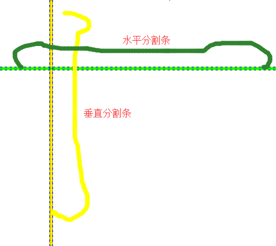

# Grid【表格布局/网格布局】

表格布局，默认行列大小是平分的，可以单独为其中一个分配大小。就像Excel中把界面分为行和列，进行摆放控件。

默认列和行为0行0列。

## 属性

- `Grid.ColumnDefinitionss` 设置列数
- `Grid.RowDefinitions` 设置行数

### 附加属性

- `Grid.Row="1"` //子控件在第几行
- `Grid.Column="0"`//子控件在第几列
- `Grid.RowSpan="2"`//子控件跨行
- `Grid.ColumnSpan="2"` //子控件跨列。
- `ShowGridLines` 是否显式网格


```xaml
<Grid>
            <Grid.ColumnDefinitions> //列
                <ColumnDefinition></ColumnDefinition>//第一列
                <ColumnDefinition Width="100"></ColumnDefinition>//第二列
                <ColumnDefinition></ColumnDefinition>//第三列
            </Grid.ColumnDefinitions>
            <Grid.RowDefinitions> //行
                <RowDefinition></RowDefinition>//第一行
                <RowDefinition Height="120"></RowDefinition>//第二行
                <RowDefinition></RowDefinition>//第三行
                <RowDefinition></RowDefinition>//第四行
            </Grid.RowDefinitions>
   <Button 
                Grid.Row="1" //控件在第几行
                Grid.Column="0"
                   Grid.RowSpan="2"//跨行
                Grid.ColumnSpan="2" //跨列></Button>//控件在第几列
        </Grid>   
```

## 代码添加控件

- 往Grid中添加子控件

```csharp
//创建image控件对象
            Image  img = new Image();
            //设置图片地址。
            img.Source = new BitmapImage(new Uri("https://cn.bing.com/th?id=OIP.yOBfpU3R6xjDYsHVxtgUiAHaLH&pid=Api&rs=1"));
            Grid.SetRowSpan(img, 2);//在表格中第几列控件对象，列数
            Grid.SetRow(img, 2);//在表格中第几行控件对象，行数
            GridMy.Children.Add(img);//添加到父控件上。控件对象
```

- 添加列和行

```csharp
  //创建列对象
                  ColumnDefinition columnDefinition = new ColumnDefinition();
                  //添加列到grid上
                  gridRoot.ColumnDefinitions.Add(columnDefinition);
  
                  //创建行对象
                  RowDefinition rowDefinition = new RowDefinition();
                  //添加列到grid上
                  gridRoot.RowDefinitions.Add(rowDefinition);
  
                  //现在就在grid上创建了一列一行
```

## 尺寸

### 绝对尺寸

不管这个窗口的尺寸如何，绝对尺寸的行高和列宽会保持不变。

- 对于列通过`Widht`属性设置宽度。
- 对于行通过`Height`属性设置高度。

### 自动调整尺寸

单元格内部控件撑开高度或宽度。也就是单元格高度和宽度有内部的控件决定。

只需要把`Widht`和`Height`属性的值设置为**Auto** 即可。

### 按比例调整尺寸/星号调整尺寸

设置为按比例调整尺寸的单元格宽度或高度，**当其它单元格的宽度或高度确定后**，按比例分配会平分单元格剩余的空间。

只需要把Widht和Height属性的值设置为***** 即可。

按前单元格的n倍来分配如2* 表示当前单元格的宽度或高度是前单元格的2倍

## GridSplitter分割条控件

一个分割条是一条分割一个网格为两段的垂直或水平的线。用户可以朝一个方向或另一个方向拖动分割条以改变两侧的比例。**分割条一般独立在一个Auto属性的单元格中这是要遵守的规定**




```xaml
 <Grid ShowGridLines="True"> //显式网格线
     <!-- 定义三列-->
        <Grid.ColumnDefinitions>
            <ColumnDefinition></ColumnDefinition>
            <ColumnDefinition Width="Auto"></ColumnDefinition> //垂直分割条列
            <ColumnDefinition></ColumnDefinition>
        </Grid.ColumnDefinitions>
     <!--  定义三行 -->
        <Grid.RowDefinitions>
            <RowDefinition></RowDefinition>
            <RowDefinition Height="Auto"></RowDefinition> //水平分割条行
            <RowDefinition></RowDefinition>
        </Grid.RowDefinitions>
     <!-- 定义一个垂直分割条 -->
        <GridSplitter 
            Grid.Column="1"  //放到1列
            Width="5" 
            Background="#FFF000" 
            Grid.RowSpan="3" //跨3行
            VerticalAlignment="Stretch" //垂直对齐拉伸
            HorizontalAlignment="Center"/> //水平对齐 居中对齐
     <!-- 定义一个水平分割条 -->
        <GridSplitter 
            Grid.Row="1" //放到1行
            Height="5" 
            Background="#00FF00" 
            Grid.ColumnSpan="3" //跨3列
            HorizontalAlignment="Stretch" //水平对齐拉伸
            VerticalAlignment="Center"/> //垂直对齐 居中对齐
    </Grid>
```

### 共享尺寸组

> **提示；**
>
> 虽然下面描述中只说了两个单元格共享尺寸，但实际中可以多个共享。

两个设置相同共享尺寸的列或行，改变其中一个的尺寸那么另一个也会随之变化，可以做到不通过按比例分配尺寸达到**尺寸形同的目的。**

使用共享尺寸的好处是我们可以为行或列设置，自动调整尺寸或绝对尺寸，虽然使用按比例调整尺寸可以做到同样的单元格平分效果但是不能设置自动调整尺寸或绝对尺寸。

Grid中设置**Grid.IsSharedSizeScope**附加属性为 True 以激活相同共享尺寸组的功能。

当改变BtnA单元格大小时BtnB单元格也会一起改变，因为他们设置了同一个共享尺寸组。


 为列或行设置`SharedSizeGroup`共享组属性 值是通过字母加数字组成，要想两个列是一个组那么这个**值就必须设置为一样。**


```xaml
<Grid ShowGridLines="True" 
      Grid.IsSharedSizeScope="True"> //开启共享尺寸组
        <Grid.ColumnDefinitions>
            <ColumnDefinition Width="80" SharedSizeGroup="C1" //设置共享组
                              ></ColumnDefinition>
            <ColumnDefinition Width="Auto"></ColumnDefinition> //分割条单元格
            <ColumnDefinition Width="*"></ColumnDefinition>
            <ColumnDefinition Width="Auto" SharedSizeGroup="C1"> //设置共享组
            </ColumnDefinition>
            <ColumnDefinition Width="*"></ColumnDefinition>
        </Grid.ColumnDefinitions>
    <!--  添加两个按钮便于观察 -->
        <Button Grid.Column="0" Width="100">BtnA</Button>
        <Button Grid.Column="3" Width="100">BtnB</Button>
    <!-- 设置水平分割条方便改变单元格大小，测试用 -->
            <GridSplitter 
            Grid.Column="1" 
            Width="5" 
            Background="#FFF000" 
            VerticalAlignment="Stretch"
            HorizontalAlignment="Center"/>
    </Grid>
```