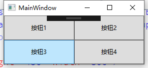

# UniformGrid【统一网格布局】

其中所有单元格都是同尺寸的不可以对其中某个单元格修改其尺寸。每一个子控件单独占据一个单元格，他们按XAML-images中定义的顺序进行摆放。



```xaml
<UniformGrid Columns="2" Rows="2"> //设置列和行
        <Button>按钮1</Button>
        <Button>按钮2</Button>
        <Button>按钮3</Button>
        <Button>按钮4</Button>
    </UniformGrid>
```