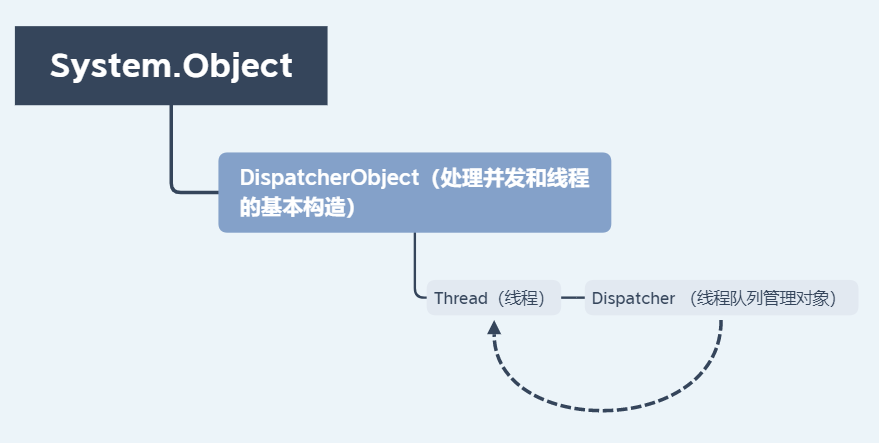
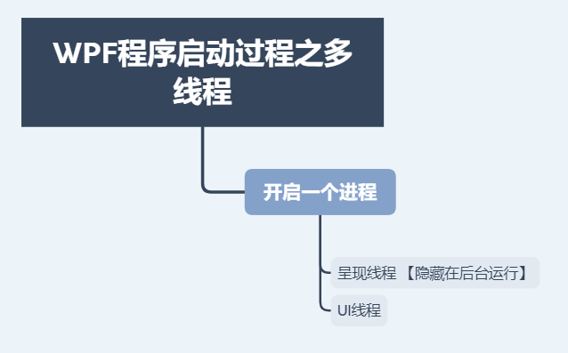
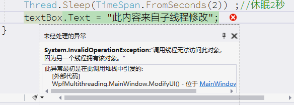

# 线程

> Thread 线程类 https://docs.microsoft.com/zh-cn/dotnet/api/system.threading.thread?view=netcore-3.1

## 摘要



## DispatcherObject类

在 WPF 中绝大部分控件都继承自 DispatcherObject，甚至包括 Application。这些继承自 DispatcherObject 的对象具有**线程关联特征**，也就意味着只有创建这些对象实例，当前对象实例且包含了 Dispatcher 的线程(通常指默认 UI 线程)才能直接对其进行更新操作。

## Dispatcher 类；

提供用于管理线程工作项队列的服务。

**介绍；**

在UI线程中有一个Dispatcher对象，管理每一个需要执行的工作项。Dispatcher会根据每个工作项的优先级排队。向Dispatcher列队中添加工作项时可指定10个不同的级别。那么问题来了，如果遇到耗时操作的时候，该操作如果依旧发生在UI线程中，Dispatcher 列队中其他的需要执行的工作项都要等待，从而造成界面假死的现象。为了加快响应速度，提高用户体验，我们应该尽量保证Dispatcher 列队中工作项要**小**。所以，对于耗时操作，我们应该开辟一个新的子线程去处理，在操作完成后，通过向UI线程的Dispatcher列队注册工作项，来通知UI线程更新结果。

**注册工作项的方法；**

以下这两个方法均调度一个委托来执行。

- `Invoke()` 同步调用，也就是说，直到 UI 线程实际执行完该委托它才返回。
- `BeginInvoke()` 异步的，将立即返回。

**特征；**

- Dispatcher实际上并不是多线程
- 子线程不能直接修改UI线程，必须通过向UI线程中的Dispatcher注册工作项来完成
- Dispatcher 是单例模式，暴露了一个静态的CurrentDispatcher方法用于获得当前线程的Dispatcher
- 每一个UI线程都至少有一个Dispatcher，一个Dispatcher只能在一个线程中执行工作。

## WPF程序中的体现；



- 一个线程用于处理呈现：隐藏在后台运行
- 一个线程用于管理用户界面：接收输入、处理事件、绘制屏幕以及运行应用程序代码,即UI线程。
- 不管是WinForm应用程序还是WPF应用程序，实际上都是一个进程，一个进程可以包含多个线程，其中有一个是主线程，其余的是子线程。
- WPF 要求将其大多数对象与 UI 线程进行关联,这称之为**线程关联**，意味着要使用一个 WPF 对象，**只能在创建它的线程上使用**,在其他线程上使用它会导致引发运行时异常。也就是通常说的子线程**无法直接访问主线程**及UI线程。


## 多线程使用

前台xaml代码；

```xaml
<Window x:Class="WpfMultithreading.MainWindow"
        xmlns="http://schemas.microsoft.com/winfx/2006/xaml/presentation"
        xmlns:x="http://schemas.microsoft.com/winfx/2006/xaml"
        xmlns:d="http://schemas.microsoft.com/expression/blend/2008"
        xmlns:mc="http://schemas.openxmlformats.org/markup-compatibility/2006"
        xmlns:local="clr-namespace:WpfMultithreading"
        mc:Ignorable="d"
        Title="MainWindow" Height="450" Width="800">
    <Canvas>
        <Button x:Name="button" Content="多线程更新" Canvas.Left="235" Canvas.Top="84" Width="75" Height="31" Click="button_Click"/>
        <TextBox x:Name="textBox" Height="23" Canvas.Left="96" TextWrapping="Wrap" Text="无内容" Canvas.Top="84" Width="120"/>


    </Canvas>
</Window>
```

**错误做法；**

直接通过子线程直接访问UI线程创建的对象，更新数据。

```c
using System;
using System.Collections.Generic;
using System.Linq;
using System.Text;
using System.Threading;
using System.Windows;
using System.Windows.Controls;
using System.Windows.Data;
using System.Windows.Documents;
using System.Windows.Input;
using System.Windows.Media;
using System.Windows.Media.Imaging;
using System.Windows.Navigation;
using System.Windows.Shapes;

namespace WpfMultithreading
{
    /// <summary>
    /// MainWindow.xaml 的交互逻辑
    /// </summary>
    public partial class MainWindow : Window
    {
        public MainWindow()
        {
            InitializeComponent();


        }
        //启动子线程，事件按钮。
        private void button_Click(object sender, RoutedEventArgs e)
        {
            Thread thread = new Thread(ModifyUI);
            thread.Start(); //开启子线程
        }

        //修改UI方法
        void ModifyUI()
        {
            //阻塞当前线程来模拟一个耗时操作。
            Thread.Sleep(TimeSpan.FromSeconds(2)) ;//休眠2秒
            textBox.Text = "此内容来自子线程修改";
        }


    }
}
```



### 使用Invoke方法

修改ModifyUI方法

```c
    //UI修改方法
        void ModifyUI()
        {
            //阻塞当前线程来模拟一个耗时操作。
            Thread.Sleep(TimeSpan.FromSeconds(2));//休眠2秒
                                                  //textBox.Text = "此内容来自子线程修改";

            //获取当前线程的Dispatcher线程管理对象。
            this.Dispatcher.Invoke(DispatcherPriority.Normal, (ThreadStart)delegate ()
            {

                textBox.Text = "此内容来自子线程修改";
            });
        }
```

- `Invoke(priority,method )`

  按指定的优先级在与 Dispatcher 关联的线程上同步执行指定的委托。

  - 参数
    - priority枚举 指定调用方法的优先级
    - method方法 对不采用任何参数的方法的委托，该委托将被推送到 Dispatcher 事件队列中。
  - 返回值
    - 类型： System.Object 正在被调用的委托的返回值，如果该委托没有返回值，则为 null。

### 使用BeginInvoke方法

修改button_Click方法

```c
        //启动子线程，事件按钮。
        private void button_Click(object sender, RoutedEventArgs e)
        {
            //Thread thread = new Thread(ModifyUI);
            //thread.Start(); //开启子线程


            new Thread(() =>
            {
                        //模拟一个耗时任务。
                        Thread.Sleep(TimeSpan.FromSeconds(2));
                Application.Current.Dispatcher.BeginInvoke(DispatcherPriority.Normal,
                    new Action(() =>
                    {

                        this.textBox.Text = "此内容来自子线程修改";

                    }));
            }).Start();

        }
```

- `Application.Current` 属性获取当前 AppDomain 的 Application 对象。
- `BeginInvoke ()`在与 Dispatcher 关联的线程上异步执行委托。
  - 参数
    - priority 类型： System.Windows.Threading.DispatcherPriority枚举 指定调用方法的优先级，与 Dispatcher 事件队列中的其他挂起操作相关。
    - method 类型： System.Delegate 对不采用任何参数的方法的委托，该委托将被推送到 Dispatcher 事件队列中。
  - 返回值
    - 类型： System.Windows.Threading.DispatcherOperation 调用 BeginInvoke 之后立即返回的对象，可用来与事件队列中挂起执行的委托进行交互。

