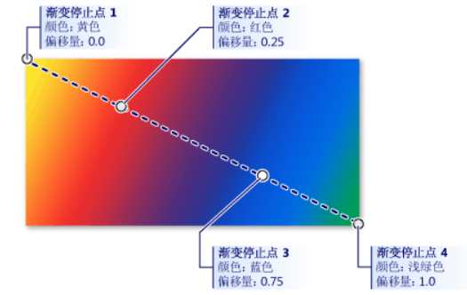
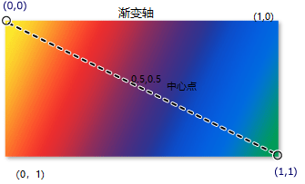
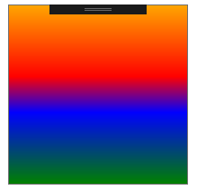

# Brush【画刷】

用来填充区域

## SolidColorBrush 【纯色画刷】

**属性；**

- `Color` 获取或设置此 SolidColorBrush 的颜色。

## LinearGradientBrush【线性渐变画刷】

> https://docs.microsoft.com/zh-cn/dotnet/api/system.windows.media.lineargradientbrush.-ctor?redirectedfrom=MSDN&view=netframework-4.8#System_Windows_Media_LinearGradientBrush__ctor



**属性**

- `GradientStops` 获取或设置画笔的渐变停止点。
- `GradientStop. Offset` 获取渐变停止点在渐变向量中的位置。值 0.0 指定停止点位于渐变向量的开始处；而值 1.0 指定停止点位于渐变向量的末尾处
- `StartPoint` 获取或设置线性渐变的二维起始坐标。
- `EndPoint` 获取或设置线性渐变的二维终止坐标。

### 相对坐标概念

坐标分布如下图



**示例代码（线性渐变）；**

```xaml
<Button Height="200" Width="200">
            <Button.Background>
                <!-- 渐变刷标记 -->
                <LinearGradientBrush StartPoint="0,0" EndPoint="0,1">
                    <!-- 渐变色集合 -->
                    <GradientStop Color="Orange" Offset="0"/>
                    <GradientStop Color="Red" Offset="0.4"/>
                    <GradientStop Color="Blue" Offset="0.6"/>
                    <GradientStop Color="Green" Offset="1"/>
                </LinearGradientBrush>
            </Button.Background>
        </Button>
```



## RadialGradientBrush【径向渐变画刷】

> https://docs.microsoft.com/zh-cn/dotnet/api/system.windows.media.radialgradientbrush?redirectedfrom=MSDN&view=netframework-4.8

**属性**

- `GradientBrush.GradientStops` 获取或设置画笔的渐变停止点。

- `RadialGradientBrush.GradientOrigin` 获取或设置定义渐变开始的二维焦点的位置。

  坐标点和LinearGradientBrush【线性渐变画刷】一直

- `RadiusX` 获取或设置径向渐变的最外面圆的水平半径

- `RadiusY` 获取或设置径向渐变的最外面圆的垂直半**径**

**示例代码；**

```xaml
<Rectangle Margin="0,10,0,0" Width="200" Height="200">
            <Rectangle.Fill>
                <RadialGradientBrush GradientOrigin="0.5,0.5" >
                    <GradientStop Color="Yellow" Offset="0"/>
                    <GradientStop Color="Red" Offset="0.5"/>
                    <GradientStop Color="Plum" Offset="0.6"/>
                    <GradientStop Color="#6000FF00" Offset="1"/>
                </RadialGradientBrush>
            </Rectangle.Fill>
        </Rectangle>
```

**效果；**


### ImageBrush【图片刷】

参考[对象资源](object-resource.md#画刷资源)

## VisualBrush【视觉笔刷】

可以复制其它控件的外观，可以做代码中的导航预览缩略图功能。

```xaml
<Rectangle Width="200" Height="200">
            <Rectangle.Fill>
                <!-- 要复制外观的的组件名 -->
                <VisualBrush Visual="{Binding ElementName=btn}"/>
            </Rectangle.Fill>
        </Rectangle>
```

## BitmapCacheBrush【位图缓存画刷】

> https://docs.microsoft.com/zh-cn/dotnet/api/system.windows.media.bitmapcachebrush?redirectedfrom=MSDN&view=netframework-4.8

他的作用和VisualBrush类型只不过他会把内容缓存到内存中。


## WriteableBitmap位图生成

> https://docs.microsoft.com/zh-cn/dotnet/api/system.windows.media.imaging.writeablebitmap?redirectedfrom=MSDN&view=netframework-4.8

提供一个可写入并可更新的 [BitmapSource](https://docs.microsoft.com/zh-cn/dotnet/api/system.windows.media.imaging.bitmapsource?view=netframework-4.8)。

**方法**

- `WritePixels` 更新位图指定区域中的像素。