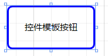
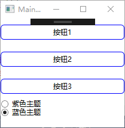
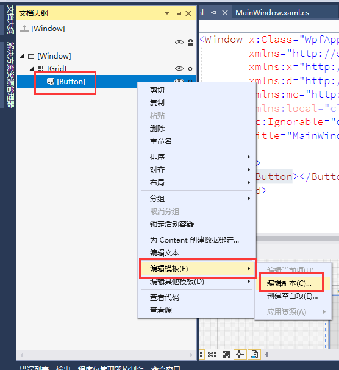

# 控件模板

使用控件模板可以高度定制控件的外观。

## 模板类

ControlTemplate类

> https://docs.microsoft.com/zh-cn/dotnet/api/system.windows.controls.controltemplate?redirectedfrom=MSDN&view=netframework-4.8

**属性**

- Template 给控件设定自定义控件模板。

## 创建和应用

```xaml
<Window x:Class="WpfApp001.MainWindow"
        xmlns="http://schemas.microsoft.com/winfx/2006/XAML-images/presentation"
        xmlns:x="http://schemas.microsoft.com/winfx/2006/XAML-images"
        xmlns:d="http://schemas.microsoft.com/expression/blend/2008"
        xmlns:mc="http://schemas.openxmlformats.org/markup-compatibility/2006"
        xmlns:local="clr-namespace:WpfApp001"
        mc:Ignorable="d"
        Title="MainWindow" Height="450" Width="800">
    <Window.Resources>
        <!--定义控件模板 
        x:Key 模板名
        TargetType 模板应用控件类型
        -->
        <ControlTemplate x:Key="btnTemplate" TargetType="{x:Type Button}">
            <!--定义外观树 也可以使用其它外观内容不必是border
        BorderBrush="{TemplateBinding Background}" 模板绑定，通过绑定当为控件设置此属性值时会自动传递到控件模板的这个属性上
-->
            <Border x:Name="border" BorderBrush="{TemplateBinding Background}" BorderThickness="2" CornerRadius="5" TextBlock.Foreground="Black">
                <!--内容表示器标记-->
                <!--
                Margin="{TemplateBinding Padding}"让StackPanel面板中的控件支持padding属性。
                TemplateBinding 模板属性绑定。
                -->
                <ContentPresenter HorizontalAlignment="Center" VerticalAlignment="Center" Margin="{TemplateBinding Padding}"/>
            </Border>
            <!--定义触发器-->
            <ControlTemplate.Triggers>
                <!--指定路由事件-->
                <Trigger Property="IsMouseOver" Value="True">
                    <!-- 事件成立改变样式 TargetName要改变样式的控件名-->
                    <Setter TargetName="border" Property="BorderBrush" Value="Red"/>
                </Trigger>
                <!--事件2-->
                <Trigger Property="IsPressed" Value="True">
                    <Setter TargetName="border" Property="Background" Value="Pink"/>
                </Trigger>
            </ControlTemplate.Triggers>
        </ControlTemplate>
    </Window.Resources>
    <Canvas>
        <!--Template使用控件模板 也可以使用动态引用模板-->
        <Button Template="{StaticResource btnTemplate}" Width="100" Height="50" Canvas.Left="50" Canvas.Top="100" FontSize="10" Padding="5">控件模板按钮</Button>
    </Canvas>
</Window>
```



## 组织模板资源

### 控件模板定义到资源字典

```xaml
<ResourceDictionary xmlns="http://schemas.microsoft.com/winfx/2006/XAML-images/presentation"
                    xmlns:x="http://schemas.microsoft.com/winfx/2006/XAML-images"
                    xmlns:local="clr-namespace:WpfApp002">
    <ControlTemplate x:Key="blue" TargetType="{x:Type Button}">
        <Border x:Name="border" BorderBrush="Blue" BorderThickness="1" CornerRadius="5" TextBlock.Foreground="Black">
            <ContentPresenter VerticalAlignment="Center" HorizontalAlignment="Center"/>
        </Border>

        <ControlTemplate.Triggers>
            <Trigger Property="IsMouseOver" Value="True">
                <Setter TargetName="border" Property="BorderBrush" Value="Red"/>
            </Trigger>

            <Trigger Property="IsPressed" Value="True">
                <Setter TargetName="border" Property="Background" Value="Blue"/>
            </Trigger>
        </ControlTemplate.Triggers>
    </ControlTemplate> 

    <!--针对按钮控件 的控件类的控件模板属性设置样式,设置后使用样式不用手动给控件设置控件模板属性-->
    <Style TargetType="{x:Type Button}">
        <Setter Property="Control.Template" Value="{StaticResource blue}"/>
    </Style>

</ResourceDictionary>
```

window的字典属性引用资源字典；

```xaml
<Window.Resources>
        <ResourceDictionary>
            <!-- 资源字典合并标记 -->
            <ResourceDictionary.MergedDictionaries>
                <!-- 引入资源字典1 -->
                <ResourceDictionary Source="Blue.XAML-images"/> 
            </ResourceDictionary.MergedDictionaries>
        </ResourceDictionary>
    </Window.Resources>
```

### 动态加载资源字典实现皮肤功能

如果不指定默认资源字典那么Resources.MergedDictionaries结合无资源。

```c
RadioButton radioButton = (RadioButton)sender;
            //实例化资源字典对象
            ResourceDictionary resourceDictionary = new ResourceDictionary();

            if (radioButton.Content as String == "紫色主题")
            {
                // 指定一个资源字典
                resourceDictionary.Source = new Uri("Purple.XAML-images", UriKind.RelativeOrAbsolute);
                //修改n索引的资源字典，为新的资源对象。
                this.Resources.MergedDictionaries[0] = resourceDictionary;

            }else{
                resourceDictionary.Source = new Uri("Blue.XAML-images", UriKind.RelativeOrAbsolute);
                this.Resources.MergedDictionaries[0] = resourceDictionary;

            };
```



## 构建更复杂的模板

通过文档大纲，快速生成控件模板，修改自己需要的代码。

