# 数据绑定

## 消息/事件驱动程序

 Windows GUI 运 ⾏ 的机理是使 ⽤ 消息（Message）来驱使程序向前运 ⾏，消息的主要来源是 ⽤ 户的操作，⽐ 如单击 ⿏ 标、按下按钮，都会产 ⽣ 消息，消息 ⼜ 会被 Windows 翻译并送达 ⽬ 标程序然后被程序所处理。正如此各种开发 ⽅ 法必须跟从这种“消息驱动程序”的基本原理。才有了 Windows API 开发的纯消息驱动、MFC 等 C++类库的消息驱动、和 Visual Basic 开始到.NET Framework 的事件驱动，程序是被来 ⾃UI 的事件（即封装过的消息）驱使向前的，简称“消息驱动”或“事件驱动”。因为消息和事件 ⼤ 都来 ⾃ 于 UI，所以统称它们为“UI 驱动程序”。

**问题；**

- 使 ⽤“UI 驱动程序”开发程序则是“为了 GUI⽽GUI”、单纯地为了实现程序的 GUI 化。实际上这已经背离了程序的本质——数据加算法，同时迫使程序员把很多 **精 ⼒ 放在了实现 UI 的编程上**。

- 随着程序 UI 的 ⽇ 趋复杂，UI 层 ⾯ 上的代码与 ⽤ 于处理数据的逻辑代码也渐渐纠缠在 ⼀ 起变得 **难以维护**。为了避免这样的问题，程序员们总结出了 Model-View-Controler（MVC）和 Model-View-Presenter（MVP）等诸多设计模式来把 UI 相关的代码与数据逻辑相关的代码分开。

程序的本质是数据加算法，⽤ 户给进 ⼀ 个输 ⼊，经过算法的处理程序会反馈 ⼀ 个输出如 CMD

而“UI 驱动程序”数据处于被动地位，总是在等待程序接收来 ⾃UI 的消息 ∕ 事件后被处理或者算法完成处理后
被显 ⽰。

如何在 GUI 编程时把数据的地位由被动变主动、让数据回归程序的核 ⼼ 呢？这就要用到 DataBinding。

## Data Binding 在 WPF 中的地位

### 三层结构的程序

数据存储层、数据处理层和数据展 ⽰ 层。

- 存储层；由数据库和 ⽂ 件系统构成

- 处理层；更正确的称呼应该是逻辑层，与业务逻辑相关、⽤ 于加 ⼯ 处理数据的算法都集中在这 ⾥，

- 展 ⽰ 层；功能是把加 ⼯ 后的数据通过可视的界 ⾯ 展 ⽰ 给 ⽤ 户或者通过其他种类的、接 ⼝ 展 ⽰ 给别的应 ⽤ 程序 

  （界 ⾯ 和接 ⼝ 两个词在英 ⽂ 中均为 interface，所以本质上没有什么区别）

#### 算法在程序中的分布

程序的本质是数据加算法。数据会在存储、逻辑和展 ⽰ 三个层流通，所以站在数据的 ⾓ 度上来看，这三层都很重要。但算法在程序中的分布就不均匀了，对于 ⼀ 个三层结构的程序来说，算法 ⼀ 般分布在这 ⼏ 处：
  A． 数据库内部。
  B． 读取和写回数据。
  C． 业务逻辑。
  D． 数据展 ⽰。
  E． 界 ⾯ 与逻辑的交互。

- A、B 两个部分的算法 ⼀ 般都 ⾮ 常稳定，不会轻易去改动，复 ⽤ 性也很 ⾼；
- C 处与客户需求关系最紧密、最复杂，变动也最 ⼤，⼤ 多数算法都集中在这 ⾥；
- D、E 两层负责 UI 与逻辑的交互，也占有 ⼀ 定量的算法。显然，C 部分是程序的核 ⼼、是开发的重中之重，所以我们应该把精 ⼒ 集中在 C 部分。然 ⽽，D、E 两个部分却经常成为 ⿇ 烦的来源。⾸ 先，这两部分都与逻辑层紧密相关，⼀ 不 ⼩⼼ 就有可能把本来该放在逻辑层 ⾥ 的算法写进这两部分（所以才有了 MVC、MVP 等模式来避免这种情况出现）；
- 其次，这两个部分以消息或事件的 ⽅ 式与逻辑层沟通，⼀ 旦出现同 ⼀ 个数据需要在多处展 ⽰∕ 修改时，⽤ 于同步的代码就会错综复杂；
- 最后，D 和 E 本应是互逆的 ⼀ 对 ⼉，但却需要分开来写——显 ⽰ 数据写 ⼀ 个算法、修改数据 ⼜ 是 ⼀ 个算法。总之导致的结果就是 D 和 E 两个部分会占去 ⼀ 部分算法，搞不好还会牵扯不少精 ⼒。
- 问题的根源就在于逻辑层与展 ⽰ 层的地位不固定——当实现客户需求的时候，逻辑层的确处在中 ⼼ 地位，但到了实现 UI 交互的时候展 ⽰ 层 ⼜ 处于中 ⼼ 地位。WPF 作为 ⼀ 种专门的展 ⽰ 层技术，华丽的外观和动画只是它的表层现象，更重要的是它在深层次上帮助程序员把思维的重 ⼼ 固定在了逻辑层、让展 ⽰ 层永远处于逻辑层的从属地位。WPF 具有这种能 ⼒ 的关键是它引 ⼊ 了 Data Binding 概念以及与之配套的 Dependency Property（依赖属性）系统和 DataTemplate。

#### Windows Form 迁移到 WPF

Windows Form 迁移到 WPF 之后，对于这个三层程序 ⽽⾔。

- 数据存储层由数据库和 ⽂ 件系统来构建。
- 数据传输和处理仍然使 ⽤.NET Framwork 的 ADO.NET 等基本类（与 Windows Form 等开发 ⼀ 样）。
- 展 ⽰ 层则使 ⽤WPF 类库来实现
- 展 ⽰ 层与逻辑层的沟通就使 ⽤Data Binding 来实现。


Data Binding 在 WPF 系统中起到的是数据 ⾼ 速公路的作 ⽤。有了这条 ⾼ 速公路，加 ⼯ 好的数据会 ⾃ 动送达 ⽤ 户界 ⾯ 加以显 ⽰，被 ⽤ 户修改过的数据也会 ⾃ 动传回逻辑层，⼀ 旦数据被加 ⼯ 好 ⼜ 会被送达 ⽤ 户界 ⾯……程序的逻辑层就像 ⼀ 个强有 ⼒ 的引擎不停运转，⽤ 加 ⼯ 好的数据驱动程序的 ⽤ 户界 ⾯ 以 ⽂ 字、图形、动画等形式把数据显 ⽰ 出来——这就是“数据驱动 UI”。

引 ⼊Data Binding 机制后，D、E 两个部分会简化很多。⾸ 先，数据在逻辑层与 ⽤ 户界 ⾯ 之间“直来直去”、不涉及逻辑问题，这样 ⽤ 户界 ⾯ 部分 ⼏ 乎不包含算法

**好处；**

- 第 ⼀，如果把 UI 层看作是应 ⽤ 程序的“⽪”、把存储层和逻辑层看作是程序的“瓤”，那么我们可以很轻易地把 ⽪ 从瓤上撕下来并换 ⼀ 个新的；
- 第 ⼆，因为数据层能够独 ⽴ 运转、⾃ 成体系，所以我们可以进 ⾏ 更完善的单元测试 ⽽⽆ 需借助 UI⾃ 动化测试 ⼯ 具——你完全可以把单元测试代码想象成 ⼀ 个“看不 ⻅ 的 UI”，单元测试只是使 ⽤ 这个“UI”绕过真实的 UI 直接测
  试业务逻辑罢了。

## 基础

**更好理解 Binding 一词；**

> 个人理解绑定这个词语在这里并不恰当是一个音译词语不便理解，而 binding 是两个事务之间建立某种联系，感觉这里使用关联这个词语更为恰当。结合这个词义更容易理解。
>
> - 关联；事物相互之间发生牵连和影响：国民经济各部门是互相～互相依存的。这可是～着生命安全的大事。

Binding⼀ 词在汉语中究竟是什么意思呢？⼤ 概是出于 ⽅ 便，业界 ⼀ 直使 ⽤Binding⼀ 词的 ⾳ 译，即“绑定”。这绑定中的“绑”⼤ 概是取材于 Bind 这个词的“捆绑”之“绑”；“定”则更像是 ⼀ 个拼 ⾳——以 ⾳ 译 ⾳，没什么意义。

在英 ⽂ 中，动词 Bind 在转化为名词 Binding 后，除了原有的“捆绑”之意外 ⼜ 引申出了“关联”和“键联”的含义。⽐ 如 ， 原 ⼦ 键联 （ atomic binding ） 、 化学键联 （ chemicalbinding）、联结梁（binding-beam）Binding 更注重表达它 **是 ⼀ 种像桥梁 ⼀ 样的关联关系**。WPF 中，正是在这段桥梁上我们有机会为往来流通的数据做很多事情。如果把 Binding⽐ 作 **数据的桥梁**，那么它的两端分别是 Binding 的 **源** （ Source ） 和 **⽬ 标** （ Target ） 。 

⼀ 般情况下，Binding **源是逻辑层的对象**，Binding **⽬ 标是 UI 层的控件对象**，这样，数据就会源源不断通过 Binding 送达 UI 层、被 UI 层展现，也就完成了数据驱动 UI 的过程

我们不但可以控制公路是在源与 ⽬ 标之间 **双向通 ⾏ 还是某个 ⽅ 向的单 ⾏ 道**，还可以控制对 **数据放 ⾏ 的时机**，甚 ⾄ 可以在桥上架设 ⼀ 些“关卡”⽤来 **转换数据类型或者检验数据的正确性**。

BindingBase 类关系

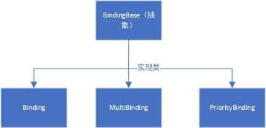

**示例；**

创建 ⼀ 个简单的数据源并通过 Binding 把它连接到 UI 元素上。

- 创建数据源

  1. 设置送达 UI 属性；

     前 ⾯ 说过，数据 **源是 ⼀ 个对象**，⼀ 个对象 ⾝ 上可能有很多数据，这些数据 ⼜ 通过属性暴露给外界。那么，其中哪个数据是你想通过 Binding 送达 UI 元素的呢？换句话说，UI 上的元素关 ⼼ 的是哪个属性值的变化呢？这个属性就称为 Binding 的路径（Path）。

  2. 通知 Binding 属性值已经变化；

     Binding 是 ⼀ 种 **⾃动机制**，当值变化后属性要有能⼒通知 Binding，让Binding 把变化传递给 UI 元素。怎样才能让 ⼀ 个属性具备这种通知 Binding 值已经变化的能 ⼒ 呢？
     
     ⽅法是 **在属性的 set 语句中激发 ⼀ 个 PropertyChanged 事件**。这个事件不需要我们 ⾃⼰ 声明，我们要做的是让作为数据源的类实现 `System.ComponentModel` 名称空间中的 `INotifyPropertyChanged` 接 ⼝。当为 Binding **设置了数据源后，Binding 就会⾃动侦听来 ⾃ 这个接 ⼝ 的 PropertyChanged 事件**。
  
  ```c#
  class Student:INotifyPropertyChanged
  {
      private string name;
  
      public event PropertyChangedEventHandler? PropertyChanged;
  
      public string Name
      {
          get { return name; }
          set {
              name = value;
              // 通知Binding属性值已经改变
              this.PropertyChanged?.Invoke(this,new PropertyChangedEventArgs("Name"));
          }
      }
  
  }
  ```
  
- 在窗体上准备 ⼀ 个 TextBox 和 ⼀ 个 Button。TextBox 将作 为 Binding ⽬ 标 ，我们还会在 Button 的 Click 事件发 ⽣ 时改变 Student 对象的 Name 属性值。

  ```xaml
  <Window x:Class="DataBinding.MainWindow"
          xmlns="http://schemas.microsoft.com/winfx/2006/xaml/presentation"
          xmlns:x="http://schemas.microsoft.com/winfx/2006/xaml"
          xmlns:d="http://schemas.microsoft.com/expression/blend/2008"
          xmlns:mc="http://schemas.openxmlformats.org/markup-compatibility/2006"
          xmlns:local="clr-namespace:DataBinding"
          mc:Ignorable="d"
          Title="MainWindow" Height="450" Width="800">
      <StackPanel>
          <TextBox x:Name="TextBox"/>
          <Button Click="Button_Click">Add Age</Button>
      </StackPanel>
  </Window>
  
  ```

  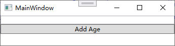

- 使 ⽤Binding 把数据源和 UI 元素连接起来

  1. 准备数据源
  2. 准备 Binding
  3. Binding 设置数据源
  4. 为 Binding 设置访问属性路径
  5. 使用 Binding 连接数据源与目标
  
  ```c#
  public partial class MainWindow : Window
  {
      Student student;
  
      public MainWindow()
      {
          InitializeComponent();
  
          // 准备数据源
          student = new Student();
  
          // 配置binding
          Binding binding = new Binding(); 
          // 设置数据源
          binding.Source = student;
          // 设置访问属性路径
          binding.Path = new PropertyPath("Name");
          // 连接数据源和目标
          /**
               * SetBinding()
               * 参数；
               *  target 绑定的绑定目标。
               *  dp 绑定的目标依赖项属性只读属性。
               *  binding 描述绑定的 BindingBase 对象。 
               */
          BindingOperations.SetBinding(TextBox,TextBox.TextProperty,binding);
  
      }
  
      private void Button_Click(object sender, RoutedEventArgs e)
      {
          // 改变student的Name属性值
          student.Name += "Name";
  
      }
  }
  ```
  
  当你单击 Button 时，TextBox 就会即时显 ⽰ 更新后的 Name 属性值
  
  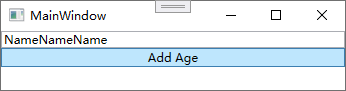
  
- 实际 ⼯ 作中 Binding 的代码可能与上 ⾯ 看到的不太 ⼀ 样，原因是 TextBox 这类 UI 元素的基类 **FrameworkElement 对 BindingOperations.SetBinding(…)⽅ 法进 ⾏ 了封装**，封装的结果也叫 SetBinding，只是参数列表发 ⽣ 了变化

  ```c#
          // 摘要:
          //     基于已提供的绑定对象将一个绑定附加到此元素上。
          //
          // 参数:
          //   dp:
          //     标识应在其中建立绑定的属性。
          //
          //   binding:
          //     表示数据绑定的详细信息。
          //
          // 返回结果:
          //     记录绑定的条件。 此返回值可用于错误检查。 
  public BindingExpression SetBinding(DependencyProperty dp, string path);
  ```
  
  使用 TextBox 的 SetBinding();
  
  ```c#
  //BindingOperations.SetBinding(TextBox,TextBox.TextProperty,binding);
  
   this.TextBox.SetBinding(TextBox.TextProperty, binding);
  ```
  
  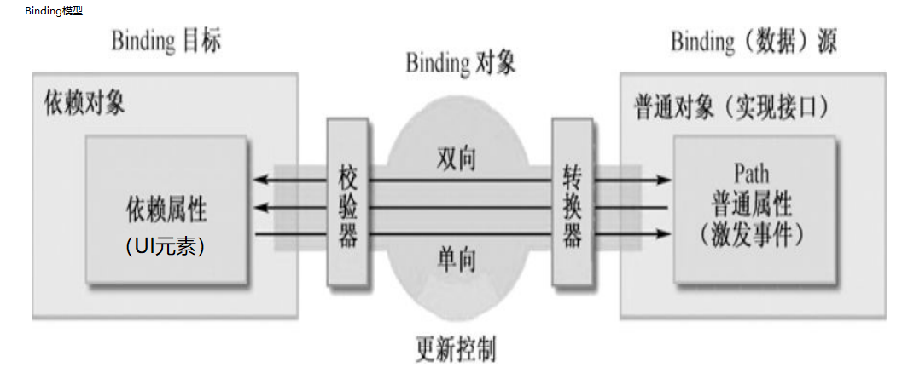


## 源与路径

**数据源要求；**

- 是 ⼀ 个对象
- 通过属性（Property）公开 ⾃⼰ 的数据。

**属性改变通知；**

如果想让作为 Binding 源的对象具有 ⾃ 动通知 Binding⾃⼰ 的属性值已经变化的能 ⼒，那么就需要让类实现 INotifyPropertyChanged 接 ⼝ 并在属性的 set 语句中激发 PropertyChanged 事件

### 把控件作为 Binding 源与 Binding 标记扩展

> 谁是绑定目标就设置 Binding 属性。

把 ⼀ 个 TextBox 的 Text 属性关联在了 Slider 的 Value 属性上。

```xaml
<Window x:Class="DataBinding.ControlBindingWindow"
        xmlns="http://schemas.microsoft.com/winfx/2006/xaml/presentation"
        xmlns:x="http://schemas.microsoft.com/winfx/2006/xaml"
        xmlns:d="http://schemas.microsoft.com/expression/blend/2008"
        xmlns:mc="http://schemas.openxmlformats.org/markup-compatibility/2006"
        xmlns:local="clr-namespace:DataBinding"
        mc:Ignorable="d"
        Title="ControlBindingWindow" Height="450" Width="800">
    <StackPanel>
        <TextBox x:Name="TextBox1" Text="{Binding Path=Value,ElementName=Slider1}" />
        <Slider x:Name="Slider1" Maximum="100" Minimum="0" Margin="5" Value="0"/>
    </StackPanel>
</Window>
```

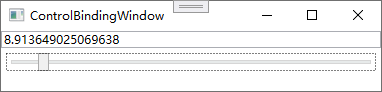

可以在 C#代码中建⽴Binding 外在 XAML 代码 ⾥ 也可以 ⽅ 便地设置 Binding，

> **注意;**
>
> 在 C#代码中可以访问 XAML 代码中声明的变量 **但 XAML 代码中却⽆法访问 C#代码中声明的变量**，
> 因此，要想在 XAML 中建⽴UI 元素与逻辑层对象的Binding还要颇费些周折，把逻辑层对象声明为 XAML 代码中的资源（Resource），

```xaml
<TextBox x:Name="TextBox1" Text="{Binding Path=Value,ElementName=Slider1}" />
```

等价 C#

````c#
this.TextBox1.SetBinding(TextBox.TextProperty,new Binding("Value") { ElementName= "Slider1" });
````

因为 Binding 类的构造器本 ⾝ 可以接收 Path 作为参数，所以也常写为

```xaml
<TextBox x:Name="TextBox1" Text="{Binding Value,ElementName=Slider1}" />
```

> [!Note]
> 因为在 C#代码中我们可以直接访问控件对象，所以⼀般也不会使⽤Binding 的
> ElementName 属性，⽽是直接把对象赋值给 Binding 的 Source 属性。

**理解 Binding 的标记扩展语法；**

Binding 的标记扩展语法，初看起来平淡 ⽆ 奇甚 ⾄ 有些别扭，但细品起来就会发现它的精巧之处。说它“别扭”是因为我们已经习	惯了 Text = "Hello World" 这种“键 − 值”式的赋值 ⽅ 式，⽽ 且认为值与属性的数据类型 ⼀ 定要 ⼀ 致——⼤ 脑很快会质询 `Text="{Binding Value,ElementName= slider1}"` 的字 ⾯ 意思——Text 的类型是 string，为什么要赋 ⼀ 个 Binding 类型的值呢？其实，我们 **并不是为 Text 属性“赋了 ⼀ 个 Binding 类型的值”**，为了消除这个误会，你可以把这句代码读作“为 Text 属性设置 Binding 为……”。再想深 ⼀ 步，在编程时我们不是经常把函数视为 ⼀ 个值吗？只是这个值需要在 **函数执 ⾏ 结束后才能得到**。同理，我们也可以把{Binding}视为 ⼀ 个值，只是这个值并 ⾮ 像 "Hello World" 字符串 ⼀ 样直接和 **固定**。也就是说，我们可以把 Binding 视为 ⼀ 种间接的、**不固定的赋值 ⽅ 式**——Binding 标记扩展很恰当地表 ⽰ 了这个含义。

### 控制 Binding 的 ⽅ 向及数据更新

Binding 在源与 ⽬ 标之间架起了沟通的桥梁，默认情况下数据既能够通过 Binding 送达 ⽬ 标，也能够从 ⽬ 标返回源（收集 ⽤ 户对数据的修改）。有时候数据只需要展 ⽰ 给 ⽤ 户、不允许 ⽤ 户修改，这时候可以把 Binding 模式更改为从源向 ⽬ 标的单向沟通。Binding 还 ⽀ 持从 ⽬ 标向源的单向沟通以及只在 Binding 关系确 ⽴ 时读取 ⼀ 次数据，这需要我们根据实际情况去选择。

#### 控制方向

**Mode；**

Binding 控制数据流方向是 BindingMode 枚举类型

| 值             | 说明               | 备注                                                         |
| -------------- | ------------------ | ------------------------------------------------------------ |
| Default        | 默认               | 根据 ⽬ 标的实际情况来确定，⽐ 如若是可编辑的（如<br/>TextBox.Text 属性），Default 就采 ⽤ 双向模式；若是只读的（如<br/>TextBlock.Text）则采 ⽤ 单向模式。 |
| OneTime        | 一次               | 单向传递数据仅生效一次 OneWay 的简化                          |
| OneWay         | 单向（源到目标）   | 当绑定源（源）更改时，更新绑定目标（目标）属性               |
| OneWayToSource | 目标到原（反单向） | 当目标属性更改时更新源属性。                                 |
| TwoWay         | 双向               | 导致对源属性或目标属性的更改可自动更新对方。                 |

#### 控制数据更新时机

之前案例中，如果我们在 TextBox⾥ 输 ⼊⼀ 个恰当的值，然后按 ⼀ 下 Tab 键、让焦点离开 TextBox，则 Slider 的 ⼿ 柄
会跳到相应的值那 ⾥。为什么 ⼀ 定要在 TextBox 失去焦点之后 Slider 的值才会改变呢？这就引出了 Binding 的另 ⼀ 个属性——UpdateSourceTrigger，

**UpdateSourceTrigger**

确定绑定源更新的执行时间。是 UpdateSourceTrigger 枚举

| 值              | 说明     | 备注                                                         |
| --------------- | -------- | ------------------------------------------------------------ |
| Default         | 默认     | 大多数依赖项属性的默认值都为 PropertyChanged，而 Text 属性的默认值为 LostFocus。 |
| Explicit        | 显示     | 仅在调用 UpdateSource 方法时更新绑定源。                     |
| LostFocus       | 失去焦点 | 当绑定目标元素失去焦点时，更新绑定源。                       |
| PropertyChanged | 属性更改 | 当绑定目标属性更改时，立即更新绑定源。                       |

对于 TextBox 默认值 Default 的 ⾏ 为与 LostFocus⼀ 致，我们只需要把这个属性改为 PropertyChanged，则 Slider 的 ⼿ 柄就会随着我们在 TextBox⾥ 的输 ⼊⽽ 改变位置。

```xaml
<TextBox x:Name="TextBox1" Text="{Binding Value,ElementName=Slider1,UpdateSourceTrigger=PropertyChanged}" />
```


**其它属性；**

- NotifyOnSourceUpdated 获取或设置一个值，该值指示当值从绑定目标传输到绑定源时是否引发 SourceUpdated 事件。 
- NotifyOnTargetUpdated 获取或设置一个值，该值指示当值从绑定源传输到绑定目标时是否引发 TargetUpdated 事件。 

如果设为 true，则当源或 ⽬ 标被更新后 Binding 会激发相应的 SourceUpdated 事件和 TargetUpdated 事件。实际 ⼯ 作中，我们可以通过监听这两个事件来找出有哪些数据或控件被更新了。

### Binding 的路径（Path）

作为 Binding 源的对象可能有很多属性，通过这些属性 Binding 源可以把数据暴露给外界。那么，Binding 到底需要关注哪个属性的值呢？这就需要由 Binding 的 Path 属性来指定了。例如前 ⾯ 这个例 ⼦，我们是把 Slider 控件对象当作源、把它的 Value 属性作为路径。

尽管在 XAML 代码中或者 Binding 类的构造器参数列表中我们以 ⼀ 个字符串来表 ⽰Path，但 Path 的实际 **类型是 PropertyPath。**

#### 使用绑定源属性作为路径

最简单方式创建 PropertyPath;

直接把 Binding 关联在 Binding 源的属性上，前 ⾯ 的例 ⼦ 就是这样。语法如下：

````xaml
<TextBox x:Name="TextBox1" Text="{Binding Path=Value,ElementName=Slider1/>
````

等价 C#

```c#
Binding bing = new Binding() { Path = new PropertyPath("Value"), Source = this.Slider1};
this.TextBox1.SetBinding(TextBox.TextProperty, bing);
```

或者使 ⽤Binding 的构造器简写为；

```c#
Binding bing = new Binding("Value") {Source = this.Slider1};
this.TextBox1.SetBinding(TextBox.TextProperty, bing);
```

#### 多级路径

Binding 还 ⽀ 持 **多级路径**（通俗地讲就是 ⼀ 路“点”下去）。

⽐ 如，如果我们想让 ⼀ 个 TextBox 显 ⽰ 另外 ⼀ 个 TextBox 的 ⽂ 本 ⻓ 度，我们可这样写

````xaml
<StackPanel>
    <TextBox x:Name="TextBox1"/>
    <TextBox x:Name="TextBox2" Text="{Binding Text.Length,ElementName=TextBox1,Mode=OneWay}"/>
</StackPanel>
````

> [!Tip]
>
> `Text.Length` 不要忘记属性中间的点

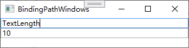

等价 C#

```c#
this.TextBox2.SetBinding(TextBox.TextProperty, new Binding("Text.Length") { ElementName = "TextBox1", Mode = BindingMode.OneWay }) ;
```

#### 集合类型的索引器

集合类型的索引器（Indexer）⼜ 称为带参属性。既然是属性，索引器也能作为 Path 来使 ⽤。

⽐ 如我想让 ⼀ 个 TextBox 显 ⽰ 另 ⼀ 个 TextBox⽂ 本的第四个字符，我们可以这样写：

```xaml
<StackPanel>
	<TextBox x:Name="TextBox3"/>
	<TextBox x:Name="TextBox4" Text="{Binding Text[3],ElementName=TextBox3,Mode=OneWay}"/>
</StackPanel>
```


等效的 C#代码是

```c#
this.TextBox4.SetBinding(TextBox.TextProperty, new Binding("Text[3]") { Source = TextBox3,Mode = BindingMode.OneWay});
```

**默认元素当作 Path 使⽤；**

当使 ⽤⼀ 个集合或者 DataView 作为 Binding 源时，如果我们想把它的默认元素（一般是指第一个元素）当作 Path 使 ⽤，则需要使 ⽤ 这样的语法

```c#
List<String> stringList = new List<String>() { "Hello", "World", "!" };
this.TxtBox1.SetBinding(TextBox.TextProperty, new Binding("/") {Source = stringList,Mode = BindingMode.OneWay });
this.TxtBox2.SetBinding(TextBox.TextProperty, new Binding("/Length") {Source = stringList,Mode = BindingMode.OneWay });
this.TxtBox3.SetBinding(TextBox.TextProperty, new Binding("/[1]") {Source = stringList,Mode = BindingMode.OneWay });

```


`/` 代表这个默认元素对象

**多级斜线语法；**

集合元素的属性仍然还是 ⼀ 个集合，我们想把 ⼦ 级集合中的元素当作 Path，则可以使 ⽤ 多级斜线的语法（即 ⼀ 路“斜线”下去）

数据类

```c#
/// <summary>
/// 省
/// </summary>

class Province
{
    public string Name
    {
        get;
        set;
    }
    public List<City> CityList
    {
        get;
        set;
    }
}

/// <summary>
/// 城市
/// </summary>
class City
{
    public string Name
    {
        get;
        set;
    }
    public List<Country> CountryList
    {
        get;
        set;
    }

}

/// <summary>
/// 区/县
/// </summary>

internal class Country
{
    public string Name
    {
        get;
        set;
    }
}
```

绑定

```c#
List<City> CityList = new List<City> { new City() { Name = "济南市" }};
List <Country> countryList = new List<Country> { new Country() {Name = "章丘区" } };
CityList[0].CountryList = countryList;
Province province = new Province();
province.Name = "山东省";
province.CityList = CityList;
List<Province> provincesList = new List<Province> { province };

this.TxtBox4.SetBinding(TextBox.TextProperty,new Binding("/Name") { Source = provincesList });
this.TxtBox5.SetBinding(TextBox.TextProperty,new Binding("/CityList/Name") { Source = provincesList });
this.TxtBox6.SetBinding(TextBox.TextProperty,new Binding("/CityList/CountryList/Name") { Source = provincesList });
            Console.WriteLine(this);
```

数据结构如图


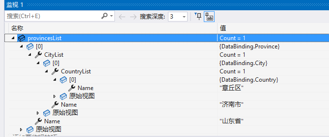


可以读作

- `"/Name"` provincesList 第一个元素的 Name 属性
- `"/CityList/Name"` provincesList 第一个元素 CityList 属性的第一个元素 Name 属性
- `"/CityList/CountryList/Name"` provincesList 第一个元素 CityList 属性的第一个元素 CountryList 属性的第一个元素的 Name 属性

### “没有 Path”的 Binding

有的时候我们会在代码中看到 ⼀ 些 Path 是 ⼀ 个“`.`”或者 ⼲ 脆没有 Path 的 Binding，

这是 ⼀ 种 ⽐ 较特殊的情况——**Binding 源本 ⾝ 就是数据且不需要 Path 来指明**。典型的，string、int 等基本类型就是这样，他们的实例本 ⾝ 就是数据，我们 ⽆ 法指出通过它的哪个属性来访问这个数据，这时我们只需将 Path 的值设
置为“`.`”就可以了。**在 XAML 代码 ⾥ 这个“`.`”可以省略不写，但在 C#代码 ⾥ 却不能省略**。

```xaml
<StackPanel>
    <StackPanel.Resources>
        <sys:String x:Key="myString">
            菩提本无树，明镜亦非台。
            本来无一物，何处惹尘埃。
        </sys:String>
    </StackPanel.Resources>

    <TextBlock Text="{Binding Path=.,Source={StaticResource ResourceKey=myString}}"/>

</StackPanel>
```

可以简写

````xaml
Text="{Binding .,Source={StaticResource ResourceKey=myString}}"
````

或者

```xaml
Text="{Binding Source={StaticResource ResourceKey=myString}}"
```


与之等效的 C#代码如下（作为 Path 的“.”是不能省略的）

```c#
string myString="菩提本⽆树，明镜亦⾮台。本来⽆⼀物，何处惹尘埃。";
this.textBlock1.SetBinding(TextBlock.TextProperty, new Binding("."){Source=myString });
```

### 为 Binding 指定源（Source）的 ⼏ 种 ⽅ 法

Binding 的源是数据的来源，所以，只要 ⼀ 个对象包含数据并能通过属性把数据暴露出来，它就能当作 Binding 的源来使 ⽤。包含数据的对象 ⽐⽐ 皆是，但必须为 Binding 的 Source 指定合适的对象 Binding 才能正确 ⼯ 作，

**常 ⻅ 的办法有：**

- 把普通 CLR 类型单个对象指定为 Source：包括.NETFramework⾃ 带类型的对象和 ⽤ 户 ⾃ 定义类型的对象。如果类型实现了 INotifyPropertyChanged 接 ⼝，则可通过在属性的 set 语句 ⾥ 激发 PropertyChanged 事件来通知 Binding 数据已被更新。
- 把普通 CLR 集合类型对象指定为 Source：包括数组、`List<T>、ObservableCollection<T>` 等集合类型。实际 ⼯ 作中，我们经常需要把 ⼀ 个集合作为 ItemsControl 派 ⽣ 类的数据源来使 ⽤，⼀ 般是把控件的 ItemsSource 属性使 ⽤Binding 关联到 ⼀ 个集合对象上。
- 把 ADO.NET 数据对象指定为 Source：包括 DataTable 和 DataView 等对象。
- 使 ⽤XmlDataProvider 把 XML 数据指定为 Source：XML 作为标准的数据存储和传输格式 ⼏ 乎 ⽆ 处不在，我们可以 ⽤ 它表 ⽰ 单个数据对象或者集合；⼀ 些 WPF 控件是级联式的（如 TreeView 和 Menu），我们可以把树状结构的 XML 数据作为源指定给与之关联的 Binding。
- 把依赖对象（Dependency Object）指定为 Source：依赖对象不仅可以作为 Binding 的 ⽬ 标，同时也可以作为 Binding 的源。这样就有可能形成 Binding 链。依赖对象中的依赖属性可以作为 Binding 的 Path。
- 把容器的 DataContext 指定为 Source（WPF Data Binding 的默认 ⾏ 为）：有时候我们会遇到这样的情况——我们明确知道将从哪个属性获取数据，但具体把哪个对象作为 Binding 源还不能确定。这时候，我们只能先建 ⽴⼀ 个 Binding、只给它设置 Path⽽ 不设置 Source，让这个 Binding⾃⼰ 去寻找 Source。这时候，Binding 会 ⾃ 动把控件的 DataContext 当作 ⾃⼰ 的 Source（它会沿着控件树 ⼀ 层 ⼀ 层向外找，直到找到带有 Path 指定属性的对象 ⽌）。
- 通过 ElementName 指定 Source：在 C#代码 ⾥ 可以直接把对象作为 Source 赋值给 Binding，但 XAML⽆ 法访问对象，所以只能使 ⽤ 对象的 Name 属性来找到对象
- 通过 Binding 的 RelativeSource 属性相对地指定 Source：当控件需要关注 ⾃⼰ 的、⾃⼰ 容器的或者 ⾃⼰ 内部元素的某个值就需要使 ⽤ 这种办法。 
- 把 ObjectDataProvider 对象指定为 Source：当数据源的数据不是通过属性 ⽽ 是通过 ⽅ 法暴露给外界的时候，我们可以使 ⽤ 这两种对象来包装数据源再把它们指定为 Source。
- 把使 ⽤LINQ 检索得到的数据对象作为 Binding 的源下 ⾯ 我们就通过实例分述每种情况。

### 没有 Source 的 Binding——使 ⽤DataContext 作为 Binding 的源

DataContext 属性被 **定义在 FrameworkElement 类 ⾥，这个类是 WPF 控件的基类**，这意味着 **所有 WPF 控件（包括容器控件）都具备这个属性**。如前所述，WPF 的 UI 布局是树形结构，这棵树的每个结点都是控件，由此我们推出另 ⼀ 个结
论——**在 UI 元素树的每个结点都有 DataContext。**

这 ⼀ 点 ⾮ 常重要，因为当 ⼀ 个 Binding 只知道 ⾃⼰ 的 Path⽽ 不知道 ⾃⼰ 的 Soruce 时，它会沿着 UI 元素树 ⼀ 路向树的根部找过去，每路过 ⼀ 个结点就要看看这个结点的 DataContext 是否具有 Path 所指定的属性。如果有，那就把这个对象作为 ⾃⼰ 的 Source；如果没有，那就继续找下去；如果到了 **树的根部还没有找到，那这个 Binding 就没有 Source**，因 ⽽ 也不会得到数据

**例 ⼦：**

- 创建 ⼀ 个名为 Student 的类，它具有 Id、Name、Age 三个属性：

  ```c#
  class Student1
  {
      public int Id { get; set; }
      public string Name { get; set; }
      public int Age { get; set; }
  }
  ```

- 在 XAML 创建程序的 UI。

  ````xaml
  <Window x:Class="DataBinding.DataContextWindow"
          xmlns="http://schemas.microsoft.com/winfx/2006/xaml/presentation"
          xmlns:x="http://schemas.microsoft.com/winfx/2006/xaml"
          xmlns:d="http://schemas.microsoft.com/expression/blend/2008"
          xmlns:mc="http://schemas.openxmlformats.org/markup-compatibility/2006"
          xmlns:local="clr-namespace:DataBinding"
          mc:Ignorable="d"
          Title="DataContextWindow" Height="450" Width="800">
      <StackPanel>
          <StackPanel.DataContext>
              <local:Student1 Id="2" Age="20" Name="Tim"/>
          </StackPanel.DataContext>
          <Grid>
              <StackPanel>
                  <TextBox Text="{Binding Path=Id}"/>
                  <TextBox Text="{Binding Path=Name}"/>
                  <TextBox Text="{Binding Path=Age}"/>
              </StackPanel>
          </Grid>
      </StackPanel>
  </Window>
  ````

​		UI 布局如图

​		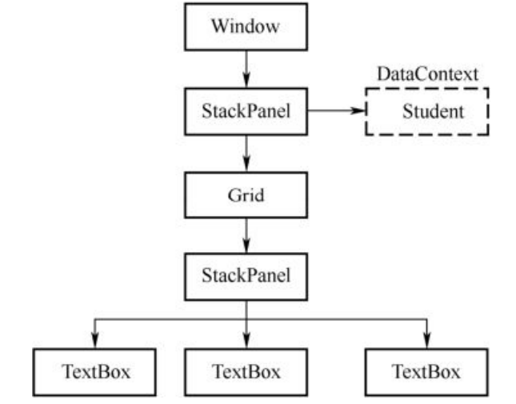


````xaml
<StackPanel.DataContext>
    <local:Student1 Id="2" Age="20" Name="Tim"/>
</StackPanel.DataContext>
````

就为外层 StackPanel 的 DataContext 进 ⾏ 了赋值——它是 ⼀ 个 Studen1t 对象。三个 TextBox 的 Text 通过 Binding 获取值，但只为 Binding 指定了 Path、没有指定 Source。简写成这样也可以

```xaml
<TextBox Text="{Binding Id}"/>
<TextBox Text="{Binding Name}"/>
<TextBox Text="{Binding Age}"/>
```

这样，这 3 个 TextBox 的 Binding 就会 ⾃ 动向 UI 元素树的上层去寻找可 ⽤ 的 DataContext 对象。最终，它们在最外层的 StackPanel⾝ 上找到了可 ⽤ 的 DataContext 对象

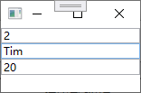

**没有 Path⼜ 没有 Source；**

当某个 DataContext 是 ⼀ 个简单类型对象的时候，我们完全可能看到 ⼀ 个“既没有 Path⼜ 没有 Source 的”Binding：

````xaml
<Window x:Class="DataBinding.DataContextWindow"
        xmlns="http://schemas.microsoft.com/winfx/2006/xaml/presentation"
        xmlns:x="http://schemas.microsoft.com/winfx/2006/xaml"
        xmlns:d="http://schemas.microsoft.com/expression/blend/2008"
        xmlns:mc="http://schemas.openxmlformats.org/markup-compatibility/2006"
        xmlns:local="clr-namespace:DataBinding" 
        xmlns:sys="clr-namespace:System;assembly=mscorlib"
        mc:Ignorable="d"
        Title="DataContextWindow" Height="450" Width="800">
    <StackPanel>
        <StackPanel.DataContext>
            <sys:String>Hello DataContent</sys:String>
        </StackPanel.DataContext>
        <Grid>
            <StackPanel>
                <TextBlock Text="{Binding}"/>
                <TextBlock Text="{Binding}"/>
                <TextBlock Text="{Binding}"/>
            </StackPanel>
        </Grid>
    </StackPanel>
</Window>
````


**并不智能的 Binding；**

其实，“Binding 并 **没有沿着 UI 元素树向上找**”只是 WPF 给我们的 ⼀ 个错觉，之所以会有这种效果是因为 DataContext 是 ⼀ 个“依赖属性”，依赖属性有 ⼀ 个很重要的特点就是当你没有为控件的某个依赖属性显式赋值时，控件会把 ⾃⼰ 容器的属性值“借过来”当作 ⾃⼰ 的属性值。实际上是属性值沿着 UI 元素树向下传递了。

举个例 ⼦；

程序的 UI 部分是若 ⼲ 层 Grid，最内层 Grid⾥ 放置了 ⼀ 个 Button，我们为最外层的 Grid 设置了 DataContext 属性值，
因为内层的 Grid 和 Button 都没有设置 DataContext 属性值所以最外层 Grid 的 DataContext 属性值会 ⼀ 直传递到 Button 那 ⾥，单击 Button 就会显 ⽰ 这个值

```xaml
<Grid DataContext="6">
    <Grid>
        <Grid>
            <Button x:Name="Btn" Click="Button_Click">ok</Button>
        </Grid>
    </Grid>
</Grid>
```

处理 Buttom 的 Click 事件

```c#
private void Button_Click(object sender, RoutedEventArgs e)
{
    MessageBox.Show(Btn.DataContext.ToString());
}
```


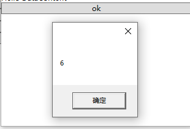

**际 ⼯ 作中 DataContext 的 ⽤ 法;**

1. 当 UI 上的多个控件都使 ⽤Binding 关注同 ⼀ 个对象时，不妨使 ⽤DataContext。
2. 当作为 Source 的对象不能被直接访问的时候——⽐ 如 B 窗体内的控件想把 A 窗体内的控件当作 ⾃⼰ 的 Binding 源时，但 A 窗体内的控件是 private 访问级别，这时候就可以把这个控件（或者控件的值）作为窗体 A 的 DataContext（这个属性是 public 访问级别的）从 ⽽ 暴露数据。形象地说，这时候外层容器的 DataContext 就相当于 ⼀ 个数据
   的“制 ⾼ 点”，只要把数据放上去，别的元素就都能看 ⻅。另外，DataContext 本 ⾝ 也是 ⼀ 个依赖属性，我们可以使 ⽤Binding 把它关联到 ⼀ 个数据源上。

### 使 ⽤ 集合对象作为列表控件的 ItemsSource

WPF 中的列表式控件们派 ⽣⾃ItemsControl 类，⾃ 然也就 **继承了 ItemsSource 这个属性**。ItemsSource 属性可以接收 ⼀ 个 **IEnumerable 接 ⼝ 派 ⽣ 类的实例** 作为 ⾃⼰ 的值（所有 **可被迭代遍历的集合都实现了这个接 ⼝**，包括数组、`List<T>` 等）。

每个 ItemsControl 的派 ⽣ 类都具有 ⾃⼰ **对应的条 ⽬ 容器**（ItemContainer），例如，ListBox 的条 ⽬ 容器 ListBoxItem、ComboBox 的条 ⽬ 容器是 ComboBoxItem。

ItemsSource⾥存放的是 ⼀ 条 ⼀ 条的数据，要想把数据显 ⽰ 出来需要为它们穿上“外 ⾐”，**条 ⽬ 容器就起到数据外 ⾐ 的作 ⽤** 外衣控制数据条目展示形式比如仅包含文本内容（实际是用的 TextBox）当然也可以自定义。怎样让每件数据外 ⾐ 与它对应的数据条 ⽬ 关联起来呢？当然是依靠 Binding！只要我们为 ⼀ 个 ItemsControl 对象设置了 ItemsSource 属性值，ItemsControl 对象就会 **⾃ 动迭代其中的数据元素**、为每个数据元素准备 ⼀ 个条 ⽬ 容器，并使 ⽤Binding 在 **条 ⽬ 容器与数据元素之间建 ⽴ 起关联**。

**例 ⼦：**

```xaml
<Window x:Class="DataBinding.ItemsSourceWindow"
        xmlns="http://schemas.microsoft.com/winfx/2006/xaml/presentation"
        xmlns:x="http://schemas.microsoft.com/winfx/2006/xaml"
        xmlns:d="http://schemas.microsoft.com/expression/blend/2008"
        xmlns:mc="http://schemas.openxmlformats.org/markup-compatibility/2006"
        xmlns:local="clr-namespace:DataBinding"
        mc:Ignorable="d"
        Title="ItemsSourceWindow" Height="450" Width="800">
    <StackPanel>
        <TextBlock Text="Student ID;"/>
        <TextBox x:Name="TxtBoxId"/>
        <TextBlock Text="Student List;"/>
        <ListBox x:Name="TxtListBox" Height="100"/>
    </StackPanel>
</Window>

```


我们要实现的效果是把 ⼀ 个 `List<Student>` 集合的实例作为 ListBox 的 ItemsSource，让 ListBox 显 ⽰Student 的 Name 并使 ⽤TextBox 显 ⽰ListBox 当前选中条 ⽬ 的 Id。

```c#
public partial class ItemsSourceWindow : Window
{
    public ItemsSourceWindow()
    {
        InitializeComponent();

        // 准备数据
        List<Student1> studentList = new List<Student1>
        {
            new Student1(){Id = 0,Name = "令狐楚",Age = 20},
            new Student1(){Id = 1,Name = "孟莹莹",Age = 22},
            new Student1(){Id = 2,Name = "郭靖",Age = 18},
            new Student1(){Id = 3,Name = "黄蓉",Age = 17},
            new Student1(){Id = 4,Name = "杨过",Age = 22},
            new Student1(){Id = 5,Name = "小龙女",Age = 18},
        };

        // 为ListBox设置数据源
        this.TxtListBox.ItemsSource = studentList;
        // 要显示的数据成语路径
        this.TxtListBox.DisplayMemberPath = "Name";

        // 让TxtBoxId 显示ListBox当前选项的Id属性
        Binding binding = new Binding("SelectedItem.Id") {Source = this.TxtListBox};
        this.TxtBoxId.SetBinding(TextBox.TextProperty, binding);

    }
}
```


例 ⼦⾥ 并没有看到为外衣 Binding。实际上 `，this.listBoxStudents.DisplayMemberPath="Name";` 这句代码还是露出了 ⼀ 些蛛丝 ⻢ 迹。

注意到它包含“Path”这个单词了吗？这说明它是 ⼀ 个路径。当 DisplayMemberPath 属性被赋值后，ListBox 在获得 ItemsSource 的时候就会创建等量的 ListBoxItem 并以 DisplayMemberPath 属性值为 Path 创建 Binding，Binding 的 ⽬ 标是 ListBoxItem 的内容插件（实际上是 ⼀ 个 TextBox，下 ⾯ 就会看到）。如果在 ItemsControl 类的代码 ⾥ 刨根问底，你会发现这个创建 Binding 的过程是在 DisplayMemberTemplateSelector 类的 SelectTemplate⽅ 法 ⾥ 完成的。

````c#
public override DataTempIate SelectTemplate(object item, Dependency()bject container)
{
    //
}
````

在这 ⾥ 我们倒不必关 ⼼ 它的完整内容，注意到它的返回值了吗？是 ⼀ 个 DataTemplate 类型的值。数据的“外 ⾐”就是由 DataTemplate 穿上的！当我们没有为 ItemsControl 显式地指定 DataTemplate 时 SelectTemplate⽅ 法就会为我们创建 ⼀ 个默认的（也是最简单的）DataTemplate——就好像给数据穿上 ⼀ 件最简单的 ⾐ 服 ⼀ 样。
这 ⾥，我们只关 ⼼SelectTemplate 内部与创建 Binding 相关的 ⼏⾏ 代码：

```c#
FrameworkElementFactory text = ContentPresenter.CreateTextBlockFactory(); // 创建TextBlock控件
Binding binding = new Binding();
binding.Path = new PropertyPath(_dispIayMemberPath);
binding.StringFornut = _stringFomat;
text.SetBinding(TextBlock.TextProperty, binding);
```

这 ⾥ 只对新创建的 Binding 设定了 Path⽽ 没有为它指定 Source，紧接着就把它关联到了 TextBlock 控件上。显然，要想得到 Source，这个 Binding 要向 **UI 元素树根的 ⽅ 向去寻找包含_displayMemberPath 指定属性的 DataContext**。

**显式地为数据设置 DataTemplate；**

把 C#代码中的 `this.TxtListBox.DisplayMemberPath = "Name";` ⼀ 句删除，再在 XAML 中添加 ⼏⾏ 代码，ListBox 的 ItemTemplate 属性（继承 ⾃ItemsControl 类）的类型是 DataTemplate，

```xaml
<Window x:Class="DataBinding.ItemsSourceWindow"
        xmlns="http://schemas.microsoft.com/winfx/2006/xaml/presentation"
        xmlns:x="http://schemas.microsoft.com/winfx/2006/xaml"
        xmlns:d="http://schemas.microsoft.com/expression/blend/2008"
        xmlns:mc="http://schemas.openxmlformats.org/markup-compatibility/2006"
        xmlns:local="clr-namespace:DataBinding"
        mc:Ignorable="d"
        Title="ItemsSourceWindow" Height="450" Width="800">
    <StackPanel>
        <TextBlock Text="Student ID;"/>
        <TextBox x:Name="TxtBoxId"/>
        <TextBlock Text="Student List;"/>
        <ListBox x:Name="TxtListBox" Height="100">
            <ListBox.ItemTemplate>
                <DataTemplate>
                    <StackPanel Orientation="Horizontal">
                        <TextBlock Text="{Binding Id}" Width="30" Foreground="#FF3C27D2" />
                        <TextBlock Text="{Binding Name}" Width="60"/>
                        <TextBlock Text="{Binding Age}" Width="30"/>
                    </StackPanel>
                </DataTemplate>
            </ListBox.ItemTemplate>
        </ListBox>
    </StackPanel>
</Window>
```


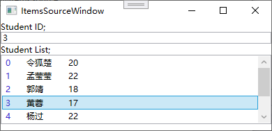

> [!Note]
>
> 在使 ⽤ 集合类型作为列表控件的 ItemsSource 时 ⼀ 般会考虑 **使 ⽤ `ObservableCollection<T>` 代替 `List<T>`**，因为 `ObservableCollection<T>` 类实现了 INotifyCollectionChanged 和 INotifyPropertyChanged 接 ⼝，能把集合的变化 ⽴ 刻通知显 ⽰ 它的列表控件，改变会 ⽴ 刻显现出来。

### 使 ⽤ADO.NET 对象作为 Binding 的源

使 ⽤ADO.NET 类对数据库进 ⾏ 操作。常 ⻅ 的 ⼯ 作是从数据库中把数据读取到 DataTable 中，再把 DataTable 显 ⽰
在 UI 列表控件 ⾥（如成绩单、博客 ⽂ 章列表、论坛帖 ⼦ 列表等）。尽管在流 ⾏ 的软件架构中并不把 DataTable 的数据直接显 ⽰ 在 UI 列表控件 ⾥⽽ 是先通过 LINQ 等 ⼿ 段把 DataTable⾥ 的数据转换成恰当的 ⽤ 户 ⾃ 定义类型集合，但 WPF 也 ⽀ 持在列表控件与 DataTable 之间直接建 ⽴Binding。

**ListBox 展示 DataTable；**

- 假设有一些数据

  ```c#
  /// <summary>
  /// 模拟从数据库获取数据
  /// </summary>
  /// <returns></returns>
  DataTable LoadData()
  {
  
      DataTable dataTable = new DataTable();
  
      // 定义表的列：
      dataTable.Columns.Add("ID", typeof(int));
      dataTable.Columns.Add("Name", typeof(string));
      dataTable.Columns.Add("Age", typeof(int));
      // 添加行到DataTable中：
      dataTable.Rows.Add(0, "John", 25);
      dataTable.Rows.Add(1, "Amy", 30);
      dataTable.Rows.Add(2, "Tom", 28);
      dataTable.Rows.Add(2, "Any", 18);
      dataTable.Rows.Add(2, "Mak", 38);
  
      return dataTable;
  }
  ```

- 显 ⽰ 在 ⼀ 个 ListBox⾥

  ```xaml
  <Window x:Class="DataBinding.ADOWindow"
          xmlns="http://schemas.microsoft.com/winfx/2006/xaml/presentation"
          xmlns:x="http://schemas.microsoft.com/winfx/2006/xaml"
          xmlns:d="http://schemas.microsoft.com/expression/blend/2008"
          xmlns:mc="http://schemas.openxmlformats.org/markup-compatibility/2006"
          xmlns:local="clr-namespace:DataBinding"
          mc:Ignorable="d"
          Title="ADOWindow" Height="450" Width="800">
      <StackPanel>
          <ListBox x:Name="ListBox" Height="130" Margin="5" />
          <Button Content="Load" Click="Button_Click"/>
      </StackPanel>
  </Window>
  
  ```

- Button 的 Click 事件处理器

  ````c#
     private void Button_Click(object sender, RoutedEventArgs e)
     {
         DataTable dataTable = LoadData();
         
         this.ListBox.DisplayMemberPath = "Name";
         // public DataView DefaultView { get; } 获取可能包括筛选视图或游标位置的表的自定义视图
         this.ListBox.ItemsSource = dataTable.DefaultView;
     }
  ````

- 运行

  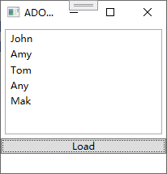

 `this.ListBox.ItemsSource = dataTable.DefaultView;` DataTable 的 DefaultView 属性是 ⼀ 个 DataView 类型的对象，DataView 类 **实现了 IEnumerable 接 ⼝**，所以可以被赋值给 ListBox.ItemsSource 属性。

**ListView 展示 DataTable（常用）；**

改动 XAML 部分的代码如下

```xaml
<Window x:Class="DataBinding.ADOWindow"
        xmlns="http://schemas.microsoft.com/winfx/2006/xaml/presentation"
        xmlns:x="http://schemas.microsoft.com/winfx/2006/xaml"
        xmlns:d="http://schemas.microsoft.com/expression/blend/2008"
        xmlns:mc="http://schemas.openxmlformats.org/markup-compatibility/2006"
        xmlns:local="clr-namespace:DataBinding"
        mc:Ignorable="d"
        Title="ADOWindow" Height="450" Width="800">
    <StackPanel>
        <ListView x:Name="ListBox" Height="130" Margin="5">
            <ListView.View>
                <GridView>
                    <GridViewColumn Header="Id" 
                                    Width="60" 
                                    DisplayMemberBinding="{Binding Id}"/>
                    <GridViewColumn 
                                    Header="Name" 
                                    Width="80" 
                                    DisplayMemberBinding="{Binding Name}"/>
                    <GridViewColumn 
                                    Header="Age" 
                                    Width="60" 
                                    DisplayMemberBinding="{Binding Age}"/>
                </GridView>
            </ListView.View>
        </ListView>
        <Button Content="Load" Click="Button_Click"/>
    </StackPanel>
</Window>
```


从字 ⾯ 上理解 ListView 和 GridView 应该是同 ⼀ 级别的控件，实际上远 ⾮ 这样！ListView 是 **ListBox 的派 ⽣ 类** ⽽GridView 是 **ViewBase 的派 ⽣ 类**，ListView 的 View 属性是 ⼀ 个 **ViewBase 类型的对象**，所以，GridView 可以作为 ListView 的 View 来使 ⽤⽽ 不能当作独 ⽴ 的控件来使 ⽤。这 ⾥ 使 ⽤ 的理念是组合模式，即 ListView“有 ⼀ 个”View，⾄ 于这个 View 是 GridView 还是其他什么类型的 View 则由程序员 ⾃ 由选择——⽬ 前只有 ⼀ 个 GridView 可 ⽤

其次，GirdView 的内容属性是 Columns，这个属性是 GridViewColumnCollection（列集合）类型对象。因为 XAML⽀ 持对内容属性的简写，所以省略了 `<GridView.Columns>…</GridView.Columns>` 这层标签，直接在 `<GridView>` 的内容部分定义了三个 GridViewColumn 对象。GridViewColumn 对象最重要的 ⼀ 个属性是 DisplayMemberBinding（类型为 BindingBase），使 ⽤ 这个属性可以指定这 ⼀ 列使 ⽤ 什么样的 Binding 去关联数据

这与 ListBox 有点不同，ListBox 使 ⽤ 的是 DisplayMemberPath 属性（类型为 string）。如果想 ⽤ 更复杂的结构来表 ⽰ 这 ⼀ 列的标题（Header）或数据，则可为 GridViewColumn **设置 HeaderTemplate 和 CellTemplate 属性**，它们的类型都是 DataTemplate。

Buttom click 事件处理

```c#
private void Button_Click(object sender, RoutedEventArgs e)
{
    DataTable dataTable = LoadData();
    this.ListView.ItemsSource = dataTable.DefaultView;
}
```


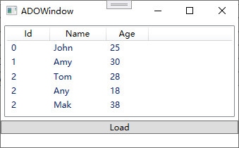

**DataTable 能直接作为 ItemsSource 使用吗？;**

通过上 ⾯ 的例 ⼦ 我们已经知道 DataTable 对象的 DefaultView 属性可以作为 ItemsSource 使 ⽤，但是不能直接使用 DataTable 会得到 ⼀ 个编译错误

```c#
private void Button_Click(object sender, RoutedEventArgs e)
{
    DataTable dataTable = LoadData();

    this.ListView.ItemsSource = dataTable; 
    // 错误	CS0266	无法将类型“System.Data.DataTable”隐式转换为“System.Collections.IEnumerable”。存在一个显式转换(是否缺少强制转换?)
}
```


显然，DataTable **不能直接拿来为 ItemsSource 赋值**。不过，当你把 DataTable 对象放在 ⼀ 个对象的 DataContext 属性 ⾥，并把 ItemsSource 与 ⼀ 个 **既没有指定 Source⼜ 没有指定 Path 的 Binding** 关联起来时，Binding 却能 ⾃ 动找到它的 DefaultView 并当作 ⾃⼰ 的 Source 来使 ⽤：

```c#
private void Button_Click(object sender, RoutedEventArgs e)
{
    DataTable dataTable = LoadData();
    this.ListView.DataContext = dataTable;
    this.ListView.SetBinding(ListView.ItemsSourceProperty,new Binding());
}
```

所以，在代码中发现把 DataTable⽽ 不是 DefaultView 作为 DataContext 的值，并且为 ItemsSource 设置 ⼀ 个既 ⽆Path⼜⽆Source 的 Binding 时，千万别感觉迷惑。

### 使 ⽤XML 数据作为 Binding 的源

当使 ⽤XML 数据作为 Binding 的 Source 时我们将使 ⽤ **XPath 属性** ⽽ 不是 Path 属性来指定数据的来源。

以下会用到 XPath 表达式

**案例；**

把以下数据显示到 ListView 控件 ⾥

```xaml
<?xml version="1.0" encoding="utf-8" ?>
<StudentList>
  <Student id="1">
    <Name>郭靖</Name>
  </Student>
  <Student id="2">
    <Name>黄蓉</Name>
  </Student>
  <Student id="3">
    <Name>杨过</Name>
  </Student>
  <Student id="4">
    <Name>小龙女</Name>
  </Student>
</StudentList>
```

- UI 代码

  ```xaml
  <Window x:Class="DataBinding.XAMLWindow"
          xmlns="http://schemas.microsoft.com/winfx/2006/xaml/presentation"
          xmlns:x="http://schemas.microsoft.com/winfx/2006/xaml"
          xmlns:d="http://schemas.microsoft.com/expression/blend/2008"
          xmlns:mc="http://schemas.openxmlformats.org/markup-compatibility/2006"
          xmlns:local="clr-namespace:DataBinding"
          mc:Ignorable="d"
          Title="XAMLWindow" Height="450" Width="800">
      <StackPanel>
          <ListView x:Name="ListViewStudents" Height="130">
              <ListView.View>
                  <GridView>
                      <GridViewColumn 
                                      Header="Id" 
                                      Width="80" 
                                      DisplayMemberBinding="{Binding XPath=@Id}"/>
                      <GridViewColumn 
                                      Header="Name" 
                                      Width="120" 
                                      DisplayMemberBinding="{Binding XPath=Name}"/>
                  </GridView>
              </ListView.View>
          </ListView>
          <Button Content="Load" Click="Button_Click"/>
      </StackPanel>
  </Window>
  ```
  
- Button 的 Click 事件处理器

  ```c#
  private void Button_Click(object sender, RoutedEventArgs e)
  {
      XmlDocument doc = new XmlDocument();
      doc.Load(@"E:\CsharpCode\wpf-code\WPF的学习\DataBinding\RawData.xml");
  
      // 允许以声明方式访问数据绑定的 XML 数据。
      XmlDataProvider xDataProvider = new XmlDataProvider();
      // 获取或设置要用作绑定源的 XmlDocument。
      xDataProvider.Document = doc;
      // 获取或设置用于生成数据集合的 XPath表达式查询。这样我们要把Student生成集合
      xDataProvider.XPath = @"/StudentList/Student";
  
      this.ListViewStudents.DataContext = xDataProvider;
      this.ListViewStudents.SetBinding(ListView.ItemsSourceProperty, new Binding());
  }
  ```

  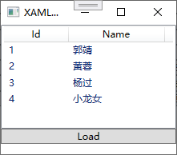

XmlDataProvider 的 Source 的属性可以直接指定 XML⽂ 档所在的位置（⽆ 论 XML⽂ 档存储在本地硬盘还是 ⽹ 络上）

Click 事件处理器也可以写成这样；

```c#
private void Button_Click(object sender, RoutedEventArgs e)
{
    // 允许以声明方式访问数据绑定的 XML 数据。
    XmlDataProvider xDataProvider = new XmlDataProvider();
    xDataProvider.Source = new Uri(@"E:\CsharpCode\wpf-code\WPF的学习\DataBinding\RawData.xml");

    // 获取或设置用于生成数据集合的 XPath 查询。这样我们要把Student生成集合
    xDataProvider.XPath = @"/StudentList/Student";

    this.ListViewStudents.DataContext = xDataProvider;
    this.ListViewStudents.SetBinding(ListView.ItemsSourceProperty, new Binding());
}
```

**案例二；**

使 ⽤TreeView 控件来显 ⽰ 拥有若 ⼲ 层 ⽬ 录的 ⽂ 件系统，这次是把 XML 数据和 XmlDataProvider 对象直接写在 XAML 代码 ⾥。代码中 ⽤ 到了 HierarchicalDataTemplate 类，这个类具有名为 ItemsSource 的属性，可 ⻅ 由这种 Template 展 ⽰ 的数据是可以拥有 ⼦ 级集合的。

```xaml
<Window x:Class="DataBinding.XAMLWindow"
        xmlns="http://schemas.microsoft.com/winfx/2006/xaml/presentation"
        xmlns:x="http://schemas.microsoft.com/winfx/2006/xaml"
        xmlns:d="http://schemas.microsoft.com/expression/blend/2008"
        xmlns:mc="http://schemas.openxmlformats.org/markup-compatibility/2006"
        xmlns:local="clr-namespace:DataBinding"
        mc:Ignorable="d"
        Title="XAMLWindow" Height="450" Width="800">
    <Window.Resources>
        <XmlDataProvider x:Key="xdp" XPath="FileSystem/Folder">
            <x:XData>
                <!-- xmlns="" 不要忘记  -->
                <FileSystem xmlns="">
                    <Folder Name="Books">
                        <Folder Name="软件">
                            <Folder Name="Window">
                                <Folder Name="WPF"/>
                                <Folder Name="MFC"/>
                                <Folder Name="c++"/>
                            </Folder>
                        </Folder>
                        <Folder Name="工具">
                            <Folder Name="VSCode"/>
                            <Folder Name="IDEA"/>
                            <Folder Name="Playex"/>
                        </Folder>
                    </Folder>
                </FileSystem>
            </x:XData>
        </XmlDataProvider>
    </Window.Resources>
    <StackPanel>
        <TreeView ItemsSource="{Binding Source={StaticResource xdp}}">
            <TreeView.ItemTemplate>
                <HierarchicalDataTemplate ItemsSource="{Binding XPath=Folder}">
                    <TextBlock Text="{Binding XPath=@Name}"/>
                </HierarchicalDataTemplate>
            </TreeView.ItemTemplate>
        </TreeView>
    </StackPanel>
</Window>
```


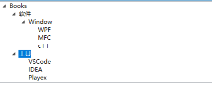

如果把 XmlDataProvider 直接写在 XAML 代码 ⾥，XML 数据需要放在 `<x:XData>…</x:XData>` 标签 ⾥

### 使 ⽤LINQ 检索结果作为 Binding 的源

> [C# 中的语言集成查询 (LINQ) | Microsoft Learn](https://learn.microsoft.com/zh-cn/dotnet/csharp/linq/)

⾃3.0 版开始，.NET Framework 开始 ⽀ 持 LINQ（Language-Integrated Query，语 ⾔ 集成查询），使 ⽤LINQ，我们可以 ⽅ 便地操作集合对象、DataTable 对象和 XML 对象 ⽽ 不必动辄就把好 ⼏ 层 foreach 循环嵌套在 ⼀ 起却只是为了完成 ⼀ 个很简单的任务。

LINQ 查询的结果是 ⼀ 个 IEnumerable <T> 类型对象，⽽IEnumerable <T> ⼜ 派 ⽣⾃IEnumerable，所以它可以作为列表控件的 ItemsSource 来使 ⽤

使用之前 Student1 类

ui 代码

```xaml
<Window x:Class="DataBinding.LINQWindow"
        xmlns="http://schemas.microsoft.com/winfx/2006/xaml/presentation"
        xmlns:x="http://schemas.microsoft.com/winfx/2006/xaml"
        xmlns:d="http://schemas.microsoft.com/expression/blend/2008"
        xmlns:mc="http://schemas.openxmlformats.org/markup-compatibility/2006"
        xmlns:local="clr-namespace:DataBinding"
        mc:Ignorable="d"
        Title="LINQWindow" Height="450" Width="800">
    <StackPanel>
        <ListView x:Name="ListViewStudent" Height="143">
            <ListView.View>
                <GridView>
                    <GridViewColumn 
                                    Header="Id" 
                                    Width="60" 
                                    DisplayMemberBinding="{Binding Id}"/>
                    <GridViewColumn 
                                    Header="Name" 
                                    Width="100" 
                                    DisplayMemberBinding="{Binding Name}"/>
                    <GridViewColumn 
                                    Header="Age" 
                                    Width="80" 
                                    DisplayMemberBinding="{Binding Age}"/>
                </GridView>
            </ListView.View>
        </ListView>
        <Button Content="Load" Click="Button_Click"/>
    </StackPanel>
</Window>
```

**数据在集合；**

从 ⼀ 个已经填充好的 `List<Student>` 对象中检索出所有名字以字 ⺟T 开头的学 ⽣

```c#
private void Button_Click(object sender, RoutedEventArgs e)
{
    List<Student1> student1s = new List<Student1>()
    {
        new Student1(){Id = 0,Name = "Join",Age = 33},
        new Student1(){Id = 1,Name = "Tim",Age = 22},
        new Student1{Id = 2,Name = "Zoom",Age = 3},
        new Student1(){Id = 3,Name = "Tom",Age = 21},
        new Student1(){Id = 4,Name = "Mike",Age = 11},
        new Student1(){Id = 5,Name = "Vni",Age = 12}

    };
    this.ListViewStudent.ItemsSource = from stu in student1s where stu.Name.StartsWith("T") select stu;
}
```

**DataTable 对象 ⾥；**

如果数据存放在 ⼀ 个已经填充好的 DataTable 对象 ⾥，则代码是这样：

```c#
private void Button_Click(object sender, RoutedEventArgs e)
{
    DataTable dataTable = LoadData();
    this.ListViewStudent.ItemsSource =
        from row in dataTable.Rows.Cast<DataRow>()
        where Convert.ToString(row["Name"]).StartsWith("T")
        select new Student1()
    {
        Id = int.Parse(row["Id"].ToString()),
        Name = row["Name"].ToString(),
        Age = int.Parse(row["Age"].ToString())
    };

}

/// <summary>
/// 模拟从数据库获取数据
/// </summary>
/// <returns></returns>
DataTable LoadData()
{

    DataTable dataTable = new DataTable();

    // 定义表的列：
    dataTable.Columns.Add("ID", typeof(int));
    dataTable.Columns.Add("Name", typeof(string));
    dataTable.Columns.Add("Age", typeof(int));
    // 添加行到DataTable中：
    dataTable.Rows.Add(0, "John", 25);
    dataTable.Rows.Add(1, "Amy", 30);
    dataTable.Rows.Add(3, "Tom", 28);
    dataTable.Rows.Add(4, "Any", 18);
    dataTable.Rows.Add(5, "Mak", 38);

    return dataTable;
}
```

**数据存储在 XML⽂ 件 ⾥;**

```xml
<?xml version="1.0" encoding="utf-8" ?>
<StudentList>
    <Calss>
        <Student Id="0" Name="Join" Age="33" />
        <Student Id ="1" Name = "Tim" Age = "22"/>
        <Student Id ="2" Name = "Zoom" Age = "3"/>
    </Calss>
    <Calss>
        <Student Id="3" Name = "Tom" Age = "21" />
        <Student Id ="4" Name = "Mike" Age = "11" />
        <Student Id ="5" Name = "Vni" Age = "12"/>
    </Calss>
</StudentList>
```


注意 xdoc.Descendants("Student")这个 ⽅ 法，它可以跨越 XML 的层级

```c#
private void Button_Click(object sender, RoutedEventArgs e)
{
	XDocument xDocument = XDocument.Load(@"E:\CsharpCode\wpf-code\WPF的学习\DataBinding\RawData2.xml");
	this.ListViewStudent.ItemsSource =
		from element in xDocument.Descendants("Student")
		where element.Attribute("Name").Value.StartsWith("T")
		select new Student1()
		{
			Id = int.Parse(element.Attribute("Id").Value),
			Name = element.Attribute( "Name").Value,
			Age = int.Parse(element.Attribute("Age").Value)
		};
}
```

程序的运 ⾏ 效果如图

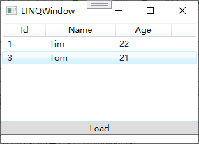

### 使 ⽤ObjectDataProvider 对象作为 Binding 的资源

当 ⼀ 个类的部分数据不是使 ⽤ 属性暴露出来，而是通过 **⽅ 法的返回值暴露**。这时候就需要使 ⽤ObjectDataProvider
来 **包装作为 Binding 源的数据对象了**。

> ObjectDataProvider 使用反射来实现对被封装对象的属性和方法的访问。

ObjectDataProvider，顾名思义就是把对象作为数据源提供给 Binding。前 ⾯ 还提到过 XmlDataProvider，也就是把 XML 数据作为数据源提供给 Binding。这两个类的 ⽗ 类都是 DataSourceProvider 抽象类。ObjectDataProvider 是将一个对象封装为数据源，使得可以在 WPF 应用程序中对其属性和方法进行数据绑定和操作的工具。

有 ⼀ 个名为 Calculator 的类，它具有计算加、减、乘、除的 ⽅ 法：

````c#
using System;
using System.Collections.Generic;
using System.Linq;
using System.Text;
using System.Threading.Tasks;

namespace DataBinding
{
    internal class Calculator
    {
        /// <summary>
        /// 加法
        /// </summary>
        /// <param name="ang1"></param>
        /// <param name="ang2"></param>
        /// <returns></returns>
        public string Add(string ang1,string ang2)
        {
            double x = 0;
            double y = 0;
            double z = 0;

            /*
             * public static bool TryParse( string s,out double result)
             参数
                - s 包含要转换的数字的字符串。
                - result 当此方法返回时，如果转换成功，则包含与 s 参数等效的双精度浮点数；如果转换失败，则包含零。 
                    如果 s 参数为 null 或 String.Empty、不是有效格式的数字，或者表示的数字小于 MinValue 或大于 MaxValue，则转换失败。 
                    此参数未经初始化即进行传递；最初在 result 中提供的任何值都会被覆盖。 
             */
            if (double.TryParse(ang1,out x) && double.TryParse(ang2,out y))
            {
                z = x + y;
                return z.ToString();
            }
            return "Input Error";
        }
        // 其它方法...
    }
}
````


**如何创建 ObjectDataProvider；**

```xaml
<Window x:Class="DataBinding.ObjectDataProviderWindow"
        xmlns="http://schemas.microsoft.com/winfx/2006/xaml/presentation"
        xmlns:x="http://schemas.microsoft.com/winfx/2006/xaml"
        xmlns:d="http://schemas.microsoft.com/expression/blend/2008"
        xmlns:mc="http://schemas.openxmlformats.org/markup-compatibility/2006"
        xmlns:local="clr-namespace:DataBinding"
        mc:Ignorable="d"
        Title="ObjectDataProviderWindow" Height="450" Width="800">
    <StackPanel>
        <Button Click="Button_Click" Content="创建ObjectDataProvider"/>
    </StackPanel>
</Window>
```

```c#
private void Button_Click(object sender, RoutedEventArgs e)
{
    ObjectDataProvider objectDataProvider = new ObjectDataProvider();
    objectDataProvider.ObjectInstance = new Calculator();
    objectDataProvider.MethodName = "Add"; // 指定要调用的方法
    objectDataProvider.MethodParameters.Add("100"); // 添加参数
    objectDataProvider.MethodParameters.Add("200");
    MessageBox.Show(objectDataProvider.Data.ToString());
}
```


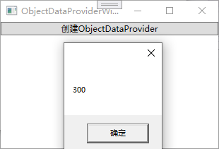


**Binding 的 Source 来使 ⽤；**

实现的功能是在上 ⾯ 两个 TextBox 输 ⼊ 数字后，第 3 个 TextBox 能实时地显 ⽰ 数字的和

```xaml
<Window x:Class="DataBinding.ObjectDataProviderWindow"
        xmlns="http://schemas.microsoft.com/winfx/2006/xaml/presentation"
        xmlns:x="http://schemas.microsoft.com/winfx/2006/xaml"
        xmlns:d="http://schemas.microsoft.com/expression/blend/2008"
        xmlns:mc="http://schemas.openxmlformats.org/markup-compatibility/2006"
        xmlns:local="clr-namespace:DataBinding"
        mc:Ignorable="d"
        Title="ObjectDataProviderWindow" Height="450" Width="800">
    <StackPanel>
        <TextBox x:Name="TextBoxAng2" Margin="5"/>
        <TextBox x:Name="TextBoxAng1" Margin="5"/>
        <TextBox x:Name="TextBoxResult" Margin="5"/>
    </StackPanel>
</Window>
```

SetBinding 的 ⽅ 法处理

```c#
using System;
using System.Collections.Generic;
using System.Linq;
using System.Text;
using System.Threading.Tasks;
using System.Windows;
using System.Windows.Controls;
using System.Windows.Data;
using System.Windows.Documents;
using System.Windows.Input;
using System.Windows.Media;
using System.Windows.Media.Imaging;
using System.Windows.Shapes;

namespace DataBinding
{
    /// <summary>
    /// ObjectDataProviderWindow.xaml 的交互逻辑
    /// </summary>
    public partial class ObjectDataProviderWindow : Window
    {
        public ObjectDataProviderWindow()
        {
            InitializeComponent();
            SetBinding();
        }
        private void SetBinding()
        {
            // 创建并配置ObjectDataProvider对象
            ObjectDataProvider odp = new ObjectDataProvider();
            odp.ObjectInstance = new Calculator();
            odp.MethodName = "Add";
            odp.MethodParameters.Add("0");
            odp.MethodParameters.Add("0");
            // 创建配置Binding
            Binding bindingToAng1 = new Binding("MethodParameters[0]")
            {
                /*
                 BindsDirectlyToSource = true
                 把从UI元素收集到的数据写⼊其直接Source（即ObjectDataProvider对象）
                 ⽽不是被ObjectDataProvider对象包装着的Calculator对象。
                 */
                Source = odp,
                BindsDirectlyToSource = true, 
                UpdateSourceTrigger = UpdateSourceTrigger.PropertyChanged
            };

            Binding bindingToAng2 = new Binding("MethodParameters[1]")
            {
                Source = odp,
                BindsDirectlyToSource = true,
                UpdateSourceTrigger = UpdateSourceTrigger.PropertyChanged
            };

            Binding bindingToResult = new Binding(".") { Source = odp};

            this.TextBoxAng1.SetBinding(TextBox.TextProperty, bindingToAng1);
            this.TextBoxAng2.SetBinding(TextBox.TextProperty, bindingToAng2);
            this.TextBoxResult.SetBinding(TextBox.TextProperty, bindingToResult);
        }
    }
}
```

执行结果


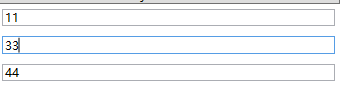

- 除了 `odp.ObjectInstance` 还可以通过被包装对象类型和希望调 ⽤ 的构造器创建包装对象。

```c#
obp.ObjectType = typeof(YouClass)
obp.ConstructorParameters.Add(argl);
obp.ConstructorParameters.Add(arg2);    
```

> 因为在 XAML⾥ 创建和使 ⽤ 对象 ⽐ 较 ⿇ 烦、可读性差，所以 ⼀ 般会在 XAML 代码中使 ⽤ 这种指定类型和构造器的办法。

- `bindingToAng1` 它的 Source 是 ObjectDataProvider 对象、Path 是 ObjectDataProvider 对象 MethodParameters 属性所引 ⽤ 的 **集合** 中的第 ⼀ 个元素。`BindsDirectlyToSource = true` 把从 UI 元素收集到的数据写 ⼊ 其直接 Source（即 ObjectDataProvider 对象）⽽ 不是被 ObjectDataProvider 对象包装着的 Calculator 对象。

- `bindingToResult` 但使 ⽤“`.`”作为 Path——前 ⾯ 说过，当数据源本 ⾝ 就代表数据的时候就使 ⽤“`.`”作 Path，并且“`.`”在 XAML 代码 ⾥ 可以省略不写。

  > [!Note]
  > 在把 ObjectDataProvider 对象当作 Binding 的 Source 来使 ⽤ 时，这个对象本 ⾝ 就代表
  > 了数据，所以这 ⾥ 的 Path 使 ⽤ 的是“.”⽽⾮ 其 Data 属性。

⼀ 般情况下，数据从哪 ⾥ 来哪 ⾥ 就是 Binding 的 Source、数据到哪 ⾥ 去哪 ⾥ 就应该是 Binding 的 Target。按这个理论，前两个 TextBox 应该是 ObjectDataProvider 对象的数据源，⽽ObjectDataProvider 对象 ⼜ 是最后 ⼀ 个 TextBox 的数据源。但实际上，三个 TextBox 都以 ObjectDataProvider 对象为数据源，只是前两个 TextBox 在 Binding 的数据流向上做了限制。这样做的原因不外乎有两个：

1. ObjectDataProvider 的 MethodParameters 不 是 依 赖 属性，不能作为 Binding 的 ⽬ 标。
2. 数据驱动 UI 的理念要求尽可能地使 ⽤ 数据对象作为 Binding 的 Source⽽ 把 UI 元素当作 Binding 的 Target。

### 使 ⽤Binding 的 RelativeSource（相对资源）

有些时候我们不能确定作为 Source 的对象叫什么名字，但知道它与作为 Binding⽬ 标的对象在 **UI 布局上有相对关系**，⽐ 如控件 ⾃⼰ **关联 ⾃⼰ 的某个数据、关联 ⾃⼰ 某级容器的数据**。这时候我们就要使 ⽤Binding 的 RelativeSource 属性。

#### 关联某容器数据

RelativeSource 属性的数据类型为 RelativeSource 类

下 ⾯ 这段 XAML 代码表 ⽰ 的是多层布局控件内放置着 ⼀ 个 TextBox：

```xaml
<Window x:Class="DataBinding.RelativeSourceWindow"
        xmlns="http://schemas.microsoft.com/winfx/2006/xaml/presentation"
        xmlns:x="http://schemas.microsoft.com/winfx/2006/xaml"
        xmlns:d="http://schemas.microsoft.com/expression/blend/2008"
        xmlns:mc="http://schemas.openxmlformats.org/markup-compatibility/2006"
        xmlns:local="clr-namespace:DataBinding"
        mc:Ignorable="d"
        Title="RelativeSourceWindow" Height="450" Width="800">
    <Grid x:Name="G1" Background="AliceBlue" Margin="10">
        <DockPanel x:Name="D1" Background="AntiqueWhite" Margin="10">
            <Grid x:Name="G2" Background="Violet" Margin="10">
                <DockPanel x:Name="D2" Background="Pink" Margin="10">
                    <TextBlock x:Name="TextBox1" FontSize="24" Margin="10"/>
                </DockPanel>
            </Grid>
        </DockPanel>
    </Grid>
</Window>
```

层级关系

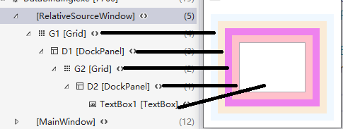

我们把 TextBox 的 Text 属性关联到外层容器的 Name 属性上

```c#
using System;
using System.Collections.Generic;
using System.Linq;
using System.Text;
using System.Threading.Tasks;
using System.Windows;
using System.Windows.Controls;
using System.Windows.Data;
using System.Windows.Documents;
using System.Windows.Input;
using System.Windows.Media;
using System.Windows.Media.Imaging;
using System.Windows.Shapes;

namespace DataBinding
{
    /// <summary>
    /// RelativeSource.xaml 的交互逻辑
    /// </summary>
    public partial class RelativeSourceWindow : Window
    {
        public RelativeSourceWindow()
        {
            InitializeComponent();
            // 通过查找上级模式创建RelativeSource对象
            RelativeSource relativeSource = new RelativeSource(RelativeSourceMode.FindAncestor);
            relativeSource.AncestorLevel = 1; //Binding控件起始层级偏移量
            relativeSource.AncestorType = typeof(Grid); //寻找的上级节点类型

            Binding binding = new Binding("Name") { RelativeSource = relativeSource };
            this.TextBox1.SetBinding(TextBox.TextProperty,binding);
        }
    }
}

```

对应 xaml 代码

```xaml
<TextBox x:Name="TextBox1"
         Text="{
               Binding RelativeSource={RelativeSource FindAncestor
               ,AncestorLevel=1
               ,AncestorType={x:Type Grid}}
               ,Path=Name
               }"
```


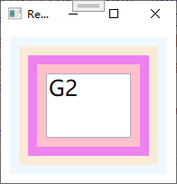

**属性；**

- AncestorLevel 指的是以 Binding⽬ 标控件为 **起点** 的层级偏移量——d2 的偏移量是 1、g2 的偏移量为 2，依次类推

- AncestorType 告诉 Binding 寻找哪个类型的对象作为 ⾃⼰ 的源，不是这个类型的对象会被跳过

#### 关联到自身

TextBox 需要关联 ⾃⾝ 的 Name 属性，

```c#
public partial class RelativeSourceWindow : Window
{
    public RelativeSourceWindow()
    {
        InitializeComponent();

        RelativeSource relativeSource = new RelativeSource();
        relativeSource.Mode = RelativeSourceMode.Self;

        Binding binding = new Binding("Name") { RelativeSource = relativeSource };
        this.TextBox1.SetBinding(TextBox.TextProperty, binding);
    }
}
```


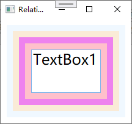

**Mode 属性；**

获取或设置一个 RelativeSourceMode 枚举类型值，Mode 属性该值描述 **绑定源相对于绑定目标的位置**。RelativeSourceMode 枚举类型

| 值              | 说明                                                         |
| --------------- | ------------------------------------------------------------ |
| FindAncestor    | 引用数据绑定元素父链中的上级。 您可以使用它 **绑定到特定类型或其子类的上级**。 |
| PreviousData    | 允许您绑定所显示数据项列表中以前的数据项（不是包含数据项的控件）。 |
| Self            | 引用您对其设置绑定的元素，并允许您将该元素的一个属性绑定到 **同一元素** 中的其他属性。 |
| TemplatedParent | 引用应用了模板（其中有数据绑定元素）的元素。 这类似于设置 TemplateBindingExtension，并仅当  Binding  在模板中时适用。 |

RelativeSource 类还有 3 个静态属性：PreviousData、Self 和 TemplatedParent，他们的类型是
RelativeSource 类。实际上这 3 个静态属性就是创建 ⼀ 个 RelativeSource 实例、把实例的 Mode 属性设置为相应的值，然后返回这个实例。之所以准备这 3 个静态属性是为了在 XAML 代码 ⾥ 直接获取 RelativeSource 实例


## Binding 对数据的转换与校验

Binding 的作 ⽤ 就是架在 Source 与 Target 之间的桥梁，数据可以在这座桥梁的帮助下来流通。就像现实世界中的
桥梁会设置 ⼀ 些关卡进 ⾏ 安检 ⼀ 样，Binding 这座桥上也可以设置关卡对数据的有效性进 ⾏ 检验，不仅如此，当 Binding 两端要求使 ⽤ 不同的数据类型时，我们还可以为数据设置转换器。

- Binding⽤ 于数据有效性校验的关卡是它的 ValidationRules 属性，
- ⽤ 于数据类型转换的关卡是它的 Converter 属性

### Binding 的数据校验

- Binding 的 ValidationRules 属性类型是 `Collection<ValidationRule>，`

- 每个 Binding 设置多个数据校验条件

- 每个条件是 ⼀ 个 ValidationRule 类型对象。ValidationRule 类是个抽象类,

  我们需要创建它的派 ⽣ 类并实现它的 Validate⽅ 法，Validate⽅ 法的 **返回值是 ValidationResult 类型对象**，

  如果校验通过，就把 ValidationResult 对象的 IsValid 属性设为 true，反之，需要把 IsValid 属性设为 false 并为其 ErrorContent 属性设置 ⼀ 个合适的消息内容（⼀ 般是个字符串）。

在 UI 上绘制 ⼀ 个 TextBox 和 ⼀ 个 Slider，以 Slider 为 源 TextBox 为 ⽬ 标进行 Binding。Slider 的取值范围是 0 到 100，我们需要校验 TextBox⾥ 输 ⼊ 的值是不是在 0 到 100 这个范围内也就是目标到源的数据

```xaml
<Window x:Class="DataBinding.ValidationRuleWindow"
        xmlns="http://schemas.microsoft.com/winfx/2006/xaml/presentation"
        xmlns:x="http://schemas.microsoft.com/winfx/2006/xaml"
        xmlns:d="http://schemas.microsoft.com/expression/blend/2008"
        xmlns:mc="http://schemas.openxmlformats.org/markup-compatibility/2006"
        xmlns:local="clr-namespace:DataBinding"
        mc:Ignorable="d"
        Title="ValidationRuleWindow" Height="450" Width="800">
    <StackPanel>
        <TextBox x:Name="TxtBox1" Margin="5"/>
        <Slider x:Name="Slider1" Minimum="0" Maximum="100"/>
    </StackPanel>
</Window>
```

准备 ⼀ 个 ValidationRule 的派 ⽣ 类，实现我们的校验规则

```c#
public class RangeValidationRule : ValidationRule
{
    // 实现Validate方法
    public override ValidationResult Validate(object value, CultureInfo cultureInfo)
    {
        double d = 0;
        if(double.TryParse(value.ToString(),out d))
        {
            if(d >= 0 && d <= 100)
            {
                /**
                   * public ValidationResult(bool isValid, object errorContent);
                   * 参数；
                   *  - bool isValid 校验是否成功
                   *  - object errorContent 校验错误时消息
                   */
                return new ValidationResult(true,null);
            }
        }

        return new ValidationResult(false, "Validation Failed");
    }
}
```

建立 Binding

```c#
public partial class ValidationRuleWindow : Window
{
    public ValidationRuleWindow()
    {
        InitializeComponent();

        Binding binding = new Binding("Value") {Source = this.Slider1 };
        binding.UpdateSourceTrigger = UpdateSourceTrigger.PropertyChanged;
        // 设置数据校验规则
        RangeValidationRule rangeValidationRule = new RangeValidationRule();
        binding.ValidationRules.Add(rangeValidationRule);


        this.TxtBox1.SetBinding(TextBox.TextProperty,binding);

    }
}
```

当输 ⼊0 到 100 之间的值时程序正常显 ⽰，但输 ⼊ 这个区间之外的值或不能被解析的值时 TextBox 会显 ⽰ 红 ⾊ 边框，表
⽰ 值是错误的，**不能把它传递给 Source**

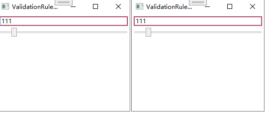

**更改默认检验行为；**

Binding 进 ⾏ 校验时的默认 ⾏ 为是认为来 ⾃Source 的数据总是正确的，**只有来 ⾃Target 的数据需要检验**，因为 Target 多为 UI 控件，所以等价于 ⽤ 户输 ⼊ 的数据，有可能有问题，为了不让有问题的数据污染 Source。

Binding 只在 Target **被外部 ⽅ 法更新** 时校验数据，⽽ **来 ⾃Binding 的 Source 数据** 更新 Target 时是不会进 ⾏ 校验的。

如果想改变这种 ⾏ 为，或者说 **当来 ⾃Source 的数据也有可能出问题时**，我们就需要将校验条件（ValidationRule 类）的 ValidatesOnTargetUpdated 属性设为 true。

先把 slider1 的取值范围由 0 到 100 改成-10 到 110

```xaml
<Slider x:Name="Slider1" Minimum="-10" Maximum="110"/>
```

然后把设置 Binding 的代码改为：

```c#
public partial class ValidationRuleWindow : Window
{
    public ValidationRuleWindow()
    {
        InitializeComponent();

        Binding binding = new Binding("Value") {Source = this.Slider1 };
        binding.UpdateSourceTrigger = UpdateSourceTrigger.PropertyChanged;
        // 设置数据校验规则
        RangeValidationRule rangeValidationRule = new RangeValidationRule();
        // 获取或设置一个值，该值指示当 Binding  的目标更新时是否运行验证规则
        rangeValidationRule.ValidatesOnTargetUpdated = true;
        binding.ValidationRules.Add(rangeValidationRule);


        this.TxtBox1.SetBinding(TextBox.TextProperty,binding);

    }
}
```

这样，当 Slider 的滑块移出有效范围时 TextBox 也会显 ⽰ 校验失败，这样我们就同时对源和目标之间的双向数据都做检验了。

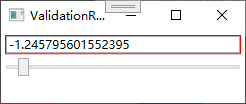

**显示检验错误信息；**

当校验错误的时候 Validate⽅ 法返回的，ValidationResult 对象携带着 ⼀ 条错误消息，如何显 ⽰ 这条消息呢？

想要做到这 ⼀ 点，需要 ⽤ 到路由事件（Routed Event）。

Binding 对象的 `NotifyOnValidationError` 属性设为 true，

这样当数据 **校验失败** 的时候 Binding 会像报警器 ⼀ 样 **发出 ⼀ 个信号**，这个信号会以 Binding 对象的 Target 为起点在 UI 元素树上传播。信号每到达 ⼀ 个结点，如果这个结点上设置有对这种信号的侦听器（事件处理器），那么这个侦听器就会被触发 ⽤ 以处理这个信号。信号处理完后，程序员还可以选择是让信号继续向下传播还是就此终 ⽌——这就是路由事件，信号在 UI 元素树上的传递过程就称为路由（Route）。

```c#
public partial class ValidationRuleWindow : Window
{
    public ValidationRuleWindow()
    {
        InitializeComponent();

        Binding binding = new Binding("Value") {Source = this.Slider1 };
        binding.UpdateSourceTrigger = UpdateSourceTrigger.PropertyChanged;
        // 设置数据校验规则
        RangeValidationRule rangeValidationRule = new RangeValidationRule();
        // 获取或设置一个值，该值指示当 Binding  的目标更新时是否运行验证规则
        rangeValidationRule.ValidatesOnTargetUpdated = true;
        binding.ValidationRules.Add(rangeValidationRule);
        // 发送检验失败路由事件
        binding.NotifyOnValidationError = true;
        // 添加指定路由事件类型处理程序
        this.TxtBox1.AddHandler(Validation.ErrorEvent, new RoutedEventHandler(ValidationError));

        this.TxtBox1.SetBinding(TextBox.TextProperty,binding);

    }
    /// <summary>
    /// 数据检验失败处理
    /// </summary>
    /// <param name="sendr"></param>
    /// <param name="e"></param>
    void ValidationError(object sendr,RoutedEventArgs e)
    {
        // 获取指定元素的 Errors 附加属性的值。返回一个ReadOnlyObservableCollection<ValidationError>泛型集合
        if (Validation.GetErrors(this.TxtBox1).Count > 0)
        {
            this.TxtBox1.ToolTip = Validation.GetErrors(this.TxtBox1)[0].ErrorContent.ToString();
        }
    }
}
```

程序运 ⾏ 时如果校验失败，TextBox 的 ToolTip 就会提 ⽰⽤ 户

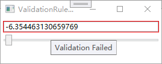

### Binding 的数据转换

在上面案例中，Slider 的 Value 属性是 double 类型值、TextBox 的 Text 属性是 string 类型值，在 C#这种强类型（strong-typed）语 ⾔ 中却可以往来 ⾃ 如，这是怎么回事呢？

Binding 还有另外 ⼀ 种机制称为数据转换（DataConvert），当 Source 端 Path 所关联的数据与 Target 端 ⽬ 标属性数据
类型不 ⼀ 致时，我们可以添加数据转换器（DataConverter）。上 ⾯ 提到的问题实际上是 double 类型与 string 类型互相转换的问题，因为处理起来 ⽐ 较简单，所以 WPF 类库就 ⾃ 动替我们做了但有些类型之间的转换就不是 WPF 能替我们做的了，例如下 ⾯ 这些情况：

- Source⾥ 的数据是 Y、N 和 X 三个值（可能是 char 类型、string 类型或 ⾃ 定义枚举类型），UI 上对应的是 CheckBox 控件，需要把这三个值映射为它的 IsChecked 属性值（bool?类型）。
- 当 TextBox⾥ 已经输 ⼊ 了 ⽂ 字时 ⽤ 于登录的 Button 才会出现，这是 string 类型与 Visibility 枚举类型或 bool 类型之间的转换（Binding 的 Mode 将是 OneWay）
- Source⾥ 的数据可能是 Male 或 Female（string 或枚举），UI 上对应的是 ⽤ 于显 ⽰ 头像的 Image 控件，这时候需要把 Source⾥ 的值转换成对应的头像图 ⽚URI（亦是 OneWay）。

我们只能 ⾃⼰ 动 ⼿ 写 Converter，⽅ 法是创建 ⼀ 个类并让这个类实现 IValueConverter 接 ⼝。IValueConverter 接 ⼝ 定义如下：

```c#
public interface IValueConverter
{
    // Source流向Target时调用 (数据源到目标转换)
    object Convert(object value, Type targetType, object parameter, CultureInfo culture);
    // Target流向Source时调用 （目标到数据源转换）
    object ConvertBack(object value, Type targetType, object parameter, CultureInfo culture);
}
```

当数据从 Binding 的 Source 流向 Target 时，Convert⽅ 法将被调 ⽤；反之，ConvertBack⽅ 法将被调 ⽤。

这两个 ⽅ 法的参数列表 ⼀ 模 ⼀ 样：

- 第 ⼀ 个参数为 object，最 ⼤ 限度地保证了 Converter 的重 ⽤ 性（可以在 ⽅ 法体内对实际类型进 ⾏ 判断）
- 第 ⼆ 个参数 ⽤ 于确定 ⽅ 法的返回类型（个 ⼈ 认为形参名字叫 outputType⽐targetType 要好，可以避免与 Binding 的 Target 混淆）
- 第三个参数 ⽤ 于把额外的信息传 ⼊⽅ 法，若需要传递多个信息则可把信息放 ⼊⼀ 个集合对象来传 ⼊⽅ 法。

Binding 对象的 Mode 属性会影响到这两个 ⽅ 法的调 ⽤。

- 如果 Mode 为 TwoWay 或 Default⾏ 为与 TwoWay⼀ 致则两个 ⽅ 法都有可能被调 ⽤
- 如果 Mode 为 OneWay 或 Default⾏ 为与 OneWay⼀ 致则只有 Convert⽅ 法会被调 ⽤；其他情况同理。

例 ⼦ 是 ⼀ 个 Converter 的综合实例，程序的 ⽤ 途是在列表 ⾥ 向玩家显 ⽰⼀ 些军 ⽤⻜ 机的状态。

创建 ⼏ 个 ⾃ 定义数据类型：

```c#
namespace DataBinding
{
    /// <summary>
    /// 飞机种类
    /// </summary>
    public enum Category
    {
        /// <summary>
        /// 轰炸机
        /// </summary>
        Bomber,
        /// <summary>
        /// 战斗机
        /// </summary>
        Fighter
    }
    /// <summary>
    /// 飞机状态
    /// </summary>
    public enum State
    {   
        /// <summary>
        /// 可用
        /// </summary>
        Available,
        /// <summary>
        /// 禁用
        /// </summary>
        Locked,
        /// <summary>
        /// 未知
        /// </summary>
        Unknown
    }

    internal class Plane
    {
        public string Name { get; set; }
        public Category Category { get; set; }
        public State State { get; set; }
    }
}
```


在 UI⾥Plane 的 Category 属性被映射为轰炸机或战 ⽃ 机的图标

> 不要忘记把图片生成属性设置为资源否则找不到图标会出现

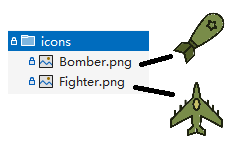

Plane 的 State 属性在 UI⾥ 被映射为 CheckBox。

因为存在以上两个映射关系，我们需要提供两个 Converter：

- ⼀ 个是由 Category 类型单向转换为 string 类型（XAML 编译器能够把 string 对象解析为图 ⽚ 资源）

  ```c#
  internal class CategoryToSourceConverter : IValueConverter
  {
  
      // category 转换为Uri
      public object Convert(object value, Type targetType, object parameter, CultureInfo culture)
      {
          Category c = (Category) value;
          switch (c)
          {
              case Category.Bomber:
                  // XAML编译器能够把string对象解析为图⽚资源
                  return @"\icons\Bomber.png";
              case Category.Fighter:
                  return @"\icons\Fighter.png";
              default:
                  return null;
          }
  
      }
      //不会执行
      // 因为是单向绑定只会调用数据源到目标转换
      public object ConvertBack(object value, Type targetType, object parameter, CultureInfo culture)
      {
          throw new NotImplementedException();
      }
  }
  ```

  

- 另 ⼀ 个是在 State 与 bool?类型之间双向转换。

  ```c#
  internal class StateToNullableBoolConverter : IValueConverter
  {
      // State转换为Bool
      public object Convert(object value, Type targetType, object parameter, CultureInfo culture)
      {
          State s = (State)value;
          switch (s)
          {
              case State.Available:
                  return true;
              case State.Locked:
                  return false;
              case State.Unknown:
              default:
                  return null;
  
          }
  
      }
  
      // Bool转换为State
      public object ConvertBack(object value, Type targetType, object parameter, CultureInfo culture)
      {
          bool? v = (bool?)value;
          switch (v)
          {
              case true:
                  return State.Available;
              case false: 
                  return State.Locked;
              case null:
              default:
                  return State.Unknown;
          }
  
      }
  }
  ```

在布局中使用

- 使用资源形式实例两个 Converter 对象。
- 用 ListBox 显示飞机列表和两个按钮负责加载数据和保存数据。

```xaml
<Window x:Class="DataBinding.ValidationRuleWindow"
        xmlns="http://schemas.microsoft.com/winfx/2006/xaml/presentation"
        xmlns:x="http://schemas.microsoft.com/winfx/2006/xaml"
        xmlns:d="http://schemas.microsoft.com/expression/blend/2008"
        xmlns:mc="http://schemas.openxmlformats.org/markup-compatibility/2006"
        xmlns:local="clr-namespace:DataBinding"
        mc:Ignorable="d"
        Title="ValidationRuleWindow" Height="450" Width="800">
    <Window.Resources>
        <local:CategoryToSourceConverter x:Key="ctsc"/>
        <local:StateToNullableBoolConverter x:Key="stnbc"/>
    </Window.Resources>
	<StackPanel>
     	<ListBox x:Name="ListBoxPlane" Height="100"></ListBox>
    	 <Button x:Name="BtnLoad" Click="BtnLoad_Click" Content="Load"/>
     	<Button x:Name="BtnSave" Click="BtnSave_Click" Content="Save"/>
 	</StackPanel>
</Window>    
```

给 ListBox 设置数据显示的 ItemTemplate 的 DataTemplate 

我们需要显示飞机图标、名称和状态

图标显示和状态显示分别都设置上我们自定义的转换器

```xaml
<ListBox x:Name="ListBoxPlane" Height="100">
    <ListBox.ItemTemplate>
        <DataTemplate>
            <StackPanel Orientation="Horizontal">
                <Image Width="20" Height="20"
                       Source="{Binding Path=Category, Converter={StaticResource ctsc}}"/>
                <TextBlock Text="{Binding Name}" Width="20" Margin="80,0"/>
                <CheckBox IsThreeState="True" 
                          IsChecked="{Binding Path=State,Converter={StaticResource stnbc}}"/>
            </StackPanel>
        </DataTemplate>
    </ListBox.ItemTemplate>
</ListBox>
```


Load 按钮的 Click 事件处理器负责把 ⼀ 组 ⻜ 机的数据赋值给 ListBox 的 ItemsSource 属性，Save 按钮的 Click 事件处理器负责把 ⽤ 户更改过的数据写 ⼊⽂ 件

```c#
private void BtnLoad_Click(object sender, RoutedEventArgs e)
{
    List<Plane> planeList = new List<Plane>()
    {
        new Plane(){Category = Category.Bomber,Name = "B-J",State = State.Unknown},
        new Plane() { Category = Category.Fighter, Name = "B-2", State = State.Unknown },
        new Plane() { Category = Category.Bomber, Name = "F-22", State = State.Unknown },
        new Plane() { Category = Category.Bomber, Name = "B-33", State = State.Unknown },
        new Plane() { Category = Category.Fighter, Name = "F-18", State = State.Unknown },
        new Plane() { Category = Category.Bomber, Name = "J-10", State = State.Unknown }
    };
    this.ListBoxPlane.ItemsSource = planeList;

}

private void BtnSave_Click(object sender, RoutedEventArgs e)
{
    StringBuilder stringBuilder = new StringBuilder();
    foreach( Plane p in ListBoxPlane.ItemsSource){
        stringBuilder.AppendLine($"Category={p.Category},Name={p.Name},State={p.State}");
    }
    File.WriteAllText(@"E:\CsharpCode\wpf-code\WPF的学习\DataBinding\PlaneList.txt",stringBuilder.ToString());
}
```

执行结果

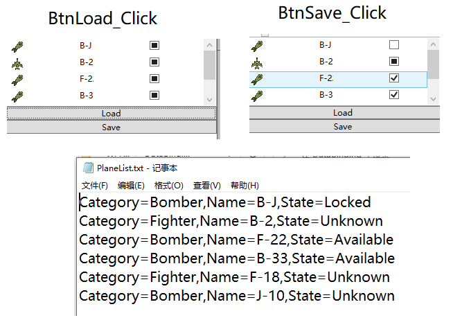


## MultiBinding（多路 Binding）

有的时候 UI 要需要显 ⽰ 的信息由不 ⽌⼀ 个数据来源决定，这时候就需要使 ⽤MultiBinding 类

同样 MultiBinding 也实现了 BindingBase 抽象类。也就是说，凡是能使 ⽤Binding 对象的场合都能使 ⽤MultiBinding。

MultiBinding 具有 ⼀ 个名为 **Bindings** 的属性，其类型是 `Collection<BindingBase>` ， 通过这个属性 MultiBinding 把 ⼀ 组 Binding 对象聚合起来， 处在这个集合中的 Binding 对象 **可以拥有 ⾃⼰ 的数据校验与转换机制**，它们汇集起来的数据将共同决定传往 MultiBinding⽬ 标的数据，

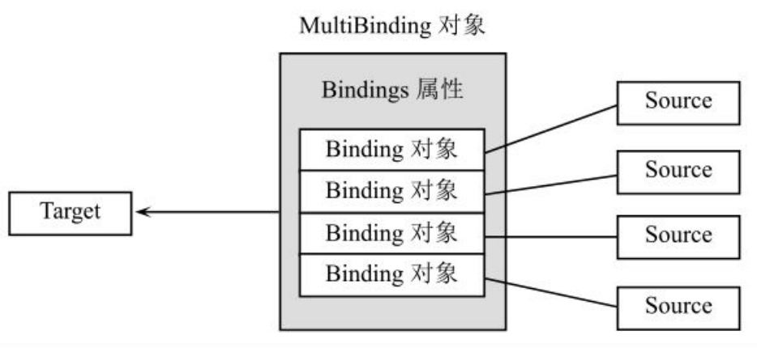

考虑这样 ⼀ 个需求，有 ⼀ 个 ⽤ 于新 ⽤ 户注册的 UI（包含 4 个 TextBox 和 ⼀ 个 Button），还有如下 ⼀ 些限定：

- 第 ⼀、⼆ 个 TextBox 输 ⼊⽤ 户名，要求内容 ⼀ 致。
- 第三、四个 TextBox 输 ⼊⽤ 户 E-Mail，要求内容 ⼀ 致。
- 当 TextBox 的内容全部符合要求的时候，Button 可 ⽤。

```xaml
<Window x:Class="DataBinding.MultiBindingWindow"
        xmlns="http://schemas.microsoft.com/winfx/2006/xaml/presentation"
        xmlns:x="http://schemas.microsoft.com/winfx/2006/xaml"
        xmlns:d="http://schemas.microsoft.com/expression/blend/2008"
        xmlns:mc="http://schemas.openxmlformats.org/markup-compatibility/2006"
        xmlns:local="clr-namespace:DataBinding"
        mc:Ignorable="d"
        Title="MultiBindingWindow" Height="450" Width="800">
    <StackPanel>
        <TextBox x:Name="TxtBoxName"/>
        <TextBox x:Name="TxtBoxConfName"/>
        <TextBox x:Name="TxtBoxEmail"/>
        <TextBox x:Name="TxtBoxConfEmail"/>
        <Button  x:Name="BtnSubmit" Content="Login" />
    </StackPanel>
</Window>
```

准备一个数据转器它实现 `IMultiValueConverter` 接 ⼝。负责将校验通过的 TextBox（string 类型转换为 bool）给 button 使用

```c#
internal class LoginMulitConverter : IMultiValueConverter
{
    public object Convert(object[] values, Type targetType, object parameter, CultureInfo culture)
    {
        /*
           Cast<TResult> 方法将 IEnumerable 的元素强制转换为指定的类型。   
           返回；
               一个 IEnumerable<T>，包含强制转换为指定类型的源序列的每个元素。

             Any()方法支持LINQ表达式
          */
        if (!values.Cast<string>().Any(text => string.IsNullOrEmpty(text))
            && values[0].ToString() == values[1].ToString()
            && values[2].ToString() == values[3].ToString()
           )
        {
            return true;
        }
        return false;


        throw new NotImplementedException();
    }
    // 单向绑定所以此方法不被调用
    public object[] ConvertBack(object value, Type[] targetTypes, object parameter, CultureInfo culture)
    {
        throw new NotImplementedException();
    }
}
```


SetMultiBinding()负责逻辑处理,

```c#
public partial class MultiBindingWindow : Window
{
    public MultiBindingWindow()
    {
        InitializeComponent();

        SetMultiBinding();
    }

    private void SetMultiBinding()
    {
        var txtBoxName = new Binding("Text") {Source = this.TxtBoxName};
        var txtBoxConfName = new Binding("Text") {Source = this.TxtBoxConfName};
        var txtBoxEmail = new Binding("Text") { Source = this.TxtBoxEmail };
        var txtBoxConfEmail = new Binding("Text") { Source = this.TxtBoxConfEmail };

        MultiBinding multiBinding = new MultiBinding();
        multiBinding.Mode = BindingMode.OneWay;
        multiBinding.Bindings.Add(txtBoxName);
        multiBinding.Bindings.Add(txtBoxConfName);
        multiBinding.Bindings.Add(txtBoxEmail);
        multiBinding.Bindings.Add(txtBoxConfEmail);
        multiBinding.Converter = new LoginMulitConverter();

        this.BtnSubmit.SetBinding(Button.IsEnabledProperty,multiBinding);
    }
}
```

- MultiBinding 对于添加 ⼦ 级 Binding 的顺序是敏感的，因为这个顺序决定了汇集到 Converter⾥ 数据的顺序。

运行结果

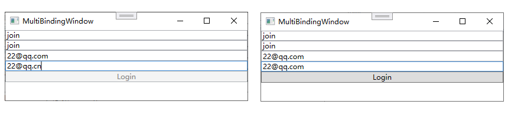


