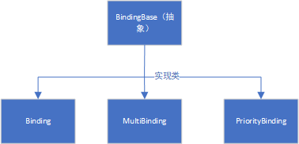
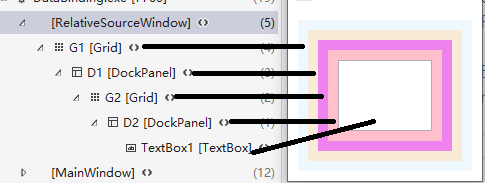
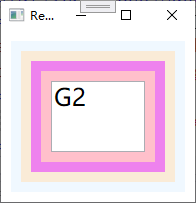
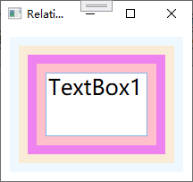
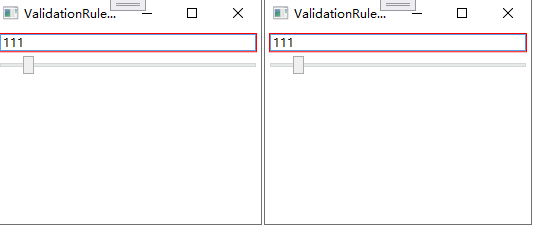
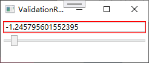
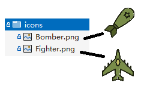
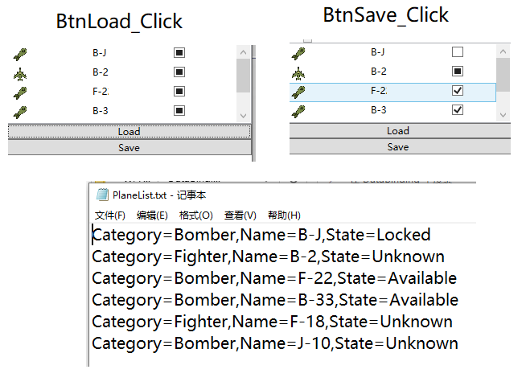
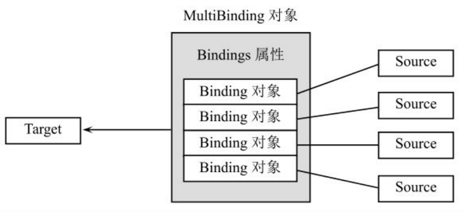
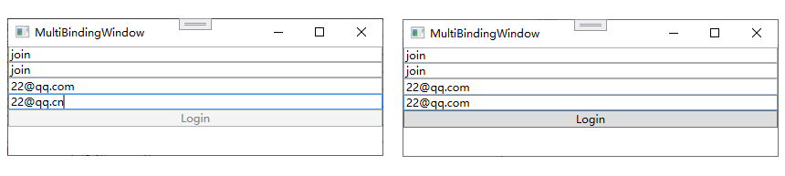

# 数据绑定

## 消息/事件驱动程序

 Windows GUI 运⾏的机理是使⽤消息（Message）来驱使程序向前运⾏，消息的主要来源是⽤户的操作，⽐如单击⿏标、按下按钮，都会产⽣消息，消息⼜会被Windows翻译并送达⽬标程序然后被程序所处理。正如此各种开发⽅法必须跟从这种“消息驱动程序”的基本原理。才有了Windows API开发的纯消息驱动、MFC等C++类库的消息驱动、和Visual Basic开始到.NET Framework的事件驱动，程序是被来⾃UI的事件（即封装过的消息）驱使向前的，简称“消息驱动”或“事件驱动”。因为消息和事件⼤都来⾃于UI，所以统称它们为“UI驱动程序”。

**问题；**

- 使⽤“UI驱动程序”开发程序则是“为了GUI⽽GUI”、单纯地为了实现程序的GUI化。实际上这已经背离了程序的本质——数据加算法，同时迫使程序员把很多**精⼒放在了实现UI的编程上**。

- 随着程序UI的⽇趋复杂，UI层⾯上的代码与⽤于处理数据的逻辑代码也渐渐纠缠在⼀起变得**难以维护**。为了避免这样的问题，程序员们总结出了Model-View-Controler（MVC）和Model-View-Presenter（MVP）等诸多设计模式来把UI相关的代码与数据逻辑相关的代码分开。

程序的本质是数据加算法，⽤户给进⼀个输⼊，经过算法的处理程序会反馈⼀个输出如CMD

而“UI驱动程序”数据处于被动地位，总是在等待程序接收来⾃UI的消息∕事件后被处理或者算法完成处理后
被显⽰。

如何在GUI编程时把数据的地位由被动变主动、让数据回归程序的核⼼呢？这就要用到DataBinding。

## Data Binding在WPF中的地位

### 三层结构的程序

数据存储层、数据处理层和数据展⽰层。

- 存储层；由数据库和⽂件系统构成

- 处理层；更正确的称呼应该是逻辑层，与业务逻辑相关、⽤于加⼯处理数据的算法都集中在这⾥，

- 展⽰层；功能是把加⼯后的数据通过可视的界⾯展⽰给⽤户或者通过其他种类的、接⼝展⽰给别的应⽤程序 

  （界⾯和接⼝两个词在英⽂中均为interface，所以本质上没有什么区别）

#### 算法在程序中的分布

程序的本质是数据加算法。数据会在存储、逻辑和展⽰三个层流通，所以站在数据的⾓度上来看，这三层都很重要。但算法在程序中的分布就不均匀了，对于⼀个三层结构的程序来说，算法⼀般分布在这⼏处：
  A．数据库内部。
  B．读取和写回数据。
  C．业务逻辑。
  D．数据展⽰。
  E．界⾯与逻辑的交互。

- A、B两个部分的算法⼀般都⾮常稳定，不会轻易去改动，复⽤性也很⾼；
- C处与客户需求关系最紧密、最复杂，变动也最⼤，⼤多数算法都集中在这⾥；
- D、E两层负责UI与逻辑的交互，也占有⼀定量的算法。显然，C部分是程序的核⼼、是开发的重中之重，所以我们应该把精⼒集中在C部分。然⽽，D、E两个部分却经常成为⿇烦的来源。⾸先，这两部分都与逻辑层紧密相关，⼀不⼩⼼就有可能把本来该放在逻辑层⾥的算法写进这两部分（所以才有了MVC、MVP等模式来避免这种情况出现）；
- 其次，这两个部分以消息或事件的⽅式与逻辑层沟通，⼀旦出现同⼀个数据需要在多处展⽰∕修改时，⽤于同步的代码就会错综复杂；
- 最后，D和E本应是互逆的⼀对⼉，但却需要分开来写——显⽰数据写⼀个算法、修改数据⼜是⼀个算法。总之导致的结果就是D和E两个部分会占去⼀部分算法，搞不好还会牵扯不少精⼒。
- 问题的根源就在于逻辑层与展⽰层的地位不固定——当实现客户需求的时候，逻辑层的确处在中⼼地位，但到了实现UI交互的时候展⽰层⼜处于中⼼地位。WPF作为⼀种专门的展⽰层技术，华丽的外观和动画只是它的表层现象，更重要的是它在深层次上帮助程序员把思维的重⼼固定在了逻辑层、让展⽰层永远处于逻辑层的从属地位。WPF具有这种能⼒的关键是它引⼊了Data Binding概念以及与之配套的Dependency Property（依赖属性）系统和DataTemplate。

#### Windows Form迁移到WPF

Windows Form迁移到WPF之后，对于这个三层程序⽽⾔。

- 数据存储层由数据库和⽂件系统来构建。
- 数据传输和处理仍然使⽤.NET Framwork的ADO.NET等基本类（与Windows Form等开发⼀样）。
- 展⽰层则使⽤WPF类库来实现
- 展⽰层与逻辑层的沟通就使⽤Data Binding来实现。


Data Binding在WPF系统中起到的是数据⾼速公路的作⽤。有了这条⾼速公路，加⼯好的数据会⾃动送达⽤户界⾯加以显⽰，被⽤户修改过的数据也会⾃动传回逻辑层，⼀旦数据被加⼯好⼜会被送达⽤户界⾯……程序的逻辑层就像⼀个强有⼒的引擎不停运转，⽤加⼯好的数据驱动程序的⽤户界⾯以⽂字、图形、动画等形式把数据显⽰出来——这就是“数据驱动UI”。

引⼊Data Binding机制后，D、E两个部分会简化很多。⾸先，数据在逻辑层与⽤户界⾯之间“直来直去”、不涉及逻辑问题，这样⽤户界⾯部分⼏乎不包含算法

**好处；**

- 第⼀，如果把UI层看作是应⽤程序的“⽪”、把存储层和逻辑层看作是程序的“瓤”，那么我们可以很轻易地把⽪从瓤上撕下来并换⼀个新的；
- 第⼆，因为数据层能够独⽴运转、⾃成体系，所以我们可以进⾏更完善的单元测试⽽⽆需借助UI⾃动化测试⼯具——你完全可以把单元测试代码想象成⼀个“看不⻅的UI”，单元测试只是使⽤这个“UI”绕过真实的UI直接测
  试业务逻辑罢了。

## 基础

**更好理解Binding一词；**

> 个人理解绑定这个词语在这里并不恰当是一个音译词语不便理解，而binding是两个事务之间建立某种联系，感觉这里使用关联这个词语更为恰当。结合这个词义更容易理解。
>
> - 关联；事物相互之间发生牵连和影响：国民经济各部门是互相～互相依存的。这可是～着生命安全的大事。

Binding⼀词在汉语中究竟是什么意思呢？⼤概是出于⽅便，业界⼀直使⽤Binding⼀词的⾳译，即“绑定”。这绑定中的“绑”⼤概是取材于Bind这个词的“捆绑”之“绑”；“定”则更像是⼀个拼⾳——以⾳译⾳，没什么意义。

在英⽂中，动词Bind在转化为名词Binding后，除了原有的“捆绑”之意外⼜引申出了“关联”和“键联”的含义。⽐如 ， 原⼦键联 （ atomic binding ） 、 化学键联 （ chemicalbinding）、联结梁（binding-beam）Binding更注重表达它**是⼀种像桥梁⼀样的关联关系**。WPF中，正是在这段桥梁上我们有机会为往来流通的数据做很多事情。如果把Binding⽐作**数据的桥梁**，那么它的两端分别是Binding的**源** （ Source ） 和**⽬标** （ Target ） 。 

⼀般情况下，Binding**源是逻辑层的对象**，Binding**⽬标是UI层的控件对象**，这样，数据就会源源不断通过Binding送达UI层、被UI层展现，也就完成了数据驱动UI的过程

我们不但可以控制公路是在源与⽬标之间**双向通⾏还是某个⽅向的单⾏道**，还可以控制对**数据放⾏的时机**，甚⾄可以在桥上架设⼀些“关卡”⽤来**转换数据类型或者检验数据的正确性**。

BindingBase类关系



**示例；**

创建⼀个简单的数据源并通过Binding把它连接到UI元素上。

- 创建数据源

  1. 设置送达UI属性；

     前⾯说过，数据**源是⼀个对象**，⼀个对象⾝上可能有很多数据，这些数据⼜通过属性暴露给外界。那么，其中哪个数据是你想通过Binding送达UI元素的呢？换句话说，UI上的元素关⼼的是哪个属性值的变化呢？这个属性就称为Binding的路径（Path）。

  2. 通知Binding属性值已经变化；

     Binding是⼀种**⾃动机制**，当值变化后属性要有能⼒通知Binding，让Binding把变化传递给UI元素。怎样才能让⼀个属性具备这种通知Binding值已经变化的能⼒呢？⽅法是**在属性的set语句中激发⼀个PropertyChanged事件**。这个事件不需要我们⾃⼰声明，我们要做的是让作为数据源的类实现`System.ComponentModel`名称空间中的`INotifyPropertyChanged`接⼝。当为Binding**设置了数据源后，Binding就会⾃动侦听来⾃这个接⼝的PropertyChanged事件**。
  
  ```c#
  class Student:INotifyPropertyChanged
  {
      private string name;
  
      public event PropertyChangedEventHandler? PropertyChanged;
  
      public string Name
      {
          get { return name; }
          set {
              name = value;
              // 通知Binding属性值已经改变
              this.PropertyChanged?.Invoke(this,new PropertyChangedEventArgs("Name"));
          }
      }
  
  }
  ```
  
- 在窗体上准备⼀个TextBox和⼀个Button。TextBox将作 为 Binding ⽬标 ，我们还会在Button的Click事件发⽣ 时改变Student对象的Name属性值。

  ```xaml
  <Window x:Class="DataBinding.MainWindow"
          xmlns="http://schemas.microsoft.com/winfx/2006/xaml/presentation"
          xmlns:x="http://schemas.microsoft.com/winfx/2006/xaml"
          xmlns:d="http://schemas.microsoft.com/expression/blend/2008"
          xmlns:mc="http://schemas.openxmlformats.org/markup-compatibility/2006"
          xmlns:local="clr-namespace:DataBinding"
          mc:Ignorable="d"
          Title="MainWindow" Height="450" Width="800">
      <StackPanel>
          <TextBox x:Name="TextBox"/>
          <Button Click="Button_Click">Add Age</Button>
      </StackPanel>
  </Window>
  
  ```

  

- 使⽤Binding把数据源和UI元素连接起来

  1. 准备数据源
  2. 准备Binding
  3. Binding设置数据源
  4. 为Binding设置访问属性路径
  5. 使用Binding连接数据源与目标
  
  ```c#
  public partial class MainWindow : Window
  {
      Student student;
  
      public MainWindow()
      {
          InitializeComponent();
  
          // 准备数据源
          student = new Student();
  
          // 配置binding
          Binding binding = new Binding(); 
          // 设置数据源
          binding.Source = student;
          // 设置访问属性路径
          binding.Path = new PropertyPath("Name");
          // 连接数据源和目标
          /**
               * SetBinding()
               * 参数；
               *  target 绑定的绑定目标。
               *  dp 绑定的目标依赖项属性只读属性。
               *  binding 描述绑定的 BindingBase 对象。 
               */
          BindingOperations.SetBinding(TextBox,TextBox.TextProperty,binding);
  
      }
  
      private void Button_Click(object sender, RoutedEventArgs e)
      {
          // 改变student的Name属性值
          student.Name += "Name";
  
      }
  }
  ```
  
  当你单击Button时，TextBox就会即时显⽰更新后的Name属性值
  
  
  
- 实际⼯作中Binding的代码可能与上⾯看到的不太⼀样，原因是TextBox这类UI元素的基类**FrameworkElement对BindingOperations.SetBinding(…)⽅法进⾏了封装**，封装的结果也叫SetBinding，只是参数列表发⽣了变化

  ```c#
          // 摘要:
          //     基于已提供的绑定对象将一个绑定附加到此元素上。
          //
          // 参数:
          //   dp:
          //     标识应在其中建立绑定的属性。
          //
          //   binding:
          //     表示数据绑定的详细信息。
          //
          // 返回结果:
          //     记录绑定的条件。 此返回值可用于错误检查。 
  public BindingExpression SetBinding(DependencyProperty dp, string path);
  
  
  
  
  ```

  使用TextBox的SetBinding();

  ```c#
  //BindingOperations.SetBinding(TextBox,TextBox.TextProperty,binding);
  
   this.TextBox.SetBinding(TextBox.TextProperty, binding);
  ```

  


## 源与路径

**数据源要求；**

- 是⼀个对象
- 通过属性（Property）公开⾃⼰的数据。

**属性改变通知；**

如果想让作为Binding源的对象具有⾃动通知Binding⾃⼰的属性值已经变化的能⼒，那么就需要让类实现 INotifyPropertyChanged接⼝并在属性的set语句中激发PropertyChanged事件

### 把控件作为Binding源与Binding标记扩展

> 谁是绑定目标就设置Binding属性。

把⼀个TextBox的Text属性关联在了Slider的Value属性上。

```xaml
<Window x:Class="DataBinding.ControlBindingWindow"
        xmlns="http://schemas.microsoft.com/winfx/2006/xaml/presentation"
        xmlns:x="http://schemas.microsoft.com/winfx/2006/xaml"
        xmlns:d="http://schemas.microsoft.com/expression/blend/2008"
        xmlns:mc="http://schemas.openxmlformats.org/markup-compatibility/2006"
        xmlns:local="clr-namespace:DataBinding"
        mc:Ignorable="d"
        Title="ControlBindingWindow" Height="450" Width="800">
    <StackPanel>
        <TextBox x:Name="TextBox1" Text="{Binding Path=Value,ElementName=Slider1}" />
        <Slider x:Name="Slider1" Maximum="100" Minimum="0" Margin="5" Value="0"/>
    </StackPanel>
</Window>
```


可以在C#代码中建⽴Binding外在XAML代码⾥也可以⽅便地设置Binding，

> **注意;**
>
> 在C#代码中可以访问XAML代码中声明的变量**但XAML代码中却⽆法访问C#代码中声明的变量**，
> 因此，要想在XAML中建⽴UI元素与逻辑层对象的Binding还要颇费些周折，把逻辑层对象声明为XAML代码中的资源（Resource），

```xaml
<TextBox x:Name="TextBox1" Text="{Binding Path=Value,ElementName=Slider1}" />
```

等价C#

````c#
this.TextBox1.SetBinding(TextBox.TextProperty,new Binding("Value") { ElementName= "Slider1" });
````

因为Binding类的构造器本⾝可以接收Path作为参数，所以也常写为

```xaml
<TextBox x:Name="TextBox1" Text="{Binding Value,ElementName=Slider1}" />
```

> [!Note]
> 因为在C#代码中我们可以直接访问控件对象，所以⼀般也不会使⽤Binding的
> ElementName属性，⽽是直接把对象赋值给Binding的Source属性。

**理解Binding的标记扩展语法；**

Binding的标记扩展语法，初看起来平淡⽆奇甚⾄有些别扭，但细品起来就会发现它的精巧之处。说它“别扭”是因为我们已经习惯了Text="Hello World"这种“键−值”式的赋值⽅式，⽽且认为值与属性的数据类型⼀定要⼀致——⼤脑很快会质询`Text="{Binding Value,ElementName= slider1}"`的字⾯意思——Text的类型是string，为什么要赋⼀个Binding类型的值呢？其实，我们**并不是为Text属性“赋了⼀个Binding类型的值”**，为了消除这个误会，你可以把这句代码读作“为Text属性设置Binding为……”。再想深⼀步，在编程时我们不是经常把函数视为⼀个值吗？只是这个值需要在**函数执⾏结束后才能得到**。同理，我们也可以把{Binding}视为⼀个值，只是这个值并⾮像"Hello World"字符串⼀样直接和**固定**。也就是说，我们可以把Binding视为⼀种间接的、**不固定的赋值⽅式**——Binding标记扩展很恰当地表⽰了这个含义。

### 控制Binding的⽅向及数据更新

Binding在源与⽬标之间架起了沟通的桥梁，默认情况下数据既能够通过Binding送达⽬标，也能够从⽬标返回源（收集⽤户对数据的修改）。有时候数据只需要展⽰给⽤户、不允许⽤户修改，这时候可以把Binding模式更改为从源向⽬标的单向沟通。Binding还⽀持从⽬标向源的单向沟通以及只在Binding关系确⽴时读取⼀次数据，这需要我们根据实际情况去选择。

#### 控制方向

**Mode；**

Binding控制数据流方向是BindingMode枚举类型

| 值             | 说明               | 备注                                                         |
| -------------- | ------------------ | ------------------------------------------------------------ |
| Default        | 默认               | 根据⽬标的实际情况来确定，⽐如若是可编辑的（如<br/>TextBox.Text属性），Default就采⽤双向模式；若是只读的（如<br/>TextBlock.Text）则采⽤单向模式。 |
| OneTime        | 一次               | 单向传递数据仅生效一次 OneWay的简化                          |
| OneWay         | 单向（源到目标）   | 当绑定源（源）更改时，更新绑定目标（目标）属性               |
| OneWayToSource | 目标到原（反单向） | 当目标属性更改时更新源属性。                                 |
| TwoWay         | 双向               | 导致对源属性或目标属性的更改可自动更新对方。                 |

#### 控制数据更新时机

之前案例中，如果我们在TextBox⾥输⼊⼀个恰当的值，然后按⼀下Tab键、让焦点离开TextBox，则Slider的⼿柄
会跳到相应的值那⾥。为什么⼀定要在TextBox失去焦点之后Slider的值才会改变呢？这就引出了Binding的另⼀个属性——UpdateSourceTrigger，

**UpdateSourceTrigger**

确定绑定源更新的执行时间。是UpdateSourceTrigger 枚举

| 值              | 说明     | 备注                                                         |
| --------------- | -------- | ------------------------------------------------------------ |
| Default         | 默认     | 大多数依赖项属性的默认值都为 PropertyChanged，而 Text 属性的默认值为 LostFocus。 |
| Explicit        | 显示     | 仅在调用 UpdateSource 方法时更新绑定源。                     |
| LostFocus       | 失去焦点 | 当绑定目标元素失去焦点时，更新绑定源。                       |
| PropertyChanged | 属性更改 | 当绑定目标属性更改时，立即更新绑定源。                       |

对于TextBox默认值Default的⾏为与LostFocus⼀致，我们只需要把这个属性改为PropertyChanged，则Slider的⼿柄就会随着我们在TextBox⾥的输⼊⽽改变位置。

```xaml
<TextBox x:Name="TextBox1" Text="{Binding Value,ElementName=Slider1,UpdateSourceTrigger=PropertyChanged}" />
```


**其它属性；**

- NotifyOnSourceUpdated 获取或设置一个值，该值指示当值从绑定目标传输到绑定源时是否引发 SourceUpdated 事件。 
- NotifyOnTargetUpdated 获取或设置一个值，该值指示当值从绑定源传输到绑定目标时是否引发 TargetUpdated 事件。 

如果设为true，则当源或⽬标被更新后Binding会激发相应的SourceUpdated事件和TargetUpdated事件。实际⼯作中，我们可以通过监听这两个事件来找出有哪些数据或控件被更新了。

### Binding的路径（Path）

作为Binding源的对象可能有很多属性，通过这些属性Binding源可以把数据暴露给外界。那么，Binding到底需要关注哪个属性的值呢？这就需要由Binding的Path属性来指定了。例如前⾯这个例⼦，我们是把Slider控件对象当作源、把它的Value属性作为路径。

尽管在XAML代码中或者Binding类的构造器参数列表中我们以⼀个字符串来表⽰Path，但Path的实际**类型是PropertyPath。**

#### 使用绑定源属性作为路径

最简单方式创建PropertyPath;

直接把Binding关联在Binding源的属性上，前⾯的例⼦就是这样。语法如下：

````xaml
<TextBox x:Name="TextBox1" Text="{Binding Path=Value,ElementName=Slider1/>
````

等价C#

```c#
Binding bing = new Binding() { Path = new PropertyPath("Value"), Source = this.Slider1};
this.TextBox1.SetBinding(TextBox.TextProperty, bing);
```

或者使⽤Binding的构造器简写为；

```c#
Binding bing = new Binding("Value") {Source = this.Slider1};
this.TextBox1.SetBinding(TextBox.TextProperty, bing);
```

#### 多级路径

Binding还⽀持**多级路径**（通俗地讲就是⼀路“点”下去）。

⽐如，如果我们想让⼀个TextBox显⽰另外⼀个TextBox的⽂本⻓度，我们可这样写

````xaml
<StackPanel>
    <TextBox x:Name="TextBox1"/>
    <TextBox x:Name="TextBox2" Text="{Binding Text.Length,ElementName=TextBox1,Mode=OneWay}"/>
</StackPanel>
````

> [!Tip]
>
> `Text.Length`不要忘记属性中间的点


等价C#

```c#
this.TextBox2.SetBinding(TextBox.TextProperty, new Binding("Text.Length") { ElementName = "TextBox1", Mode = BindingMode.OneWay }) ;
```

#### 集合类型的索引器

集合类型的索引器（Indexer）⼜称为带参属性。既然是属性，索引器也能作为Path来使⽤。

⽐如我想让⼀个TextBox显⽰另⼀个TextBox⽂本的第四个字符，我们可以这样写：

```xaml
<StackPanel>
	<TextBox x:Name="TextBox3"/>
	<TextBox x:Name="TextBox4" Text="{Binding Text[3],ElementName=TextBox3,Mode=OneWay}"/>
</StackPanel>
```


等效的C#代码是

```c#
this.TextBox4.SetBinding(TextBox.TextProperty, new Binding("Text[3]") { Source = TextBox3,Mode = BindingMode.OneWay});
```

**默认元素当作Path使⽤；**

当使⽤⼀个集合或者DataView作为Binding源时，如果我们想把它的默认元素（一般是指第一个元素）当作Path使⽤，则需要使⽤这样的语法

```c#
List<String> stringList = new List<String>() { "Hello", "World", "!" };
this.TxtBox1.SetBinding(TextBox.TextProperty, new Binding("/") {Source = stringList,Mode = BindingMode.OneWay });
this.TxtBox2.SetBinding(TextBox.TextProperty, new Binding("/Length") {Source = stringList,Mode = BindingMode.OneWay });
this.TxtBox3.SetBinding(TextBox.TextProperty, new Binding("/[1]") {Source = stringList,Mode = BindingMode.OneWay });

```


`/` 代表这个默认元素对象

**多级斜线语法；**

集合元素的属性仍然还是⼀个集合，我们想把⼦级集合中的元素当作Path，则可以使⽤多级斜线的语法（即⼀路“斜线”下去）

数据类

```c#
/// <summary>
/// 省
/// </summary>

class Province
{
    public string Name
    {
        get;
        set;
    }
    public List<City> CityList
    {
        get;
        set;
    }
}

/// <summary>
/// 城市
/// </summary>
class City
{
    public string Name
    {
        get;
        set;
    }
    public List<Country> CountryList
    {
        get;
        set;
    }

}

/// <summary>
/// 区/县
/// </summary>

internal class Country
{
    public string Name
    {
        get;
        set;
    }
}
```

绑定

```c#
List<City> CityList = new List<City> { new City() { Name = "济南市" }};
List <Country> countryList = new List<Country> { new Country() {Name = "章丘区" } };
CityList[0].CountryList = countryList;
Province province = new Province();
province.Name = "山东省";
province.CityList = CityList;
List<Province> provincesList = new List<Province> { province };

this.TxtBox4.SetBinding(TextBox.TextProperty,new Binding("/Name") { Source = provincesList });
this.TxtBox5.SetBinding(TextBox.TextProperty,new Binding("/CityList/Name") { Source = provincesList });
this.TxtBox6.SetBinding(TextBox.TextProperty,new Binding("/CityList/CountryList/Name") { Source = provincesList });
            Console.WriteLine(this);
```

数据结构如图


可以读作

- `"/Name"` provincesList第一个元素的Name属性
- `"/CityList/Name"` provincesList第一个元素CityList属性的第一个元素Name属性
- `"/CityList/CountryList/Name"` provincesList第一个元素CityList属性的第一个元素CountryList属性的第一个元素的Name属性

### “没有Path”的Binding

有的时候我们会在代码中看到⼀些Path是⼀个“`.`”或者⼲脆没有Path的Binding，

这是⼀种⽐较特殊的情况——**Binding源本⾝就是数据且不需要Path来指明**。典型的，string、int等基本类型就是这样，他们的实例本⾝就是数据，我们⽆法指出通过它的哪个属性来访问这个数据，这时我们只需将Path的值设
置为“`.`”就可以了。**在XAML代码⾥这个“`.`”可以省略不写，但在C#代码⾥却不能省略**。

```xaml
<StackPanel>
    <StackPanel.Resources>
        <sys:String x:Key="myString">
            菩提本无树，明镜亦非台。
            本来无一物，何处惹尘埃。
        </sys:String>
    </StackPanel.Resources>

    <TextBlock Text="{Binding Path=.,Source={StaticResource ResourceKey=myString}}"/>

</StackPanel>
```

可以简写

````xaml
Text="{Binding .,Source={StaticResource ResourceKey=myString}}"
````

或者

```xaml
Text="{Binding Source={StaticResource ResourceKey=myString}}"
```


与之等效的C#代码如下（作为Path的“.”是不能省略的）

```c#
string myString="菩提本⽆树，明镜亦⾮台。本来⽆⼀物，何处惹尘埃。";
this.textBlock1.SetBinding(TextBlock.TextProperty, new Binding("."){Source=myString });
```

### 为Binding指定源（Source）的⼏种⽅法

Binding的源是数据的来源，所以，只要⼀个对象包含数据并能通过属性把数据暴露出来，它就能当作Binding的源来使⽤。包含数据的对象⽐⽐皆是，但必须为Binding的Source指定合适的对象Binding才能正确⼯作，

**常⻅的办法有：**

- 把普通CLR类型单个对象指定为Source：包括.NETFramework⾃带类型的对象和⽤户⾃定义类型的对象。如果类型实现了INotifyPropertyChanged接⼝，则可通过在属性的set语句⾥激发PropertyChanged事件来通知Binding数据已被更新。
- 把普通CLR集合类型对象指定为Source：包括数组、`List<T>、ObservableCollection<T>`等集合类型。实际⼯作中，我们经常需要把⼀个集合作为ItemsControl派⽣类的数据源来使⽤，⼀般是把控件的ItemsSource属性使⽤Binding关联到⼀个集合对象上。
- 把ADO.NET数据对象指定为Source：包括DataTable和DataView等对象。
- 使⽤XmlDataProvider把XML数据指定为Source：XML作为标准的数据存储和传输格式⼏乎⽆处不在，我们可以⽤它表⽰单个数据对象或者集合；⼀些WPF控件是级联式的（如TreeView和Menu），我们可以把树状结构的XML数据作为源指定给与之关联的Binding。
- 把依赖对象（Dependency Object）指定为Source：依赖对象不仅可以作为Binding的⽬标，同时也可以作为Binding的源。这样就有可能形成Binding链。依赖对象中的依赖属性可以作为Binding的Path。
- 把容器的DataContext指定为Source（WPF Data Binding的默认⾏为）：有时候我们会遇到这样的情况——我们明确知道将从哪个属性获取数据，但具体把哪个对象作为Binding源还不能确定。这时候，我们只能先建⽴⼀个Binding、只给它设置Path⽽不设置Source，让这个Binding⾃⼰去寻找Source。这时候，Binding会⾃动把控件的DataContext当作⾃⼰的Source（它会沿着控件树⼀层⼀层向外找，直到找到带有Path指定属性的对象⽌）。
- 通过ElementName指定Source：在C#代码⾥可以直接把对象作为Source赋值给Binding，但XAML⽆法访问对象，所以只能使⽤对象的Name属性来找到对象
- 通过Binding的RelativeSource属性相对地指定Source：当控件需要关注⾃⼰的、⾃⼰容器的或者⾃⼰内部元素的某个值就需要使⽤这种办法。 
- 把ObjectDataProvider对象指定为Source：当数据源的数据不是通过属性⽽是通过⽅法暴露给外界的时候，我们可以使⽤这两种对象来包装数据源再把它们指定为Source。
- 把使⽤LINQ检索得到的数据对象作为Binding的源下⾯我们就通过实例分述每种情况。

### 没有Source的Binding——使⽤DataContext作为Binding的源

DataContext属性被**定义在FrameworkElement类⾥，这个类是WPF控件的基类**，这意味着**所有WPF控件（包括容器控件）都具备这个属性**。如前所述，WPF的UI布局是树形结构，这棵树的每个结点都是控件，由此我们推出另⼀个结
论——**在UI元素树的每个结点都有DataContext。**

这⼀点⾮常重要，因为当⼀个Binding只知道⾃⼰的Path⽽不知道⾃⼰的Soruce时，它会沿着UI元素树⼀路向树的根部找过去，每路过⼀个结点就要看看这个结点的DataContext是否具有Path所指定的属性。如果有，那就把这个对象作为⾃⼰的Source；如果没有，那就继续找下去；如果到了**树的根部还没有找到，那这个Binding就没有Source**，因⽽也不会得到数据

**例⼦：**

- 创建⼀个名为Student的类，它具有Id、Name、Age三个属性：

  ```c#
  class Student1
  {
      public int Id { get; set; }
      public string Name { get; set; }
      public int Age { get; set; }
  }
  ```

- 在XAML创建程序的UI。

  ````xaml
  <Window x:Class="DataBinding.DataContextWindow"
          xmlns="http://schemas.microsoft.com/winfx/2006/xaml/presentation"
          xmlns:x="http://schemas.microsoft.com/winfx/2006/xaml"
          xmlns:d="http://schemas.microsoft.com/expression/blend/2008"
          xmlns:mc="http://schemas.openxmlformats.org/markup-compatibility/2006"
          xmlns:local="clr-namespace:DataBinding"
          mc:Ignorable="d"
          Title="DataContextWindow" Height="450" Width="800">
      <StackPanel>
          <StackPanel.DataContext>
              <local:Student1 Id="2" Age="20" Name="Tim"/>
          </StackPanel.DataContext>
          <Grid>
              <StackPanel>
                  <TextBox Text="{Binding Path=Id}"/>
                  <TextBox Text="{Binding Path=Name}"/>
                  <TextBox Text="{Binding Path=Age}"/>
              </StackPanel>
          </Grid>
      </StackPanel>
  </Window>
  ````

​		UI布局如图

​		


````xaml
<StackPanel.DataContext>
    <local:Student1 Id="2" Age="20" Name="Tim"/>
</StackPanel.DataContext>
````

就为外层StackPanel的DataContext进⾏了赋值——它是⼀个Studen1t对象。三个TextBox的Text通过Binding获取值，但只为Binding指定了Path、没有指定Source。简写成这样也可以

```xaml
<TextBox Text="{Binding Id}"/>
<TextBox Text="{Binding Name}"/>
<TextBox Text="{Binding Age}"/>
```

这样，这3个TextBox的Binding就会⾃动向UI元素树的上层去寻找可⽤的DataContext对象。最终，它们在最外层的StackPanel⾝上找到了可⽤的DataContext对象


**没有Path⼜没有Source；**

当某个DataContext是⼀个简单类型对象的时候，我们完全可能看到⼀个“既没有Path⼜没有Source的”Binding：

````xaml
<Window x:Class="DataBinding.DataContextWindow"
        xmlns="http://schemas.microsoft.com/winfx/2006/xaml/presentation"
        xmlns:x="http://schemas.microsoft.com/winfx/2006/xaml"
        xmlns:d="http://schemas.microsoft.com/expression/blend/2008"
        xmlns:mc="http://schemas.openxmlformats.org/markup-compatibility/2006"
        xmlns:local="clr-namespace:DataBinding" 
        xmlns:sys="clr-namespace:System;assembly=mscorlib"
        mc:Ignorable="d"
        Title="DataContextWindow" Height="450" Width="800">
    <StackPanel>
        <StackPanel.DataContext>
            <sys:String>Hello DataContent</sys:String>
        </StackPanel.DataContext>
        <Grid>
            <StackPanel>
                <TextBlock Text="{Binding}"/>
                <TextBlock Text="{Binding}"/>
                <TextBlock Text="{Binding}"/>
            </StackPanel>
        </Grid>
    </StackPanel>
</Window>
````


**并不智能的Binding；**

其实，“Binding并**没有沿着UI元素树向上找**”只是WPF给我们的⼀个错觉，之所以会有这种效果是因为DataContext是⼀个“依赖属性”，依赖属性有⼀个很重要的特点就是当你没有为控件的某个依赖属性显式赋值时，控件会把⾃⼰容器的属性值“借过来”当作⾃⼰的属性值。实际上是属性值沿着UI元素树向下传递了。

举个例⼦；

程序的UI部分是若⼲层Grid，最内层Grid⾥放置了⼀个Button，我们为最外层的Grid设置了DataContext属性值，
因为内层的Grid和Button都没有设置DataContext属性值所以最外层Grid的DataContext属性值会⼀直传递到Button那⾥，单击Button就会显⽰这个值

```xaml
<Grid DataContext="6">
    <Grid>
        <Grid>
            <Button x:Name="Btn" Click="Button_Click">ok</Button>
        </Grid>
    </Grid>
</Grid>
```

处理Buttom的Click事件

```c#
private void Button_Click(object sender, RoutedEventArgs e)
{
    MessageBox.Show(Btn.DataContext.ToString());
}
```


**际⼯作中DataContext的⽤法;**

1. 当UI上的多个控件都使⽤Binding关注同⼀个对象时，不妨使⽤DataContext。
2. 当作为Source的对象不能被直接访问的时候——⽐如B窗体内的控件想把A窗体内的控件当作⾃⼰的Binding源时，但A窗体内的控件是private访问级别，这时候就可以把这个控件（或者控件的值）作为窗体A的DataContext（这个属性是public访问级别的）从⽽暴露数据。形象地说，这时候外层容器的DataContext就相当于⼀个数据
   的“制⾼点”，只要把数据放上去，别的元素就都能看⻅。另外，DataContext本⾝也是⼀个依赖属性，我们可以使⽤Binding把它关联到⼀个数据源上。

### 使⽤集合对象作为列表控件的ItemsSource

WPF中的列表式控件们派⽣⾃ItemsControl类，⾃然也就**继承了ItemsSource这个属性**。ItemsSource属性可以接收⼀个**IEnumerable接⼝派⽣类的实例**作为⾃⼰的值（所有**可被迭代遍历的集合都实现了这个接⼝**，包括数组、`List<T>`等）。

每个ItemsControl的派⽣类都具有⾃⼰**对应的条⽬容器**（ItemContainer），例如，ListBox的条⽬容器ListBoxItem、ComboBox的条⽬容器是ComboBoxItem。

ItemsSource⾥存放的是⼀条⼀条的数据，要想把数据显⽰出来需要为它们穿上“外⾐”，**条⽬容器就起到数据外⾐的作⽤**外衣控制数据条目展示形式比如仅包含文本内容（实际是用的TextBox）当然也可以自定义。怎样让每件数据外⾐与它对应的数据条⽬关联起来呢？当然是依靠Binding！只要我们为⼀个ItemsControl对象设置了ItemsSource属性值，ItemsControl对象就会**⾃动迭代其中的数据元素**、为每个数据元素准备⼀个条⽬容器，并使⽤Binding在**条⽬容器与数据元素之间建⽴起关联**。

**例⼦：**

```xaml
<Window x:Class="DataBinding.ItemsSourceWindow"
        xmlns="http://schemas.microsoft.com/winfx/2006/xaml/presentation"
        xmlns:x="http://schemas.microsoft.com/winfx/2006/xaml"
        xmlns:d="http://schemas.microsoft.com/expression/blend/2008"
        xmlns:mc="http://schemas.openxmlformats.org/markup-compatibility/2006"
        xmlns:local="clr-namespace:DataBinding"
        mc:Ignorable="d"
        Title="ItemsSourceWindow" Height="450" Width="800">
    <StackPanel>
        <TextBlock Text="Student ID;"/>
        <TextBox x:Name="TxtBoxId"/>
        <TextBlock Text="Student List;"/>
        <ListBox x:Name="TxtListBox" Height="100"/>
    </StackPanel>
</Window>

```


我们要实现的效果是把⼀个`List<Student>`集合的实例作为ListBox的ItemsSource，让ListBox显⽰Student的Name并使⽤TextBox显⽰ListBox当前选中条⽬的Id。

```c#
public partial class ItemsSourceWindow : Window
{
    public ItemsSourceWindow()
    {
        InitializeComponent();

        // 准备数据
        List<Student1> studentList = new List<Student1>
        {
            new Student1(){Id = 0,Name = "令狐楚",Age = 20},
            new Student1(){Id = 1,Name = "孟莹莹",Age = 22},
            new Student1(){Id = 2,Name = "郭靖",Age = 18},
            new Student1(){Id = 3,Name = "黄蓉",Age = 17},
            new Student1(){Id = 4,Name = "杨过",Age = 22},
            new Student1(){Id = 5,Name = "小龙女",Age = 18},
        };

        // 为ListBox设置数据源
        this.TxtListBox.ItemsSource = studentList;
        // 要显示的数据成语路径
        this.TxtListBox.DisplayMemberPath = "Name";

        // 让TxtBoxId 显示ListBox当前选项的Id属性
        Binding binding = new Binding("SelectedItem.Id") {Source = this.TxtListBox};
        this.TxtBoxId.SetBinding(TextBox.TextProperty, binding);

    }
}
```


例⼦⾥并没有看到为外衣Binding。实际上`，this.listBoxStudents.DisplayMemberPath="Name";`这句代码还是露出了⼀些蛛丝⻢迹。

注意到它包含“Path”这个单词了吗？这说明它是⼀个路径。当DisplayMemberPath属性被赋值后，ListBox在获得ItemsSource的时候就会创建等量的ListBoxItem并以DisplayMemberPath属性值为Path创建Binding，Binding的⽬标是ListBoxItem的内容插件（实际上是⼀个TextBox，下⾯就会看到）。如果在ItemsControl类的代码⾥刨根问底，你会发现这个创建Binding的过程是在DisplayMemberTemplateSelector类的SelectTemplate⽅法⾥完成的。

````c#
public override DataTempIate SelectTemplate(object item, Dependency()bject container)
{
    //
}
````

在这⾥我们倒不必关⼼它的完整内容，注意到它的返回值了吗？是⼀个DataTemplate类型的值。数据的“外⾐”就是由DataTemplate穿上的！当我们没有为ItemsControl显式地指定DataTemplate时SelectTemplate⽅法就会为我们创建⼀个默认的（也是最简单的）DataTemplate——就好像给数据穿上⼀件最简单的⾐服⼀样。
这⾥，我们只关⼼SelectTemplate内部与创建Binding相关的⼏⾏代码：

```c#
FrameworkElementFactory text = ContentPresenter.CreateTextBlockFactory(); // 创建TextBlock控件
Binding binding = new Binding();
binding.Path = new PropertyPath(_dispIayMemberPath);
binding.StringFornut = _stringFomat;
text.SetBinding(TextBlock.TextProperty, binding);
```

这⾥只对新创建的Binding设定了Path⽽没有为它指定Source，紧接着就把它关联到了TextBlock控件上。显然，要想得到Source，这个Binding要向**UI元素树根的⽅向去寻找包含_displayMemberPath指定属性的DataContext**。

**显式地为数据设置DataTemplate；**

把C#代码中的 `this.TxtListBox.DisplayMemberPath = "Name";`⼀句删除，再在XAML中添加⼏⾏代码，ListBox的ItemTemplate属性（继承⾃ItemsControl类）的类型是DataTemplate，

```xaml
<Window x:Class="DataBinding.ItemsSourceWindow"
        xmlns="http://schemas.microsoft.com/winfx/2006/xaml/presentation"
        xmlns:x="http://schemas.microsoft.com/winfx/2006/xaml"
        xmlns:d="http://schemas.microsoft.com/expression/blend/2008"
        xmlns:mc="http://schemas.openxmlformats.org/markup-compatibility/2006"
        xmlns:local="clr-namespace:DataBinding"
        mc:Ignorable="d"
        Title="ItemsSourceWindow" Height="450" Width="800">
    <StackPanel>
        <TextBlock Text="Student ID;"/>
        <TextBox x:Name="TxtBoxId"/>
        <TextBlock Text="Student List;"/>
        <ListBox x:Name="TxtListBox" Height="100">
            <ListBox.ItemTemplate>
                <DataTemplate>
                    <StackPanel Orientation="Horizontal">
                        <TextBlock Text="{Binding Id}" Width="30" Foreground="#FF3C27D2" />
                        <TextBlock Text="{Binding Name}" Width="60"/>
                        <TextBlock Text="{Binding Age}" Width="30"/>
                    </StackPanel>
                </DataTemplate>
            </ListBox.ItemTemplate>
        </ListBox>
    </StackPanel>
</Window>
```


> [!Note]
>
> 在使⽤集合类型作为列表控件的ItemsSource时⼀般会考虑**使⽤`ObservableCollection<T>`代替`List<T>`**，因为`ObservableCollection<T>`类实现了INotifyCollectionChanged和INotifyPropertyChanged接⼝，能把集合的变化⽴刻通知显⽰它的列表控件，改变会⽴刻显现出来。

### 使⽤ADO.NET对象作为Binding的源

使⽤ADO.NET类对数据库进⾏操作。常⻅的⼯作是从数据库中把数据读取到DataTable中，再把DataTable显⽰
在UI列表控件⾥（如成绩单、博客⽂章列表、论坛帖⼦列表等）。尽管在流⾏的软件架构中并不把DataTable的数据直接显⽰在UI列表控件⾥⽽是先通过LINQ等⼿段把DataTable⾥的数据转换成恰当的⽤户⾃定义类型集合，但WPF也⽀持在列表控件与DataTable之间直接建⽴Binding。

**ListBox展示DataTable；**

- 假设有一些数据

  ```c#
  /// <summary>
  /// 模拟从数据库获取数据
  /// </summary>
  /// <returns></returns>
  DataTable LoadData()
  {
  
      DataTable dataTable = new DataTable();
  
      // 定义表的列：
      dataTable.Columns.Add("ID", typeof(int));
      dataTable.Columns.Add("Name", typeof(string));
      dataTable.Columns.Add("Age", typeof(int));
      // 添加行到DataTable中：
      dataTable.Rows.Add(0, "John", 25);
      dataTable.Rows.Add(1, "Amy", 30);
      dataTable.Rows.Add(2, "Tom", 28);
      dataTable.Rows.Add(2, "Any", 18);
      dataTable.Rows.Add(2, "Mak", 38);
  
      return dataTable;
  }
  ```

- 显⽰在⼀个ListBox⾥

  ```xaml
  <Window x:Class="DataBinding.ADOWindow"
          xmlns="http://schemas.microsoft.com/winfx/2006/xaml/presentation"
          xmlns:x="http://schemas.microsoft.com/winfx/2006/xaml"
          xmlns:d="http://schemas.microsoft.com/expression/blend/2008"
          xmlns:mc="http://schemas.openxmlformats.org/markup-compatibility/2006"
          xmlns:local="clr-namespace:DataBinding"
          mc:Ignorable="d"
          Title="ADOWindow" Height="450" Width="800">
      <StackPanel>
          <ListBox x:Name="ListBox" Height="130" Margin="5" />
          <Button Content="Load" Click="Button_Click"/>
      </StackPanel>
  </Window>
  
  ```

- Button的Click事件处理器

  ````c#
     private void Button_Click(object sender, RoutedEventArgs e)
     {
         DataTable dataTable = LoadData();
         
         this.ListBox.DisplayMemberPath = "Name";
         // public DataView DefaultView { get; } 获取可能包括筛选视图或游标位置的表的自定义视图
         this.ListBox.ItemsSource = dataTable.DefaultView;
     }
  ````

- 运行

  

 `this.ListBox.ItemsSource = dataTable.DefaultView;` DataTable的DefaultView属性是⼀个DataView类型的对象，DataView类**实现了IEnumerable接⼝**，所以可以被赋值给ListBox.ItemsSource属性。

**ListView展示DataTable（常用）；**

改动XAML部分的代码如下

```xaml
<Window x:Class="DataBinding.ADOWindow"
        xmlns="http://schemas.microsoft.com/winfx/2006/xaml/presentation"
        xmlns:x="http://schemas.microsoft.com/winfx/2006/xaml"
        xmlns:d="http://schemas.microsoft.com/expression/blend/2008"
        xmlns:mc="http://schemas.openxmlformats.org/markup-compatibility/2006"
        xmlns:local="clr-namespace:DataBinding"
        mc:Ignorable="d"
        Title="ADOWindow" Height="450" Width="800">
    <StackPanel>
        <ListView x:Name="ListBox" Height="130" Margin="5">
            <ListView.View>
                <GridView>
                    <GridViewColumn Header="Id" 
                                    Width="60" 
                                    DisplayMemberBinding="{Binding Id}"/>
                    <GridViewColumn 
                                    Header="Name" 
                                    Width="80" 
                                    DisplayMemberBinding="{Binding Name}"/>
                    <GridViewColumn 
                                    Header="Age" 
                                    Width="60" 
                                    DisplayMemberBinding="{Binding Age}"/>
                </GridView>
            </ListView.View>
        </ListView>
        <Button Content="Load" Click="Button_Click"/>
    </StackPanel>
</Window>
```


从字⾯上理解ListView和GridView应该是同⼀级别的控件，实际上远⾮这样！ListView是**ListBox的派⽣类**⽽GridView是**ViewBase的派⽣类**，ListView的View属性是⼀个**ViewBase类型的对象**，所以，GridView可以作为ListView的View来使⽤⽽不能当作独⽴的控件来使⽤。这⾥使⽤的理念是组合模式，即ListView“有⼀个”View，⾄于这个View是GridView还是其他什么类型的View则由程序员⾃由选择——⽬前只有⼀个GridView可⽤

其次，GirdView的内容属性是Columns，这个属性是GridViewColumnCollection（列集合）类型对象。因为XAML⽀持对内容属性的简写，所以省略了`<GridView.Columns>…</GridView.Columns>`这层标签，直接在`<GridView>`的内容部分定义了三个GridViewColumn对象。GridViewColumn对象最重要的⼀个属性是DisplayMemberBinding（类型为BindingBase），使⽤这个属性可以指定这⼀列使⽤什么样的Binding去关联数据

这与ListBox有点不同，ListBox使⽤的是DisplayMemberPath属性（类型为string）。如果想⽤更复杂的结构来表⽰这⼀列的标题（Header）或数据，则可为GridViewColumn **设置HeaderTemplate 和 CellTemplate 属性**，它们的类型都是DataTemplate。

Buttom click事件处理

```c#
private void Button_Click(object sender, RoutedEventArgs e)
{
    DataTable dataTable = LoadData();
    this.ListView.ItemsSource = dataTable.DefaultView;
}
```


**DataTable能直接作为ItemsSource使用吗？;**

通过上⾯的例⼦我们已经知道DataTable对象的DefaultView属性可以作为ItemsSource使⽤，但是不能直接使用DataTable会得到⼀个编译错误

```c#
private void Button_Click(object sender, RoutedEventArgs e)
{
    DataTable dataTable = LoadData();

    this.ListView.ItemsSource = dataTable; 
    // 错误	CS0266	无法将类型“System.Data.DataTable”隐式转换为“System.Collections.IEnumerable”。存在一个显式转换(是否缺少强制转换?)
}
```


显然，DataTable**不能直接拿来为ItemsSource赋值**。不过，当你把DataTable对象放在⼀个对象的DataContext属性⾥，并把ItemsSource与⼀个**既没有指定Source⼜没有指定Path的Binding**关联起来时，Binding却能⾃动找到它的DefaultView并当作⾃⼰的Source来使⽤：

```c#
private void Button_Click(object sender, RoutedEventArgs e)
{
    DataTable dataTable = LoadData();
    this.ListView.DataContext = dataTable;
    this.ListView.SetBinding(ListView.ItemsSourceProperty,new Binding());
}
```

所以，在代码中发现把DataTable⽽不是DefaultView作为DataContext的值，并且为ItemsSource设置⼀个既⽆Path⼜⽆Source的Binding时，千万别感觉迷惑。

### 使⽤XML数据作为Binding的源

当使⽤XML数据作为Binding的Source时我们将使⽤**XPath属性**⽽不是Path属性来指定数据的来源。

以下会用到XPath表达式

**案例；**

把以下数据显示到ListView控件⾥

```xaml
<?xml version="1.0" encoding="utf-8" ?>
<StudentList>
  <Student id="1">
    <Name>郭靖</Name>
  </Student>
  <Student id="2">
    <Name>黄蓉</Name>
  </Student>
  <Student id="3">
    <Name>杨过</Name>
  </Student>
  <Student id="4">
    <Name>小龙女</Name>
  </Student>
</StudentList>
```

- UI代码

  ```xaml
  <Window x:Class="DataBinding.XAMLWindow"
          xmlns="http://schemas.microsoft.com/winfx/2006/xaml/presentation"
          xmlns:x="http://schemas.microsoft.com/winfx/2006/xaml"
          xmlns:d="http://schemas.microsoft.com/expression/blend/2008"
          xmlns:mc="http://schemas.openxmlformats.org/markup-compatibility/2006"
          xmlns:local="clr-namespace:DataBinding"
          mc:Ignorable="d"
          Title="XAMLWindow" Height="450" Width="800">
      <StackPanel>
          <ListView x:Name="ListViewStudents" Height="130">
              <ListView.View>
                  <GridView>
                      <GridViewColumn 
                                      Header="Id" 
                                      Width="80" 
                                      DisplayMemberBinding="{Binding XPath=@Id}"/>
                      <GridViewColumn 
                                      Header="Name" 
                                      Width="120" 
                                      DisplayMemberBinding="{Binding XPath=Name}"/>
                  </GridView>
              </ListView.View>
          </ListView>
          <Button Content="Load" Click="Button_Click"/>
      </StackPanel>
  </Window>
  ```
  
- Button的Click事件处理器

  ```c#
  private void Button_Click(object sender, RoutedEventArgs e)
  {
      XmlDocument doc = new XmlDocument();
      doc.Load(@"E:\CsharpCode\wpf-code\WPF的学习\DataBinding\RawData.xml");
  
      // 允许以声明方式访问数据绑定的 XML 数据。
      XmlDataProvider xDataProvider = new XmlDataProvider();
      // 获取或设置要用作绑定源的 XmlDocument。
      xDataProvider.Document = doc;
      // 获取或设置用于生成数据集合的 XPath表达式查询。这样我们要把Student生成集合
      xDataProvider.XPath = @"/StudentList/Student";
  
      this.ListViewStudents.DataContext = xDataProvider;
      this.ListViewStudents.SetBinding(ListView.ItemsSourceProperty, new Binding());
  }
  ```

  

XmlDataProvider的Source的属性可以直接指定XML⽂档所在的位置（⽆论XML⽂档存储在本地硬盘还是⽹络上）

Click事件处理器也可以写成这样；

```c#
private void Button_Click(object sender, RoutedEventArgs e)
{
    // 允许以声明方式访问数据绑定的 XML 数据。
    XmlDataProvider xDataProvider = new XmlDataProvider();
    xDataProvider.Source = new Uri(@"E:\CsharpCode\wpf-code\WPF的学习\DataBinding\RawData.xml");

    // 获取或设置用于生成数据集合的 XPath 查询。这样我们要把Student生成集合
    xDataProvider.XPath = @"/StudentList/Student";

    this.ListViewStudents.DataContext = xDataProvider;
    this.ListViewStudents.SetBinding(ListView.ItemsSourceProperty, new Binding());
}
```

**案例二；**

使⽤TreeView控件来显⽰拥有若⼲层⽬录的⽂件系统，这次是把XML数据和XmlDataProvider对象直接写在XAML代码⾥。代码中⽤到了HierarchicalDataTemplate类，这个类具有名为ItemsSource的属性，可⻅由这种Template展⽰的数据是可以拥有⼦级集合的。

```xaml
<Window x:Class="DataBinding.XAMLWindow"
        xmlns="http://schemas.microsoft.com/winfx/2006/xaml/presentation"
        xmlns:x="http://schemas.microsoft.com/winfx/2006/xaml"
        xmlns:d="http://schemas.microsoft.com/expression/blend/2008"
        xmlns:mc="http://schemas.openxmlformats.org/markup-compatibility/2006"
        xmlns:local="clr-namespace:DataBinding"
        mc:Ignorable="d"
        Title="XAMLWindow" Height="450" Width="800">
    <Window.Resources>
        <XmlDataProvider x:Key="xdp" XPath="FileSystem/Folder">
            <x:XData>
                <!-- xmlns="" 不要忘记  -->
                <FileSystem xmlns="">
                    <Folder Name="Books">
                        <Folder Name="软件">
                            <Folder Name="Window">
                                <Folder Name="WPF"/>
                                <Folder Name="MFC"/>
                                <Folder Name="c++"/>
                            </Folder>
                        </Folder>
                        <Folder Name="工具">
                            <Folder Name="VSCode"/>
                            <Folder Name="IDEA"/>
                            <Folder Name="Playex"/>
                        </Folder>
                    </Folder>
                </FileSystem>
            </x:XData>
        </XmlDataProvider>
    </Window.Resources>
    <StackPanel>
        <TreeView ItemsSource="{Binding Source={StaticResource xdp}}">
            <TreeView.ItemTemplate>
                <HierarchicalDataTemplate ItemsSource="{Binding XPath=Folder}">
                    <TextBlock Text="{Binding XPath=@Name}"/>
                </HierarchicalDataTemplate>
            </TreeView.ItemTemplate>
        </TreeView>
    </StackPanel>
</Window>
```


如果把XmlDataProvider直接写在XAML代码⾥，XML数据需要放在`<x:XData>…</x:XData>`标签⾥

### 使⽤LINQ检索结果作为Binding的源

> [C# 中的语言集成查询 (LINQ) | Microsoft Learn](https://learn.microsoft.com/zh-cn/dotnet/csharp/linq/)

⾃3.0版开始，.NET Framework开始⽀持LINQ（Language-Integrated Query，语⾔集成查询），使⽤LINQ，我们可以⽅便地操作集合对象、DataTable对象和XML对象⽽不必动辄就把好⼏层foreach循环嵌套在⼀起却只是为了完成⼀个很简单的任务。

LINQ查询的结果是⼀个IEnumerable<T>类型对象，⽽IEnumerable<T>⼜派⽣⾃IEnumerable，所以它可以作为列表控件的ItemsSource来使⽤

使用之前Student1类

ui代码

```xaml
<Window x:Class="DataBinding.LINQWindow"
        xmlns="http://schemas.microsoft.com/winfx/2006/xaml/presentation"
        xmlns:x="http://schemas.microsoft.com/winfx/2006/xaml"
        xmlns:d="http://schemas.microsoft.com/expression/blend/2008"
        xmlns:mc="http://schemas.openxmlformats.org/markup-compatibility/2006"
        xmlns:local="clr-namespace:DataBinding"
        mc:Ignorable="d"
        Title="LINQWindow" Height="450" Width="800">
    <StackPanel>
        <ListView x:Name="ListViewStudent" Height="143">
            <ListView.View>
                <GridView>
                    <GridViewColumn 
                                    Header="Id" 
                                    Width="60" 
                                    DisplayMemberBinding="{Binding Id}"/>
                    <GridViewColumn 
                                    Header="Name" 
                                    Width="100" 
                                    DisplayMemberBinding="{Binding Name}"/>
                    <GridViewColumn 
                                    Header="Age" 
                                    Width="80" 
                                    DisplayMemberBinding="{Binding Age}"/>
                </GridView>
            </ListView.View>
        </ListView>
        <Button Content="Load" Click="Button_Click"/>
    </StackPanel>
</Window>
```

**数据在集合；**

从⼀个已经填充好的`List<Student>`对象中检索出所有名字以字⺟T开头的学⽣

```c#
private void Button_Click(object sender, RoutedEventArgs e)
{
    List<Student1> student1s = new List<Student1>()
    {
        new Student1(){Id = 0,Name = "Join",Age = 33},
        new Student1(){Id = 1,Name = "Tim",Age = 22},
        new Student1{Id = 2,Name = "Zoom",Age = 3},
        new Student1(){Id = 3,Name = "Tom",Age = 21},
        new Student1(){Id = 4,Name = "Mike",Age = 11},
        new Student1(){Id = 5,Name = "Vni",Age = 12}

    };
    this.ListViewStudent.ItemsSource = from stu in student1s where stu.Name.StartsWith("T") select stu;
}
```

**DataTable对象⾥；**

如果数据存放在⼀个已经填充好的DataTable对象⾥，则代码是这样：

```c#
private void Button_Click(object sender, RoutedEventArgs e)
{
    DataTable dataTable = LoadData();
    this.ListViewStudent.ItemsSource =
        from row in dataTable.Rows.Cast<DataRow>()
        where Convert.ToString(row["Name"]).StartsWith("T")
        select new Student1()
    {
        Id = int.Parse(row["Id"].ToString()),
        Name = row["Name"].ToString(),
        Age = int.Parse(row["Age"].ToString())
    };

}

/// <summary>
/// 模拟从数据库获取数据
/// </summary>
/// <returns></returns>
DataTable LoadData()
{

    DataTable dataTable = new DataTable();

    // 定义表的列：
    dataTable.Columns.Add("ID", typeof(int));
    dataTable.Columns.Add("Name", typeof(string));
    dataTable.Columns.Add("Age", typeof(int));
    // 添加行到DataTable中：
    dataTable.Rows.Add(0, "John", 25);
    dataTable.Rows.Add(1, "Amy", 30);
    dataTable.Rows.Add(3, "Tom", 28);
    dataTable.Rows.Add(4, "Any", 18);
    dataTable.Rows.Add(5, "Mak", 38);

    return dataTable;
}
```

**数据存储在XML⽂件⾥;**

```xml
<?xml version="1.0" encoding="utf-8" ?>
<StudentList>
    <Calss>
        <Student Id="0" Name="Join" Age="33" />
        <Student Id ="1" Name = "Tim" Age = "22"/>
        <Student Id ="2" Name = "Zoom" Age = "3"/>
    </Calss>
    <Calss>
        <Student Id="3" Name = "Tom" Age = "21" />
        <Student Id ="4" Name = "Mike" Age = "11" />
        <Student Id ="5" Name = "Vni" Age = "12"/>
    </Calss>
</StudentList>
```


注意 xdoc.Descendants("Student")这个⽅法，它可以跨越XML的层级

```c#
private void Button_Click(object sender, RoutedEventArgs e)
{
	XDocument xDocument = XDocument.Load(@"E:\CsharpCode\wpf-code\WPF的学习\DataBinding\RawData2.xml");
	this.ListViewStudent.ItemsSource =
		from element in xDocument.Descendants("Student")
		where element.Attribute("Name").Value.StartsWith("T")
		select new Student1()
		{
			Id = int.Parse(element.Attribute("Id").Value),
			Name = element.Attribute( "Name").Value,
			Age = int.Parse(element.Attribute("Age").Value)
		};
}
```

程序的运⾏效果如图


### 使⽤ObjectDataProvider对象作为Binding的资源

当⼀个类的部分数据不是使⽤属性暴露出来，而是通过**⽅法的返回值暴露**。这时候就需要使⽤ObjectDataProvider
来**包装作为Binding源的数据对象了**。

> ObjectDataProvider使用反射来实现对被封装对象的属性和方法的访问。

ObjectDataProvider，顾名思义就是把对象作为数据源提供给Binding。前⾯还提到过XmlDataProvider，也就是把XML数据作为数据源提供给Binding。这两个类的⽗类都是DataSourceProvider抽象类。ObjectDataProvider是将一个对象封装为数据源，使得可以在WPF应用程序中对其属性和方法进行数据绑定和操作的工具。

有⼀个名为Calculator的类，它具有计算加、减、乘、除的⽅法：

````c#
using System;
using System.Collections.Generic;
using System.Linq;
using System.Text;
using System.Threading.Tasks;

namespace DataBinding
{
    internal class Calculator
    {
        /// <summary>
        /// 加法
        /// </summary>
        /// <param name="ang1"></param>
        /// <param name="ang2"></param>
        /// <returns></returns>
        public string Add(string ang1,string ang2)
        {
            double x = 0;
            double y = 0;
            double z = 0;

            /*
             * public static bool TryParse( string s,out double result)
             参数
                - s 包含要转换的数字的字符串。
                - result 当此方法返回时，如果转换成功，则包含与 s 参数等效的双精度浮点数；如果转换失败，则包含零。 
                    如果 s 参数为 null 或 String.Empty、不是有效格式的数字，或者表示的数字小于 MinValue 或大于 MaxValue，则转换失败。 
                    此参数未经初始化即进行传递；最初在 result 中提供的任何值都会被覆盖。 
             */
            if (double.TryParse(ang1,out x) && double.TryParse(ang2,out y))
            {
                z = x + y;
                return z.ToString();
            }
            return "Input Error";
        }
        // 其它方法...
    }
}
````


**如何创建ObjectDataProvider；**

```xaml
<Window x:Class="DataBinding.ObjectDataProviderWindow"
        xmlns="http://schemas.microsoft.com/winfx/2006/xaml/presentation"
        xmlns:x="http://schemas.microsoft.com/winfx/2006/xaml"
        xmlns:d="http://schemas.microsoft.com/expression/blend/2008"
        xmlns:mc="http://schemas.openxmlformats.org/markup-compatibility/2006"
        xmlns:local="clr-namespace:DataBinding"
        mc:Ignorable="d"
        Title="ObjectDataProviderWindow" Height="450" Width="800">
    <StackPanel>
        <Button Click="Button_Click" Content="创建ObjectDataProvider"/>
    </StackPanel>
</Window>
```

```c#
private void Button_Click(object sender, RoutedEventArgs e)
{
    ObjectDataProvider objectDataProvider = new ObjectDataProvider();
    objectDataProvider.ObjectInstance = new Calculator();
    objectDataProvider.MethodName = "Add"; // 指定要调用的方法
    objectDataProvider.MethodParameters.Add("100"); // 添加参数
    objectDataProvider.MethodParameters.Add("200");
    MessageBox.Show(objectDataProvider.Data.ToString());
}
```


**Binding的Source来使⽤；**

实现的功能是在上⾯两个TextBox输⼊数字后，第3个TextBox能实时地显⽰数字的和

```xaml
<Window x:Class="DataBinding.ObjectDataProviderWindow"
        xmlns="http://schemas.microsoft.com/winfx/2006/xaml/presentation"
        xmlns:x="http://schemas.microsoft.com/winfx/2006/xaml"
        xmlns:d="http://schemas.microsoft.com/expression/blend/2008"
        xmlns:mc="http://schemas.openxmlformats.org/markup-compatibility/2006"
        xmlns:local="clr-namespace:DataBinding"
        mc:Ignorable="d"
        Title="ObjectDataProviderWindow" Height="450" Width="800">
    <StackPanel>
        <TextBox x:Name="TextBoxAng2" Margin="5"/>
        <TextBox x:Name="TextBoxAng1" Margin="5"/>
        <TextBox x:Name="TextBoxResult" Margin="5"/>
    </StackPanel>
</Window>
```

SetBinding的⽅法处理

```c#
using System;
using System.Collections.Generic;
using System.Linq;
using System.Text;
using System.Threading.Tasks;
using System.Windows;
using System.Windows.Controls;
using System.Windows.Data;
using System.Windows.Documents;
using System.Windows.Input;
using System.Windows.Media;
using System.Windows.Media.Imaging;
using System.Windows.Shapes;

namespace DataBinding
{
    /// <summary>
    /// ObjectDataProviderWindow.xaml 的交互逻辑
    /// </summary>
    public partial class ObjectDataProviderWindow : Window
    {
        public ObjectDataProviderWindow()
        {
            InitializeComponent();
            SetBinding();
        }
        private void SetBinding()
        {
            // 创建并配置ObjectDataProvider对象
            ObjectDataProvider odp = new ObjectDataProvider();
            odp.ObjectInstance = new Calculator();
            odp.MethodName = "Add";
            odp.MethodParameters.Add("0");
            odp.MethodParameters.Add("0");
            // 创建配置Binding
            Binding bindingToAng1 = new Binding("MethodParameters[0]")
            {
                /*
                 BindsDirectlyToSource = true
                 把从UI元素收集到的数据写⼊其直接Source（即ObjectDataProvider对象）
                 ⽽不是被ObjectDataProvider对象包装着的Calculator对象。
                 */
                Source = odp,
                BindsDirectlyToSource = true, 
                UpdateSourceTrigger = UpdateSourceTrigger.PropertyChanged
            };

            Binding bindingToAng2 = new Binding("MethodParameters[1]")
            {
                Source = odp,
                BindsDirectlyToSource = true,
                UpdateSourceTrigger = UpdateSourceTrigger.PropertyChanged
            };

            Binding bindingToResult = new Binding(".") { Source = odp};

            this.TextBoxAng1.SetBinding(TextBox.TextProperty, bindingToAng1);
            this.TextBoxAng2.SetBinding(TextBox.TextProperty, bindingToAng2);
            this.TextBoxResult.SetBinding(TextBox.TextProperty, bindingToResult);
        }
    }
}
```

执行结果


- 除了`odp.ObjectInstance` 还可以通过被包装对象类型和希望调⽤的构造器创建包装对象。

```c#
obp.ObjectType = typeof(YouClass)
obp.ConstructorParameters.Add(argl);
obp.ConstructorParameters.Add(arg2);    
```

> 因为在XAML⾥创建和使⽤对象⽐较⿇烦、可读性差，所以⼀般会在XAML代码中使⽤这种指定类型和构造器的办法。

- `bindingToAng1`它的Source是ObjectDataProvider对象、Path是ObjectDataProvider对象MethodParameters属性所引⽤的**集合**中的第⼀个元素。`BindsDirectlyToSource = true`把从UI元素收集到的数据写⼊其直接Source（即ObjectDataProvider对象）⽽不是被ObjectDataProvider对象包装着的Calculator对象。

- `bindingToResult`但使⽤“`.`”作为Path——前⾯说过，当数据源本⾝就代表数据的时候就使⽤“`.`”作Path，并且“`.`”在XAML代码⾥可以省略不写。

  > [!Note]
  > 在把ObjectDataProvider对象当作Binding的Source来使⽤时，这个对象本⾝就代表
  > 了数据，所以这⾥的Path使⽤的是“.”⽽⾮其Data属性。

⼀般情况下，数据从哪⾥来哪⾥就是Binding的Source、数据到哪⾥去哪⾥就应该是Binding的Target。按这个理论，前两个TextBox应该是ObjectDataProvider对象的数据源，⽽ObjectDataProvider对象⼜是最后⼀个TextBox的数据源。但实际上，三个TextBox都以ObjectDataProvider对象为数据源，只是前两个TextBox在Binding的数据流向上做了限制。这样做的原因不外乎有两个：

1. ObjectDataProvider 的 MethodParameters 不 是 依 赖 属性，不能作为Binding的⽬标。
2. 数据驱动UI的理念要求尽可能地使⽤数据对象作为Binding的Source⽽把UI元素当作Binding的Target。

### 使⽤Binding的RelativeSource（相对资源）

有些时候我们不能确定作为Source的对象叫什么名字，但知道它与作为Binding⽬标的对象在**UI布局上有相对关系**，⽐如控件⾃⼰**关联⾃⼰的某个数据、关联⾃⼰某级容器的数据**。这时候我们就要使⽤Binding的RelativeSource属性。

#### 关联某容器数据

RelativeSource属性的数据类型为RelativeSource类

下⾯这段XAML代码表⽰的是多层布局控件内放置着⼀个TextBox：

```xaml
<Window x:Class="DataBinding.RelativeSourceWindow"
        xmlns="http://schemas.microsoft.com/winfx/2006/xaml/presentation"
        xmlns:x="http://schemas.microsoft.com/winfx/2006/xaml"
        xmlns:d="http://schemas.microsoft.com/expression/blend/2008"
        xmlns:mc="http://schemas.openxmlformats.org/markup-compatibility/2006"
        xmlns:local="clr-namespace:DataBinding"
        mc:Ignorable="d"
        Title="RelativeSourceWindow" Height="450" Width="800">
    <Grid x:Name="G1" Background="AliceBlue" Margin="10">
        <DockPanel x:Name="D1" Background="AntiqueWhite" Margin="10">
            <Grid x:Name="G2" Background="Violet" Margin="10">
                <DockPanel x:Name="D2" Background="Pink" Margin="10">
                    <TextBlock x:Name="TextBox1" FontSize="24" Margin="10"/>
                </DockPanel>
            </Grid>
        </DockPanel>
    </Grid>
</Window>
```

层级关系



我们把TextBox的Text属性关联到外层容器的Name属性上

```c#
using System;
using System.Collections.Generic;
using System.Linq;
using System.Text;
using System.Threading.Tasks;
using System.Windows;
using System.Windows.Controls;
using System.Windows.Data;
using System.Windows.Documents;
using System.Windows.Input;
using System.Windows.Media;
using System.Windows.Media.Imaging;
using System.Windows.Shapes;

namespace DataBinding
{
    /// <summary>
    /// RelativeSource.xaml 的交互逻辑
    /// </summary>
    public partial class RelativeSourceWindow : Window
    {
        public RelativeSourceWindow()
        {
            InitializeComponent();
            // 通过查找上级模式创建RelativeSource对象
            RelativeSource relativeSource = new RelativeSource(RelativeSourceMode.FindAncestor);
            relativeSource.AncestorLevel = 1; //Binding控件起始层级偏移量
            relativeSource.AncestorType = typeof(Grid); //寻找的上级节点类型

            Binding binding = new Binding("Name") { RelativeSource = relativeSource };
            this.TextBox1.SetBinding(TextBox.TextProperty,binding);
        }
    }
}

```

对应xaml代码

```xaml
<TextBox x:Name="TextBox1"
         Text="{
               Binding RelativeSource={RelativeSource FindAncestor
               ,AncestorLevel=1
               ,AncestorType={x:Type Grid}}
               ,Path=Name
               }"
```




**属性；**

- AncestorLevel 指的是以Binding⽬标控件为**起点**的层级偏移量——d2的偏移量是1、g2的偏移量为2，依次类推

- AncestorType 告诉Binding寻找哪个类型的对象作为⾃⼰的源，不是这个类型的对象会被跳过

#### 关联到自身

TextBox需要关联⾃⾝的Name属性，

```c#
public partial class RelativeSourceWindow : Window
{
    public RelativeSourceWindow()
    {
        InitializeComponent();

        RelativeSource relativeSource = new RelativeSource();
        relativeSource.Mode = RelativeSourceMode.Self;

        Binding binding = new Binding("Name") { RelativeSource = relativeSource };
        this.TextBox1.SetBinding(TextBox.TextProperty, binding);
    }
}
```




**Mode属性；**

获取或设置一个 RelativeSourceMode枚举类型值，Mode属性该值描述**绑定源相对于绑定目标的位置**。RelativeSourceMode 枚举类型

| 值              | 说明                                                         |
| --------------- | ------------------------------------------------------------ |
| FindAncestor    | 引用数据绑定元素父链中的上级。 您可以使用它**绑定到特定类型或其子类的上级**。 |
| PreviousData    | 允许您绑定所显示数据项列表中以前的数据项（不是包含数据项的控件）。 |
| Self            | 引用您对其设置绑定的元素，并允许您将该元素的一个属性绑定到**同一元素**中的其他属性。 |
| TemplatedParent | 引用应用了模板（其中有数据绑定元素）的元素。 这类似于设置 TemplateBindingExtension，并仅当  Binding  在模板中时适用。 |

RelativeSource类还有3个静态属性：PreviousData、Self和TemplatedParent，他们的类型是
RelativeSource类。实际上这3个静态属性就是创建⼀个RelativeSource实例、把实例的Mode属性设置为相应的值，然后返回这个实例。之所以准备这3个静态属性是为了在XAML代码⾥直接获取RelativeSource实例


## Binding对数据的转换与校验

Binding的作⽤就是架在Source与Target之间的桥梁，数据可以在这座桥梁的帮助下来流通。就像现实世界中的
桥梁会设置⼀些关卡进⾏安检⼀样，Binding这座桥上也可以设置关卡对数据的有效性进⾏检验，不仅如此，当Binding两端要求使⽤不同的数据类型时，我们还可以为数据设置转换器。

- Binding⽤于数据有效性校验的关卡是它的ValidationRules属性，
- ⽤于数据类型转换的关卡是它的Converter属性

### Binding的数据校验

- Binding的ValidationRules属性类型是`Collection<ValidationRule>，`

- 每个Binding设置多个数据校验条件

- 每个条件是⼀个ValidationRule类型对象。ValidationRule类是个抽象类,

  我们需要创建它的派⽣类并实现它的Validate⽅法，Validate⽅法的**返回值是ValidationResult类型对象**，

  如果校验通过，就把ValidationResult对象的IsValid属性设为true，反之，需要把IsValid属性设为false并为其ErrorContent属性设置⼀个合适的消息内容（⼀般是个字符串）。

在UI上绘制⼀个TextBox和⼀个Slider，以 Slider 为 源 TextBox为⽬标进行Binding。Slider的取值范围是0到100，我们需要校验TextBox⾥输⼊的值是不是在0到100这个范围内也就是目标到源的数据

```xaml
<Window x:Class="DataBinding.ValidationRuleWindow"
        xmlns="http://schemas.microsoft.com/winfx/2006/xaml/presentation"
        xmlns:x="http://schemas.microsoft.com/winfx/2006/xaml"
        xmlns:d="http://schemas.microsoft.com/expression/blend/2008"
        xmlns:mc="http://schemas.openxmlformats.org/markup-compatibility/2006"
        xmlns:local="clr-namespace:DataBinding"
        mc:Ignorable="d"
        Title="ValidationRuleWindow" Height="450" Width="800">
    <StackPanel>
        <TextBox x:Name="TxtBox1" Margin="5"/>
        <Slider x:Name="Slider1" Minimum="0" Maximum="100"/>
    </StackPanel>
</Window>
```

准备⼀个ValidationRule的派⽣类，实现我们的校验规则

```c#
public class RangeValidationRule : ValidationRule
{
    // 实现Validate方法
    public override ValidationResult Validate(object value, CultureInfo cultureInfo)
    {
        double d = 0;
        if(double.TryParse(value.ToString(),out d))
        {
            if(d >= 0 && d <= 100)
            {
                /**
                   * public ValidationResult(bool isValid, object errorContent);
                   * 参数；
                   *  - bool isValid 校验是否成功
                   *  - object errorContent 校验错误时消息
                   */
                return new ValidationResult(true,null);
            }
        }

        return new ValidationResult(false, "Validation Failed");
    }
}
```

建立Binding

```c#
public partial class ValidationRuleWindow : Window
{
    public ValidationRuleWindow()
    {
        InitializeComponent();

        Binding binding = new Binding("Value") {Source = this.Slider1 };
        binding.UpdateSourceTrigger = UpdateSourceTrigger.PropertyChanged;
        // 设置数据校验规则
        RangeValidationRule rangeValidationRule = new RangeValidationRule();
        binding.ValidationRules.Add(rangeValidationRule);


        this.TxtBox1.SetBinding(TextBox.TextProperty,binding);

    }
}
```

当输⼊0到100之间的值时程序正常显⽰，但输⼊这个区间之外的值或不能被解析的值时TextBox会显⽰红⾊边框，表
⽰值是错误的，**不能把它传递给Source**



**更改默认检验行为；**

Binding进⾏校验时的默认⾏为是认为来⾃Source的数据总是正确的，**只有来⾃Target的数据需要检验**，因为Target多为UI控件，所以等价于⽤户输⼊的数据，有可能有问题，为了不让有问题的数据污染Source。

Binding只在Target**被外部⽅法更新**时校验数据，⽽**来⾃Binding的Source数据**更新Target时是不会进⾏校验的。

如果想改变这种⾏为，或者说**当来⾃Source的数据也有可能出问题时**，我们就需要将校验条件（ValidationRule 类）的ValidatesOnTargetUpdated属性设为true。

先把slider1的取值范围由0到100改成-10到110

```xaml
<Slider x:Name="Slider1" Minimum="-10" Maximum="110"/>
```

然后把设置Binding的代码改为：

```c#
public partial class ValidationRuleWindow : Window
{
    public ValidationRuleWindow()
    {
        InitializeComponent();

        Binding binding = new Binding("Value") {Source = this.Slider1 };
        binding.UpdateSourceTrigger = UpdateSourceTrigger.PropertyChanged;
        // 设置数据校验规则
        RangeValidationRule rangeValidationRule = new RangeValidationRule();
        // 获取或设置一个值，该值指示当 Binding  的目标更新时是否运行验证规则
        rangeValidationRule.ValidatesOnTargetUpdated = true;
        binding.ValidationRules.Add(rangeValidationRule);


        this.TxtBox1.SetBinding(TextBox.TextProperty,binding);

    }
}
```

这样，当Slider的滑块移出有效范围时TextBox也会显⽰校验失败，这样我们就同时对源和目标之间的双向数据都做检验了。



**显示检验错误信息；**

当校验错误的时候Validate⽅法返回的，ValidationResult对象携带着⼀条错误消息，如何显⽰这条消息呢？

想要做到这⼀点，需要⽤到路由事件（Routed Event）。

Binding对象的`NotifyOnValidationError`属性设为true，

这样当数据**校验失败**的时候Binding会像报警器⼀样**发出⼀个信号**，这个信号会以Binding对象的Target为起点在UI元素树上传播。信号每到达⼀个结点，如果这个结点上设置有对这种信号的侦听器（事件处理器），那么这个侦听器就会被触发⽤以处理这个信号。信号处理完后，程序员还可以选择是让信号继续向下传播还是就此终⽌——这就是路由事件，信号在UI元素树上的传递过程就称为路由（Route）。

```c#
public partial class ValidationRuleWindow : Window
{
    public ValidationRuleWindow()
    {
        InitializeComponent();

        Binding binding = new Binding("Value") {Source = this.Slider1 };
        binding.UpdateSourceTrigger = UpdateSourceTrigger.PropertyChanged;
        // 设置数据校验规则
        RangeValidationRule rangeValidationRule = new RangeValidationRule();
        // 获取或设置一个值，该值指示当 Binding  的目标更新时是否运行验证规则
        rangeValidationRule.ValidatesOnTargetUpdated = true;
        binding.ValidationRules.Add(rangeValidationRule);
        // 发送检验失败路由事件
        binding.NotifyOnValidationError = true;
        // 添加指定路由事件类型处理程序
        this.TxtBox1.AddHandler(Validation.ErrorEvent, new RoutedEventHandler(ValidationError));

        this.TxtBox1.SetBinding(TextBox.TextProperty,binding);

    }
    /// <summary>
    /// 数据检验失败处理
    /// </summary>
    /// <param name="sendr"></param>
    /// <param name="e"></param>
    void ValidationError(object sendr,RoutedEventArgs e)
    {
        // 获取指定元素的 Errors 附加属性的值。返回一个ReadOnlyObservableCollection<ValidationError>泛型集合
        if (Validation.GetErrors(this.TxtBox1).Count > 0)
        {
            this.TxtBox1.ToolTip = Validation.GetErrors(this.TxtBox1)[0].ErrorContent.ToString();
        }
    }
}
```

程序运⾏时如果校验失败，TextBox的ToolTip就会提⽰⽤户


### Binding的数据转换

在上面案例中，Slider的Value属性是double类型值、TextBox的Text属性是string类型值，在C#这种强类型（strong-typed）语⾔中却可以往来⾃如，这是怎么回事呢？

Binding还有另外⼀种机制称为数据转换（DataConvert），当Source端Path所关联的数据与Target端⽬标属性数据
类型不⼀致时，我们可以添加数据转换器（DataConverter）。上⾯提到的问题实际上是double类型与string类型互相转换的问题，因为处理起来⽐较简单，所以WPF类库就⾃动替我们做了但有些类型之间的转换就不是WPF能替我们做的了，例如下⾯这些情况：

- Source⾥的数据是Y、N和X三个值（可能是char类型、string类型或⾃定义枚举类型），UI上对应的是CheckBox控件，需要把这三个值映射为它的IsChecked属性值（bool?类型）。
- 当TextBox⾥已经输⼊了⽂字时⽤于登录的Button才会出现，这是string类型与Visibility枚举类型或bool类型之间的转换（Binding的Mode将是OneWay）
- Source⾥的数据可能是Male或Female（string或枚举），UI上对应的是⽤于显⽰头像的Image控件，这时候需要把Source⾥的值转换成对应的头像图⽚URI（亦是OneWay）。

我们只能⾃⼰动⼿写Converter，⽅法是创建⼀个类并让这个类实现IValueConverter接⼝。IValueConverter接⼝定义如下：

```c#
public interface IValueConverter
{
    // Source流向Target时调用 (数据源到目标转换)
    object Convert(object value, Type targetType, object parameter, CultureInfo culture);
    // Target流向Source时调用 （目标到数据源转换）
    object ConvertBack(object value, Type targetType, object parameter, CultureInfo culture);
}
```

当数据从Binding的Source流向Target时，Convert⽅法将被调⽤；反之，ConvertBack⽅法将被调⽤。

这两个⽅法的参数列表⼀模⼀样：

- 第⼀个参数为object，最⼤限度地保证了Converter的重⽤性（可以在⽅法体内对实际类型进⾏判断）
- 第⼆个参数⽤于确定⽅法的返回类型（个⼈认为形参名字叫outputType⽐targetType要好，可以避免与Binding的Target混淆）
- 第三个参数⽤于把额外的信息传⼊⽅法，若需要传递多个信息则可把信息放⼊⼀个集合对象来传⼊⽅法。

Binding对象的Mode属性会影响到这两个⽅法的调⽤。

- 如果Mode为TwoWay或Default⾏为与TwoWay⼀致则两个⽅法都有可能被调⽤
- 如果Mode为OneWay或Default⾏为与OneWay⼀致则只有Convert⽅法会被调⽤；其他情况同理。

例⼦是⼀个Converter的综合实例，程序的⽤途是在列表⾥向玩家显⽰⼀些军⽤⻜机的状态。

创建⼏个⾃定义数据类型：

```c#
namespace DataBinding
{
    /// <summary>
    /// 飞机种类
    /// </summary>
    public enum Category
    {
        /// <summary>
        /// 轰炸机
        /// </summary>
        Bomber,
        /// <summary>
        /// 战斗机
        /// </summary>
        Fighter
    }
    /// <summary>
    /// 飞机状态
    /// </summary>
    public enum State
    {   
        /// <summary>
        /// 可用
        /// </summary>
        Available,
        /// <summary>
        /// 禁用
        /// </summary>
        Locked,
        /// <summary>
        /// 未知
        /// </summary>
        Unknown
    }

    internal class Plane
    {
        public string Name { get; set; }
        public Category Category { get; set; }
        public State State { get; set; }
    }
}
```


在UI⾥Plane的Category属性被映射为轰炸机或战⽃机的图标

> 不要忘记把图片生成属性设置为资源否则找不到图标会出现



Plane的State属性在UI⾥被映射为CheckBox。

因为存在以上两个映射关系，我们需要提供两个Converter：

- ⼀个是由Category类型单向转换为string类型（XAML编译器能够把string对象解析为图⽚资源）

  ```c#
  internal class CategoryToSourceConverter : IValueConverter
  {
  
      // category 转换为Uri
      public object Convert(object value, Type targetType, object parameter, CultureInfo culture)
      {
          Category c = (Category) value;
          switch (c)
          {
              case Category.Bomber:
                  // XAML编译器能够把string对象解析为图⽚资源
                  return @"\icons\Bomber.png";
              case Category.Fighter:
                  return @"\icons\Fighter.png";
              default:
                  return null;
          }
  
      }
      //不会执行
      // 因为是单向绑定只会调用数据源到目标转换
      public object ConvertBack(object value, Type targetType, object parameter, CultureInfo culture)
      {
          throw new NotImplementedException();
      }
  }
  ```

  

- 另⼀个是在State与bool?类型之间双向转换。

  ```c#
  internal class StateToNullableBoolConverter : IValueConverter
  {
      // State转换为Bool
      public object Convert(object value, Type targetType, object parameter, CultureInfo culture)
      {
          State s = (State)value;
          switch (s)
          {
              case State.Available:
                  return true;
              case State.Locked:
                  return false;
              case State.Unknown:
              default:
                  return null;
  
          }
  
      }
  
      // Bool转换为State
      public object ConvertBack(object value, Type targetType, object parameter, CultureInfo culture)
      {
          bool? v = (bool?)value;
          switch (v)
          {
              case true:
                  return State.Available;
              case false: 
                  return State.Locked;
              case null:
              default:
                  return State.Unknown;
          }
  
      }
  }
  ```

在布局中使用

- 使用资源形式实例两个Converter对象。
- 用ListBox显示飞机列表和两个按钮负责加载数据和保存数据。

```xaml
<Window x:Class="DataBinding.ValidationRuleWindow"
        xmlns="http://schemas.microsoft.com/winfx/2006/xaml/presentation"
        xmlns:x="http://schemas.microsoft.com/winfx/2006/xaml"
        xmlns:d="http://schemas.microsoft.com/expression/blend/2008"
        xmlns:mc="http://schemas.openxmlformats.org/markup-compatibility/2006"
        xmlns:local="clr-namespace:DataBinding"
        mc:Ignorable="d"
        Title="ValidationRuleWindow" Height="450" Width="800">
    <Window.Resources>
        <local:CategoryToSourceConverter x:Key="ctsc"/>
        <local:StateToNullableBoolConverter x:Key="stnbc"/>
    </Window.Resources>
	<StackPanel>
     	<ListBox x:Name="ListBoxPlane" Height="100"></ListBox>
    	 <Button x:Name="BtnLoad" Click="BtnLoad_Click" Content="Load"/>
     	<Button x:Name="BtnSave" Click="BtnSave_Click" Content="Save"/>
 	</StackPanel>
</Window>    
```

给ListBox设置数据显示的ItemTemplate的DataTemplate 

我们需要显示飞机图标、名称和状态

图标显示和状态显示分别都设置上我们自定义的转换器

```xaml
<ListBox x:Name="ListBoxPlane" Height="100">
    <ListBox.ItemTemplate>
        <DataTemplate>
            <StackPanel Orientation="Horizontal">
                <Image Width="20" Height="20"
                       Source="{Binding Path=Category, Converter={StaticResource ctsc}}"/>
                <TextBlock Text="{Binding Name}" Width="20" Margin="80,0"/>
                <CheckBox IsThreeState="True" 
                          IsChecked="{Binding Path=State,Converter={StaticResource stnbc}}"/>
            </StackPanel>
        </DataTemplate>
    </ListBox.ItemTemplate>
</ListBox>
```


Load按钮的Click事件处理器负责把⼀组⻜机的数据赋值给ListBox的ItemsSource属性，Save按钮的Click事件处理器负责把⽤户更改过的数据写⼊⽂件

```c#
private void BtnLoad_Click(object sender, RoutedEventArgs e)
{
    List<Plane> planeList = new List<Plane>()
    {
        new Plane(){Category = Category.Bomber,Name = "B-J",State = State.Unknown},
        new Plane() { Category = Category.Fighter, Name = "B-2", State = State.Unknown },
        new Plane() { Category = Category.Bomber, Name = "F-22", State = State.Unknown },
        new Plane() { Category = Category.Bomber, Name = "B-33", State = State.Unknown },
        new Plane() { Category = Category.Fighter, Name = "F-18", State = State.Unknown },
        new Plane() { Category = Category.Bomber, Name = "J-10", State = State.Unknown }
    };
    this.ListBoxPlane.ItemsSource = planeList;

}

private void BtnSave_Click(object sender, RoutedEventArgs e)
{
    StringBuilder stringBuilder = new StringBuilder();
    foreach( Plane p in ListBoxPlane.ItemsSource){
        stringBuilder.AppendLine($"Category={p.Category},Name={p.Name},State={p.State}");
    }
    File.WriteAllText(@"E:\CsharpCode\wpf-code\WPF的学习\DataBinding\PlaneList.txt",stringBuilder.ToString());
}
```

执行结果




## MultiBinding（多路Binding）

有的时候UI要需要显⽰的信息由不⽌⼀个数据来源决定，这时候就需要使⽤MultiBinding类

同样MultiBinding也实现了BindingBase抽象类。也就是说，凡是能使⽤Binding对象的场合都能使⽤MultiBinding。

MultiBinding具有⼀个名为**Bindings**的属性，其类型是`Collection<BindingBase>` ， 通过这个属性MultiBinding把⼀组Binding对象聚合起来， 处在这个集合中的Binding对象**可以拥有⾃⼰的数据校验与转换机制**，它们汇集起来的数据将共同决定传往MultiBinding⽬标的数据，



考虑这样⼀个需求，有⼀个⽤于新⽤户注册的UI（包含4个TextBox和⼀个Button），还有如下⼀些限定：

- 第⼀、⼆个TextBox输⼊⽤户名，要求内容⼀致。
- 第三、四个TextBox输⼊⽤户E-Mail，要求内容⼀致。
- 当TextBox的内容全部符合要求的时候，Button可⽤。

```xaml
<Window x:Class="DataBinding.MultiBindingWindow"
        xmlns="http://schemas.microsoft.com/winfx/2006/xaml/presentation"
        xmlns:x="http://schemas.microsoft.com/winfx/2006/xaml"
        xmlns:d="http://schemas.microsoft.com/expression/blend/2008"
        xmlns:mc="http://schemas.openxmlformats.org/markup-compatibility/2006"
        xmlns:local="clr-namespace:DataBinding"
        mc:Ignorable="d"
        Title="MultiBindingWindow" Height="450" Width="800">
    <StackPanel>
        <TextBox x:Name="TxtBoxName"/>
        <TextBox x:Name="TxtBoxConfName"/>
        <TextBox x:Name="TxtBoxEmail"/>
        <TextBox x:Name="TxtBoxConfEmail"/>
        <Button  x:Name="BtnSubmit" Content="Login" />
    </StackPanel>
</Window>
```

准备一个数据转器它实现`IMultiValueConverter`接⼝。负责将校验通过的TextBox（string类型转换为bool）给button使用

```c#
internal class LoginMulitConverter : IMultiValueConverter
{
    public object Convert(object[] values, Type targetType, object parameter, CultureInfo culture)
    {
        /*
           Cast<TResult> 方法将 IEnumerable 的元素强制转换为指定的类型。   
           返回；
               一个 IEnumerable<T>，包含强制转换为指定类型的源序列的每个元素。

             Any()方法支持LINQ表达式
          */
        if (!values.Cast<string>().Any(text => string.IsNullOrEmpty(text))
            && values[0].ToString() == values[1].ToString()
            && values[2].ToString() == values[3].ToString()
           )
        {
            return true;
        }
        return false;


        throw new NotImplementedException();
    }
    // 单向绑定所以此方法不被调用
    public object[] ConvertBack(object value, Type[] targetTypes, object parameter, CultureInfo culture)
    {
        throw new NotImplementedException();
    }
}
```


SetMultiBinding()负责逻辑处理,

```c#
public partial class MultiBindingWindow : Window
{
    public MultiBindingWindow()
    {
        InitializeComponent();

        SetMultiBinding();
    }

    private void SetMultiBinding()
    {
        var txtBoxName = new Binding("Text") {Source = this.TxtBoxName};
        var txtBoxConfName = new Binding("Text") {Source = this.TxtBoxConfName};
        var txtBoxEmail = new Binding("Text") { Source = this.TxtBoxEmail };
        var txtBoxConfEmail = new Binding("Text") { Source = this.TxtBoxConfEmail };

        MultiBinding multiBinding = new MultiBinding();
        multiBinding.Mode = BindingMode.OneWay;
        multiBinding.Bindings.Add(txtBoxName);
        multiBinding.Bindings.Add(txtBoxConfName);
        multiBinding.Bindings.Add(txtBoxEmail);
        multiBinding.Bindings.Add(txtBoxConfEmail);
        multiBinding.Converter = new LoginMulitConverter();

        this.BtnSubmit.SetBinding(Button.IsEnabledProperty,multiBinding);
    }
}
```

- MultiBinding对于添加⼦级Binding的顺序是敏感的，因为这个顺序决定了汇集到Converter⾥数据的顺序。

运行结果




