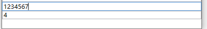
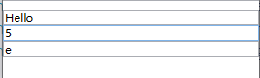
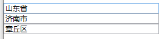
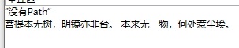
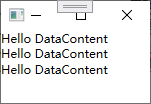
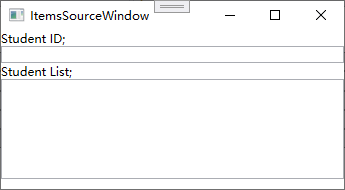
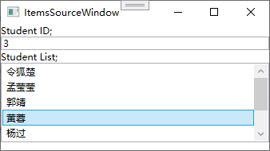

# DataBinding

DataBinding是将数据源（逻辑层对象）链接到目标（UI元素）


DataBinding工具类继承；


## Binding基础

⼀个简单的数据源并通过Binding把它连接到 UI 元素上

### 通知Binding属性值已经变化

作为数据源类需要实现`System.ComponentModel` 名称空间中的 `INotifyPropertyChanged`接口。在属性的 set语句中激发⼀个PropertyChanged 事件。当为Binding **设置了数据源后，Binding 就会⾃动侦听来⾃这个接⼝的 PropertyChanged 事件**

Student类

```csharp
class Student:INotifyPropertyChanged
{
    private string name;
    public event PropertyChangedEventHandler? PropertyChanged;
    
    public string Name
    {
        get { return name; }
        set {
            name = value;
            // 通知Binding属性值已经改变
            this.PropertyChanged?.Invoke(this,new PropertyChangedEventArgs("Name"));
        }
    }
}
```

TextBox 将作为 Binding ⽬标 ，当Button的 Click 事件发⽣时改变 Student 对象的 Name 属性值。

```xaml
<Window x:Class="DataBinding.MainWindow"
        xmlns="http://schemas.microsoft.com/winfx/2006/xaml/presentation"
        xmlns:x="http://schemas.microsoft.com/winfx/2006/xaml"
        xmlns:d="http://schemas.microsoft.com/expression/blend/2008"
        xmlns:mc="http://schemas.openxmlformats.org/markup-compatibility/2006"
        xmlns:local="clr-namespace:DataBinding"
        mc:Ignorable="d"
        Title="MainWindow" Height="450" Width="800">
    <StackPanel>
        <TextBox x:Name="TextBox"/>
        <Button Click="Button_Click">Add Age</Button>
    </StackPanel>
</Window>
```


### 使⽤Binding 把数据源和 UI 元素连接起来

1. 准备数据源

2. 准备 Binding

3. Binding 设置数据源

4. 为 Binding 设置访问属性路径

   **Path（路径）；**用来制定数据源对象的那个**属性**绑定到UI元素上。

5. 使用 Binding 连接数据源与目标

```csharp
public partial class MainWindow : Window
{
    Student student;

    public MainWindow()
    {
        InitializeComponent();

        // 准备数据源
        student = new Student();

        // 配置binding
        Binding binding = new Binding(); 
        // 设置数据源
        binding.Source = student;
        // 设置访问属性路径
        binding.Path = new PropertyPath("Name");
        // 连接数据源和目标
        /**
             * SetBinding()
             * 参数；
             *  target 绑定的绑定目标。
             *  dp 绑定的目标依赖项属性，只读属性。
             *  binding 描述绑定的 BindingBase 对象。 
             */
        BindingOperations.SetBinding(
            TextBox,
            TextBox.TextProperty,
            binding
        );

    }
    
    private void Button_Click(object sender, RoutedEventArgs e)
    {
        // 改变student的Name属性值
        student.Name += "Name";

    }
}
```

当你单击 Button 时，TextBox 就会即时显 ⽰ 更新后的 Name 属性值


#### 使用SetBinding()连接数据源与目标

TextBox 这类 UI 元素的基类 `FrameworkElement` 对 `BindingOperations.SetBinding(…)`⽅法进⾏了封装
封装的结果也叫 SetBinding，只是参数列表发 ⽣ 了变化

- `public BindingExpression SetBinding(DependencyProperty dp, string path);` 基于已提供的绑定对象将一个绑定附加到此元素上。
  - 参数
    - dp: 标识应在其中建立绑定的属性。
    -  binding: 表示数据绑定的详细信息。
  - 返回
    - 记录绑定的条件。 此返回值可用于错误检查。 


```csharp
//BindingOperations.SetBinding(TextBox,TextBox.TextProperty,binding);
 this.TextBox.SetBinding(TextBox.TextProperty, binding);
```

## 数据源（Source）

**数据源要求；**

- 是 ⼀ 个对象
- 通过属性（Property）公开 ⾃⼰ 的数据。

### 把控件作为 Binding 源

把TextBox 的 Text 属性关联在了 Slider 的 Value 属性上。

> [!Tip]
>
> 谁是绑定目标就设置 Binding 属性。

```xaml
<Window x:Class="DataBinding.ControlBindingWindow"
        xmlns="http://schemas.microsoft.com/winfx/2006/xaml/presentation"
        xmlns:x="http://schemas.microsoft.com/winfx/2006/xaml"
        xmlns:d="http://schemas.microsoft.com/expression/blend/2008"
        xmlns:mc="http://schemas.openxmlformats.org/markup-compatibility/2006"
        xmlns:local="clr-namespace:DataBinding"
        mc:Ignorable="d"
        Title="ControlBindingWindow" Height="450" Width="800">
    <StackPanel>
        <TextBox x:Name="TextBox1" Text="{Binding Path=Value,ElementName=Slider1}" />
        <Slider x:Name="Slider1" Maximum="100" Minimum="0" Margin="5" Value="0"/>
    </StackPanel>
</Window>
```


> [!Note]
>
> 在 C#代码中可以访问 XAML 代码中声明的变量 **但 XAML 代码中却⽆法访问 C#代码中声明的变量**，
> 因此，要想在 XAML 中建⽴UI 元素与逻辑层对象的Binding还要颇费些周折，把逻辑层对象声明为 XAML 代码中的资源（Resource），

省略Path

因为Binding 类单参数构造器默认是Path 作为参数

```xaml
<TextBox x:Name="TextBox1" Text="{Binding Value,ElementName=Slider1}" />
```

C#绑定

```c#
this.TextBox1.SetBinding(
    TextBox.TextProperty,
    new Binding("Value") { ElementName= "Slider1" }
);
```

> [!Tip]
>
> 因为在 C#代码中我们可以直接访问控件对象，所以⼀般也不会使⽤Binding 的
> ElementName 属性，⽽是直接把对象赋值给 Binding 的 Source 属性。
>
> ```csharp
> this.TextBox1.SetBinding(
>     TextBox.TextProperty,
>     new Binding("Value") { Source = Slider1 }  // 直接绑定到 Slider1 对象
> );
> ```
>
> 


## 控制 Binding 的⽅向及数据更新

### 控制方向

**Mode属性；**

Binding 控制数据流方向是 BindingMode 枚举类型

| 值             | 说明               | 备注                                                         |
| -------------- | ------------------ | ------------------------------------------------------------ |
| Default        | 默认               | 根据 ⽬ 标的实际情况来确定，⽐ 如若是可编辑的（如<br/>TextBox.Text 属性），Default 就采 ⽤ 双向模式；若是只读的（如<br/>TextBlock.Text）则采 ⽤ 单向模式。 |
| OneTime        | 一次               | 单向传递数据仅生效一次 OneWay 的简化                         |
| OneWay         | 单向（源到目标）   | 当绑定源（源）更改时，更新绑定目标（目标）属性               |
| OneWayToSource | 目标到原（反单向） | 当目标属性更改时更新源属性。                                 |
| TwoWay         | 双向               | 导致对源属性或目标属性的更改可自动更新对方。                 |

### 控制数据更新时机

**UpdateSourceTrigger属性**

确定绑定源更新的执行时间。是 UpdateSourceTrigger 枚举

| 值              | 说明     | 备注                                                         |
| --------------- | -------- | ------------------------------------------------------------ |
| Default         | 默认     | 大多数依赖项属性的默认值都为 PropertyChanged，而 Text 属性的默认值为 LostFocus。 |
| Explicit        | 显示     | 仅在调用 UpdateSource 方法时更新绑定源。                     |
| LostFocus       | 失去焦点 | 当绑定目标元素失去焦点时，更新绑定源。                       |
| PropertyChanged | 属性更改 | 当绑定目标属性更改时，立即更新绑定源。                       |

**其它属性；**

- NotifyOnSourceUpdated 获取或设置一个值，该值指示当值从绑定目标传输到绑定源时是否引发 SourceUpdated 事件。 
- NotifyOnTargetUpdated 获取或设置一个值，该值指示当值从绑定源传输到绑定目标时是否引发 TargetUpdated 事件。 

如果设为 true，则当源或⽬标被更新后 Binding 会激发相应的 SourceUpdated 事件和 TargetUpdated 事件。可以通过监听这两个事件来找出有哪些数据或控件被更新了。

## Path（路径）

Binding的Path属性用于制定Binding 需要关注哪个属性的值，算然在xmal中制定Path是字符串但实际 **类型是 PropertyPath。**

Xmal等价C#

```c#
Binding bing = new Binding() 
{ 
    Path = new PropertyPath("Value"), 
 	Source = this.Slider1
};
this.TextBox1.SetBinding(TextBox.TextProperty, bing);
```


或者使 ⽤Binding 的构造器简写为；

> [!Tip]
>
> Binding单参数构造是Path

```c#
Binding bing = new Binding("Value") 
{
    Source = this.Slider1
};
this.TextBox1.SetBinding(TextBox.TextProperty, bing);
```

### 多级Path

通俗地讲就是 ⼀ 路“点”下去

如果我们想让 ⼀ 个 TextBox 显 ⽰另外 ⼀ 个TextBox 的⽂本⻓度

```xaml
<StackPanel>
    <TextBox x:Name="TextBox1"/>
    <TextBox 
             x:Name="TextBox2" 
             Text="{Binding Text.Length,ElementName=TextBox1,Mode=OneWay}"
             />
</StackPanel>
```

> [!Tip]
>
> `Text.Length` 不要忘记属性中间的点


等价C#

```c#
this.TextBox2.SetBinding(
    TextBox.TextProperty, 
    new Binding("Text.Length") 
    { 
        ElementName = "TextBox1", 
        Mode = BindingMode.OneWay 
    }) ;
```


### 集合类型索引器

如我想让 ⼀ 个TextBox显⽰另 ⼀ 个TextBox⽂本的第四个字符

```xaml
<StackPanel>
    <TextBox x:Name="TextBox3"/>
    <TextBox 
             x:Name="TextBox4" 
             Text="{Binding Text[3],ElementName=TextBox3,Mode=OneWay}"
             />
</StackPanel>
```



等价c#

```c#
this.TextBox4.SetBinding(
    TextBox.TextProperty, 
    new Binding("Text[3]") 
    { 
        Source = TextBox3,
        Mode = BindingMode.OneWay
    }
);
```


### 默认元素当作 Path 使⽤

当使 ⽤⼀ 个**集合或者 DataView** 作为 Binding 源时，如果我们想把它的默认元素（一般是指第一个元素）当作 Path 使⽤

```c#
List<String> stringList = new List<String>() { "Hello", "World", "!" };
this.TxtBox1.SetBinding(
    TextBox.TextProperty, 
    new Binding("/") 
    {
        Source = stringList,
        Mode = BindingMode.OneWay 
    }
);
this.TxtBox2.SetBinding(
    TextBox.TextProperty, 
    new Binding("/Length") 
    {
        Source = stringList,
        Mode = BindingMode.OneWay 
    }
);
this.TxtBox3.SetBinding(
    TextBox.TextProperty, 
    new Binding("/[1]") 
    {
        Source = stringList,
        Mode = BindingMode.OneWay 
    }
);

```




`/` 代表这个默认元素对象

### 多级斜线语法；

集合元素的**属性仍然还是 ⼀ 个集合**，我们想把⼦级集合中的元素当作 Path，则可以使 ⽤ 多级斜线的语法（即 ⼀ 路“斜线”下去）

数据类

```c#
/// <summary>
/// 省
/// </summary>

class Province
{
    public string Name
    {
        get;
        set;
    }
    public List<City> CityList
    {
        get;
        set;
    }
}

/// <summary>
/// 城市
/// </summary>
class City
{
    public string Name
    {
        get;
        set;
    }
    public List<Country> CountryList
    {
        get;
        set;
    }

}

/// <summary>
/// 区/县
/// </summary>

internal class Country
{
    public string Name
    {
        get;
        set;
    }
}
```

绑定；

```c#
List<City> CityList = new List<City> { new City() { Name = "济南市" }};
List <Country> countryList = new List<Country> { new Country() {Name = "章丘区" } };
CityList[0].CountryList = countryList;
Province province = new Province();
province.Name = "山东省";
province.CityList = CityList;
List<Province> provincesList = new List<Province> { province };

this.TxtBox4.SetBinding(
    TextBox.TextProperty,
    new Binding("/Name") 
    {
        Source = provincesList 
    }
);
this.TxtBox5.SetBinding(
    TextBox.TextProperty,
    new Binding("/CityList/Name") 
    { 
        Source = provincesList 
    }
);
this.TxtBox6.SetBinding(
    TextBox.TextProperty,
    new Binding("/CityList/CountryList/Name") 
    {
        Source = provincesList 
    }
);
Console.WriteLine(this);
```

数据结构如图




可以读作

- `"/Name"` provincesList 第一个元素的 Name 属性
- `"/CityList/Name"` provincesList 第一个元素 CityList 属性的第一个元素 Name 属性
- `"/CityList/CountryList/Name"` provincesList 第一个元素 CityList 属性的第一个元素 CountryList 属性的第一个元素的 Name 属性


### 不带Path

当**Binding 源本⾝就是数据且不需要 Path 来指明**。典型的，string、int 等**基本类型**，他们的**实例**本⾝就是数据，⽆法指出通过它的哪个属性来访问这个数据，

这时我们只需将 Path 的值设置为“`.`”就可以了。**在 XAML 代码 ⾥ 这个“`.`”可以省略不写，但在 C#代码 ⾥ 却不能省略**。

```xaml
<StackPanel>
    <StackPanel.Resources>
        <sys:String x:Key="myString">
            菩提本无树，明镜亦非台。
            本来无一物，何处惹尘埃。
        </sys:String>
    </StackPanel.Resources>

    <TextBlock Text="{
                     Binding Path=.,
                     Source={
                     	StaticResource ResourceKey=myString
                     }
                     }"/>

</StackPanel>
```


可以缩写；

```xaml
Text="{Binding .,Source={StaticResource ResourceKey=myString}}"
```

或者；

```xaml
Text="{Binding Source={StaticResource ResourceKey=myString}}"
```




等价c#；

```c#
string myString="菩提本⽆树，明镜亦⾮台。本来⽆⼀物，何处惹尘埃。";
this.textBlock1.SetBinding(
    TextBlock.TextProperty, 
    new Binding("."){
        Source=myString 
    }
);
```


## 更多指定源（Source）⽅法

**普通 CLR 类型；**

普通 CLR 类型**单个**对象指定为 Source：包括.NETFramework⾃带类型的对象和 ⽤ 户 ⾃ 定义类型的对象。如果类型实现了 `INotifyPropertyChanged` 接⼝，则可通过在属性的 set 语句⾥激发 `PropertyChanged` 事件来通知 Binding 数据已被更新。

**CLR 集合类型；**

普通 CLR 集合类型对象指定为 Source：包括数组、`List<T>、ObservableCollection<T>` 等集合类型。实际⼯作中，我们经常需要把 ⼀ 个集合作为 ItemsControl 派⽣类的数据源来使⽤，⼀ 般是把控件的 ItemsSource 属性使⽤Binding 关联到 ⼀ 个集合对象上。

**ADO.NET 数据对象**

ADO.NET 数据对象指定为 Source：包括 DataTable 和 DataView 等对象。

**XmlDataProvider**

使 ⽤XmlDataProvider 把 XML 数据指定为 Source：XML 作为标准的数据存储和传输格式 ⼏ 乎 ⽆ 处不在，我们可以 ⽤ 它表 ⽰ 单个数据对象或者集合；⼀ 些 WPF 控件是级联式的（如 TreeView 和 Menu），我们可以把树状结构的 XML 数据作为源指定给与之关联的 Binding。

**依赖对象**

把依赖对象（Dependency Object）指定为 Source：依赖对象不仅可以作为 Binding 的 ⽬ 标，同时也可以作为 Binding 的源。这样就有可能形成 Binding 链。依赖对象中的依赖属性可以作为 Binding 的 Path。

**DataContext** 

把容器的 DataContext 指定为 Source（WPF Data Binding 的默认⾏为）：有时候我们会遇到这样的情况——我们明确知道将从哪个属性获取数据，但具体把哪个对象作为 Binding 源还不能确定。这时候，我们只能先建⽴⼀个 Binding、只给它设置 Path⽽不设置 Source，让这个 Binding⾃⼰去寻找 Source。这时候，Binding会⾃动把控件的 DataContext 当作⾃⼰的 Source（它会沿着控件树⼀层⼀层向外找，直到找到带有Path指定属性的对象⽌）。

**ElementName** 

通过 ElementName 指定 Source：在 C#代码⾥可以直接把对象作为 Source 赋值给 Binding，但 XAML⽆法访问对象，所以只能使⽤对象的 Name 属性来找到对象

**RelativeSource 属性**

通过 Binding 的 RelativeSource 属性相对地指定 Source：当控件需要关注⾃⼰、⾃⼰容器的或⾃⼰ 内部元素的某个值就需要使⽤这种办法。 

**ObjectDataProvider 对象**

把 ObjectDataProvider 对象指定为 Source：当数据源的数据不是通过属性⽽是通过⽅法暴露给外界的时候，我们可以使⽤这两种对象来包装数据源再把它们指定为 Source、

**LINQ** 

使⽤LINQ 检索得到的数据对象作为 Binding 的源

### 使⽤DataContext 作为源

DataContext属性定义在FrameworkElement类中它是wpf控件的基类，WPF的UI 布局是树形结构，这棵树的每个结点都是控件。所以每个节点上的控件都有DataContext属性。

 当 ⼀ 个 Binding 只知道 ⾃⼰ 的 Path⽽ 不知道 ⾃⼰ 的 Soruce 时，它会沿着 UI 元素树 ⼀ 路向树的根部找过去，每路过 ⼀ 个结点就要看看这个结点的 DataContext 是否具有 Path 所指定的属性。如果有，那就把这个对象作为 ⾃⼰ 的 Source；如果没有，那就继续找下去；如果到了 **树的根部还没有找到，那这个 Binding 就没有 Source**，因 ⽽ 也不会得到数据

数据类；

```c#
class Student1
{
    public int Id { get; set; }
    public string Name { get; set; }
    public int Age { get; set; }
}
```

ui;

```xaml
<Window x:Class="DataBinding.DataContextWindow"
        xmlns="http://schemas.microsoft.com/winfx/2006/xaml/presentation"
        xmlns:x="http://schemas.microsoft.com/winfx/2006/xaml"
        xmlns:d="http://schemas.microsoft.com/expression/blend/2008"
        xmlns:mc="http://schemas.openxmlformats.org/markup-compatibility/2006"
        xmlns:local="clr-namespace:DataBinding"
        mc:Ignorable="d"
        Title="DataContextWindow" Height="450" Width="800">
    <StackPanel>
        <!-- 外层 StackPanel 的 DataContext 进 ⾏ 了赋值——它是 ⼀ 个 Studen1t 对象 -->
        <StackPanel.DataContext>
            <local:Student1 Id="2" Age="20" Name="Tim"/>
        </StackPanel.DataContext>
        <Grid>
            <StackPanel>
                <TextBox Text="{Binding Path=Id}"/>
                <TextBox Text="{Binding Path=Name}"/>
                <TextBox Text="{Binding Path=Age}"/>
               	<!-- 简写
                <TextBox Text="{Binding Id}"/>
                <TextBox Text="{Binding Name}"/>
                <TextBox Text="{Binding Age}"/>
				-->
            </StackPanel>
        </Grid>
    </StackPanel>
</Window>
```

ui层次结构；


三个TextBox 的 Text 通过 Binding 获取值，但只为 Binding 指定了 Path。这样，这 3 个 TextBox 的 Binding 就会 ⾃ 动向 UI 元素树的上层去寻找可 ⽤ 的 DataContext 对象。最终，它们在最外层的 StackPanel⾝ 上找到了可 ⽤ 的 DataContext 对象


#### 没有Path⼜没有 Source

当DataContext 是 ⼀ 个简单类型对象的时候就可以不写Paht和Source

```xaml
<Window x:Class="DataBinding.DataContextWindow"
        xmlns="http://schemas.microsoft.com/winfx/2006/xaml/presentation"
        xmlns:x="http://schemas.microsoft.com/winfx/2006/xaml"
        xmlns:d="http://schemas.microsoft.com/expression/blend/2008"
        xmlns:mc="http://schemas.openxmlformats.org/markup-compatibility/2006"
        xmlns:local="clr-namespace:DataBinding" 
        xmlns:sys="clr-namespace:System;assembly=mscorlib"
        mc:Ignorable="d"
        Title="DataContextWindow" Height="450" Width="800">
    <StackPanel>
        <StackPanel.DataContext>
            <sys:String>Hello DataContent</sys:String>
        </StackPanel.DataContext>
        <Grid>
            <StackPanel>
                <TextBlock Text="{Binding}"/>
                <TextBlock Text="{Binding}"/>
                <TextBlock Text="{Binding}"/>
            </StackPanel>
        </Grid>
    </StackPanel>
</Window>
```




#### 并不智能的 Binding；

其实，“Binding 并 **没有沿着 UI 元素树向上找**”只是 WPF 给我们的 ⼀ 个错觉，之所以会有这种效果是因为 DataContext 是 ⼀ 个“依赖属性”，依赖属性有 ⼀ 个很重要的特点就是当你没有为控件的某个依赖属性显式赋值时，控件会把 ⾃⼰ 容器的属性值“借过来”当作 ⾃⼰ 的属性值。实际上是属性值沿着 UI 元素树向下传递了。

举个例 ⼦；

程序的 UI 部分是若 ⼲ 层 Grid，最内层 Grid⾥ 放置了 ⼀ 个 Button，我们为最外层的 Grid 设置了 DataContext 属性值，
因为内层的 Grid 和 Button 都没有设置 DataContext 属性值所以最外层 Grid 的 DataContext 属性值会 ⼀ 直传递到 Button 那 ⾥，单击 Button 就会显 ⽰ 这个值

```xaml
<Grid DataContext="6">
    <Grid>
        <Grid>
            <Button x:Name="Btn" Click="Button_Click">ok</Button>
        </Grid>
    </Grid>
</Grid>
```

处理 Buttom 的 Click 事件

```c#
private void Button_Click(object sender, RoutedEventArgs e)
{
    MessageBox.Show(Btn.DataContext.ToString());
}
```


#### 际⼯作中 DataContext 的⽤法;

1. 当 UI 上的多个控件都使 ⽤Binding 关注同 ⼀ 个对象时，不妨使⽤DataContext。
2. 当作为 Source 的对象不能被直接访问的时候——⽐ 如 B 窗体内的控件想把 A 窗体内的控件当作 ⾃⼰ 的 Binding 源时，但 A 窗体内的控件是 private 访问级别，这时候就可以把这个控件（或者控件的值）作为窗体 A 的 DataContext（这个属性是 public 访问级别的）从 ⽽ 暴露数据。形象地说，这时候外层容器的 DataContext 就相当于 ⼀ 个数据
   的“制 ⾼ 点”，只要把数据放上去，别的元素就都能看 ⻅。另外，DataContext 本 ⾝ 也是 ⼀ 个依赖属性，我们可以使 ⽤Binding 把它关联到 ⼀ 个数据源上。

#### 列表控件使用集合类型

列表控件都派生自`ItemsControl`类它的`ItemsSource`属性。可以接收 ⼀ 个 **IEnumerable接⼝派⽣类的实例** 作为 ⾃⼰的值（所有**可被迭代遍历的集合都实现了这个接⼝**，包括数组、`List<T>` 等）。

每个`ItemsControl` 的派⽣类都具有⾃⼰ **对应的条⽬容器**（`ItemContainer`）例如，`ListBox`的条⽬容器 ListBoxItem、ComboBox 的条⽬容器是 ComboBoxItem。

条目容器是一个‘外衣’用于控制I，temsSource⾥存放的是一条条的数据，以何种形式展示。比如仅包含文本内容（实际是用的 TextBox）也可以自定义。

为 ⼀ 个ItemsControl 对象设置了 ItemsSource 属性值，ItemsControl 对象就会 **⾃动迭代其中的数据元素**、为每个数据元素准备 ⼀ 个条⽬容器，并使⽤Binding 在 **条⽬容器与数据元素之间建⽴起关联**。

```xaml
<Window x:Class="DataBinding.ItemsSourceWindow"
        xmlns="http://schemas.microsoft.com/winfx/2006/xaml/presentation"
        xmlns:x="http://schemas.microsoft.com/winfx/2006/xaml"
        xmlns:d="http://schemas.microsoft.com/expression/blend/2008"
        xmlns:mc="http://schemas.openxmlformats.org/markup-compatibility/2006"
        xmlns:local="clr-namespace:DataBinding"
        mc:Ignorable="d"
        Title="ItemsSourceWindow" Height="450" Width="800">
    <StackPanel>
        <TextBlock Text="Student ID;"/>
        <TextBox x:Name="TxtBoxId"/>
        <TextBlock Text="Student List;"/>
        <ListBox x:Name="TxtListBox" Height="100"/>
    </StackPanel>
</Window>

```



把 ⼀ 个 `List<Student>` 集合的实例作为 ListBox 的 ItemsSource，让 ListBox 显 ⽰Student 的 Name 并使 ⽤TextBox 显 ⽰ListBox 当前选中条 ⽬ 的 Id。

```c#
public partial class ItemsSourceWindow : Window
{
    public ItemsSourceWindow()
    {
        InitializeComponent();

        // 准备数据
        List<Student1> studentList = new List<Student1>
        {
            new Student1(){Id = 0,Name = "令狐楚",Age = 20},
            new Student1(){Id = 1,Name = "孟莹莹",Age = 22},
            new Student1(){Id = 2,Name = "郭靖",Age = 18},
            new Student1(){Id = 3,Name = "黄蓉",Age = 17},
            new Student1(){Id = 4,Name = "杨过",Age = 22},
            new Student1(){Id = 5,Name = "小龙女",Age = 18},
        };

        // 为ListBox设置数据源
        this.TxtListBox.ItemsSource = studentList;
        // 要显示的数据成语路径
        this.TxtListBox.DisplayMemberPath = "Name";

        // 让TxtBoxId 显示ListBox当前选项的Id属性
        Binding binding = new Binding("SelectedItem.Id") {Source = this.TxtListBox};
        this.TxtBoxId.SetBinding(TextBox.TextProperty, binding);
    }
}
```

> [!Tip]
>
> `SelectedItem` 属性表示当前在该 ListBox 中被选中的项。



**分析条目和数据关联；**

例⼦⾥并没有看到为外衣 Binding。实际上在`this.listBoxStudents.DisplayMemberPath="Name";`它接受一个路径值。

当 DisplayMemberPath 属性被赋值后，ListBox 在获得 ItemsSource 的时候就会创建**等量**的 ListBoxItem 并以 DisplayMemberPath 属性值为 Path 创建 Binding，Binding 的⽬标是 ListBoxItem 的内容插件（实际上是 ⼀ 个 TextBox）。如果在 ItemsControl 类的代码 ⾥ 刨根问底，你会发现这个创建 Binding 的过程是在 DisplayMemberTemplateSelector 类的 SelectTemplate⽅ 法 ⾥ 完成的。

```c#
public override DataTempIate SelectTemplate(object item, Dependency()bject container)
{
    //
}
```

它的返回值是 ⼀ 个 `DataTemplate` 类型的值。数据的“外⾐”就是由 DataTemplate 穿上的！当我们没有为 ItemsControl 显式地指定 DataTemplate 时 SelectTemplate⽅ 法就会为我们创建 ⼀ 个**默认**的也是最简单的DataTemplate 这⾥，我们只关 ⼼SelectTemplate 内部与创建 Binding 相关的 ⼏⾏ 代码：

```c#
FrameworkElementFactory text = ContentPresenter.CreateTextBlockFactory(); // 创建TextBlock控件
Binding binding = new Binding();
binding.Path = new PropertyPath(_dispIayMemberPath);
binding.StringFornut = _stringFomat;
text.SetBinding(TextBlock.TextProperty, binding);
```

zhe'l设定了Path⽽没有为它指定 Source。显然，要想得到 Source，这个 Binding 要向 **UI 元素树根的 ⽅ 向去寻找包含_displayMemberPath 指定属性的 DataContext**。


