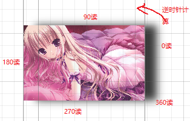

# 效果

给控件快速设置一种显式效果。

### BlurEffect【模糊】

> https://docs.microsoft.com/zh-cn/dotnet/api/system.windows.media.effects.blureffect?redirectedfrom=MSDN&view=netframework-4.8

- `Radius`属性 获取或设置一个值，该值指示模糊效果曲线的半径。默认值为5

  ```xaml
   <Image  Source="F:\图片\桌面图片\01.jpg" Width="200">
              <Image.Effect>
                  <BlurEffect Radius="5"/>
              </Image.Effect>
          </Image>
  ```


### DropShadowEffect【阴影效果】

> https://docs.microsoft.com/zh-cn/dotnet/api/system.windows.media.effects.dropshadoweffect?redirectedfrom=MSDN&view=netframework-4.8

#### 属性

- `BlurRadius` 获取或设置一个值，该值指示阴影的模糊效果的半径。

- `Color` 获取或设置投影的颜色。

- `Direction` 获取或设置投影的方向以读为单位。

  

- `ShadowDepth` 获取或设置投影距纹理下方的距离以像素为单位。

```xaml
<Image  Source="F:\图片\桌面图片\01.jpg" Width="200">
            <Image.Effect>
                <DropShadowEffect Color="Gray" BlurRadius="20" Direction="0" ShadowDepth="20"/>
            </Image.Effect>
        </Image>
```

### ShaderEffect【着色】

这是一个抽象类，没有直接提供方法，通过重写此类可以实现更高级的效果。

> https://docs.microsoft.com/zh-cn/dotnet/api/system.windows.media.effects.shadereffect?view=netframework-4.8

需要编写HLSL语言文件，而不是使用C#编写。

