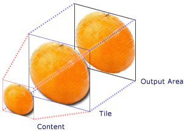

# 对象资源

资源可以是画刷，图片媒体等资源。

## 定义资源

通过，对象的`Resources`属性，以属性标签形式定义资源。尽管所有控件对象都有此属性建议定义Window对象上，其它对象也可以访问。**也可以从App.XAML的Resources属性标签里定义。**

```xaml
<Window.Resources>
    <!-- 定义画刷资源 
x:Key资源索引名-->
        <ImageBrush x:Key="bg_image" TileMode="Tile" ImageSource="F:\图片\琥珀 初音\60535674_p2.jpg" Opacity="1"/>
    </Window.Resources>
```


### 画刷资源

#### ImageBrush 【图片画刷】

利用图像绘制区域

当使用Brush时需要三个组件分别是内容，图块，输出区域。



**属性；**

- `TileMode` 获取或设置一个值，该值指定当基本图块小于输出区域时 TileBrush 如何填充您所绘制的区域。

- `Viewbox` 获取或设置 平铺快中图片内容的位置和尺寸。

  - 属性值

    x,y偏移坐标,平铺快宽度和高度。

  - 类型： System.Windows.Rect TileBrush 内容的位置和尺寸。 默认值是一个矩形 ( Rect)，其 TopLeft 为 (0,0)， Width 和 Height 为 1。

- `ViewboxUnits` 获取或设置一个值，该值指定 Viewbox 值是相对于 TileBrush 内容的边界框而言，还是绝对值。

  - 属性值 类型： System.Windows.Media.BrushMappingMode 一个值，该值指示 Viewbox 值是相对于 TileBrush 内容的边界框而言，还是绝对值。 默认值为 RelativeToBoundingBox。

- `Viewport` 获取设置平铺快的尺寸。

  - 属性值

    x,y偏移坐标,平铺快宽度和高度。

    类型： System.Windows.Rect TileBrush 内容的位置和尺寸。 默认值是一个矩形 ( Rect)，其 TopLeft 为 (0,0)， Width 和 Height 为 1。

- ViewportUnits 获取或设置平铺是相对尺寸或绝对尺寸，**默认**相对尺寸。

  - 属性值 类型： System.Windows.Media.BrushMappingMode

  1. 默认值为 RelativeToBoundingBox相对尺寸【不可以修改偏移】相对于内容边框
  2. Absolute绝对尺寸。【可以修改偏移】

- `ImageSource` 获取或设置图片源，就是图片路径。

- `Opacity` 获取或设置 Brush 的不透明度。

- `Stretch` 获取或设置一个值，该值指定此 TileBrush 的内容如何拉伸以适合其填充区域。

常用`Viewport` 属性设置图片偏移等。

## 使用资源

使用扩展属性为控件的属性赋值。**静态资源**只会在程序启动第一次加载资源，而**动态资源**当源资源发生变化会自动更新到程序。

### 静态使用

```xaml
//格式StaticResource 资源索引名
<StackPanel Background="{StaticResource bg_image}">
    ……
</StackPanel>
```

### 静态使用系统资源

```xaml
//使用系统下定义的资源。颜色资源这里使用
<Button Foreground="{x:Static SystemColors.WindowTextBrush}">按钮1</Button>
```

### 动态使用

```xaml
//DynamicResource 资源索引名
<Button Foreground="{DynamicResource color1}">按钮2</Button>
```

### 动态使用系统资源

```xaml
//DynamicResource动态资源关键测
<Button
            Foreground="{DynamicResource {x:Static SystemColors.WindowColor}}"
            >按钮2</Button>
```


## 资源字典

资源字典被定义在一个XAML文件中，用于于其它程序共享资源。

### 创建资源字典

项目右键=>添加=>资源字典=>设置字典名称,编写需要资源对象。

```xaml
<ResourceDictionary xmlns="http://schemas.microsoft.com/winfx/2006/XAML-images/presentation"
                    xmlns:x="http://schemas.microsoft.com/winfx/2006/XAML-images"
                    xmlns:local="clr-namespace:WpfApp27">
    //定义资源字典内容。
    <SolidColorBrush x:Key="main_color" Color="#FF0000"/>
</ResourceDictionary>
```

#### 使用资源字典

1. 打开App.XAML文件在里面引用我们的资源字典。

   ```xaml
   <Application x:Class="WpfApp27.App"
                xmlns="http://schemas.microsoft.com/winfx/2006/XAML-images/presentation"
                xmlns:x="http://schemas.microsoft.com/winfx/2006/XAML-images"
                xmlns:local="clr-namespace:WpfApp27"
                StartupUri="MainWindow.XAML-images">
       <Application.Resources>
           <!-- 引用资源字典 -->
           <ResourceDictionary>
               <!-- 资源字典合并标记 -->
               <ResourceDictionary.MergedDictionaries>
                   <!-- 引入资源字典1 -->
                   <ResourceDictionary Source="Dictionary1.XAML-images"/> //Source 资源字典名带文件后缀
               </ResourceDictionary.MergedDictionaries>
           </ResourceDictionary>
       </Application.Resources>
   </Application>
   ```

2. 为设置资源控件设置资源，支持动态资源和静态资源设置方法

   ```xaml
   //main_color资源key名。
   <Label Foreground="{StaticResource ResourceKey=main_color}">红色字体</Label>
   ```

## 程序集中共享资源

**方式一**

把字典编译为类库形式，在不同的程序间使用。

**方式二**

1. 根项目，目录新建**Themes文件夹**。
2. 在Themes文件添加名为generic【**文件名必须是generic**】的资源文件。
3. 给字典创建一个key名，值必须用。

