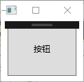

# 样式

## 创建样式

在资源标签内使用style标签定义样式。

- 不指定 TargetType【目标类型】，必须设置x:Key并且必须用类名限定样式中的属性。（不建议使用比较麻烦）

  ```xaml
  <Window.Resources>
          <Style x:Key="mainFont"> //必须设置key名
              <!-- 格式Property="属性所属类.属性名" Value="属性值" -->
              <Setter Property="Control.FontFamily" Value="华文彩云"/>
              <Setter Property="Control.Foreground" Value="#00FF00"/>
              <Setter Property="Control.FontSize" Value="30"/>
          </Style>
   </Window.Resources>
  ```

- 指定TargetType

  ```xaml
  <Window.Resources>
      <!-- 格式 TargetType="{x:Type 控件名及类名}" 这里指定只能TextBlock使用此样式-->
      <Style TargetType="{x:Type TextBlock}" x:Key="win">
              <Setter Property="FontFamily" Value="仿宋"/>
              <Setter Property="FontSize" Value="50"/>
              <Setter Property="Foreground" Value="#0000FF"/>
      </Style>
  </Window.Resources>
  ```

### style类属性

> https://docs.microsoft.com/zh-cn/dotnet/api/system.windows.style?redirectedfrom=MSDN&view=netframework-4.8

- `Setter` 为特定属性设置值。
- `Triggens` 触发器，判断属性变化修改其样式
- `BasedOn` 继承于其他样式 值样式名
- TargetType 获取或设置此样式所针对那个对象【控件名】。
  - 使用此格式`TargetType="Button"`指定类型后，此类型的控件会自动使用该样式作为默认样式。
  - 使用此格式`TargetType="{x:Type Button}"` 指定类型后，只有是此类型的控件的style属性设置了此样式的键名才会应用此样式。所以使用此方法定义的样式只有设置了`x:key` 属性才可以使用。

## 使用样式

和wpf资源使用方法一样。

- 不指定`TargetType` 类型的样式使用方法。

```xaml
<Label Style="{StaticResource style键名}">style内容控件</Label>
```

- 指定`TargetType` 类型，不应用定义的样式。

  ```xaml
  <Button Width="100" Height="80" Style="{x:Null}">按钮</Button>
  ```


## Triggens 触发器

通过style的类的`Triggens` 属性配置。触发器，判断属性变化修改其样式如同css中的伪类。

### Triggens 简单触发器

满足单个条件才会触发

不能改变高度宽度，的部分属性。

```xaml
    <Window.Resources>
        <Style TargetType="{x:Type Button}" x:Key="redText">
            <!-- 定义触发器 -->
            <Style.Triggers>
                <!-- 定义触发器执行条件，这里定义当鼠标悬停到控件上 -->
                <Trigger Property="IsMouseOver" Value="True">
                    <!-- 触发事件后要改变的样式 -->
                    <Setter Property="FontSize" Value="50"/>
                    ……
                </Trigger>
                <!-- 可以定义多个 --->
                <Trigger Property="IsMouseOver" Value="True">

                </Trigger>
            </Style.Triggers>
        </Style>
    </Window.Resources>
```

### MultiTrigger多级触发器

满足多个条件才会触发

```xaml
    <Window.Resources>
        <Style TargetType="{x:Type Button}" x:Key="redText">
            <!-- 定义触发器 -->
            <Style.Triggers>
                <!-- 定义多级触发器标记 -->
                <MultiTrigger>
                    <!-- 触发器条件集合标记 -->
                    <MultiTrigger.Conditions>
                        <!-- 定义条件（可以定义多个） -->
                        <Condition Property="IsMouseOver" Value="True"/>
                        <Condition Property="IsFocused" Value="True"/>
                    </MultiTrigger.Conditions>
                    <!-- 满足条件执行，样式设定器集合标记 -->
                    <MultiTrigger.Setters>
                        <!-- 定义多条样式 -->
                        <Setter Property="Foreground" Value="#FFFF00"/>
                        <Setter Property="FontSize" Value="50"/>
                    </MultiTrigger.Setters>
                </MultiTrigger>
            </Style.Triggers>
        </Style>
    </Window.Resources>
```

### EventTrigger事件触发器

> 在style里不能使用`TargetName` 附加属性，默认style作用到应此样式控件本身,要想使用此控件那么必须使用控件触发器绑定形式书写参考Storyboard【故事板】

当发生一个特定的事件后执行，可以配置动画内容。

改变后的属性不会自动还原。可以改变高度宽度。当事件结束后想还原之前的数值，需要反转动画。

以下代码展示鼠标移动到控件上和移除控件。简单字体大小改变动画。

```xaml
<Window.Resources>
        <Style TargetType="{x:Type Button}" x:Key="redText">
            <Style.Triggers>
                <!--事件触发标记 RoutedEvent路由事件当发生指定的此事件后执行事件动作标记-->
                <EventTrigger RoutedEvent="MouseEnter">
                    <!-- 事件动作标记 -->
                    <EventTrigger.Actions>
                        <!-- 开始故事板标记 -->
                        <BeginStoryboard>
                            <!-- 配置故事板 -->
                            <Storyboard>
                                <!--配置动画-->
                                <!-- 属性
                                Duration=动画总时长
                                    格式；时:分:秒
                                Storyboard.TargetProperty=要改变的目标属性
                                To=改变后的值
                                DoubleAnimation适用于数字类型属性改变。
                                -->
                <DoubleAnimation Duration="0:0:2" Storyboard.TargetProperty="FontSize" To="50"/>
                            </Storyboard>
                        </BeginStoryboard>
                    </EventTrigger.Actions>
                </EventTrigger>

                <!--反转动画事件 -->
                <EventTrigger RoutedEvent="MouseLeave">
                    <!-- 事件动作标记 -->
                    <EventTrigger.Actions>
                        <!-- 开始故事板标记 -->
                        <BeginStoryboard>
                            <!-- 配置故事板 -->
                            <Storyboard>
                                <!--配置动画-->
                                <!-- 属性
                                Duration=动画总时长
                                    格式；时:分:秒
                                Storyboard.TargetProperty=要改变的目标属性
                                To=改变后的值 不指定此属性,改变的属性会恢复到初始值。
                                DoubleAnimation适用于数字类型属性改变。
                                -->
                     <DoubleAnimation Duration="0:0:2" Storyboard.TargetProperty="FontSize"/>
                            </Storyboard>
                        </BeginStoryboard>
                    </EventTrigger.Actions>
                </EventTrigger>
            </Style.Triggers>
        </Style>
    </Window.Resources>
```

